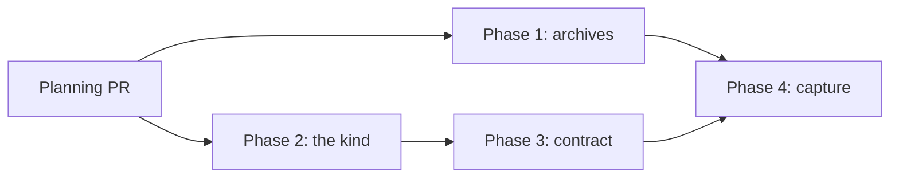

# The plan task kind: phased implementation

Source plan: [`plan.md`](./plan.md), rendered at [`plan.html`](./plan.html).

This index turns the approved plan into four merge units. The phase files beside it are the
implementation guides. The source plan remains the authority for the intended outcome and the
approved product choices.

## Incorporated human decisions

| Decision | Approved selection | Consequence | Owned by |
|---|---|---|---|
| Artifact durability | Durable archive, like scout | Plan artifacts are captured into the archive library and survive worktree reclaim | Phase 4 |
| After work | Preselect None, reversibly | `plan` joins `scout` in the dispatch form's stash-and-restore rule | Phase 2 |
| Skill dependence | Point at the skills | The contract invokes `html-plans` rather than restating it, and dispatch refuses when it is off | Phase 3 |
| Completion | Normal boundary, like ship | No archive gate on `done`; durability is achieved at teardown instead | Phase 4 |
| External links | Allow clickable external links | The archive validator permits `http(s)` in navigational slots only | Phase 1 |
| Archive container | Generalize and rename to archives | New format string, root and tables, with the legacy ones still read | Phase 1 |
| Foreman wrap-up | Offer ordinary wrap-up | The plan kind is exempted from the review-artifact classifier | Phase 3 |

## Repository findings that changed the route

Verified against the planning checkout. Implementers must re-check the current tree before
editing.

- **The two planning skills already do the second half of the request.**
  `skills/html-plans/SKILL.md:44-85` mandates that every root plan review end with a
  `request_plan_decisions` call whose last decision offers **Create phased implementation plan**
  or **Stop after this plan**, and invokes `phased-plan` on the first. Nothing needs building for
  the follow-up prompt; the kind's job is to guarantee an agent reaches it. This removed an entire
  phase from the original shape of this work.
- **The archive format is append-only by explicit declaration.** `src/shared/scouts.ts:3-23`
  states that renaming a persisted value "orphans evidence that no migration can reach, because
  the evidence is not in this database". The approved rename is therefore additive: a new format
  string and root are introduced, and `mission-control/scout-archive` keeps its exact meaning
  forever and stops being written.
- **There are four scout tables, and one is not disposable.** `scout_archives`,
  `scout_artifacts` and `scout_search_segments` are a cache the reconciler rebuilds from disk
  (`src/server/scouts/reconciler.ts:20-24`), but `scout_capture_jobs` (`src/server/db.ts:1661`)
  is the idempotency and resume ledger whose `repos_json` stops being derivable once a session is
  gone. Phase 1 drops and rebuilds the first three and migrates the fourth. There are **zero**
  scout entries in `migrate()` today, so Phase 1 writes the first one.
- **The reading UI does not exist yet**, which is what makes the rename affordable now.
  `docs/scout-archives.md` still defers the Scouts page. There is no route, no palette entry and
  no topbar segment bound to the name.
- **The review-artifact classifier catches a plan task twice.**
  `src/server/foreman/wrapup-eligibility.ts` matches `plans?` in both its objective vocabulary
  (`:62-63`) and its path regex (`:69-71`), and a `docs/plans/**`-only diff matches every path.
  Delivering the approved "ordinary wrap-up" decision required exempting the kind from both
  halves, not one.
- **Skill invocation is per-harness and has two different resolvers.**
  `skillCommand` (`src/shared/harness-capabilities.ts:923`) renders `/html-plans` on Claude,
  `$html-plans - run this skill now.` on Codex and `/skill:html-plans` on Pi, so a hardcoded slash
  command is inert on two of three harnesses and the bug is invisible on the default one.
  Separately, `skillInvocationForAgent` is correct at launch and `requiredSkillCommand` - which
  adds a reload-watermark rung - is correct for a live session. The two delivery seams need
  different ones.
- **A plan's directory cannot be found by convention.** A scout's report is at one known path; a
  plan's is at `docs/plans/<name>/` with an agent-chosen name, in a repository that routinely
  holds many unrelated plan directories. Phase 4 uses the task's own diff, which the Foreman
  worker already computes, because it is server-derived and names exactly what the task touched.
- **The repository was written in anticipation of a third kind.** `TASK_KIND_INFO` and
  `GUIDED_KIND_KEYS` are both `Record<TaskKind, …>` with comments saying a third kind must not
  compile until it has said how it is offered, and `tasks.kind` is unconstrained `TEXT` needing no
  migration. Against that, five surfaces degrade silently rather than failing to compile, and
  Phase 2 owns all of them.

## Phase map

| Phase | Name | Direct prerequisites | Delivers |
|---|---|---|---|
| 1 | [Kind-agnostic archives](./phase-1-kind-agnostic-archives.md) | none | A kind-discriminated archive format, root, tables and validator, with scout behaviour unchanged |
| 2 | [The plan task kind](./phase-2-the-plan-task-kind.md) | none | `plan` as a selectable, durable, drawn and described Kind |
| 3 | [Plan delivery contract](./phase-3-plan-delivery-contract.md) | Phase 2 | The contract appendix, launch requirements, skill-gated dispatch, and ordinary wrap-up |
| 4 | [Plan capture](./phase-4-plan-capture.md) | Phase 1, Phase 3 | Plan artifacts archived before worktree reclaim |

## Dependency and delivery flow

**Concurrency groups.** Phase 1 and Phase 2 share no decision and may run and merge in either
order. Phase 3 may start as soon as Phase 2 merges, while Phase 1 is still in flight. Phase 4 is
the only point where the two lines meet.

The one file two concurrent phases both touch is `src/server/db.ts`: Phase 1 adds table DDL and
the first scout-family migration, Phase 2 changes the task row read at `:3232`. Different regions,
no shared decision - a textual conflict is possible and a semantic one is not. Whichever merges
second should expect it.

## Cross-phase contracts

From Phase 1:

- **C-A1** A manifest declares its `kind` from an append-only vocabulary that already contains
  `plan`; a legacy manifest reads as `scout`.
- **C-A2** One format is written under one root; the read path unions both.
- **C-A3** Index tables carry `kind` and the list query can filter on it.
- **C-A4** Bundle mechanics are kind-agnostic; a kind contributes which paths become the primary
  artifact and what the segments are cut from.
- **C-A5** The validator permits navigational `http(s)` and refuses it in every fetching slot.

From Phase 2:

- **C-K1** `TASK_KINDS` contains `plan`; `ship` stays index 0 and the universal default.
- **C-K2** `TASK_KIND_INFO` is the only home for per-kind human copy; no hand-written option lists
  remain.
- **C-K3** "This kind has no reviewable diff" is a predicate over kinds.
- **C-K4** The task read path validates the persisted kind and falls back to `ship`.

From Phase 3:

- **C-P1** One kind-dispatched contract composer is called at both delivery seams.
- **C-P2** One kind-dispatched MCP requirement function derives launch capabilities from the kind.
- **C-P3** A plan task is guaranteed to have been dispatched with the planning skills invocable.

From Phase 4:

- **C-C1** Both kinds are discoverable through one list query with a `kind` filter.
- **C-C2** A plan bundle's companions keep their relative paths, so the page's links still resolve.
- **C-C3** Plan segments are derived from the document, not from agent-supplied metadata.

## Merge order and compatibility strategy

- Every phase leaves the repository operable. Phase 1 changes no behaviour a person can see.
  Phase 2 adds a kind that behaves like `ship` at delivery. Phase 3 makes the feature real with
  artifacts living in the pull request. Phase 4 makes them durable.
- Nothing published to disk is ever rewritten. The legacy format and root stay readable
  permanently and stop being written.
- The one-way compatibility cost is stated rather than mitigated: an archive written after Phase 1
  is not discovered by a build that predates it. It remains readable in a file manager, and it is
  the same property the schedule store already has.
- The index rebuild after Phase 1 is a background pass bounded by the existing candidate cap and
  reconcile cadence. The capture-job ledger is migrated rather than rebuilt because it cannot be.
- Phase 3 introduces a new dispatch failure mode by design. Its message must name the toggle and
  where to find it.

## Final verification strategy

- **Phase 1's proof is that the existing scout suite passes with only mechanical edits.** A test
  needing a semantic change means the phase changed scout behaviour, which is its one prohibition.
- Golden bundle vectors cover both the legacy read path and the new write path.
- The validator relaxation is pinned by a passing navigational case and an explicitly failing case
  for **each** fetching slot, which is what stops it spreading past navigation.
- `test/task-kinds.test.ts` extends to three kinds and `KNOWN_HAND_WRITTEN` empties. Its
  pair-detector must be generalized or it silently stops detecting.
- The wrap-up exemption is proved by the negative case: a **ship** task with a
  `docs/plans/**`-only diff and a plan-shaped objective is still blocked.
- Phase 4's central claim is proved by the negative case too: an unrelated plan directory in the
  same checkout is never archived.
- Playwright specs cover Phase 2 (the picker, the after-work rule and its reversal, the chip) and
  Phase 3 (the delivered contract and the refusal). Both run against the faked agent binaries and
  spend no model tokens. Phases 1 and 4 add no UI surface and state that explicitly.
- Per phase: `npm run typecheck`, `npm run lint`, `npm test`, plus `npm run build && npm run
  smoke` where runtime surfaces changed and `npm run test:e2e` where UI surfaces changed.

## Complete cross-phase audit

Performed over the full set after the last phase file was written.

- **Every approved decision is owned by exactly one phase.** The decisions table above names the
  owner for each of the seven. No decision is split across phases and none is unowned.
- **Every consumer follows its prerequisite.** Phase 3 consumes only Phase 2's contracts; Phase 4
  consumes Phase 1's and Phase 3's. No phase consumes a contract from a phase that does not
  precede it in the graph.
- **The concurrent pair can merge in either order.** Phase 1 and Phase 2 were checked file by file
  against each other's step lists. The single overlap is `src/server/db.ts` in disjoint regions,
  recorded in both files' audit records.
- **Two reconciliations were applied while writing, and both are recorded in the affected files.**
  Phase 1 dropped the submission-credential rename after Phase 4's route showed a plan never uses
  the agent-facing submission path. Phase 4 rejected an agent-declared artifact path after finding
  it both spoofable and in conflict with Phase 3's approved "point at the skills" scope, and
  confirmed - rather than assumed - that Phase 3's appendix needed no amendment as a result.
- **One negative audit result is recorded deliberately.** Phase 4 needed nothing added to Phase 1's
  C-A4, because that contract already describes the seam Phase 4 fills. It is written down because
  an audit that only records changes cannot be distinguished from an audit that was not performed.
- **The final state matches the source plan without undocumented cleanup.** Every non-goal in the
  source plan is still a non-goal at the end of Phase 4: no Archives reading UI, no new planning
  skill, no change to what `phased-plan` schedules, no migration of existing bundles, and no kind
  parameter on the MCP `create_task` tool.
- **One gap is carried forward on purpose.** Phase 4's truncated-diff fallback may skip archiving
  a very large plan task. That is the correct trade against archiving an unrelated plan, and it
  belongs in that phase's pull request description rather than being discovered later.
