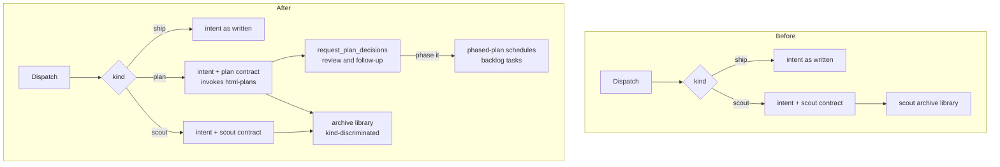

# The `plan` task kind

## Outcome

Mission Control gains a third durable task **Kind**, `plan`, alongside `ship` and `scout`.
Choosing it in the dispatch form launches an agent that is told, in its own delivered prompt, to
produce a reviewed HTML plan rather than a change or an investigation report. The human reads
the rendered plan in the dashboard, refines it with the agent, and is then asked - as selectable
options, not as prose - whether to turn it into a phased implementation plan with one
dependency-linked backlog task per phase.

The plan the agent produces outlives the checkout it was written in. Plan artifacts are captured
into the same durable, machine-local archive library that already preserves scout reports, so an
approved plan survives worktree reclamation, daemon restarts, and database replacement.

Three sentences describe what a person sees:

1. Pick **plan** under **Kind**, describe what you want planned, dispatch.
2. A `plan.html` arrives for review. You refine it in conversation until it is right.
3. The agent asks, with buttons, whether to phase it. Choosing yes fills your backlog with
   dependency-linked implementation tasks that release when the plan's pull request merges.

## What the repository does today

- `TASK_KINDS` in `src/shared/types.ts:1426` is the two-element tuple `["ship", "scout"]`. Both
  `TASK_KIND_INFO` (`src/shared/task.ts:41`) and `GUIDED_KIND_KEYS`
  (`src/web/lib/guided-dispatch-steps.ts:203`) are `Record<TaskKind, …>`, and both carry comments
  stating that a third kind must not compile until it has said how it is offered. The repository
  was written in anticipation of this change.
- `tasks.kind` is `TEXT NOT NULL` (`src/server/db.ts:136`) with no `CHECK` constraint and no
  migration in its history. A third kind is a zero-migration change to that column.
- The `html-plans` skill (`skills/html-plans/SKILL.md`) **already** owns everything this feature
  asks an agent to do once it is planning: write `docs/plans/<name>/plan.md`, emit a
  self-contained `plan.html` beside it, open it for review, draw flow changes as inline SVG, and
  end every root plan review with a `request_plan_decisions` call whose last decision is the
  `implementation-follow-up` question offering **Create phased implementation plan** or **Stop
  after this plan**.
- The `phased-plan` skill (`skills/phased-plan/SKILL.md`) already owns the follow-up: investigate
  the plan against the repository, write merge-aware phase documents beside the source plan, and
  schedule one `create_task` per phase with `dependsOnCurrentSession: true` so the phase tasks
  stay backlogged until the planning pull request merges.
- Both skills are **opt-in** and both are `enforcement: triggered`. Neither is guaranteed to be
  installed in a dispatched session.
- The scout kind already establishes every seam this feature needs. Its contract is composed by
  the daemon at delivery (`src/server/scouts/prompt.ts`) and injected at two places: a fresh
  dispatch (`src/server/dispatcher.ts:262`) and a backlog task assigned to a live session
  (`src/server/tasks.ts:2074`). Its launch requirement is derived from the durable kind
  (`scoutMissionMcpRequirement`, `src/server/mission-mcp.ts:83`). Its artifacts are published
  into a durable bundle before the worktree is removed (`settleBeforeCleanup`).
- That archive library is **scout-shaped throughout**: `SCOUT_ARCHIVE_FORMAT` is the literal
  `"mission-control/scout-archive"` written into every manifest, the index lives in the
  `scout_archives` and `scout_search_segments` tables, and the bundles live under
  `~/.mission-control/scouts/`. Around 7,100 lines carry the name.
- The archive's HTML validator (`src/server/scouts/html.ts`) refuses **any** URL scheme anywhere
  in a page, including a navigational `<a href>`. Real plan pages in this repository link out to
  external documentation: `docs/plans/recurring-missions/plan.html` carries five such links.
- **No Scouts page exists.** `docs/scout-archives.md` states that the reading UI "arrives in a
  later change"; today the library is reachable only through the daemon's HTTP API and the
  filesystem. The archive subsystem therefore has no user-facing surface bound to its name.
- Foreman's `skipReviewArtifactWrapup` (`src/shared/protocol.ts:1102`) is on by default and
  retires "mockups and other explicit review-only artifacts" at completion instead of offering an
  automatic wrap-up. It classifies from the resolved objective and the completed diff's paths.

## Incorporated human decisions

These were submitted before this plan was written and are requirements here, not open questions.

| Decision | Approved selection | Consequence |
|---|---|---|
| Artifact durability | Durable archive, like scout | Plan artifacts are captured into the archive library and survive worktree reclaim; they are not left to the pull request alone |
| After work | Preselect None, reversibly | Choosing `plan` stashes and clears the after-work Workflow exactly as `scout` does, and switching back hands the stash back losslessly |
| Skill dependence | Point at the skills | The delivered contract invokes `html-plans` rather than restating it; a plan dispatch requires that skill to be enabled and refuses when it is not |
| Completion | Normal boundary, like ship | No scout-style completion gate. A plan task completes on Foreman's ordinary boundary; durability is achieved at teardown instead |
| External links | Allow clickable external links | The archive HTML validator permits `http(s)` in navigational slots only, and continues to refuse every fetching slot. This applies to the shared format, so scout reports gain it too |
| Archive container | Generalize and rename to archives | A neutral, kind-discriminated archive format, root and table, with a read path that still discovers existing scout bundles |
| Foreman wrap-up | Offer ordinary wrap-up | A completed plan task gets the same Ship it / Straight to PR handling as a ship task, which requires exempting the kind from the review-artifact classifier |

## The plan kind

### Vocabulary and surfaces

`TASK_KINDS` becomes `["ship", "scout", "plan"]`. Array order is picker order, so `plan` is
offered third. `ship` remains index 0 and remains the default every automated writer takes.

Two `Record<TaskKind, …>` registries stop compiling until they are extended, which is the
intended enforcement:

- `TASK_KIND_INFO` gains a `plan` entry. Its `blurb` is the one line a person reads when choosing:
  it must say that a plan produces a reviewed page and can schedule the work, and that it has no
  diff to review.
- `GUIDED_KIND_KEYS` gains `plan: "l"`. `p` belongs to `ship` and `t` to `scout` for the reason
  recorded at `guided-dispatch-steps.ts:193` - the two words share a first letter, so the
  mnemonics are the letters that distinguish them. `l` is the free distinguishing letter in
  `plan`; `p`, `a` and `n` are taken, ambiguous, or both.

Several surfaces degrade silently rather than failing to compile, and each is in scope:

- `src/shared/task.ts:183` (`taskPillParts`) draws a kind badge only for `scout`, on the stated
  ground that `ship` is what everything defaults to. `plan` is deliberately chosen and rare, so it
  is drawn on the same reasoning that draws `scout`.
- `src/web/styles.css` has `.bl-kind-ship` and `.bl-kind-scout` colour rules and no fallback. A
  `.bl-kind-plan` rule is required or the backlog card's kind chip inherits body text colour.
- `src/server/foreman/backlog-prompt.ts:68` describes the kind to Foreman's backlog-planner model
  with a binary ternary, so a third kind is described to the model as "investigate and report".
  This becomes a lookup over the registry.
- `src/web/components/schedules/ScheduleEditor.tsx:365` and
  `src/web/components/TaskSourcesPanel.tsx:600` hand-write their `<option>` elements. They are the
  two entries in `KNOWN_HAND_WRITTEN` (`test/task-kinds.test.ts:47`), a list explicitly allowed to
  shrink and never grow. Both are converted to render from `TASK_KIND_INFO`, which both fixes the
  omission and empties that list.
- `src/server/db.ts:3232` reads the column back with an unvalidated `r.kind as TaskKind` cast,
  while the schedule store validates the same vocabulary with `readPersistedEnum`. The task read
  path adopts the same validation, so a row written by a newer build degrades predictably instead
  of flowing into typed code as a kind that does not exist.
- `KIND_FIELD_TIP` (`DispatchModal.tsx:285`) and the guided hint (`:2452`) are two-kind prose.

### What a plan task is delivered

A plan task's intent is composed the way a scout's is: the operator's own words first, then a
contract appendix, at both delivery seams. Nothing clamps or rewrites the intent.

The contract differs from scout's in one deliberate way. Scout's appendix **restates** its skill
because a scout's output is server-enforced and had to hold with skills switched off. The
approved decision here is the opposite: the plan appendix **invokes** `html-plans` and lets that
skill own the procedure. The appendix therefore says what a plan task is for, invokes the skill,
names the artifact location, and states that the phased-plan follow-up is expected. It does not
duplicate the skill's rendering rules, its decision schema, or its diagram guidance.

The invocation must be written through `skillCommand(agent, name)` rather than as a literal
`/html-plans`, because the three harnesses spell it differently: Claude uses `/html-plans`, Codex
uses `$html-plans - run this skill now.` (the trailing clause closes the mention popup so a single
Enter submits), and Pi uses `/skill:html-plans`. A hardcoded slash command would be inert on two
of the three harnesses.

Because the contract points at a skill instead of restating it, the skill's presence becomes a
launch requirement rather than a nicety. A plan dispatch is refused when `html-plans` is disabled
or missing, with a message naming the toggle - the same shape as the existing refusal when a
scout is dispatched on a machine where the MCP bundle is not built
(`src/server/tasks.ts:1921`). This is the one place the plan kind deliberately diverges from the
scout precedent, and it follows directly from the approved decision to point at the skills rather
than to restate them.

`phased-plan` is required on the same terms, because the follow-up decision the human is offered
is not answerable without it. Refusing at dispatch is better than refusing after the human has
already chosen to phase the work.

### Launch requirements

`scoutMissionMcpRequirement` generalizes into a kind-dispatched function. A plan task must be
able to call:

- `request_plan_decisions`, which is how the plan is shown for review and how the phased-plan
  follow-up is asked. Without it the agent falls back to asking in prose, which is the exact
  failure the skill exists to prevent.
- `create_task`, which is how `phased-plan` schedules the phase tasks.

A ship task keeps getting its caller's requirement back unchanged, `null` included, so existing
dispatch argv stays byte-identical.

### After work, completion, and wrap-up

Choosing `plan` in the dispatch form moves the after-work Workflow to **None** and stashes the
previous selection, reusing `afterWorkForKind`'s existing stash-and-restore. Switching back to
`ship` hands the exact stash back. As with scout this is a default and not a lock: a Workflow
picked by hand after choosing `plan` sticks, and is never reverted by a later kind switch.

A plan task completes on Foreman's ordinary boundary. There is no gate equivalent to
`ScoutArchiveGate`. The refinement loop does not need one: `request_plan_decisions` blocks the
agent until the human submits or dismisses, so the conversation is held open by the tool call
rather than by a completion rule.

A completed plan task is offered ordinary wrap-up - the same Ship it / Straight to PR handling a
ship task gets. This is a requirement rather than a consequence, and it does not happen for free:
a plan's diff is confined to `docs/plans/**`, which is precisely the shape
`skipReviewArtifactWrapup` exists to retire. Delivering the approved decision means the plan kind
is exempt from that classifier. The reasoning is that a plan is not a review artifact in the sense
that setting means - a mockup is a thing produced *for* a review and then discarded, while a plan
is a durable document whose landing on the default branch is what releases the phase tasks that
depend on it.

The result is that a plan task ends with both an archive and an offered pull request. That is not
redundancy. The archive is what preserves the plan when the human stops after it; the pull request
is what publishes the paths when the human phases it, because `phased-plan` schedules tasks that
carry paths rather than content and those paths must resolve on the default branch.

## The kind-agnostic archive library

### Why the rename

Plan bundles have to live somewhere durable, and the repository already has exactly one durable
bundle library. Building a second one for plans would be a parallel source of truth for
"immutable local artifact bundle, indexed for search, discovered from disk" - the thing the
project's working rules forbid most explicitly.

Reusing it under its current name would mean a `scouts/` directory and a `scout_archives` table
holding plans, and a `mission-control/scout-archive` format string in a plan's manifest. The
approved decision is to make the container honest instead.

The rename is affordable now for a reason that will not hold later: **the reading UI has not been
built**. There is no Scouts page, no route, no command-palette entry, and no topbar segment bound
to the name. The rename touches the daemon, the shared contract, the tables and the docs, and
stops there. Every month that passes before this happens makes it more expensive.

### Format, storage, and index

- The manifest gains a `kind` discriminator naming what the bundle preserves, and carries a new
  neutral format string. The bundle's internal shape is otherwise unchanged: a manifest, a primary
  directory of the rendered artifact and its companions, and supporting artifacts under a
  generated per-repository slot.
- Bundles are written under a neutral archives root beside the existing scouts root, resolved the
  same way from the Mission Control state directory, so `MISSION_HOME` continues to move the whole
  library and an isolated or demo daemon keeps its archives beside its own database.
- The index moves to neutrally named tables. The index is a **cache** - the existing subsystem
  already rebuilds it from disk when the database is deleted - which is what makes this a
  low-risk schema change rather than a data migration. The bundles on disk are the record.

### The compatibility window

The read path discovers and indexes both formats: existing bundles under the scouts root carrying
the old format string, and new bundles under the archives root carrying the new one. A legacy
bundle with no `kind` field reads as a scout, which is what it is. The write path only ever emits
the new format.

Nothing rewrites or moves an existing bundle. The project's rule against renaming persisted
append-only identifiers is honoured by leaving the old identifier meaningful forever rather than
by redefining it: `mission-control/scout-archive` keeps meaning exactly what it has always meant,
and stops being produced.

The consequence to state plainly is downgrade behaviour. An archive written by a build that has
this change is not discovered by a build that does not. That is acceptable for a local cache of
local files whose bundles remain readable in a file manager either way, and it is the same
property the schedule store already has.

### The validator relaxation

`urlProblem` (`src/server/scouts/html.ts:354`) currently rejects every scheme in every slot. The
approved change is to permit `http(s)` where the attribute is navigational - `href`, `action`,
`formaction`, `ping` - and to keep refusing it everywhere a page fetches on open: `src`,
`xlink:href`, CSS `url()`, `@import`, `image-set()`, and every other entry in `URL_ATTRIBUTES`.

The existing rationale supports the distinction rather than contradicting it. The comment at
`html.ts:345` defends the small allowed set as being about "a request this machine would make on
somebody else's behalf when a human opens an archive they were sent" - which is what an automatic
fetch does and what a click does not. `data:` remains refused in navigational slots, since a
`data:` link target is a navigation primitive and not a reference.

This applies to the shared format, so archived scout reports gain the same ability. That is a
deliberate widening, and the tests that pin the refusals must gain a case for each fetching slot
so the relaxation cannot spread past navigation.

## Flow

Today a scout is the only kind whose delivery is shaped by the daemon, and the only kind with a
durable output. After this change the daemon composes a contract for two kinds, and both kinds'
outputs land in one library.

## Non-goals

- **No Archives reading UI.** This plan does not build the page that reads the library. That
  remains the later change `docs/scout-archives.md` already anticipates, and it now inherits a
  neutrally named library to read rather than a scout-named one.
- **No new planning skill.** `html-plans` and `phased-plan` are the procedure and stay the
  procedure. This plan adds the kind that guarantees an agent reaches them; it does not fork them.
- **No change to what `phased-plan` schedules.** It continues to create ship tasks with
  `dependsOnCurrentSession: true`. A phase task is not a plan task, and nothing here makes plans
  recursively phase themselves.
- **No migration of existing scout bundles.** They stay where they are, in the format they have.
- **No kind for the MCP `create_task` tool.** It continues to file ship tasks only, as it does for
  scout today. An agent cannot file a plan task; a human chooses the kind.

## Risks

- **The rename is the majority of the work and delivers nothing a person can see.** It is
  sequenced first because it is foundational, and it is scoped to be behaviour-preserving for
  scouts, which is what makes it reviewable: the existing scout tests must pass unchanged through
  the renamed library.
- **A plan dispatch now depends on two opt-in toggles.** Refusing at dispatch makes the dependency
  loud instead of silent, but it is a new way for a dispatch to fail. The refusal message must name
  the toggle and the settings location, or it will read as a bug.
- **The validator relaxation widens a deliberately narrow security surface.** Confining it to
  navigational attributes, and pinning each fetching slot with a test, is what keeps the widening
  from spreading.
- **Foreman's classifier exemption is a behaviour change keyed on kind.** It is required by the
  approved wrap-up decision, and it must not disturb the classifier's judgement for ship tasks
  that genuinely produce only mockups.

## Verification

- The existing scout suite passes unchanged against the generalized library, which is the
  behaviour-preservation proof for the rename.
- Golden bundle vectors cover both the legacy format read path and the new format write path.
- `test/task-kinds.test.ts` extends to three kinds, and `KNOWN_HAND_WRITTEN` empties.
- A Playwright spec drives the dispatch form to `plan`, asserts the after-work preselection and
  its lossless reversal, and asserts the kind chip renders. UI changes in this repository require
  a browser spec; the older layers are additions to that requirement and never substitutes.
- A dispatch with `html-plans` disabled is refused with the message naming the toggle.
