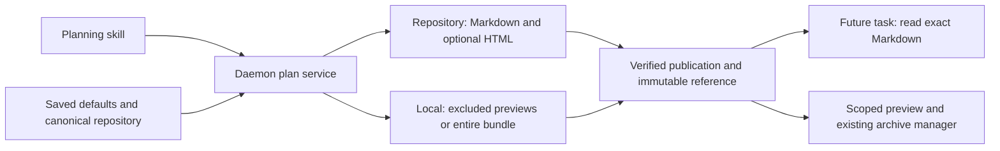

# Plan storage policy

Status: approved design scheduled as two implementation phases. This pull request publishes the planning inputs only; neither phase's feature implementation is included.

## Delivery boundary

The operator selected a plans-only pull request on 2026-10-08 and will merge it. The two
already scheduled tasks retain their original full implementation scope and dependency order.
Phase 1 delivers managed repository plans and HTML policy. Phase 2 builds on Phase 1 to deliver
local storage, exact task inputs, discovery, and approval/workflow-backed publication.

Implementers start from the merged repository. An earlier uncommitted implementation draft
was set aside locally and is not part of this pull request or a prerequisite. Do not assume
that its settings, writer, task hints, tests, or skill changes have landed. The detailed phase
contracts below describe work to implement and verify, not existing product behavior.

## Outcome

Let an operator decide whether Mission Control planning skills publish plans through Git or retain them locally for future tasks. Markdown is committed by default. Generated HTML is still rendered for review, but is committed only after an explicit opt-in. Destination and publication are daemon-owned operations, with stable skills and task instructions that identify both storage locations.

This Markdown is the authoritative source for the implementation phases. It incorporates the earlier design report and supersedes that report's open-design status. The report is not a required implementation input or a committable artifact.

## Recorded decisions

- The operator initially requested a design before implementation and then requested a separate HTML-commit preference.
- The operator subsequently instructed: "use phased plan skill to schedule the work based on recommended path forward". This selected the daemon-managed recommendation and authorized the two scheduled tasks. On 2026-10-08 the operator explicitly returned delivery to a plans-only PR, with implementation owned by those scheduled tasks.
- New plans use application-wide defaults. Existing tracked plans are not automatically migrated, untracked, deleted, or rewritten.
- Update the shipped HTML Plans and Phased Plan skills once to use a managed API. Do not generate or rewrite installed skill variants when a setting changes.
- Local retention is machine-local, beneath the configured Mission state home. Cloud synchronization, automatic migration, per-repository overrides, and arbitrary Git interception are outside this release.
- This planning package's downstream pointers are Markdown-only. Its HTML renderings are local review companions, not implementation dependencies. Never commit the earlier `report.html` or workflow evidence.

## Behavior

| Plan storage | Commit generated HTML | Plan files included in Git | Local files |
| --- | --- | --- | --- |
| Repository, default | Off, default | Source and phase Markdown only | Rendered HTML and review companions |
| Repository | On | Markdown and self-contained HTML | Other review companions |
| Local | Disabled, preference retained | None | Complete Markdown and HTML bundle |

The UI lives in Settings > Skills. Local mode takes precedence over the HTML preference. Returning to repository mode restores the saved HTML preference. Both settings default correctly on an existing installation whose saved configuration lacks the new keys.

"Commit" describes eligibility for the normal publication workflow. Saving a plan does not run Git, open a PR, or bypass the session's completion handoff.

## Acceptance criteria

| ID | Observable outcome | Owning phase |
| --- | --- | --- |
| PS-01 | New and upgraded settings default to repository plans and HTML excluded; the operator can enable HTML commits and the preference survives restart and settings restore. | 1 |
| PS-02 | A daemon-managed repository plan writes only Markdown to committable checkout paths by default; HTML opt-in adds its HTML files. Ordinary staging in an isolated repository demonstrates the difference. | 1 |
| PS-03 | HTML remains generated, readable, linked to its exact Markdown revision, and available for review and archive capture even when omitted from Git. | 1 |
| PS-04 | A plan pins its policy at creation. Later setting changes do not relocate active plans or reinterpret referenced revisions. Legacy tracked Markdown and HTML remain untouched unless explicitly edited or migrated. | 1 |
| PS-05 | Registered sessions use stable planning tools and one skill procedure. The daemon resolves repository ownership, rejects unauthorized paths and corrupt settings, and preserves whole revisions through retry, concurrency, and restart. | 1 |
| PS-06 | The local storage option persists a complete plan bundle under `$MISSION_HOME/plans/<repo-name>/`, normally `~/.mission-control/plans/<repo-name>/`, with no plan output eligible for Git staging. The HTML checkbox is disabled in local mode without losing its saved value. | 2 |
| PS-07 | Linked worktrees share their owning repository's plan namespace; unrelated repositories with the same name do not collide. Published local plans survive authoring-worktree cleanup. | 1 establishes identity and retention; 2 proves full-local use |
| PS-08 | Every managed task delivery, including assignment to an existing session and attached repositories, tells the agent to check repository plans and the appropriate local store. | 2 |
| PS-09 | Scheduled phase tasks retain exact structured Markdown references. Missing, corrupt, ambiguous, or unauthorized pinned inputs block dispatch with a useful reason rather than silently selecting a different plan. | 2 |
| PS-10 | Local planning can release its artifact prerequisite after exact human-approved publication and applicable workflow validation without a planning PR. Repository publication and implementation-phase merge prerequisites retain their existing meaning. | 2 |
| PS-11 | Failed, paused, superseded, or mismatched workflow/revision evidence cannot publish a local plan; retries and restart cannot release dependencies twice or broaden which edges are satisfied. | 2 |
| PS-12 | Settings and preview UI behavior have browser coverage using fake agents, with no model calls. Future implementation evidence demonstrates all three storage/HTML combinations and the scheduling boundary. | Both, for their delivered behavior |

## Ownership and artifact contract

One daemon plan service owns identity, policy resolution, saved revisions, destination mapping, and publication readiness. Extend `src/server/plans/`; use browser-safe schemas in `src/shared/`. MCP remains an authenticated HTTP bridge and Foreman remains an HTTP client. Neither process writes SQLite.

Use the existing configured `STATE_DIR` and canonical repository resolver. The readable repository name is a directory label, not its identity. A proposed layout is:

```text
$MISSION_HOME/plans/<sanitized-repo-name>/<repo-key>/<plan-id>/<revision>/
```

Derive `repo-key` from the canonical owning repository rather than the temporary checkout or basename alone. Independently cloned repositories retain independent local namespaces in this release. Moving a repository or transporting plans between machines requires explicit future import/mapping; do not guess from a display name.

Each plan has a stable identity and pinned artifact policy. Each saved revision is immutable and records a bounded inventory and digests. The daemon's operational ledger owns provenance and publication state; the revision manifest owns the file inventory. Repository Markdown remains authoritative in repository mode; retained snapshots and previews are immutable evidence of a revision, not another editable source.

A settings-only change does not alter skill symlinks or their reload generation. A corrupt stored record is not equivalent to a missing new preference and must refuse managed writes rather than silently selecting repository publication.

Managed writes accept bounded, validated artifact input and choose destinations themselves. Prefer bounded content payloads for Markdown and self-contained HTML, avoiding an external-directory write grant to the agent. Any import of a generated file uses an explicitly attributed, bounded source inside the caller's checkout and the existing no-symlink/path-validation discipline. Do not accept an arbitrary destination or sweep the checkout for likely plans. An optional staging implementation must establish that its exact directory is ignored before an agent writes there.

The normal managed path creates only policy-eligible files in committable checkout locations. This is not an assertion that an unrestricted shell user cannot manually copy excluded HTML into Git or force-add an ignored file.

## Save, review, and publication

Distinguish saving a revision, recording human approval, and making a plan available to dependent tasks. A successful save is not approval or publication. Reject stale expected revisions and content changes after approval unless a new revision is saved and approved.

Stage a complete bounded revision before publishing its manifest. Record readiness only after required files and their digests can be read. Repository checkout writes cannot be atomically committed with another filesystem or SQLite transaction: maintain a recoverable write intent, replay only matching writes, and refuse conflicting operator edits. Never claim cross-filesystem atomicity.

For repository mode, preserve the existing Git publication boundary. The required paths are Markdown, plus HTML when its policy includes it. When HTML is omitted, it is registered as a local preview and is not required to resolve in the pushed commit. Future tasks consume Markdown sources, not an HTML path.

For local mode, the approved bundle must be durable, the exact selected workflow must finish successfully when present, and the work episode must still match. Use existing completion and workflow owners. Do not create a second Foreman loop, infer approval from task prose, or treat session idleness or exit as publication.

Plan-only local tasks do not need an empty PR. Mixed code-and-plan tasks continue shipping their code through their selected workflow and merge requirements. Persist a distinct plan-publication prerequisite so a local plan publication cannot accidentally satisfy ordinary task/session merge edges.

## Discovery, review, and archives

At both task delivery seams, resolve the main and attached repositories and provide the checkout's `docs/plans/` location plus the corresponding local plan location. Discovery instructions apply even after the operator changes the current default. Avoid placing the complete local catalog in every launch prompt.

Tasks created from managed plans carry repository-scoped plan id, revision, and Markdown file references. A pinned plan resolves exactly, not by filename fallback. Missing inputs block before provision/reset/delivery, and are rechecked before use. Unpinned historical searches inspect both locations and surface ambiguity.

Provide a scoped plan reader and rendered preview that identifies the exact revision and uses existing sandbox/CSP and archive-reader patterns. Do not weaken checkout-only file APIs to admit arbitrary home paths. Relative links between a plan, its phase index, and phase files must continue to work in the virtual bundle even when physical destinations differ.

The existing archive manager remains the archive owner. Managed revisions provide verified capture inputs for excluded HTML and local plans. Unregistered legacy plans retain Git-diff-based capture and its existing partial-result behavior. Do not loosen the archive library's global ignored-file or root restrictions to accommodate one new producer.

## Flow



## Compatibility boundaries

- No automatic deletion or untracking of historical files. Existing unmanaged plans remain readable and retain their established publication path. New-plan defaults do not silently rewrite a legacy plan's effective contract.
- No `.gitignore` policy change for all users, global Git hook, commit interceptor, or filesystem watcher racing an agent's commit.
- No automatic remote backup. A settings snapshot contains the preferences, not the local plan contents. Document that distinction.
- New tool names must appear in the Mission MCP registry and built handshake/smoke expectations. A required tool absent from the built bundle causes a visible preflight refusal.
- Do not mutate published workflow versions. Append new versions or introduce an explicitly selected local-publication completion capability through the existing graph/action registry. Unsupported custom workflows must be refused with an actionable explanation, never silently altered or skipped.
- Third-party skills must opt into the managed API for the destination guarantee. Unregistered sessions get an explicit refusal when they require managed storage. They never silently fall back to committing locally intended plans.

## Implementation and verification

The implementation sequence and repository findings are in [phased-plan.md](phased-plan.md). Detailed steps live only in their phase documents. This plan is the approved outcome and boundary; those steps remain proposed routes that an implementer should adapt when current repository evidence warrants it.

Each phase includes its own focused behavior tests, Playwright coverage, documentation, and required repository checks. No release, signing, deployment, or CI infrastructure changes are part of this work.
