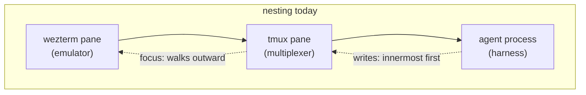
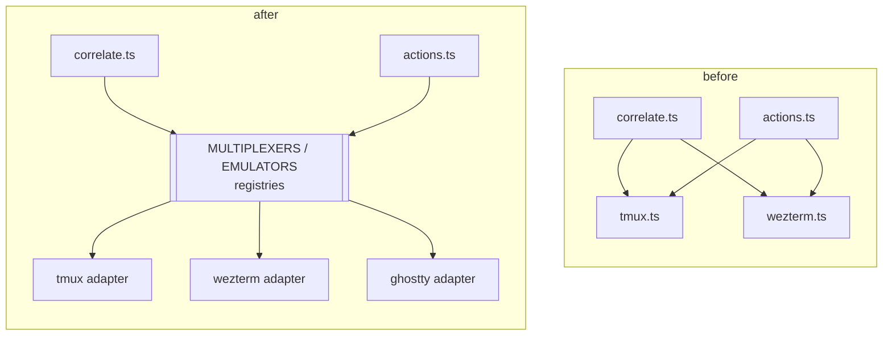
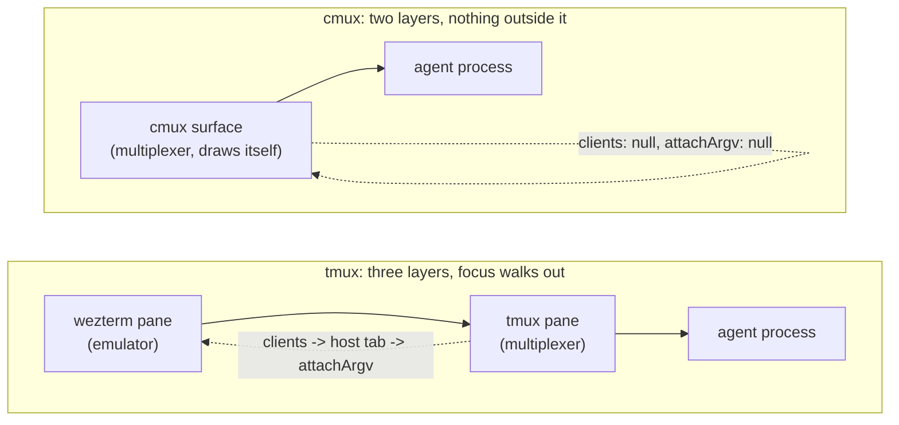

# Pluggable integrations: harnesses, multiplexers, terminals

Mission Control hardcodes three vendors: Claude Code, tmux, and WezTerm. Adding a fourth
agent (`pi`), a different multiplexer (`cmux`, `zellij`), or a different terminal (Ghostty,
iTerm2) currently means editing dozens of unrelated files and hoping you found them all.

This plan defines the interfaces those integrations should sit behind, and sequences the
migration of the existing code onto them.

## The finding, in one sentence

There is no abstraction today - `src/server/harnesses.ts` is a 24-line settings blob, not a
harness registry - and the ~35 `if (agent !== "claude")` guards plus ~20 open-coded
`if (session.tmux) … else if (session.wezterm) …` branches mean **a new integration degrades
silently rather than failing to compile**.

## Evidence

### Agent coupling (claude / codex)

| Capability | Where it is hardcoded |
|---|---|
| Process detection | ~~`discovery/processes.ts:47-90` - literal argv signatures per agent~~ **closed**: `Harness.detect` |
| Binary resolution | ~~**three** independent paths: `config.ts` `AGENT_BINS`, `claude-cli.ts:26`, `main/integrations.ts:184`~~ **two of three closed**: `Harness.bin` + one `resolveAgentBin`. `main/integrations.ts:184` belongs to the hooks/MCP-install row |
| Transcript | `transcript.ts:51` hard `return null` for non-Claude; Anthropic JSONL shape throughout (`:115-155`, `:500-505`, `:584`) |
| Rollout (codex) | `codex-rollout.ts` - metadata only, no message parsing |
| Dispatch point | `runtime-meta.ts:43-58` - an explicit `if claude … else if codex`. This is where the interface belongs. |
| ~~Hook -> state~~ | **Closed.** `Harness.hooks` - see "`hooks`, as landed" below |
| TUI mode line | **Closed.** `harness.tui.modeLine`; `pane-mode.ts` keeps the scan |
| TUI dialogs | **Closed.** `harness.tui.dialog`; the grammar was never Claude-specific - see below |
| Paste settle | `actions.ts:311` `PASTE_SETTLE_MS = 400`, measured against Claude Code 2.1.215 |
| Paste placeholder | `discovery/pane-paste.ts:37` - Claude's `[Pasted text #N]` |
| Skills | ~~`skills/reconcile.ts:48-53`, `shared/skills.ts:73` `/reload-skills`~~ - **closed**, `Harness.skills` |
| Hooks + MCP install | **closed** - the event vocabulary is `Harness.hooks`, the MCP registration is `Harness.mcp`. `hooks/install.mjs` still writes `~/.claude/settings.json` because that path is Claude's, not ours. |
| Model windows | `shared/model.ts:96-101` - only Claude families get a non-200k default |

The union itself was written out **three** times (`shared/types.ts`, `shared/protocol.ts`,
`web/lib/api.ts`) and `AGENT_LABEL` **twice**, holding different values for the same key -
`session-bits.tsx` said "Claude Code" where `TranscriptPanel.tsx` said "claude". **Phase 0
collapsed both**: `AGENT_TYPES` (`shared/types.ts`) is the one source the zod enum and the
dashboard's dispatch input now derive from, and `AGENT_IDENTITY` (`shared/agent.ts`, `AGENT_NAMES` until the UI item
widened it) holds each register as a named field (`label`, `speaker`, and now `accent`)
so none can be mistaken for drift.

**The first five rows, the hook row, and skills / MCP / permission modes are closed.**
`Harness.transcript` (`server/harness/types.ts`) owns transcript, rollout, and the dispatch
point between them: `runtime-meta.ts` names no agent, Claude's JSONL shape lives in
`harness/claude/`, the rollout in `harness/codex/`, and the byte windowing that belongs to
neither sits in `transcript.ts` behind a supplied line parser. `Harness.detect` and
`Harness.bin` then closed the first two: `discovery/processes.ts` iterates the registry, and
one `resolveAgentBin` serves both things that spawn an agent CLI. See "`transcript`, as
landed", "`hooks`, as landed", "Capability guards, as landed" and "`detect` and `bin`, as
landed" below.

**The paste settle and paste placeholder rows are closed too.** `Harness.control`
(`ControlSpec`) owns both: the measured settle window and Claude's `[Pasted text #N]` regex
live in `harness/claude/control.ts`, Codex declares `pastePlaceholder: null` instead of
inheriting a regex it could never match, and `actions.ts` holds no per-agent constant -
`hasPendingPaste` is handed the placeholder rather than owning one. See "`control`, as
landed" below.

Before Phase 0, only **four** `Record<AgentType, …>` maps would fail to compile on a new
agent. Everything else silently does nothing, and that asymmetry is the core problem. Phase 0
took it to **six** - `shared/agent.ts`, `shared/cost.ts`, `shared/goal.ts`, `shared/model.ts`,
`server/config.ts`, `server/goal/source.ts` - which is the list `session-contracts.test.ts`
pins by adding a probe agent id and asserting each one fails to typecheck. The transcript
item swapped one of those for `server/harness/index.ts`: the per-agent `GoalSource` record
WAS that capability spelled twice, and one `Harness` entry forces a decision about every
capability at once rather than about one reader. The detection/bin item folded
`server/config.ts` in the same way - `AGENT_BINS` was the bin capability spelled where the
harnesses could not see it - so the list is `shared/agent.ts`, `shared/cost.ts`,
`shared/goal.ts`, `shared/model.ts`, `server/harness/index.ts`, plus
`shared/harness-capabilities.ts`, which the capability-guards item added beside it: the two
harness records are a purity split, not a second vocabulary; see "Capability guards, as
landed". The rows still marked silent in the table above are the ones nothing yet forces.

### Terminal coupling (tmux / wezterm)

`wezterm.ts` and `tmux.ts` are **not parallel** - they diverge in shape, in where their
code lives, and in which capabilities exist at all:

| | wezterm.ts | tmux.ts |
|---|---|---|
| bin resolution | ~~`resolveWeztermBin()`, `WEZTERM_BIN`~~ | ~~literal `"tmux"` at ~19 inline call sites~~ **closed**: one `BinSpec` each, `resolveBin` + `binEnv`. The last eleven inline `run("tmux", …)` calls went with the lifecycle item, and `resolveWeztermBin` with them |
| pane id type | `number` | `string` (`"%3"`) |
| cwd | `file://` URL, needs `weztermCwdToPath` | plain path |
| spawn | ~~`spawnWeztermTab` (used only as a focus fallback)~~ | ~~lives in `dispatcher.ts:449-468`, not in `tmux.ts`~~ **closed**: `EmulatorSpawn.tab` / `MuxSessions.spawnDetached`, both reached through `launchHome` |
| retitle | ~~`setWeztermTabTitle`~~ | ~~inline in `actions.ts:1090`~~ **closed**: `TerminalEmulator.retitle` |
| copy-mode probe | none - no such concept | ~~`readTmuxPaneMode:57-71`~~ **closed**: `Multiplexer.paneMode`, and null there means "no such concept" rather than "in no mode" |
| focus | ~~`activateWeztermPane:83-87`~~ | ~~cannot focus alone~~ **closed**: `EmulatorFocus` / `Multiplexer.select`, composed in `focus` |
| kill group | ~~none - SIGTERM only (`actions.ts:1234`)~~ | ~~`kill-session`~~ **closed**: `MuxSessions.kill`, nullable - "has a killable group" is now declared |

Duplicated pane-token functions, in **two spellings**: `actions.ts` (the write lock) and
`pane-mode.ts` (the capture-miss counter) emitted `wezterm:`; `registry.ts` (the hook
overlay) and `foreman/queue-apply.ts` (the pane-recreated guard) emitted `wez:`. Each
subsystem was internally consistent, so there was no live defect - but it was four copies of
one function waiting for a fifth backend. **Phase 0 collapsed them** into `paneToken`
(`shared/pane.ts`) on the `wezterm:` spelling, tmux being unabbreviated too; no token is
persisted, so the format was free to change. `test/pane-lock.test.ts` pins the agreement.

## The design

### Three axes, not one

The request was "one interface per integration point". The investigation says there are
**three** axes, and folding them together would be the design error:

1. **Harness** - the agent process. Detection, transcript, live state, TUI grammar, skills,
   hook/MCP installation. (`claude`, `codex`, `pi`)
2. **Terminal** - which itself splits in two (below).
3. **Headless runner** - the `claude -p` calls behind Foreman triage, goal refinement, task
   titling, away digests and the Inspector (`claude-cli.ts`, plus their per-caller model
   constants). This is a *model provider* axis, orthogonal to which agent the observed
   session runs. Keep it separate; conflating it would mean you cannot review a Pi session
   with Claude, or a Claude session with a cheaper local model.

#### `LlmRunner` must guarantee context isolation, not just shape

"One-shot text completion with a model id and a prompt" describes the signature and misses
the contract. Today the guarantee comes from three flags that are **absent** in
`claude-cli.ts` - no `--resume`, no `--continue`, no `--session-id` - which is why that
file now carries a comment saying so. Without one of those, every run mints a new session
with an empty context.

That is a correctness property, because the Foreman reviews *many* sessions. Any
implementation that carried context between calls would grow it monotonically across every
session it ever looked at, and let session A's transcript influence the verdict on session
B. The tempting version is a warm held-open process to skip the spawn: measured, that is
~1.8-2.4s of a 4-6s call, and the prompt cache is server-side so a cold process still gets
a cache read. Almost nothing to buy, a correctness property to lose.

So the interface states isolation explicitly, and offers the only safe form of memory as a
named opt-in:

```ts
interface LlmRunner {
  /** Fresh context every call. The default, and what Foreman requires. */
  run(prompt: string, opts: RunOpts): Promise<string>;
  /**
   * Optional: one conversation per SUPERVISED SESSION, never one shared across sessions.
   * `claude -p --session-id <uuid>` then `--resume`. Null when unsupported.
   */
  runInThread: ((threadKey: string, prompt: string, opts: RunOpts) => Promise<string>) | null;
}
```

`RunOpts` cannot be just `{ model, timeoutMs }`. The Inspector already grants tools and
pays for it with a working directory and a `--settings` deny-list (`ClaudeRunOptions.tools`
/ `cwd` / `settings`), so the interface has to carry a *sandboxing* shape, not only a model
id - and a runner backed by something other than `claude -p` has to be able to say it
cannot honour one. Treat `tools` as the capability boundary it is: the default of every
tool disabled is what makes it safe to embed untrusted transcript and repo text in a
prompt, and that default must survive being put behind an interface.

Also note the naming collision to avoid: phase 4 was titled "Headless", and this plan means
*which model does offline work*. It does not mean driving an agent without a terminal -
that is the `control` capability on the Harness axis. Rename one of them before both exist
in the codebase.

**Resolved, that way round.** The phase is renamed to "LLM runner" below and the new code
says `llm`, never `headless`. "Headless" keeps the meaning it already has on disk -
`HEADLESS_CWD`, `MISSION_HEADLESS`, `headlessTranscriptDir`, `goal/prune.ts` - which is an
offline run of the app's own, and one of those is read by a hook script installed globally
from a checkout that may lag this code, so it was never the cheap side to rename. The
Harness-axis capability stays `control`; it must not acquire "headless" as a nickname.

#### As landed

`@shared/llm.ts` holds the contract (pure, no `node:` imports - the web bundle imports it),
`src/server/llm/claude.ts` the `claude -p` implementation, `src/server/llm/index.ts` the
`Record<LlmRunnerId, LlmRunner>`. Three deltas from the sketch above, each forced by a real
caller:

- **`RunOpts.grant`, one object, not three sibling options.** `tools` / `cwd` / `denyPaths`
  are one decision - the tools are what make an untrusted prompt dangerous, the cwd is what
  bounds them, the deny list is what carves the credential stores back out - so a shape that
  let a caller pass one without the others would make the unsafe call the easy one. A
  runner declares `sandbox: LlmSandboxSpec | null`, and a grant it cannot fully honour is
  refused before the spawn rather than partly applied (`grantRefusal`). `denyPaths` are
  provider-neutral globs; rendering them into `claude`'s `--settings` is the runner's job,
  and `llm-runner-contract.test.ts` pins that rendering byte-for-byte against the
  Inspector's live constant so migrating that call site is a provable no-op.
- **`run()` returns the model's text, envelope already off.** The envelope exists because
  the runner passed `--output-format json`; a caller unwrapping it is undoing its own
  runner's flag.
- **`litter: LlmLitterSpec | null` and `killLiveRuns()`.** What a run leaves behind is part
  of the contract, not an implementation detail: nothing read or deleted these transcripts
  until `goal/prune.ts` existed, by which point 153 of 250 sampled on one machine were the
  app's own.

`runInThread` is `null` for `claude`, matching today's behaviour exactly - the shape is
`--session-id <uuid>` then `--resume`, and nothing wants it yet.

#### Which model, as opposed to how it is called

Deliberately NOT in `@shared/llm.ts`, because a third spelling of this is the actual mess:

- `@shared/foreman-models.ts` is already the right shape - four roles, each resolving
  config key -> env var -> shipped fallback, and *reporting which of the three won* so the
  settings panel cannot display a default the worker does not spawn with. Pure and in
  `shared` for the same reason `cost.ts` is: the worker spawns with the answer and the
  panel renders it.
- ~~`task-title.ts:20`, `away/digest.ts:17`, `goal/refiner.ts:39` are bare
  `envVar(…) ?? "claude-haiku-4-5"` - no config key, nothing surfacing them in the UI.~~
  **Closed**: `LLM_JOB_SPECS` (`@shared/llm-jobs.ts`), rendered by Settings → Models.
- ~~`inspector/worker.ts:92` is `cfg.model ?? envVar("INSPECTOR_MODEL")`, a third
  spelling.~~ **Closed** by `INSPECTOR_MODEL_SPEC` before this item; it is now the same
  ladder, filed with its own subsystem.

The next item puts those callers on the same ladder. It does not start a second list under
`llm.ts`; a runner answers "how is a model called", a role answers "which model", and only
the first one is the runner's.

#### The model-role ladder and the call sites, as landed

`@shared/llm-jobs.ts` holds `LLM_JOB_IDS` + `LLM_JOB_SPECS`, `src/server/llm/config.ts` the
`llm` blob over `app_config`, `src/server/llm/jobs.ts` the one call a background job makes,
and **Settings → Models** renders both axes. Four deltas from the sketch above, each forced
by something real:

- **`foreman-models.ts` was NOT generalised to hold every role.** The sketch said it should
  be, and that is the one instruction here worth disobeying: the ladder is already shared
  (`resolveModelChoice`), so what "generalise" would move is the ROLES - and a role is
  edited by the panel that owns its blob. Foreman's four live in the `foreman` blob and are
  written by the Foreman panel; the Inspector's one in `inspector`; these three had no
  owner, which is why they had no config key. Putting all eight in one module would put two
  writers on blobs whose whole concurrency story is a per-key merge with a single writer.
  So it is a THIRD set of roles on one ladder, filed the way the other two are, and
  `model-choice.ts` stays the only resolver. CLAUDE.md's "the roles stay with their
  subsystem" is the rule that decided it.
- **The runner ladder VALIDATES where the model ladder does not**, so it is
  `resolveLlmRunner` and not a fourth call to `resolveModelChoice`. A model id is free text
  the CLI resolves - a fixed list would strand an operator the day a model ships - while a
  runner id has to name something in `LLM_RUNNERS` or there is nothing to spawn. It
  therefore falls back on an unresolvable one, and REPORTS what it dropped: the config is
  persisted, so a downgrade leaves a stored id this build cannot resolve, and a silent
  replacement is indistinguishable from an unset field once the panel has drawn it. Same
  reason `LlmConfigSchema` `.catch()`es rather than throwing - `getLlmConfig` is on the path
  of every titling, goal refresh and digest, and a schema that rejected a preference would
  take all three down. The PATCH schema is strict, because a typo from the panel should be a
  400 the operator can read rather than a key that sits in the blob doing nothing.
- **`runStructured`, `createLimiter` and `parseModelJson` left `claude-cli.ts`**, as this
  item was always going to make them. They are a retry ladder, a concurrency gate and a JSON
  extractor - none of them about a provider - and `llm/structured.ts` takes a bound `run`
  function rather than a runner, which keeps it free of both `LlmRunner` and `runClaudeText`
  and lets the not-yet-migrated callers pass `(p) => runClaudeText(p, opts)` unchanged.
  `parseModelJson` still tolerates a `{result: …}` envelope, and that tolerance is dated:
  `LlmRunner.run` strips its own, so a migrated caller's text arrives bare and the branch
  does nothing. It goes with the last caller holding `runClaudeText`.
- **Triage's runner reaches the Foreman worker over a route, not the DB.** The worker is a
  separate process and never touches it, so `GET /api/llm/status` is where it reads the
  resolved runner - and it is the DAEMON's resolution, not the worker re-deriving one from
  its own environment, because a worker that answered differently from the panel that
  printed it is exactly the bug `ForemanStatus.models` exists to rule out. Refreshed once per
  outer pass and kept on the last known answer when the daemon cannot say: a blip must not
  move the cheap tier onto a provider nobody picked.

The Inspector and Foreman's review / verify / backlog are deliberately NOT migrated. The
Inspector is the one caller holding TOOLS, and rendering its `cwd` + deny list as an
`LlmToolGrant` is its own item - `llm-runner-contract.test.ts` already pins
`claudeGrantSettings` byte-for-byte against its live constants so that migration can be
provably a no-op rather than hopefully one.

Verified as byte-identical for anyone who changes nothing: `llm-config.test.ts` asserts that
an unconfigured daemon resolves the same three model ids the hardcoded constants produced,
from the same env var names, with `default` as the reported source. `llm-jobs.test.ts` pins
those ids as LITERALS rather than reading them back off the specs they came from. Tests:
`llm-jobs.test.ts`, `llm-config.test.ts`, `llm-panel.test.ts`,
`foreman-prompt-harness.test.ts`, `settings-sidebar-render.test.ts`.

#### Where the two axes meet, and the only place they should

Foreman's reviewer and router prompts describe the child's SCREEN - "you MUST fill
answer.option", "the child's UI is not a text box, it discards typed characters" - and that
is a claim about a harness's TUI sitting inside a call whose model is the runner's question.
It was written against Claude's chrome and handed to every agent's session.

`ReviewInput.session.agent` is now required, and `promptHarness(agent)` projects the two
facts the prompts need: what to call the child (`AGENT_IDENTITY`) and whether it renders
dialogs we can read and select rows in (`dialogSpecFor`). The failure it closes is
asymmetric, which is why the capability is asked rather than assumed - told a menu exists
where none is drawn, the model fills `answer.option` against nothing and `menuMismatch`
cancels the answer, which is safe but silently dead; told nothing where one IS drawn, the
model writes prose for a screen that discards typed characters, and that reply is delivered
as keystrokes. Only the second direction acts.

`promptHarness` returns a small pure shape rather than the prompt reading the registry
inline, and that is the same argument `PaneDeps.pane` makes: BOTH shipped harnesses declare
a dialog, so a policy that asked `dialogSpecFor` inline would have its no-menu branch first
exercised by whichever harness declares `tui: null` - which is to say, in production.

Splicing a 6KB prompt is the kind of change whose diff is unreadable, so it was checked
rather than argued: `policyFor(promptHarness("claude"))` was diffed against the `POLICY`
constant as it stood at `c73a521`, and **exactly one line differs** - the sentence that now
names the harness. Every clause, the whole reply shape, the menu block and the phrasing line
are byte-for-byte what a Claude session was already being judged against. The no-menu branch
is not pinned that way and should not be: a 6KB literal in a test fights every legitimate
policy edit, so `foreman-prompt-harness.test.ts` pins the invariant CLAUSES and the two
branches' menu content instead.

### Terminal is two interfaces, because tmux and wezterm are not peers

A tmux pane lives *inside* a wezterm pane. `wezterm.ts:117-140` exists solely to join them
by shared tty, and `actions.ts:1149-1185` shows focus for a tmux session is a **composition**:
select-pane, then select-window, then find the hosting wezterm tab, then activate it, then
fall back to spawning `tmux attach` in a new tab.

So:

- **`Multiplexer`** - named persistent sessions, panes, splits, detach/reattach, copy-mode.
  Can address a pane; generally *cannot* raise a window. (tmux, zellij, screen, cmux)
- **`TerminalEmulator`** - windows and tabs, focus/raise, spawn, tab titles. No persistence,
  no session names. (wezterm, Ghostty, iTerm2, kitty, Terminal.app)

Plus a documented composition rule: a session may hold a multiplexer handle, an emulator
handle, or both; writes prefer the innermost (multiplexer), focus walks outward.

**Landed** in `src/server/terminal/` - `types.ts` (both interfaces, the `Key` vocabulary,
`BinSpec`), `registry.ts` (`MULTIPLEXERS` / `EMULATORS`, plus `bindPane` and `hostPanesFor`,
which are the composition rule made executable), `tmux.ts` and `wezterm.ts`, `exec.ts` (the
subprocess seam the adapters are testable through), `bin.ts` and `enumerate.ts` (the third
composition primitive: what each backend can SEE, in the order that decides which names a
session). `handles.ts` - the `Session`-to-handle-list projection, `legacyHandles` run
backwards - is gone, deleted with its mirror by the `Session` handle list below; its one
remaining function, `bindSession`, sits beside `bindPane`. Discovery was the first call
site migrated, pane I/O the second and the lifecycle operations (`home.ts`, `names.ts`) the
third, and the adapters stay mechanism only - the copy-mode refusal, pane lock, paste settle
and submit read-back remain in `actions.ts` as the policy that composes them.

`bin.ts` closes the first row of the divergence table rather than adding to it:
`resolveWeztermBin` moved its body there as `resolveBin(BinSpec)` and `config.ts` keeps a
one-line wrapper for the call sites this phase does not reach, so the change whose purpose is
to stop copies multiplying does not land a fifth copy of bin resolution. Behavior is
unchanged (env override, then the first existing candidate, then the bare name on PATH), and
no `TMUX_BIN` env var was invented, because tmux has no such convention. The enumeration
item then gave `BinSpec` its other two jobs - `dropEnv` and `binPresent` - since "which
binary", "in what environment" and "is it even here" are one question asked of one spec, and
splitting them is how tmux came to have the third answered and neither of the first two.

Three refinements the sketch above did not have, each forced by the existing code:

- **Keys are named, not written.** tmux takes `BTab`/`Up`, wezterm takes `\x1b[Z`/`\x1b[A`,
  and each adapter renders a `Record<Key, string>` - so a new key fails typecheck in every
  backend rather than being typed as literal text into someone's session.
- **`SpawnResult` splits "a tab opened" from "we can address it".** `spawnWeztermTab`
  returns a nullable pane id today and the focus fallback reads null as failure, which would
  make Ghostty - written here as the emulator that opens tabs perfectly well and cannot say
  what it made - look broken. The adapter reads `spawnWeztermTabResult` instead, which
  reports the spawn's own `RunResult` beside the id, so a spawn that was killed rather than
  answering is not reported as proof that no tab exists. (Ghostty as landed *can* name the
  surface it opened; the split still earns its place, because that read can fail and the
  adapter then returns `ok: true` with a null target rather than a failure. See "Ghostty,
  as landed".)
- **`TerminalResult.outcomeUnknown` is required**, for the reason `RunResult` carries it: a
  `paste-buffer` that died rather than answering may be sitting in the composer, and
  `injectPrompt` re-pastes only on positive evidence of non-delivery.

Two things the migration commits will carry that a reader of their diffs must not mistake
for a pure move:

- **The adapters terminate flag parsing; the inline call sites do not.** `send-keys`,
  `new-session` and `wezterm send-text` all parse their trailing arguments as options, so a
  reply beginning with a dash (`-v is what broke it`) dies in the arg parser and never
  reaches the pane. Verified on tmux 3.6b and wezterm's clap parser; both fixed by `--`, and
  the terminator changes nothing about how what follows is read.
- **Every wezterm command in the adapter goes through `cli --no-auto-start` with
  `weztermEnv()`.** The writes in `actions.ts` and the captures in `discovery/pane-capture.ts`
  use neither, so they inherit `WEZTERM_UNIX_SOCKET` while the pane ids they are given came
  from `listWeztermPanes`, which drops it. Routing them through the adapter puts commands and
  ids on the same mux.

#### Enumeration and correlation, as landed

`correlate.ts` names no backend. `DiscoveryInput` is `{ procs, terminals }` where
`terminals` is a list of `TerminalEnumeration`s produced by `enumerateTerminals`
(`terminal/enumerate.ts`), which sweeps `MULTIPLEXER_IDS` then `EMULATOR_IDS` and asks each
registered adapter what it can see. The three-arm `if (tmuxPane) … else if (weztermPane) …
else …` is a priority walk over that list, and the "keep the wezterm handle too" fixup is
gone - taking the first pane of each AXIS *is* the composition rule, so the emulator handle
can no longer be dropped by an early `else`. Five deltas, each forced by something real:

- **The ids moved to `@shared/terminal.ts`, and only the ids.** `NameSource` was the closed
  union `"tmux" | "wezterm" | "process"` sitting in `shared/types.ts` with nothing
  connecting it to the registries, so a third backend would stamp a value the type did not
  admit and the dashboard could not read. It is now `TerminalBackendId | "process"`. The
  split is the `HARNESS_CAPABILITIES` one exactly: the browser renders `nameSource` and
  cannot import an adapter whose `list` spawns a subprocess, so ids are shared and mechanism
  is not. `Record<MultiplexerId, Multiplexer>` still does the enforcing.
- **The id arrays are ORDERED, and that is the precedence.** tmux-beats-wezterm was the arm
  order of an if/else - unstated, and unavailable to a third backend. It is now
  multiplexers-before-emulators, declared once, because a multiplexer pane lives inside an
  emulator pane and is the inner, more specific answer. `correlate.test.ts` pins it by
  enumerating emulator-first and asserting the emulator names the session: if that still
  said "tmux", an arm order would still be the real rule.
- ~~**`legacyHandles` is the one place left that names a vendor**, and it is the phase 3
  seam rather than a leftover.~~ **Closed** by the `Session` handle list below. It projected
  onto `Session.tmux` / `Session.wezterm`, so a backend with no field of its own correlated,
  named its session and then recorded no handle at all - discovered, drawn, and unreachable
  by every write. It is now `handleOf`, which names no vendor and drops the `Number` casts
  with the field that wanted them.
- **A registered-but-absent adapter costs no spawn per tick.** Discovery sweeps every
  backend every 1500ms, so the registry must be free to carry Ghostty, cmux and iTerm2 on a
  machine that has none of them. `binPresent` answers "installed?" by walking PATH with
  `existsSync` - microseconds against the ~1-3ms of a `fork`+`execve` that fails ENOENT.
  Deliberately NOT a "did it work last tick?" memo: wezterm installed with no GUI running
  must keep being swept, or a session never appears after the user opens their terminal.
- **`BinSpec` grew `dropEnv`, and tmux's is EMPTY - which is the finding, not the gap.**
  wezterm had `weztermEnv` stripping `WEZTERM_UNIX_SOCKET`; tmux had no env handling at all,
  and `TMUX` looks like the same variable - it pins every client to one socket path, verified
  against tmux 3.6b with two servers up. Scrubbing it was written, then reverted, because the
  two cases only rhyme. wezterm's pin goes STALE (`gui-sock-<pid>` dies with its GUI), so
  dropping it recovers the live default; tmux's names a server that is alive by construction,
  so dropping it picks a *different* live server rather than restoring anything - and "every
  session on the machine" is not on offer either way, since a tmux client talks to exactly one
  socket. Worse, the ~19 inline `run("tmux", …)` writes this item does not reach still inherit
  `TMUX`, so scrubbing it here alone splits enumeration from actuation: cards built from one
  server's pane ids while `send-keys -t %3` lands on another server's `%3`, and `tmuxSendKeys`
  probing copy-mode on one server while writing to the other, where the probe answers "no such
  pane", fails open, and silently stops guarding. An empty list is a declaration in the same
  register as a null capability. `TMUX` goes when the writes go, in that commit. Data rather
  than a scrub function, for the reason `DetectSpec` is data rather than a predicate.

Verified as a no-op the way the detection item was: `discover()` run on a live machine with
18 tmux panes and 15 wezterm panes, against `HEAD` and against this code, output compared
field by field over all 10 sessions - name, `nameSource`, both handles, cwd and branch -
with zero differences. `discovery/tmux.ts` is deleted; `discovery/wezterm.ts` keeps only
what `actions.ts` still calls (focus, spawn, retitle) and goes with that file. Tests:
`correlate.test.ts`, `terminal-enumerate.test.ts`, `terminal-adapters.test.ts`,
`terminal-registry.test.ts`.

#### Pane I/O, as landed

Every read from and write to a pane now resolves through `bindPane`, and `actions.ts`
names no vendor on any of those paths. `capturePaneText`, `sendText`, `injectPrompt`,
`injectShiftTab`, `injectArrow` and `injectEnter` were six copies of the same
tmux-else-wezterm chain; they are one `BoundPane` and a capability check each. The
copy-mode refusal, the pane lock, the paste settle and the submit read-back stayed exactly
where they were - they are decisions about WHEN to write, and they are the same decisions
for every backend. Six deltas, each forced by something real:

- **The seam moved from a command runner to the PANE.** `PaneDeps.exec` was the only way a
  test could drive these writers, and after the migration nothing in the write paths used
  it except to build an adapter - so it is `PaneDeps.pane: (session) => BoundPane | null`,
  and `bindSession(session, fakeExec)` is how a test that wants real argv still gets it
  (`pane-copy-mode.test.ts` reads the same `send-keys` lines it always did). What that
  bought is the other half: the capability NULLS - no `write`, no `paste`, no `mode` - are
  reachable from a test through a hand-built pane, before the adapter that depends on them
  exists. A path first exercised by Ghostty is a path that ships broken.
- **`tmuxWriteBlock` became `paneWriteBlock`, and its null capability is not its null
  answer.** An emulator has no input mode to be stuck in, which is why the wezterm path
  never probed; a multiplexer that HAS one and is in none is a different claim, and the
  same value would have conflated them. The probe-then-write gap is unchanged and is still
  a shrunk race rather than an eliminated one - moving it behind an interface bought
  nothing there, and the comment says so.
- **The refusal names the backend it came from.** `inModeError` said "this pane is in tmux
  copy-mode" literally, which a second multiplexer would have sent someone hunting for a
  tmux they are not running. It reads `BoundPane.label`, so the tmux sentence is
  byte-identical and a `cmux` one is true. (The rest of the user-visible de-tmuxing -
  `NO_HANDLE`, the rename copy - is still phase 3's; this one moved because the sentence
  is composed at the moment a specific backend refuses.)
- **`ActionResult.paneBlocked` kept its name and lost its tmux wording.** It was already
  vendor-neutral, and renaming it would have touched `routes.ts` and
  `foreman/queue-apply.ts` for nothing.
- **`outcomeUnknown` finally decides something**, which is what `TerminalResult` always
  said it was for. A `paste-buffer` that reported failure resolved its target before
  writing, so nothing reached the pane and `pasted: false` invites a safe retry; a paste
  that was KILLED may be sitting in the composer, and the same answer would re-paste onto
  it and append a second copy. That case now reports `pasted: true`. Erring this way costs
  a prompt someone re-sends by hand; erring the other way corrupts one already delivered.
- **Two behavior changes came along, both stated in the adapters' own docs.** The `--`
  terminator means a reply beginning with a dash reaches the pane instead of tmux's getopt
  or wezterm's clap parser - verified live on both. And every wezterm command now carries
  `--no-auto-start` with `WEZTERM_UNIX_SOCKET` dropped, so writes and captures address the
  same mux the pane ids were enumerated on.

`TMUX` is still NOT in `TMUX_BIN.dropEnv`, and this was the commit that was supposed to
add it. It cannot: the writes that moved are only some of them. Focus, rename, kill and
`dispatcher.ts`'s spawn/teardown are eleven inline `run("tmux", …)` calls that still
inherit `TMUX`, and scrubbing it for pane I/O alone would put keystrokes on one server
while the `kill-session` tearing that session down landed on another - a worse split than
the one that exists now. It goes with the focus/spawn/kill item.

Verified the way the enumeration item was, on live backends rather than from the diff: a
real tmux pane and a real WezTerm tab, each with a child recording every byte it received.
Typed text, a dash-leading body (which fails on `HEAD`), a multi-line bracketed paste and
its Enter, and a capture read back - all delivered, in order, on both. The suite's
existing real-tmux cases (the copy-mode swallow, the placeholder through a live
`capture-pane`) pass unchanged. Tests: `pane-write-capabilities.test.ts` (the capability
nulls, the innermost-handle rule, the two `outcomeUnknown` directions),
`pane-copy-mode.test.ts`, `inject-prompt-submit.test.ts`, `harness-control.test.ts`.

#### Lifecycle, as landed

Focus, spawn, rename and kill - the last four call sites that named a vendor, and the one
place the multiplexer/emulator composition is unavoidable. `discovery/wezterm.ts` is
deleted, `config.ts`'s `resolveWeztermBin` with it, and the eleven inline `run("tmux", …)`
calls are gone. Six deltas, each forced by something real:

- **Focus is modelled as the composition, not as a tmux special case.** Two steps on two
  axes: `Multiplexer.select` decides what the session SHOWS and raises nothing, then an
  emulator raises a window - the tab already hosting a client for that session (the
  `hostPanesFor` join), else the session's own emulator handle, else a fresh tab on
  `MuxSessions.attachArgv`. The old code was `if (session.wezterm) … else if (session.tmux)`,
  so the ORDER was an arm order, and the else carried three unstated claims: that a
  multiplexer cannot raise, that an emulator has nothing to select inside, and that the tab
  hosting a client is not the session's own handle. A multiplexer with no emulator lands on
  the byte-identical refusal it always did, composed from `Multiplexer.label` for the
  `inModeError` reason - the sentence is written at the moment one specific backend refuses.
- **`MuxSessions.kill` is nullable, and that is the item's title.** "Has a killable group"
  was the else-branch of `if (session.tmux)`, which quietly handed every other backend the
  signal-only path. Correct for a tab, which is not a group; wrong for a second multiplexer,
  whose windows would be left running with nothing saying why. `EmulatorSpawn` and
  `EmulatorFocus` were already capabilities; this makes the third one match.
- **Dispatch picks an axis, ONCE, and every later verb reads that choice.** `homeBackends`
  (`terminal/home.ts`) returns multiplexers if any is installed and emulators only if none
  is - `enumerateTerminals`'s precedence applied to creation instead of to naming - so a
  machine with no tmux dispatches into a terminal tab rooted at the worktree rather than
  failing on an `ENOENT`. Choosing once is the load-bearing part: launch, name-uniqueness,
  liveness and teardown are asked minutes or a restart apart, and three of them are
  destructive. If `launchHome` and `killHome` could disagree about which axis holds the
  home, teardown would kill nothing and hand a live agent's worktree back to the pool.
- **The liveness probe has THREE answers, and only one of them may reclaim.**
  `tmuxSessionAlive` was a boolean, and `t.tmuxSession ? probe : false` turned an adapter
  lookup that found nothing into the destructive answer by omission. `homeAlive` returns
  `null` for "no installed backend could tell us", and both callers - `reconcileOnStartup`
  and the dispatch failure path - group it with "survived". The failure modes are not
  symmetric: a wrong `false` runs `git worktree remove --force` over a checkout an agent is
  working in, a wrong `null` leaves a tree freed by one Reclaim click. `killHome` reports
  `asked` beside `ok` for the same reason, and `teardownWorktree` warns by name when nothing
  could act on the home it is about to reclaim the tree from.
- **Name rules are one capability, and they had already drifted.** `validateSessionName`
  (`actions.ts`) barred `.`, `:` and a leading `$`; `sessionLabel` (`dispatcher.ts`) stripped
  those AND a leading `=` or `{`. Two half-copies of tmux's target grammar in two files with
  nothing connecting them, so a name a dispatch would never produce could still be typed in.
  `NameRules` carries both verbs - `validate` refuses, `sanitize` coerces - because the
  product asks the question in both directions and only one of them has a human to tell. The
  shared half (`plainName` / `plainValidate`) is what no display name can hold and applies
  INSIDE every backend's rules; the asymmetry that remains is deliberate and now readable in
  one place. `terminal-name-rules.test.ts` pins the round trip: whatever a backend
  sanitizes, the same backend accepts. The rename path asks the session's OWN backend rather
  than the one a fresh dispatch would land on, which are not always the same.
- **`EmulatorSpawn.tab` takes a `TabSpec` with a cwd.** The focus fallback opens `attach`,
  which lands wherever the session already is; a DISPATCH must root the agent in the worktree
  just cut for it, and an agent that opened in the daemon's directory commits to the wrong
  branch.
- **A name is not an address, and `killHome` resolves one to the other.** The cmux adapter
  landed while this item was open and split `MuxPane.sessionName` from `MuxTarget.session`;
  everything here had been written when those were one string, because on tmux a session's
  name IS its target spec. `held` therefore answers with a MAP - the name a human sees to the
  string `kill` takes - and teardown resolves through it. Without that, `close-workspace
  --workspace "Fix the login bug"` resolves nothing on cmux, tears down nothing, and hands a
  live agent's worktree back to the pool: the exact failure this item is written against,
  arriving through the one door it had left open. A name no backend holds is passed through
  unchanged, so a backend's own "no such session" stays the reported error rather than our
  lookup miss wearing its clothes.

**One gap stays open, named rather than guessed at: raising a self-hosting multiplexer's own
window.** `MuxSessions.attachArgv: null` is cmux declaring that a workspace is drawn by the
cmux app from the moment it exists, so the walk's last step - open a terminal running
`attach` - has nothing to do. The walk therefore ENDS there and reports the select, which is
the same claim `attached` already makes for a terminal we cannot raise, arrived at by
declaration instead of by observation. What it does not claim is that anything came to the
front. cmux can do that (`focus-window` plus activating the app) and the cmux item deliberately
left the slot to this one; it is still absent, because the machine this was written on has no
cmux to point a capability at, and the rule that kept the adapter from inventing one governs
this file too. A `Multiplexer.raise` belongs on the phase 5 item that can verify it.

`Task.tmuxSession` kept its name and its column through THIS item - what changed here is that
nothing reads a vendor OUT of it. The rename of the field and column, with its schema
migration, is phase 3's own item and has since landed - see "The `Task.homeName` migration, as
landed". `registry.ts`'s optimistic rename fan-out moved with it.

Verified on live backends rather than from the diff, the way the pane-I/O item was: a real
tmux server and a real WezTerm GUI. A detached home spawned (agent in pane 0, shell split
beside it, both rooted at the worktree, agent pane left focused); `heldHomeNames` matching
exactly rather than by tmux's own prefix fallback; a focus that selected the pane on the
real server and then opened exactly one titled tab; a rename that moved the tmux name AND
followed the client-tty join out to retitle that tab; a kill that took the whole group; and
`killHome` on a name nothing holds reporting `asked: true, ok: false` rather than silence.
Tests: `focus-composition.test.ts` and `terminal-home.test.ts` (both driven through
hand-built adapters, because the capability nulls - a multiplexer with no `clients`, an
emulator that opens tabs it cannot enumerate, a multiplexer with no killable group - describe
no shipped backend and so are unreachable through the real two), `terminal-name-rules.test.ts`,
`rename.test.ts` and `kill.test.ts` rewritten onto the registries.



#### The `Session` handle list, as landed

Structural blocker #2, and the last place the wire format itself said there are exactly two
terminals. `Session.wezterm: WeztermInfo | null` and `Session.tmux: TmuxInfo | null` are one
`Session.terminals: TerminalHandle[]`, in naming-priority order, at most one per backend.

The union is discriminated on the **axis** (`multiplexer` / `emulator`) and never on the
vendor, which is what makes it more than a rename: the axis is a real difference every
caller already needed (writes go innermost, focus walks outward, only a multiplexer has a
named session to kill), while the vendor was a difference nothing outside an adapter was
ever entitled to see. The types moved to `@shared/terminal.ts` beside the ids, for the
`HARNESS_CAPABILITIES` reason: the browser holds handles now.

Six deltas, each forced by something real:

- **One predicate, `canWriteTo` (`@shared/pane.ts`), replaces ~20 spellings of
  `Boolean(s.tmux || s.wezterm)`** across both processes and every layout - the Send box in
  three of the four session views, the mode picker, Rename, the work queue's delivery check,
  Foreman's `canSend` on two surfaces, the reset preview's "will this clear context". Not
  one of them was a question about tmux or wezterm; each was "is there a composer to type
  into?", asked by restating the handle list. That is the shape a third backend fails
  silently in twenty times over, and each site looks right on its own. The two per-axis
  accessors (`muxHandle`, `emulatorHandle`) exist for the questions that genuinely ARE about
  an axis - a named session to rename or tear down, a tab to raise - and their doc says so,
  because they are the obvious wrong tool for the first question.
- **`innermostPane` is the composition rule, stated once and shared.** `bindPane` used to
  restate it and `paneToken` restated it again - fine while they agreed, and a session with
  both handles locking its emulator pane while typing into its multiplexer pane the moment
  they did not. `bindPane` now calls it and spells its token with the same constructor. The
  rule is decided by the handle's AXIS rather than by its position in the list, because the
  list's own order is a NAMING priority and reading one as the other would let a re-ordered
  registry silently re-aim every write on the machine.
- **The comparator is field-by-field, and it closed two gaps rather than porting two.** This
  runs on every session on every 1500ms tick, so `byJson` over an array of six-key objects to
  answer what three string compares answer is a real cost. `wezterm` compared `isActive` and
  `tmux` compared `window`, and nothing else - but the pane id reaches the card's subtitle
  and the multiplexer session name reaches Kill's confirm tooltip, so a pane that moved under
  an otherwise-still card kept displaying the old one until something unrelated shook it
  loose. Those two are in; `windowIndex` and `windowId`, which churn and are rendered
  nowhere, stay out.
- **`legacyHandles` and `handlesOf` are deleted together**, as their own docs promised. What
  replaced the first is `handleOf`, which names no vendor and drops the `Number` casts along
  with the field that wanted them - `WeztermInfo` held wezterm's numeric ids while the
  adapters had already normalized pane ids to strings, so every write site converted back.
  `terminal/handles.ts` is gone; `bindSession` moved beside `bindPane`.
- **Focus, rename and kill still shell out to `tmux` and wezterm by name - and now fail to
  COMPILE for a second backend rather than misleading.** They belong to the focus/spawn/kill
  item, not this one, so the mechanism is untouched; but each takes its handle from
  `tmuxOnly` / `weztermOnly`, whose `default` arm calls `noDriver(backend: never)`. Adding
  an id to either axis is a typecheck error at those two functions, instead of a Ghostty tab
  handed to `activateWeztermPane` or a zellij name handed to `tmux kill-session`. The
  runtime that cannot happen degrades to "no handle", which all three already refuse
  honestly. `validateSessionName` went further because it could: tmux's ban on
  `.`, `:` and a leading `$` comes from its own target grammar, and that rule already existed
  on the adapter as `MuxSessions.validateName`, so the copy in `actions.ts` is gone.
- **Two user-visible sentences de-tmuxed, and one asymmetry kept on purpose.** `NO_HANDLE`
  and the rename refusal named both vendors; they now say "terminal pane". Kill's confirm
  tooltip takes the backend's name from the handle, so the tmux copy is byte-identical. The
  card subtitle still shows a pane id for a multiplexer and not for an emulator - which is
  about the AXIS rather than about tmux: a multiplexer names a SESSION that may hold many
  panes, so which pane is only answerable by saying it, while an emulator names the tab
  itself and has nothing left to disambiguate.

Not a `ServerEvent` change: `Session` rides the existing `session_upsert` / `snapshot`
collections, so no `useEventStream` case, `registry.snapshot()` or `MissionState` moved. It
IS a wire-format change, so the daemon and the dashboard have to ship together - there is no
version negotiation on the SSE stream and none is being invented for it.

Tests: `session-terminals.test.ts` (the predicate, the axis rule, and a backend the shared
layer has never heard of), `session-contracts.test.ts` (the comparator, including the two
gaps it closed), `correlate.test.ts` (a zellij pane now lands a HANDLE, not just a name),
`terminal-registry.test.ts`, `pane-lock.test.ts`, `rename.test.ts`, `kill.test.ts`.

#### Ghostty, as landed - and the premise it overturned

This was queued as the emulator axis's acceptance test rather than as a feature: WezTerm is
the capable pole and the wrong thing to shape an interface around, and Ghostty was the
opposite pole - "no scripting CLI at all, so it can be launched into but never enumerated or
captured", the adapter that would prove the capability-null path is real and not decorative.
**The premise was wrong, and finding out is most of what the adapter is worth.**

The CLI half holds. `ghostty +new-window` answers "+new-window is not supported on this
platform", `--help` says launching the emulator from the CLI is unsupported on macOS, and
the binary in the bundle is built `app runtime: .none`. The conclusion drawn from it does
not. Ghostty 1.3.1 ships an AppleScript dictionary (`Contents/Resources/Ghostty.sdef`,
`NSAppleScriptEnabled`), and against a live 1.3.1 on macOS it enumerates windows, tabs and
surfaces with their ids, names and working directories; focuses **one surface**; spawns with
a command, a cwd and an environment; and types. What is genuinely absent is `capture` - no
property or command returns screen text - and `retitle`, where `name` is `access="r"` on
every class. That is the `HARNESSES.codex.tui` mistake in the same shape: a capability
declared absent by a comment, and a guard that guaranteed nobody would ever point it at a
real install. Note `EmulatorFocus.granularity: "app"` was added to this interface **for**
Ghostty, on the assumption it could only be brought forward wholesale. The interface guessed
low; the adapter declares `"pane"`, and the `"app"` variant stays because it is still the
honest answer for some emulator.

**The interface was wrong, and only a real adapter could have shown how.** No Ghostty class
exposes a tty or a pid - `get properties of terminal` returns exactly `id`, `name` and
`working directory`. `EmulatorPane.tty` was documented as "the join key to everything else"
and `correlate.ts` indexed panes by tty alone, so Ghostty could fill every field of
`EmulatorPane` except the one that makes a pane findable: an adapter that enumerated
perfectly enumerated into a void. The alternatives were ruled out by measurement rather than
assumption. An injected env var is unreadable, because `ps -E` is SIP-restricted even for a
process the operator owns. A surface spawned with a raw `command` reports an **empty**
working directory, because shell integration never runs to emit OSC 7 - so cwd alone fails
for precisely the surfaces this app creates. Declaring `list: null` would have recorded a
false REASON ("cannot enumerate") for a true OUTCOME ("cannot correlate"), which is the
conflation `HARNESSES.codex.transcript.messages` is null rather than `[]` to avoid.

Six deltas, each forced by something real:

- **`HostProcessSpec` is a new nullable slot on `TerminalEmulator`**, and the rule the
  acceptance test was written for is what admitted it: an adapter needing a field added here
  means the interface was shaped around `wezterm cli`. It is DATA - argv0 basenames of the
  GUI process - for the reason `DetectSpec` is data rather than a predicate: a rule inside a
  callback cannot be audited. Matched at **argv0 only**, never as a substring, which is the
  lesson `DetectSpec.background` learned the expensive way once a dispatched session's
  command line grew an operator's paths and a 1.2KB prompt. `terminal/host.ts` owns the
  ancestry walk and names no vendor, exactly as `discovery/pane-dialog.ts` holds the menu
  grammar while a harness supplies its cursor glyph. Both shipped backends declare
  `hostProcess: null`, and that is a declaration rather than a gap - their panes carry their
  own ttys.
- **A multiplexer has no such slot, deliberately.** It owns its ptys, so its panes always
  carry a tty, and its server is reparented away from its clients so ancestry would say
  nothing anyway. That second fact is load-bearing in the other direction too: a tmux session
  running inside a Ghostty window does **not** walk up to Ghostty, so the multiplexer keeps
  that pane - the inner, more specific handle - and the two axes cannot fight over one tty.
- **`correlate.ts` correlates over two keys.** Pass 1 is the pane's own tty, unchanged, and
  it always wins - a tty claimed by a pane that knows its own name is never reassigned by a
  guess. Pass 2 runs only afterwards, and only for tty-less panes, pairing them against the
  ttys hosted by that backend's GUI where **exactly one** pairing is possible: cwd agreement
  where one tty and one pane are alone in sharing a directory, then "last one standing",
  where a single unplaced tty faces a single unplaced pane and there is no choice to make.
  The second rule is what carries a surface spawned with a raw command, which has no cwd to
  agree with.
- **Declining is the important half, because a wrong pairing does not degrade - it
  MISDIRECTS.** Two tabs on one worktree, the ordinary case of an agent tab beside a shell
  tab, make both sides ambiguous and neither is paired. Guessing there would raise a
  stranger's tab on Focus and type the next queued prompt into it. An unpaired session is the
  already-tested handleless one: named `<agent> <pid>`, Send disabled, Focus refusing. That
  is a visible absence, and it is what "degrades correctly" means here.
- **`enumerateTerminals` takes the process table and skips an emulator whose declared
  `hostProcess` is not running.** Not an optimisation: a `tell application` against an app
  that is *not* running LAUNCHES it, so an unguarded sweep would open a terminal window on
  the operator's desktop every 1500ms. `gatherDiscoveryInput` is sequential now (ps, then the
  sweep) rather than a `Promise.all`, so the one reading of `ps` serves both the gate and the
  correlation instead of an adapter growing a private second way to ask whether its app is
  up. The alternative guard, asking System Events, measured ~160ms per tick.
- **Ghostty's key vocabulary is a THIRD convention, which is the case `Key` exists for**, and
  every value was verified by recording raw bytes off a real surface's pty. `send key` takes
  a small table of NAMED special keys (`enter`, `escape`, `home`, `end`, `backspace`);
  `up`, `arrow_up` and `page_up` are all rejected with "Unknown key name", and a plain
  character is accepted and then silently does nothing, which is the trap. Arrows and
  Shift+Tab go through `perform action "csi:A|B|C|D|Z"`, which emits exactly `ESC [ X`.

Writing is assembled rather than issued, because neither primitive implements
`PaneWrite.text` alone and picking either would have been a silent correctness bug.
`input text` is a real **bracketed paste** - measured arriving wrapped in
`ESC[200~ … ESC[201~` - so it is the right implementation of `paste` and the wrong one of
`text`. `perform action "text:…"` types literally and **interprets backslash escapes**:
`text:a\nb` arrives as `a<LF>b`, so a reply containing a literal `\n` would submit itself
halfway through. So the body goes through the byte-exact path in single-line chunks and each
newline becomes a real Enter, which is byte-for-byte what typing produces.

Two smaller things the adapter settled:

- **`GHOSTTY_BIN` answers "is it installed" and is never run** - the first backend where
  "which binary proves it is here" and "what do we execute" have different answers, and worth
  saying out loud because `BinSpec` reads like the latter. There is no bare `ghostty` PATH
  candidate, deliberately: it is normally absent from PATH on macOS and normally *present* on
  Linux, where this adapter cannot work at all, so a bare candidate would answer "installed"
  on exactly the platform where every call must fail. `dropEnv` is empty and, unlike tmux's,
  that is not a deferred decision - there is no CLI holding a socket to be pinned to.
- **`subtitle()` (`session-bits.tsx`) was a hand-kept per-vendor list** that fell through to
  "process" for anything it did not recognise, so a Ghostty-named session would have been
  labelled as having no terminal at all - about a session a terminal had just named. This
  branch fixed it by deriving from `nameSource`; the handle-list item landed a better fix
  first, reading the handle that DID the naming out of `session.terminals`, and this branch
  carries none of its own change. Worth recording as a near miss rather than a win: two
  items found the same defect independently, days apart, because it was a list of vendor
  names in a file whose whole subject is that vendors are not a list.

**What the handle list bought, and what is still not reachable.** This item was written
expecting to end with "named but unreachable": `legacyHandles` could project onto
`Session.tmux` / `Session.wezterm` and nothing else, and `WeztermInfo` held NUMERIC ids where
Ghostty's are UUIDs, so a correctly correlated Ghostty pane would have been named and then
dropped on the floor. The handle-list item landed first and that paragraph never had to be
written. A Ghostty session records a real `EmulatorHandle`, `canWriteTo` is true, and a reply
routes through `bindPane` to the adapter and into the surface. Verified live through the
whole path - `sendText` on a discovered Ghostty session, with a child on the far pty
recording exactly the bytes typed plus the CR from submit. Two items that never met each
other composed with no seam between them, which is the strongest evidence either one is
shaped right.

**And then the caller landed too.** This paragraph was written to say that focus, rename and
kill still shelled out to `wezterm cli` by name, so `weztermOnly` carried an explicit
`case "ghostty": return null` and all three degraded to the handleless refusal. The
focus/spawn/kill item landed while this branch was open and deleted that function along with
the shelling out, so the refusal is gone and **Focus works**: verified live, the frontmost
application going from Finder to Ghostty through `focus()` on a discovered session. Rename
refuses on a capability rather than on a vendor - `retitle: null`, surfaced as "Ghostty can't
retitle a tab" - and that is the honest end state rather than a gap, because Ghostty's titles
are read-only on every class.

Three items written independently, none aware of the others, composed with no seam: the
handle list gave Ghostty somewhere to be recorded, the lifecycle item gave it a caller, and
this one gave correlation a way to find it. That is the strongest evidence the three-axis
split is shaped right, and it is worth more than any of them passing on its own. What the
adapter had to answer on arrival was `TabSpec` (it honours `cwd` through
`initial working directory`, and drops `title`, which is the same read-only fact `retitle`
declares) and `names`, where `PLAIN_NAMES` is a claim rather than an inherited default.

Verified live end to end rather than from the diff: a real agent-shaped process in a real
Ghostty window correlated with `nameSource: "ghostty"`, the right tty and the right cwd, and
a multi-line `write.text` arrived with each line submitted. `list()` costs ~150ms, the price
of one Apple Event, which is why the host-process gate keeps it off the tick when Ghostty is
not running. The measurement transcript is `todo/ghostty-emulator.md`. Tests:
`terminal-host-join.test.ts` (the second key, in both directions - what pairs, and every
ambiguous case asserting that NOTHING was recorded), `terminal-ghostty.test.ts` (the nulls
that survived a real install, and the AppleScript the adapter emits - each script verified
once against the live app by recording pty bytes, so what the assertions protect is that
nobody edits them into something that was never measured), `terminal-enumerate.test.ts`
(the launch-by-asking guard), `terminal-registry.test.ts`, `correlate.test.ts`.
#### The `Task.homeName` migration, as landed

Structural blocker #3, and the only place this whole migration touches PERSISTED state and
destructive teardown at once. `Task.tmuxSession` / the `tmux_session` column is
`Task.homeName` / `home_name` - the last field that spelled a vendor, renamed to the noun the
`terminal/home.ts` module already uses. The lifecycle item had already taken the vendor out
of what READS the value (`killHome` / `homeAlive` resolve the name against the registry); what
was left was the column and its name, and moving those is a schema migration rather than a
rename. Four deltas, each forced by something real:

- **It is an `addColumn` plus a ONE-TIME backfill, not a column swap.** A real user's upgraded
  db carries live agents' home names in `tmux_session`, and `reconcileOnStartup` runs
  `git worktree remove --force` on a task whose home does not resolve - so an `addColumn` that
  left `home_name` NULL would read every running task as home-less and reclaim its checkout
  out from under the agent. `migrate()` copies `tmux_session` across on the one start after
  upgrade. `db.ts`'s migration house pattern applies: the old column is left in place
  (SQLite drops are the expensive migration) and simply stops being named by any write.
- **The backfill is gated on `addColumn` having just added the column, and runs EXACTLY
  once.** After the rename `tmux_session` is a frozen fossil - no write path names it - so a
  copy that re-ran on every open would RESURRECT a dead name onto a task since reclaimed to
  NULL and re-aim its `killHome` at whatever took the name. `addColumn` now returns whether it
  added, and the `UPDATE` hangs off that boolean. `test/task-home-migration-idempotent.test.ts`
  seeds an already-migrated db and pins that a second open leaves a reclaimed row's `homeName`
  null.
- **A missing home name fails SAFE in `reconcileOnStartup`, `: null` not `: false`.** This is
  the destructive-by-omission trap `homeAlive` was written against, one level up: across the
  rename an unmigrated or unreadable value reads as absent, and a restart cannot tell that
  apart from a task that never had a home - so absence is grouped with "could not tell",
  keeping the tree and surfacing the task rather than reclaiming it. The dispatcher's own catch
  keeps `: false`, because there the absence is the running process's own knowledge that no
  home was ever spawned, not a value that might have been lost. `test/task-reconcile-failsafe.test.ts`
  pins both directions.
- **The optimistic rename fan-out moved with the field, not the mechanism.**
  `registry.renameSession` still re-points a dispatched task's recorded home name onto the new
  name so a restart's reconcile probes the live name - it now reads and writes `homeName`, and
  the `worktreePath` guard that keeps a since-reused name from re-pointing onto a live session
  is unchanged. The user-visible collision refusal in `validateSessionNameAgainstTasks`
  de-tmuxed to "terminal session name".

Verified against a database written by the previous version, not from the diff:
`test/task-home-migration.test.ts` seeds a pre-rename schema holding a live running task with
a real `tmux_session` name, lets `openDb()` migrate it on the production path, and asserts the
name survived onto `homeName` (the property that stops the spurious reclaim), a backlog task
stays null, the fossil column is left intact but never read back, and a post-upgrade write
round-trips. Tests: `task-home-migration.test.ts`, `task-home-migration-idempotent.test.ts`,
`task-reconcile-failsafe.test.ts`, plus `rename.test.ts` and `http-integration.test.ts`
rewritten onto `homeName`.

### How the call graph changes

`correlate.ts` and `actions.ts` both imported the two backend modules directly, so every
new backend edited both. After the migration they resolve an adapter from a registry and
never name a vendor. **Both are there now**, and so is `dispatcher.ts`: `correlate.ts`
reads `enumerateTerminals()`, every pane READ and WRITE in `actions.ts` resolves one
`BoundPane`, and focus / rename / kill read the two registries while spawn and teardown go
through `launchHome` / `killHome`. `discovery/wezterm.ts` is deleted and no file outside
`src/server/terminal/` imports a backend by name.



### Capability objects, not fat interfaces

This is the load-bearing decision. The candidate backends have genuinely different
capabilities:

- ~~Ghostty has no scripting CLI at all - it can be *launched into*, but not enumerated or
  captured.~~ **Half true, and the half that was false was the conclusion.** The CLI is
  useless (`+new-window` answers "not supported on this platform"; the bundled binary is
  built `app runtime: .none`), but Ghostty 1.3.1 ships an AppleScript dictionary and
  enumerates, focuses, spawns and types through it. Only `capture` and `retitle` are
  genuinely absent. Measured, not read off release notes - see "Ghostty, as landed".
- iTerm2 scripts via AppleScript/Python, not a flag-parsing CLI.
- tmux has copy-mode; wezterm has no equivalent.
- wezterm can raise a window; tmux cannot.
- Codex has no permission modes, no skills, no `/clear`.

A flat interface with fifteen required methods forces every adapter to stub eight of them,
and stubs are where silent breakage lives. Instead: a small required core plus **optional
capability sub-objects**, where `null` is a first-class, meaningful value.

```ts
interface Harness {
  id: HarnessId;
  label: string;                  // "Claude Code"
  accent: string;                 // CSS custom property name
  detect: DetectSpec;             // argv signatures, background-process exclusions
  bin: BinSpec;                   // env vars, fallback, launch argv

  control:    ControlSpec;             // how a turn is DELIVERED - see below
  transcript: TranscriptSpec | null;   // null => no transcript pane, by declaration
  hooks:      HookSpec | null;         // null => no push instrumentation; skip the 20s wait
  tui:        TuiSpec | null;          // mode line, dialog grammar - PARSING only
  permissionModes: PermissionModeSpec | null;
  skills:     SkillSpec | null;
  mcp:        McpSpec | null;
  models:     ModelSpec;               // label(id), defaultWindow(id)
}
```

#### `control` is separate from `tui`, and not nullable

An earlier draft of this interface had no `control` slot: prompt delivery lived partly in
the Terminal axis and partly inside `tui`, whose spec carried the paste placeholder and
`PASTE_SETTLE_MS`. That is wrong in a way worth stating, because the whole point of this
refactor is to outlive the current backends.

`PASTE_SETTLE_MS = 400` was a measured property of an undocumented input-coalescing window
in one Claude build (the measurements now live in `harness/claude/control.ts`, beside the
value they justify). Putting it in the harness contract makes "you talk to an agent by
typing into its terminal" a permanent architectural assumption - and every live third-party
tool that drives Claude Code programmatically has already stopped doing that, in favour of
`claude -p --input-format stream-json --output-format stream-json`, which takes follow-up
turns on a live process with no keystrokes involved. Codex exposes the same thing as a
JSON-RPC `turn/steer`.

So delivery gets its own capability, and it is **required** - every harness must say how
you talk to it:

```ts
type ControlSpec =
  | { kind: "keystroke"; settleMs: number; pastePlaceholder: RegExp | null }
  | { kind: "stream-json" };
```

`tui` keeps mode-line and dialog *parsing*, which is about reading a screen; `settleMs` is
about writing to one and moves here. The split means a second `ControlSpec` variant is a
new implementation behind an existing slot, rather than an interface change every migrated
call site has to absorb.

Note this is the seam that makes headless dispatch possible later; it is not a commitment
to build it now. Sessions a human owns will keep `kind: "keystroke"` regardless, because
we do not own their pty.

The win is mechanical: every `if (session.agent !== "claude") return null` becomes
`if (!harness.transcript) return null`. The guard now states *why*, and a new harness that
genuinely lacks transcripts gets the identical, already-tested degradation path instead of a
code change.

#### `transcript`, as landed

`HARNESSES` (`src/server/harness/index.ts`) is the `Record<AgentType, Harness>`;
`harness/types.ts` holds the interface; `harness/claude/` and `harness/codex/` hold the two
specs. Four deltas from the sketch, each forced by something real:

- **No `label` / `accent` on `Harness`.** `AGENT_IDENTITY` (`@shared/agent.ts`) already
  owns naming and the web bundle imports it; a second register on a server-only object is
  the exact defect Phase 0 collapsed, re-created one layer down. The remaining slots arrive
  with their phases rather than landing as `null` placeholders nobody has designed - and
  `accent` duly landed there, not here, with the UI item.
- **The capability splits in two: `TranscriptSpec` and its `messages`.** "There is a file
  we can read runtime facts out of" and "that file contains the turns" are separate claims,
  and Codex is the proof - its rollout carries model / effort / tokens and no conversation.
  `messages: null` is that stated once, where every reader sees it; the alternative was a
  window read answering `[]`, which says "this session has said nothing" and is a wrong
  answer no caller can distinguish from a right one.
- **One `passiveRead` per tick, not one call per axis.** Claude's runtime metadata and its
  hook-free idle/working signal come out of the same tail read, and the poller would
  otherwise double the I/O of its own hot loop.
- **`retain`, because the cache belongs to the spec.** Finding a rollout is a dated
  directory walk, so it is cached - and that cache used to sit in the generic poller as a
  `Map<string, CodexBinding>` plus a Codex rescan constant. A third harness that also has
  to search would have added a second map beside it. The poller now hands each harness the
  live ids and lets it prune its own.

#### Capability guards, as landed

The `if (agent !== "claude")` guards named in the evidence table are gone, and the win was
the mechanical one predicted above - `if (!harness.skills)`, `if (!harness.permissionModes)`,
`if (!capabilitiesFor(agent).workQueue)`. One structural delta, forced by where the
guards actually live:

- **The registry splits by PURITY, not by capability.** Most of these guards are answered
  in the BROWSER - the dashboard decides whether to draw a mode picker, whether a
  work-queue box can exist, and what sentence to show when it cannot - and the web bundle
  cannot import a spec whose `locate` calls `statSync`. So the pure capabilities live in
  `@shared/harness-capabilities.ts` as `HARNESS_CAPABILITIES`, and `Harness extends
  HarnessCapabilities` with `HARNESSES` spreading that record in. A server call site
  holding a harness still reads every slot off one object; the two records force disjoint
  questions (the shared one asks for permission modes, skills, work queue, context
  clearing and MCP; the server one asks only for `transcript`), so neither is a copy of
  the other and a new harness that fills in one and not the other does not compile.
  `session-contracts.test.ts` pins both.
- **Absences that reach a human carry their sentence.** `workQueueUnsupportedWhy`
  composes from `AGENT_IDENTITY`, so the panel's refusal, `ensureQueue`'s refusal and the
  re-attach button's refusal are one sentence - and a fourth harness gets a true one
  rather than inheriting Codex's. Same for the mode routes' 400 and the skills panel's
  per-row chip, which used to be three literals containing the word "Claude".
- **`permissionModes` carries `onDispatch`, not just `pickable`.** They answer different
  questions - what a human may choose, versus what "auto mode on dispatch" promises on
  the operator's behalf - and the dispatcher's guard was the literal `"auto"` sitting
  behind an agent id.
- **`ModePicker` owns its own absence**, so the three layouts mount it unconditionally
  and none of them carries an agent check. That is the layout-parity rule paying off: one
  guard in the leaf rather than the same guard in Cards, Console detail and Board detail,
  where the third one is always the one left behind.

The **`/clear` defect is fixed** by the same slot: `resetToOrigin` reads
`harness.clearContext` and a null lands on the byte-identical `cleared: false` a pane-less
session has always produced - and types nothing. `resetPreview.canClear` reflects it too,
so the modal stops offering a checkbox that would submit `/clear` as a prompt. The
read-back in `awaitClearProcessed` now checks for the bytes that were typed rather than a
literal `/clear`, so a harness whose command is spelled differently is not reported as
never having echoed anything. Test: `harness-capabilities.test.ts`, which pins each null
against the pre-existing degradation rather than against a new shape.

Two guards were deliberately NOT converted here, because their WHY belongs to a slot that
has not landed: `discovery/processes.ts`'s argv signatures (`detect`) and
`agents-shadow.ts`, which reads Claude's own `~/.claude` session-state files - a shadow
reader that has no slot yet and is not `hooks` (nothing is pushed) or `transcript`
(it is not the conversation).
`annotatePaneState` is gated on `permissionModes` as instructed, which is exactly today's
behaviour - but the dialog half of that function is really `tui`, and the Codex-reads-as-idle
defect below moves with it.

`transcript.ts` keeps what is about bytes rather than about a vendor - head/tail windows,
the forward-from-an-offset read, the stream reads - and takes the line parser from the
harness. `server/goal/source.ts`'s `Record<AgentType, GoalSource>` is gone: it was this
capability spelled a second time, and `session-contracts.test.ts` pins `HARNESSES` in its
place. Tests: `harness-transcript.test.ts` (the registry, and that a null capability
degrades to the byte-identical `{unavailable: true}` / `{size: null}` a missing file
produces), `session-contracts.test.ts`.

#### `hooks`, as landed

`HookSpec` (`harness/types.ts`) and `harness/claude/hooks.ts`. What moved off `registry.ts`
is `hookToState`'s nine-case switch, `isIdleNudge`'s match on Claude's literal notification
text, and goal capture's `evt.event !== "UserPromptSubmit"` gate - the last folded together
with `substantivePrompt` into one `promptText`, because "which event carries a prompt" and
"what inside it a human typed" are the same harness's answer and were being asked one layer
apart.

The transport did NOT move, deliberately and as `todo/codex-instrumentation.md` predicted:
`HookIngestSchema`, `POST /hooks/:event` and the pane-keyed overlay name no vendor and are
reused as-is. `hooks/harness-hook.mjs` keeps Claude's payload key mapping and the two PR
sniffs and hands the rest to `@shared/hook-bridge.mjs`, which is stdin, the POST, the
timeouts and exit 0. A second agent's bridge is another file that size.

Four things the sketch above did not have:

- **The ingest declares its agent.** `HookIngest.agent`, defaulted to `claude`, because an
  event has to be interpretable before a session is resolved and the pane it arrived on
  says nothing about who is in it now. Defaulted rather than required for the reason
  `harness-runtime.mjs`'s env chain is append-only: the bridge is installed into
  `~/.claude/settings.json` from a checkout that may lag this code by any amount.
- **The overlay is agent-scoped, which is a live bug fix.** Overlays are keyed by pane and
  a pane outlives the agent in it. Quit Claude, start Codex in the same tmux pane, and the
  Codex card inherited Claude's state, activity, permission mode, `agentSessionId` and
  `transcriptPath` - reported as `instrumented`, from an agent that pushes nothing, with
  the wrong key under its note and queue. `HookOverlay.agent` and the matching check in
  `findSessionForHook` are what keep a null `hooks` on the passive path rather than pinned.
- **The event vocabulary is the spec's**, so `EVENTS` / `MATCHER_EVENTS` are gone from both
  installers. That was the one item in this plan whose duplication CLAUDE.md documented
  rather than fixed; `harness-hooks.test.ts` now fails if either installer names an event
  itself. `harness/claude/hooks.ts` is kept to types and pure functions because the Electron
  main bundle imports it.
- **[Phase 1 - hooks, FIXED]** `dispatcher.ts`'s `awaitReady` gates its 20-second wait on
  `hooksFor(agent)`. "Hooks aren't installed" is worth waiting out; "this agent has no
  hooks" is 20 seconds of certain silence, which Codex paid on every dispatch.

Tests: `harness-hooks.test.ts` (the three things a hookless harness is owed, plus the
installer drift guard), `hooks.test.ts` (the Claude vocabulary itself, now against the spec).
#### `detect` and `bin`, as landed

Two more slots on the same `Harness`, both **required** rather than nullable - a harness
nothing can find has no card at all, and one that names no binary cannot be dispatched.
`harness/<agent>/detect.ts` and `harness/<agent>/bin.ts` hold the specs;
`discovery/processes.ts` iterates the registry and names no vendor. Three deltas from the
sketch:

- **`detect` is data, not a predicate.** `commands` (matched two ways - argv0's basename,
  and a bare token under a `WRAPPERS` launcher, because those are the same fact),
  `argvSignatures` (substrings that see through a re-exec or a node shim), and
  `background`. A spec that hid its rules inside a `match(command)` could not be audited,
  and the audit is the point: `detection.test.ts` asserts every claim about every declared
  harness, so a new one inherits the coverage instead of needing its own tests written.
- **`background` is TOKENS, and it is per harness.** Both halves are load-bearing, and the
  first one is not this item's idea - it is the shape the ask-channel work arrived at after
  two rewrites, because a dispatched session's argv now carries a state-dir path and a
  ~1.2KB inline prompt, so anything decided by searching the raw command line can be
  reached by an operator's directory name (`~/daemon-state`) or by prompt prose quoting
  `--bg-pty-host`. Both were observed making real agents undetectable. The spec therefore
  declares `subcommands` and `flags`, matched at argv[1]/argv[2] only, and
  `isBackgroundAgent` keeps that logic exactly. What changed is WHOSE vocabulary is asked:
  it was one global list consulted BEFORE classification, so Claude Code's `bg-pty-host`
  was tried against every process on the machine - harmless with two harnesses, and the way
  one vendor's exclusion starts hiding another vendor's sessions with three. Now the
  command is classified first and its own harness is asked, which is why Codex declares
  `mcp serve` (it was in that global list) and not `daemon` / `bg-pty-host` / `bg-spare`
  (Claude Code internals, and a lie on a Codex spec). Answers for a real Claude line are
  unchanged, and `process-background-filter.test.ts` pins that against verbatim `ps`
  output.
- **`bin` names env vars, it does not read them.** `resolveAgentBin` (`harness/index.ts`)
  is the single resolver, for a dispatched session and a headless run alike. It could not
  stay in `config.ts`: the map was there while `claude-cli.ts` kept a second,
  differently-ordered chain beside it, so `MISSION_CLAUDE_BIN` pointed at a wrapper reached
  one and not the other. `legacyEnv` is the raw-key slot that let that second chain be
  deleted without dropping `FOREMAN_CLAUDE_BIN`, which cannot be spelled as a `MISSION_`
  suffix - it now resolves for dispatch too, which is what the README always said it
  aliased.

Verified as a no-op the only way that claim is worth anything: the old `nativeAgent` /
`classifyAgent` / `isBackgroundAgent` were run beside the new ones over every command line
on a live machine (~1,000 of them) plus the background and wrapper edge cases, with zero
differences except one, named rather than found: `codex daemon` was excluded by that
global list and is not excluded by Codex's own spec. Codex has no `daemon` subcommand, so
nothing on a real machine changes. Tests: `detection.test.ts` and `harness-bin.test.ts`,
table-driven off the registry, plus `process-background-filter.test.ts` unchanged.

#### `control`, as landed

`ControlSpec` sits on `Harness` exactly as sketched - required, never `null` - with the two
specs in `harness/claude/control.ts` and `harness/codex/control.ts` and `controlFor(session)`
as the one way the delivery path asks. Two deltas from the sketch:

- **The keystroke variant also carries `collapses(text)`.** Saying what the placeholder
  LOOKS like without saying when it APPEARS leaves the one reading that can establish a
  pending paste taken on faith, and "a paste collapses only when it is multi-line" was one
  more guess about a single TUI applied to every agent. The delivery path asks the two at
  different moments, so they are separate fields that have to move together.
- **`InjectResult.submitVerified` is required, not optional.** For the reason
  `TerminalResult.outcomeUnknown` is: an optional flag defaults the decision to whoever
  forgot it, and this is precisely the decision that was being defaulted - a verified Claude
  submit and an unverified Codex one used to be byte-identical at the call site.

`stream-json` is declared and deliberately unimplemented: `injectPrompt` and
`paneAcceptsPrompt` refuse a non-keystroke harness by name rather than falling through to
the pane paths and typing at nothing. Tests: `harness-control.test.ts` (every harness
declares a delivery; a null placeholder is a capability absence and not "the composer is
clear"; ok-without-evidence is reported as unverified), `inject-prompt-submit.test.ts`,
which now takes Claude's placeholder from its harness rather than restating the regex.

#### `tui`, as landed - and the assumption it overturned

This item was scoped as "move 397 lines of Claude menu grammar behind an interface". That
scoping was wrong, and the way it was wrong is the most useful thing this phase produced.

`annotatePaneState` opened with `if (s.agent !== "claude")`, and the comment directly above
it said Codex "doesn't render these dialogs". **Nobody had ever checked**, because the guard
guaranteed the parser was never pointed at a Codex pane. Driven live against codex-cli
0.144.1 in a tmux pane, all three dialogs it renders - command approval, directory trust,
update prompt - returned `null` from the existing parser and parsed *perfectly* once one
token changed. Not the numbering, not the prompt scan, not the wrap rejoining, not the
label compare: **the cursor glyph**, U+203A where Claude draws U+276F.

So the grammar is not Claude's. It is the same machinery/vendor split `transcript.ts`
already makes - a numbered block with one cursor on it, a question wrapped across a
viewport, a label compared across a hard wrap are facts about TERMINALS - and moving it
into `harness/claude/` would have buried a capability Codex could always have had inside the
one agent's directory. `discovery/pane-dialog.ts` therefore keeps the grammar and takes a
`DialogSpec`; the harness supplies the glyph and its own form vocabulary.

What that cost, for as long as it went unmeasured: Codex sends **no hooks**, so
`activePaneDialog` is the only "needs you" evidence a Codex card can ever produce. A Codex
session parked on a command-approval prompt - the most definitively blocked thing on a board
- was never once surfaced as needing anyone.

Three deltas from the sketch above:

- **`repaintTimeoutMs` sits on `TuiSpec`, not on the mode-line capability.** Both walks need
  it: the mode cycle waits for the footer to redraw, the dialog walks wait for the cursor to
  move. It is one fact about how fast an agent paints, and it was already being spent on
  dialogs while living in a constant named for Shift+Tab.
- **`DialogFormSpec` is its own nullable sub-capability**, the same shape as
  `TranscriptSpec.messages`. "This agent draws menus" and "this agent draws forms you fill
  in and submit" are separate claims, and every word of the form vocabulary
  (`submit answers`, `type something`, `have not answered all questions`) is one agent's
  own. Codex declares `form: null`, so a bracketed row keeps its brackets in the label -
  the same path a Claude permission prompt quoting a `[ ]` already took.
- **`modeLine: null` for Codex is a real refusal, not a gap.** `setPermissionMode` now
  answers "this agent has no permission modes" by declaration rather than walking a cycle
  that does not exist, and no mode chip is invented for a card that has no modes.

The ask channel (`docs/plans/ask-channel/plan.md`) landed first, which was the right order
and did not shrink this item the way it was expected to: it disallows `AskUserQuestion` only
on sessions the harness DISPATCHES, so human-started sessions still render those forms and
**every** permission prompt on every session still renders a menu. No grammar was deleted,
and none should be.

Tests: `harness-tui.test.ts`, with `test/fixtures/codex-panes.ts` holding the verbatim
captures. Note the fixture rule from `claude-panes.ts` applies: recapture, never hand-write.

#### UI, as landed

The last Phase 1 item, and the one that closes the acceptance clause "whose unsupported
capabilities are visibly disabled in the UI rather than silently absent". Two halves: the
dashboard must PAINT a harness it has never heard of, and every sentence naming an agent
must be computed rather than typed.

- **`accent` went on `AGENT_IDENTITY`, and it is a VALUE.** The register that held two
  names now holds three facts about how an agent presents itself, because name and colour
  are one question asked at the same surfaces - a second `Record<AgentType, …>` beside it
  in the same module, at the same purity, over the same domain, would have been the list
  to keep in step that this whole plan is about. It is not a capability (an accent is not
  something an agent can *do*, so it does not belong on `HarnessCapabilities`) and not on
  the server-side `Harness` (the browser cannot import that). The value is `#d97757`, not
  `var(--claude)`: a token NAME would have left the coupling exactly where it was, with a
  new harness rendering correctly only once someone remembered to add its token to a
  7,800-line stylesheet.
- **One `--agent-accent` custom property, set inline, and `styles.css` names no agent.**
  `AgentDot` and the transcript set it (`agentAccentStyle`, `session-bits.tsx`); the
  stylesheet reads it back with `var(--agent-accent, var(--neutral))`. The fallback is the
  neutral grey deliberately - a surface that forgets to set it should look unremarkable,
  not look like Claude. `.turn-assistant .turn-role` moved onto it too, so an agent's
  byline over its own turns is its own colour rather than a hardcoded terracotta.
- **Foreman has `--foreman`, and it is purple.** The collision the old comment admitted was
  not just a shared token, it was a shared APPEARANCE: Foreman's byline in the no-mistakes
  log was drawn in Claude Code's terracotta, in a log that sits beside a Claude agent's own
  turns. Foreman was already purple in the one place the two had to sit side by side
  (`.turn-foreman`), and that is the decision the other five rules have been brought onto -
  so Foreman is one colour everywhere and is never read as an agent. `--syntax-type` picked
  up the terracotta for `.hljs-type`, which had `--claude` by pure coincidence of hue.
- **The remaining agent-naming prose is computed.** `agentList` (`@shared/agent.ts`) says a
  set of harnesses out loud for the empty grid; `autoModeAgents` / `autoModeUnsupportedWhy`
  (`@shared/harness-capabilities.ts`) replace the settings panel's "claude only", "Every
  Claude session…" and "Codex support comes later" - the last of which was a promise the
  dashboard was in no position to make on a vendor's behalf. The skills panel's
  `~/.claude/skills` is read off `skills.homeDir`, and `MODE_DISPLAY`'s tooltips say "the
  agent" rather than "Claude".
- **Nothing was left for the dispatch modal or the layout leaves.** The agent `<select>`
  was already generated from `AGENT_TYPES`, and the mode picker, work-queue refusal and
  action bar were already reading capabilities from the guards item - so the four surfaces
  a session is drawn by (`SessionCard`, `ConsoleDetail`, `SessionTile`, `RailRow`) all
  reach the accent through the one shared `AgentDot` and none of them gained a branch.

Test: `agent-accent.test.ts`, which is the enforcement the old arrangement lacked - it
fails if any agent id reappears anywhere in `styles.css`, if an accent is declared as a
token name rather than a value, or if a Foreman rule borrows an agent's colour again.
`harnesses-panel.test.ts` asserts the auto-mode row as a PAIR (reached agents named,
unreached agents never claimed), and `session-contracts.test.ts` pins that the accent is
non-empty for every declared agent.

### Compiler enforcement

The codebase already has this pattern - `SESSION_FIELD_COMPARATORS` (`registry.ts`) makes a
new `Session` field fail typecheck until it is given a comparator, and
`session-contracts.test.ts` guards it.

Apply the same shape here: `HARNESS_CAPABILITIES: Record<HarnessId, HarnessCapabilities>`,
`HARNESSES: Record<HarnessId, Harness>`, `MULTIPLEXERS: Record<MultiplexerId, Multiplexer>`,
`EMULATORS: Record<EmulatorId, TerminalEmulator>`.
A new id then cannot compile until every capability is either implemented or explicitly
declared `null`. "I forgot skills exist" stops being a possible outcome.

## Structural blockers

Three places assume exactly two backends as *named fields*, and no adapter work can land
cleanly until they become lists:

1. ~~`DiscoveryInput` (`correlate.ts:78-82`) - `{ procs, tmux, wezterm }`, with
   `gatherDiscoveryInput` unconditionally `Promise.all`-ing both listers.~~ **Closed** -
   `{ procs, terminals }`, a list of adapter results. See "Enumeration and correlation, as
   landed".
2. ~~`Session.tmux` / `Session.wezterm` (`shared/types.ts:140-141`) - two nullable siblings,
   with per-field SSE comparators at `registry.ts:2237-2238` and ~20 call sites doing
   `Boolean(s.tmux || s.wezterm)` as a stand-in for "can we type here?".~~ **Closed** -
   `Session.terminals`, a list. See "The `Session` handle list, as landed".
3. ~~`Task.tmuxSession` (`shared/types.ts:830`) - persisted as `tmux_session`
   (`db.ts:109`) and driving **destructive teardown** (`dispatcher.ts`). Generalizing
   it is a schema migration, not a rename, and needs an `addColumn` call in `migrate()`.~~
   **Closed** - `Task.homeName` / `home_name`, added by `migrate()` with a one-time backfill
   from the old column and a fail-safe reconcile so a lost value keeps a worktree rather than
   reclaiming it. See "The `Task.homeName` migration, as landed".

## Sequence

Phase 0 landed first because it shrinks every later diff and carries no behavior change.
Phase 3 is deliberately last: it is the only phase that can lose someone's worktree.

| Phase | Items |
|---|---|
| 0 - Seams **(landed)** | `AGENT_TYPES` + `AGENT_IDENTITY` as the one agent-union source (`shared/types.ts`, `shared/agent.ts`); one pane token (`shared/pane.ts`); the already-neutral helpers lifted out of the Claude modules into `server/util/file-tail.ts` (`readTailLines`) and `server/discovery/capture-tolerance.ts` (capture-miss tolerance) |
| 1 - Harness | Interface + registry **(landed)**; transcript **(landed)**; hooks **(landed)**; detection/bin **(landed)**; capability guards - skills, permission modes, work queue, context clearing, MCP **(landed)**; TUI **(landed)**; control **(landed)**; UI **(landed)** |
| 2 - Terminal | `Multiplexer` + `TerminalEmulator` interfaces **(landed)**; enumeration and correlation **(landed)**; pane I/O **(landed)**; focus/spawn/rename/kill **(landed)** |
| 3 - Structural | `Session` handle list **(landed)**; `Task.tmuxSession` -> `Task.homeName` migration **(landed)**; de-tmux user-visible strings **(landed)** |
| 4 - LLM runner | `LlmRunner` interface + registry **(landed)**; model-role ladder + settings surface **(landed)**; call sites: goal refiner, task titling, away digest, Foreman's Tier 1 router **(landed)** - the Inspector and Foreman's review / verify / backlog still hold `runClaudeText` directly, and go with the tool-grant item |
| 5 - Proof | A third adapter on each axis, written *only* against the interface. cmux **(landed)**, one per axis with Ghostty **(landed)** - and neither was written *only* against the interface, which is the finding rather than the failure: cmux needed three tmux assumptions unpicked, Ghostty needed a correlation key the interface did not have. iTerm2 and `pi` still queued |

### Decisions taken

- **All four candidate adapters are queued** (Ghostty, cmux, iTerm2, pi), not just one per axis.
  Ghostty and iTerm2 together are the real test of the emulator boundary: one has no
  scripting CLI, the other scripts via AppleScript/Python rather than a flag-parsing binary.
  If the interface only fits things shaped like `wezterm cli`, both will expose it.
  **The contrast was wrong and the conclusion held anyway.** Ghostty scripts through
  AppleScript too, so the two poles were one pole and the "no scripting CLI" end of the
  emulator axis is currently unrepresented by anything shipped. It exposed the interface
  regardless, through a defect nobody had listed: an emulator that answers everything except
  which tty a pane is on. Whatever fills that end will not be picked from release notes
  again.
- **The headless-runner axis is in scope** (Phase 4). Foreman should be able to triage a Pi
  session with Pi, or run titling on a cheaper local model. It stays a *separate* interface
  from `Harness` - the observed agent and the evaluating model are independent choices.
- **The six drive-by defects are folded into the migration items**, not queued separately.
  Each is fixed by the phase that rewrites its file, and the item says so explicitly, so the
  fix lands with a test rather than as a patch that the refactor later reverts.

## Acceptance

The migration is not done when the interfaces exist. It is done when a new implementation can
be added without touching shared code. Phase 5 is the test:

- A **`pi` harness** that discovers, names, focuses, and accepts typed input - and whose
  unsupported capabilities are visibly disabled in the UI rather than silently absent.
  Spike first, as `todo/codex-instrumentation.md` did for Codex.
- ~~A **Ghostty** emulator adapter, which supports spawn and focus but **not** enumeration or
  capture - proving the capability-null path is real and not decorative.~~ **Landed, and it
  proved something better.** The clause was written from release notes and three of its four
  claims were false: Ghostty enumerates, focuses one surface and types, all through an
  AppleScript dictionary, and only `capture` and `retitle` are null. What it did prove is the
  thing the clause below is actually for - **the interface was wrong**, and wrong in a way
  only a real adapter could show. It answers every field of `EmulatorPane` except `tty`, the
  key correlation was built on, so `HostProcessSpec` and a second correlation key had to be
  added outside the adapter. Read as a pass/fail this is a fail; read as what it was queued
  for, it is the only kind of finding worth writing an acceptance test to get. Its remaining
  gap is not a capability but structural blocker #2: no `Session` field can hold a Ghostty
  handle, so the session is named and cannot yet be typed into or focused. See "Ghostty, as
  landed".
- An **iTerm2** emulator adapter, driven by AppleScript/Python rather than a CLI - proving
  the boundary is not accidentally shaped like "a binary we pass flags to". Now also the
  second Apple Events backend, so it tests whether `HostProcessSpec` and the
  launch-by-asking guard generalise or were shaped around one app.
- A **cmux** multiplexer adapter - the same exercise on the multiplexer axis.

If any of the four requires editing a file outside its own adapter, the interface is wrong.
Ghostty did, and it was.

#### cmux, as landed - and the three things it found

`src/server/terminal/cmux.ts`, registered by appending one id to `MULTIPLEXER_IDS`. cmux
0.64.20 is a native macOS terminal with named workspaces, splits and a Unix-socket control
API, and it was the right first proof for exactly the reason it looked like the easy one:
a NEAR NEIGHBOUR only fails where the interface mistook a tmux fact for a universal one.
It found three, and the acceptance criterion held in the way that matters - **every edit
outside the adapter was to the interface itself, and none was a special case for cmux**:

- **`MuxPane.sessionName`, split from `MuxTarget.session`.** A tmux session's name IS its
  target spec, so one field did both jobs and `correlate.ts` titled cards from the address.
  cmux cannot do that: a workspace has a UUID stable for its lifetime and a title that
  defaults to whatever the shell reports, so the title changes as someone cds and two
  workspaces sitting at `~` share one. Naming cards by the id is unreadable; addressing by
  the title makes `kill` a coin flip between two live sessions. `EmulatorPane` had this
  split from the start (`tabId` addresses, `tabTitle` displays) - this is the multiplexer
  side catching up, and tmux sets both from one string.
- **`MuxSessions.attachArgv` is nullable.** It is handed to `EmulatorSpawn.tab(...)` at the
  end of the focus walk, which encodes "a multiplexer session can exist with nothing
  displaying it". True of tmux, screen and zellij; false of cmux, where a workspace is drawn
  by the app from the moment it exists. Every candidate value was a lie - the nearest,
  `cmux select-workspace`, opens a stray empty tab in a FOREIGN terminal beside a window
  already on screen.
- **`MuxPane.panePid` is nullable.** Nothing joins on it - the tty is the join - and it was
  required because tmux hands it over in the same format string for free. cmux answers it
  only from a resource-sampling call that walks every process in every surface, which is not
  a thing to spend on the 1500ms tick for a field no reader consults.

The nesting is why those last two nulls fall where they do. tmux sits *inside* an emulator
and needs it to be seen; cmux IS the window, so the outward half of the walk has nowhere to
go:



**What was NOT added, deliberately: a `raise` capability.** cmux can bring its own window
forward, which no multiplexer this interface was built for could, so the focus walk
(select -> host tab -> spawn an attach) ends in two nulls for it. The slot that fixes this
belongs to the focus/spawn/kill item, which is the phase that rewrites the walk and the
first phase to have a caller for it. Landing a null nobody has designed is what the harness
work explicitly refused to do ("the remaining slots arrive with their phases"), and the same
discipline applies here.

**cmux is a multiplexer that is not persistent, and that is fine.** Its workspaces do not
outlive the app - verified by killing it: the list comes back from a snapshot with fresh
shells and every child process gone, which is what cmux's own
`surface resume --kind tmux --shell "tmux attach -t work"` exists to paper over. It still
belongs on this axis rather than the emulator one, because `MuxSessions` - create a named
session for a task, rename it, kill it on teardown - is precisely what the dispatcher needs
from it and precisely what an emulator has no answer for. Note it ranks BELOW tmux in
`MULTIPLEXER_IDS`: tmux can run inside a cmux surface, so tmux is the inner answer.

Two defects in cmux itself were found by pointing the adapter at it, and both are handled
here rather than worked around at a call site:

- **`cmux send` cannot express literal text.** It replaces the two-character sequences
  `\n`, `\r` and `\t` wherever they appear, `\n` and `\r` with a CR - which in an agent
  composer is Enter. There is no escape (`\\n` does not collapse; verified across single,
  double and quadruple backslashes), so a reply containing `printf("\n")` submits itself
  halfway through and one containing a Windows path silently loses characters. Same class as
  tmux's getopt eating a dash-leading reply, one layer worse: tmux refused loudly, this
  delivers corrupted text and exits 0. `write.text` goes through the socket method
  `surface.send_text`, which applies no scanner.
- **cmux mis-attributes ttys in a multi-surface workspace.** Reproduced from clean, against
  `ps` as ground truth: a workspace running `sleep 12345` on `ttys031` is reported correctly
  until one `new-split`, after which cmux reports `ttys032` for that process (the split's
  own tty) and `nil` for the split. `debug-terminals` shows the same, so it is cmux's
  tracking rather than its rendering. The tty is the ONLY join between a process and a pane,
  so passing it on binds a card to a pane its agent is not in and types the next prompt into
  someone's shell. The adapter reports a tty only from a workspace holding one terminal
  surface, and `spawnDetached` therefore declines `sidePane` - which the contract already
  allows, and which costs a convenience shell rather than the session's card.

**It lands as a fully driveable backend, which it would not have a phase earlier.** The
`Session` handle list arrived first, so `handleOf` reads `backend` off the candidate and a
cmux pane becomes a real `MuxHandle` rather than correlating with nowhere to land - the
"honest shape of a half-finished migration" that `legacyHandles` used to impose on any
backend without a named field. A cmux session therefore names its card, resolves through
`bindPane`, and takes writes and captures, with its capability nulls intact. The one thing
it does NOT reach is focus, rename and kill, which still shell out to `tmux` by name: those
three answer `tmuxOnly`, whose `noDriver(backend: never)` tripwire is what forced cmux to
say so out loud instead of being handed to `tmux kill-session`. That arm goes when the
focus/spawn/kill item does.

One deployment fact worth stating because it is cmux's default rather than a bug: the socket
ships as `socketControlMode: "cmuxOnly"`, admitting only processes cmux started, and the
daemon is not one. An operator sets `allowAll` in `~/.config/cmux/cmux.json`. Until they do,
`list()` answers `[]` and their cmux sessions are named `<agent> <pid>` - the same
degradation as any unrecognised terminal, which is the right one.

Verified the way the pane-I/O item was, not from the diff: the real adapter driven against a
real cmux, with a child recording every byte it received. Spawn, enumerate (tty checked
against `ps`), literal text carrying `\n` / `\t` / backslashes, all six keys byte for byte,
a multi-line bracketed paste that did not submit, a capture, select, rename (title changed,
address did not), every name rule cross-checked against what the live app accepts, and kill
- workspace gone, process gone. Tests: `cmux-adapter.test.ts` against
`test/fixtures/cmux-panes.ts`, which is a verbatim capture holding the mis-attributed tty in
the act.

## Fixes found along the way

Real defects, each folded into the migration item that rewrites its file rather than queued
separately. The item that owns each fix is named in brackets.

- **[Phase 1 - TUI, FIXED]** `pane-mode.ts:126-133` - `annotatePaneState` filtered to
  Claude, so `paneDialog` was never set for Codex. Since `activePaneDialog` is the only
  hookless "needs-you" evidence (`shared/session.ts:172`), **a Codex session parked on a
  prompt was never surfaced as needing anyone**. The most user-visible of the six, and worse
  than the entry above assumed: the fix is not "degrade honestly because we cannot see", it
  is that we *could* see all along. Codex's dialogs parse with the existing grammar once the
  harness supplies its own cursor glyph. `annotatePaneState` now asks
  `dialogSpecFor(s.agent)`, and a harness that genuinely draws nothing readable leaves
  `paneDialog` untouched rather than asserting "no menu" about a screen it never read.
- **[Phase 1 - control, FIXED]** `pane-paste.ts:37` + `actions.ts:344-379` - submit
  verification looked for Claude's paste placeholder, so for Codex `hasPendingPaste` was
  always false and `awaitPasteSubmitted` returned `ok` after one Enter with zero evidence.
  The placeholder now lives on `harness.control` as `ControlSpec.pastePlaceholder`, which
  Codex declares `null`; `hasPendingPaste` takes it rather than owning one. The delivery path
  reads that absence and spends exactly ONE Enter - the retries are safe only because a
  visible placeholder proves the composer has focus - and reports the outcome as
  `submitVerified: false` instead of returning `ok` having proved nothing.
- **[Phase 1 - guards, FIXED]** `actions.ts:1418` - `resetToOrigin` sent `/clear`, a Claude
  slash command, to **every** agent type, ungated. It now reads `Harness.clearContext`, and
  a harness that declares none has its context left alone: `cleared: false`, zero
  keystrokes, and `canClear` false so the modal does not offer the checkbox. Test:
  `harness-capabilities.test.ts`.
- **[Phase 1 - hooks, FIXED]** `dispatcher.ts` - every dispatch waited `HOOK_READY_MS` (20s)
  for a hook, including for agents that will never send one. `awaitReady` now gates that wait
  on `hooksFor(agent)`; see "`hooks`, as landed".
- **[Phase 1 - transcript, FIXED]** `registry.ts:700` - `findSessionByEnv` hardcoded
  `s.agent === "claude"` inside an otherwise generic env->session fallback. The condition is
  gone: that branch's safety is UNIQUENESS (exactly one session in the cwd), and filtering
  by agent did not make the match safer - it hid the one ambiguity that matters, a Claude
  and a Codex session sharing a worktree, and bound the caller to the Claude card with full
  confidence.
- **[Phase 1 - UI, FIXED]** `styles.css` - `--claude` doubled as the Foreman accent colour
  in five rules; the comment admitted it. `AgentDot` rendered `agent-${agent}`, so a new
  harness got an unstyled dot. Foreman has its own `--foreman` token, the per-agent tokens
  and rules are gone, and the colour now arrives from the harness as `--agent-accent`. See
  "UI, as landed".

## Prior art in this repo

`todo/codex-instrumentation.md` is a parked spike on exactly the Phase 1 question for Codex
(hook-vs-wrapper, blocked on a Codex login). Its conclusion - that the
`HookIngestSchema` -> `POST /hooks/:event` -> registry-overlay pipeline is already
agent-agnostic and reusable - is confirmed by this investigation, and `HookSpec` was built
on it rather than around it: the pipeline is untouched, and what landed is the vocabulary
above it plus a payload mapper below it. Its "follow-on work once the path is chosen" list
now has homes rather than open questions - a Codex live-state mapping is
`HARNESSES.codex.hooks`, no longer null; the rollout parser is
`HARNESSES.codex.transcript.messages`, still null. The spike itself is unchanged: it decides
hook-vs-wrapper, and it is still blocked on a Codex login.
