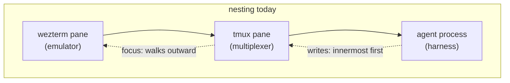
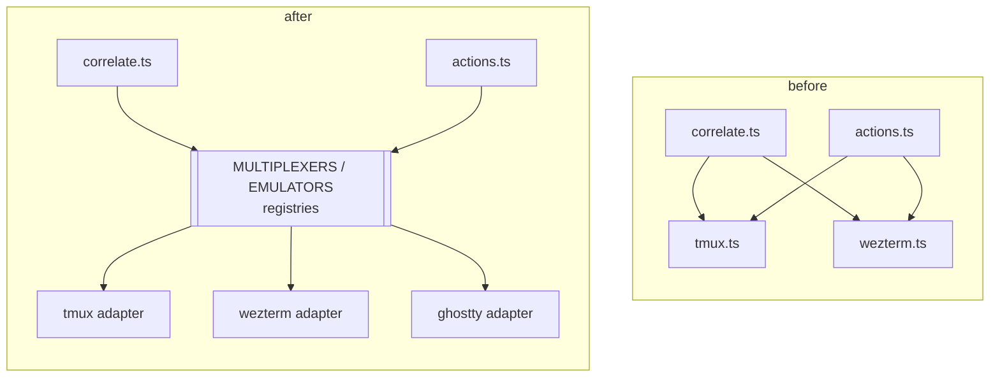

# Pluggable integrations: harnesses, multiplexers, terminals

Mission Control hardcodes three vendors: Claude Code, tmux, and WezTerm. Adding a fourth
agent (`pi`), a different multiplexer (`cmux`, `zellij`), or a different terminal (Ghostty,
iTerm2) currently means editing dozens of unrelated files and hoping you found them all.

This plan defines the interfaces those integrations should sit behind, and sequences the
migration of the existing code onto them.

## The finding, in one sentence

There is no abstraction today - `src/server/harnesses.ts` is a 24-line settings blob, not a
harness registry - and the ~35 `if (agent !== "claude")` guards plus ~20 open-coded
`if (session.tmux) … else if (session.wezterm) …` branches mean **a new integration degrades
silently rather than failing to compile**.

## Evidence

### Agent coupling (claude / codex)

| Capability | Where it is hardcoded |
|---|---|
| Process detection | `discovery/processes.ts:47-90` - literal argv signatures per agent |
| Binary resolution | **three** independent paths: `config.ts` `AGENT_BINS` (a total map since Phase 0), `claude-cli.ts:26`, `main/integrations.ts:184` |
| Transcript | `transcript.ts:51` hard `return null` for non-Claude; Anthropic JSONL shape throughout (`:115-155`, `:500-505`, `:584`) |
| Rollout (codex) | `codex-rollout.ts` - metadata only, no message parsing |
| Dispatch point | `runtime-meta.ts:43-58` - an explicit `if claude … else if codex`. This is where the interface belongs. |
| Hook -> state | `registry.ts:2141-2172` `hookToState` - Claude's event vocabulary; `:2137` `isIdleNudge` matches Claude's literal notification text |
| TUI mode line | `discovery/pane-mode.ts:33-96` - Claude footer glyphs and mode strings |
| TUI dialogs | `discovery/pane-dialog.ts` - 397 lines of Claude menu grammar |
| Paste settle | `actions.ts:311` `PASTE_SETTLE_MS = 400`, measured against Claude Code 2.1.215 |
| Paste placeholder | `discovery/pane-paste.ts:37` - Claude's `[Pasted text #N]` |
| Skills | `skills/reconcile.ts:48-53`, `shared/skills.ts:73` `/reload-skills` |
| Hooks + MCP install | `hooks/install.mjs` and `main/integrations.ts:183-206` - `~/.claude/settings.json` and `claude mcp add` only |
| Model windows | `shared/model.ts:96-101` - only Claude families get a non-200k default |

The union itself was written out **three** times (`shared/types.ts`, `shared/protocol.ts`,
`web/lib/api.ts`) and `AGENT_LABEL` **twice**, holding different values for the same key -
`session-bits.tsx` said "Claude Code" where `TranscriptPanel.tsx` said "claude". **Phase 0
collapsed both**: `AGENT_TYPES` (`shared/types.ts`) is the one source the zod enum and the
dashboard's dispatch input now derive from, and `AGENT_NAMES` (`shared/agent.ts`) holds the
two registers as named fields (`label`, `speaker`) so neither can be mistaken for drift.

**The first three rows are closed.** `Harness.transcript` (`server/harness/types.ts`) now
owns transcript, rollout, and the dispatch point between them: `runtime-meta.ts` names no
agent, Claude's JSONL shape lives in `harness/claude/`, the rollout in `harness/codex/`,
and the byte windowing that belongs to neither sits in `transcript.ts` behind a supplied
line parser. See "`transcript`, as landed" below.

Before Phase 0, only **four** `Record<AgentType, …>` maps would fail to compile on a new
agent. Everything else silently does nothing, and that asymmetry is the core problem. Phase 0
took it to **six** - `shared/agent.ts`, `shared/cost.ts`, `shared/goal.ts`, `shared/model.ts`,
`server/config.ts`, `server/goal/source.ts` - which is the list `session-contracts.test.ts`
pins by adding a probe agent id and asserting each one fails to typecheck. The transcript
item swapped the last of those for `server/harness/index.ts`: the per-agent `GoalSource`
record WAS this capability spelled twice, and one `Harness` entry forces a decision about
every capability at once rather than about one reader. Every remaining row in the table
above is still silent.

### Terminal coupling (tmux / wezterm)

`wezterm.ts` and `tmux.ts` are **not parallel** - they diverge in shape, in where their
code lives, and in which capabilities exist at all:

| | wezterm.ts | tmux.ts |
|---|---|---|
| bin resolution | `resolveWeztermBin()`, `WEZTERM_BIN` | literal `"tmux"` at ~19 inline call sites |
| pane id type | `number` | `string` (`"%3"`) |
| cwd | `file://` URL, needs `weztermCwdToPath` | plain path |
| spawn | `spawnWeztermTab` (used only as a focus fallback) | lives in `dispatcher.ts:449-468`, not in `tmux.ts` |
| retitle | `setWeztermTabTitle` | inline in `actions.ts:1090` |
| copy-mode probe | none - no such concept | `readTmuxPaneMode:57-71` |
| focus | `activateWeztermPane:83-87` | cannot focus alone |
| kill group | none - SIGTERM only (`actions.ts:1234`) | `kill-session` |

Duplicated pane-token functions, in **two spellings**: `actions.ts` (the write lock) and
`pane-mode.ts` (the capture-miss counter) emitted `wezterm:`; `registry.ts` (the hook
overlay) and `foreman/queue-apply.ts` (the pane-recreated guard) emitted `wez:`. Each
subsystem was internally consistent, so there was no live defect - but it was four copies of
one function waiting for a fifth backend. **Phase 0 collapsed them** into `paneToken`
(`shared/pane.ts`) on the `wezterm:` spelling, tmux being unabbreviated too; no token is
persisted, so the format was free to change. `test/pane-lock.test.ts` pins the agreement.

## The design

### Three axes, not one

The request was "one interface per integration point". The investigation says there are
**three** axes, and folding them together would be the design error:

1. **Harness** - the agent process. Detection, transcript, live state, TUI grammar, skills,
   hook/MCP installation. (`claude`, `codex`, `pi`)
2. **Terminal** - which itself splits in two (below).
3. **Headless runner** - the `claude -p` calls behind Foreman triage, goal refinement, task
   titling, away digests and the Inspector (`claude-cli.ts`, plus their per-caller model
   constants). This is a *model provider* axis, orthogonal to which agent the observed
   session runs. Keep it separate; conflating it would mean you cannot review a Pi session
   with Claude, or a Claude session with a cheaper local model.

#### `LlmRunner` must guarantee context isolation, not just shape

"One-shot text completion with a model id and a prompt" describes the signature and misses
the contract. Today the guarantee comes from three flags that are **absent** in
`claude-cli.ts` - no `--resume`, no `--continue`, no `--session-id` - which is why that
file now carries a comment saying so. Without one of those, every run mints a new session
with an empty context.

That is a correctness property, because the Foreman reviews *many* sessions. Any
implementation that carried context between calls would grow it monotonically across every
session it ever looked at, and let session A's transcript influence the verdict on session
B. The tempting version is a warm held-open process to skip the spawn: measured, that is
~1.8-2.4s of a 4-6s call, and the prompt cache is server-side so a cold process still gets
a cache read. Almost nothing to buy, a correctness property to lose.

So the interface states isolation explicitly, and offers the only safe form of memory as a
named opt-in:

```ts
interface LlmRunner {
  /** Fresh context every call. The default, and what Foreman requires. */
  run(prompt: string, opts: RunOpts): Promise<string>;
  /**
   * Optional: one conversation per SUPERVISED SESSION, never one shared across sessions.
   * `claude -p --session-id <uuid>` then `--resume`. Null when unsupported.
   */
  runInThread: ((threadKey: string, prompt: string, opts: RunOpts) => Promise<string>) | null;
}
```

`RunOpts` cannot be just `{ model, timeoutMs }`. The Inspector already grants tools and
pays for it with a working directory and a `--settings` deny-list (`ClaudeRunOptions.tools`
/ `cwd` / `settings`), so the interface has to carry a *sandboxing* shape, not only a model
id - and a runner backed by something other than `claude -p` has to be able to say it
cannot honour one. Treat `tools` as the capability boundary it is: the default of every
tool disabled is what makes it safe to embed untrusted transcript and repo text in a
prompt, and that default must survive being put behind an interface.

Also note the naming collision to avoid: phase 4 was titled "Headless", and this plan means
*which model does offline work*. It does not mean driving an agent without a terminal -
that is the `control` capability on the Harness axis. Rename one of them before both exist
in the codebase.

**Resolved, that way round.** The phase is renamed to "LLM runner" below and the new code
says `llm`, never `headless`. "Headless" keeps the meaning it already has on disk -
`HEADLESS_CWD`, `MISSION_HEADLESS`, `headlessTranscriptDir`, `goal/prune.ts` - which is an
offline run of the app's own, and one of those is read by a hook script installed globally
from a checkout that may lag this code, so it was never the cheap side to rename. The
Harness-axis capability stays `control`; it must not acquire "headless" as a nickname.

#### As landed

`@shared/llm.ts` holds the contract (pure, no `node:` imports - the web bundle imports it),
`src/server/llm/claude.ts` the `claude -p` implementation, `src/server/llm/index.ts` the
`Record<LlmRunnerId, LlmRunner>`. Three deltas from the sketch above, each forced by a real
caller:

- **`RunOpts.grant`, one object, not three sibling options.** `tools` / `cwd` / `denyPaths`
  are one decision - the tools are what make an untrusted prompt dangerous, the cwd is what
  bounds them, the deny list is what carves the credential stores back out - so a shape that
  let a caller pass one without the others would make the unsafe call the easy one. A
  runner declares `sandbox: LlmSandboxSpec | null`, and a grant it cannot fully honour is
  refused before the spawn rather than partly applied (`grantRefusal`). `denyPaths` are
  provider-neutral globs; rendering them into `claude`'s `--settings` is the runner's job,
  and `llm-runner-contract.test.ts` pins that rendering byte-for-byte against the
  Inspector's live constant so migrating that call site is a provable no-op.
- **`run()` returns the model's text, envelope already off.** The envelope exists because
  the runner passed `--output-format json`; a caller unwrapping it is undoing its own
  runner's flag.
- **`litter: LlmLitterSpec | null` and `killLiveRuns()`.** What a run leaves behind is part
  of the contract, not an implementation detail: nothing read or deleted these transcripts
  until `goal/prune.ts` existed, by which point 153 of 250 sampled on one machine were the
  app's own.

`runInThread` is `null` for `claude`, matching today's behaviour exactly - the shape is
`--session-id <uuid>` then `--resume`, and nothing wants it yet.

#### Which model, as opposed to how it is called

Deliberately NOT in `@shared/llm.ts`, because a third spelling of this is the actual mess:

- `@shared/foreman-models.ts` is already the right shape - four roles, each resolving
  config key -> env var -> shipped fallback, and *reporting which of the three won* so the
  settings panel cannot display a default the worker does not spawn with. Pure and in
  `shared` for the same reason `cost.ts` is: the worker spawns with the answer and the
  panel renders it.
- `task-title.ts:20`, `away/digest.ts:17`, `goal/refiner.ts:39` are bare
  `envVar(…) ?? "claude-haiku-4-5"` - no config key, nothing surfacing them in the UI.
- `inspector/worker.ts:92` is `cfg.model ?? envVar("INSPECTOR_MODEL")`, a third spelling.

The next item generalises `foreman-models.ts` to hold every role and moves those four onto
it. It does not start a second list under `llm.ts`; a runner answers "how is a model
called", a role answers "which model", and only the first one is the runner's.

### Terminal is two interfaces, because tmux and wezterm are not peers

A tmux pane lives *inside* a wezterm pane. `wezterm.ts:117-140` exists solely to join them
by shared tty, and `actions.ts:1149-1185` shows focus for a tmux session is a **composition**:
select-pane, then select-window, then find the hosting wezterm tab, then activate it, then
fall back to spawning `tmux attach` in a new tab.

So:

- **`Multiplexer`** - named persistent sessions, panes, splits, detach/reattach, copy-mode.
  Can address a pane; generally *cannot* raise a window. (tmux, zellij, screen, cmux)
- **`TerminalEmulator`** - windows and tabs, focus/raise, spawn, tab titles. No persistence,
  no session names. (wezterm, Ghostty, iTerm2, kitty, Terminal.app)

Plus a documented composition rule: a session may hold a multiplexer handle, an emulator
handle, or both; writes prefer the innermost (multiplexer), focus walks outward.



### How the call graph changes

Today `correlate.ts` and `actions.ts` import the two backend modules directly, so every
new backend edits both. After the migration they resolve an adapter from a registry and
never name a vendor.



### Capability objects, not fat interfaces

This is the load-bearing decision. The candidate backends have genuinely different
capabilities:

- Ghostty has no scripting CLI at all - it can be *launched into*, but not enumerated or
  captured.
- iTerm2 scripts via AppleScript/Python, not a flag-parsing CLI.
- tmux has copy-mode; wezterm has no equivalent.
- wezterm can raise a window; tmux cannot.
- Codex has no permission modes, no skills, no `/clear`.

A flat interface with fifteen required methods forces every adapter to stub eight of them,
and stubs are where silent breakage lives. Instead: a small required core plus **optional
capability sub-objects**, where `null` is a first-class, meaningful value.

```ts
interface Harness {
  id: HarnessId;
  label: string;                  // "Claude Code"
  accent: string;                 // CSS custom property name
  detect: DetectSpec;             // argv signatures, background-process exclusions
  bin: BinSpec;                   // env vars, fallback, launch argv

  control:    ControlSpec;             // how a turn is DELIVERED - see below
  transcript: TranscriptSpec | null;   // null => no transcript pane, by declaration
  hooks:      HookSpec | null;         // null => no push instrumentation; skip the 20s wait
  tui:        TuiSpec | null;          // mode line, dialog grammar - PARSING only
  permissionModes: PermissionModeSpec | null;
  skills:     SkillSpec | null;
  mcp:        McpSpec | null;
  models:     ModelSpec;               // label(id), defaultWindow(id)
}
```

#### `control` is separate from `tui`, and not nullable

An earlier draft of this interface had no `control` slot: prompt delivery lived partly in
the Terminal axis and partly inside `tui`, whose spec carried the paste placeholder and
`PASTE_SETTLE_MS`. That is wrong in a way worth stating, because the whole point of this
refactor is to outlive the current backends.

`PASTE_SETTLE_MS = 400` is a measured property of an undocumented input-coalescing window
in one Claude build (`actions.ts:307` records the measurements). Putting it in the harness
contract makes "you talk to an agent by typing into its terminal" a permanent
architectural assumption - and every live third-party tool that drives Claude Code
programmatically has already stopped doing that, in favour of
`claude -p --input-format stream-json --output-format stream-json`, which takes follow-up
turns on a live process with no keystrokes involved. Codex exposes the same thing as a
JSON-RPC `turn/steer`.

So delivery gets its own capability, and it is **required** - every harness must say how
you talk to it:

```ts
type ControlSpec =
  | { kind: "keystroke"; settleMs: number; pastePlaceholder: RegExp | null }
  | { kind: "stream-json" };
```

`tui` keeps mode-line and dialog *parsing*, which is about reading a screen; `settleMs` is
about writing to one and moves here. The split means a second `ControlSpec` variant is a
new implementation behind an existing slot, rather than an interface change every migrated
call site has to absorb.

Note this is the seam that makes headless dispatch possible later; it is not a commitment
to build it now. Sessions a human owns will keep `kind: "keystroke"` regardless, because
we do not own their pty.

The win is mechanical: every `if (session.agent !== "claude") return null` becomes
`if (!harness.transcript) return null`. The guard now states *why*, and a new harness that
genuinely lacks transcripts gets the identical, already-tested degradation path instead of a
code change.

#### `transcript`, as landed

`HARNESSES` (`src/server/harness/index.ts`) is the `Record<AgentType, Harness>`;
`harness/types.ts` holds the interface; `harness/claude/` and `harness/codex/` hold the two
specs. Four deltas from the sketch, each forced by something real:

- **No `label` / `accent` on `Harness`.** `AGENT_NAMES` (`@shared/agent.ts`) already owns
  naming and the web bundle imports it; a second register on a server-only object is the
  exact defect Phase 0 collapsed, re-created one layer down. The remaining slots arrive
  with their phases rather than landing as `null` placeholders nobody has designed.
- **The capability splits in two: `TranscriptSpec` and its `messages`.** "There is a file
  we can read runtime facts out of" and "that file contains the turns" are separate claims,
  and Codex is the proof - its rollout carries model / effort / tokens and no conversation.
  `messages: null` is that stated once, where every reader sees it; the alternative was a
  window read answering `[]`, which says "this session has said nothing" and is a wrong
  answer no caller can distinguish from a right one.
- **One `passiveRead` per tick, not one call per axis.** Claude's runtime metadata and its
  hook-free idle/working signal come out of the same tail read, and the poller would
  otherwise double the I/O of its own hot loop.
- **`retain`, because the cache belongs to the spec.** Finding a rollout is a dated
  directory walk, so it is cached - and that cache used to sit in the generic poller as a
  `Map<string, CodexBinding>` plus a Codex rescan constant. A third harness that also has
  to search would have added a second map beside it. The poller now hands each harness the
  live ids and lets it prune its own.

`transcript.ts` keeps what is about bytes rather than about a vendor - head/tail windows,
the forward-from-an-offset read, the stream reads - and takes the line parser from the
harness. `server/goal/source.ts`'s `Record<AgentType, GoalSource>` is gone: it was this
capability spelled a second time, and `session-contracts.test.ts` pins `HARNESSES` in its
place. Tests: `harness-transcript.test.ts` (the registry, and that a null capability
degrades to the byte-identical `{unavailable: true}` / `{size: null}` a missing file
produces), `session-contracts.test.ts`.

### Compiler enforcement

The codebase already has this pattern - `SESSION_FIELD_COMPARATORS` (`registry.ts`) makes a
new `Session` field fail typecheck until it is given a comparator, and
`session-contracts.test.ts` guards it.

Apply the same shape here: `HARNESSES: Record<HarnessId, Harness>`,
`MULTIPLEXERS: Record<MultiplexerId, Multiplexer>`, `EMULATORS: Record<EmulatorId, TerminalEmulator>`.
A new id then cannot compile until every capability is either implemented or explicitly
declared `null`. "I forgot skills exist" stops being a possible outcome.

## Structural blockers

Three places assume exactly two backends as *named fields*, and no adapter work can land
cleanly until they become lists:

1. `DiscoveryInput` (`correlate.ts:78-82`) - `{ procs, tmux, wezterm }`, with
   `gatherDiscoveryInput` unconditionally `Promise.all`-ing both listers.
2. `Session.tmux` / `Session.wezterm` (`shared/types.ts:140-141`) - two nullable siblings,
   with per-field SSE comparators at `registry.ts:2237-2238` and ~20 call sites doing
   `Boolean(s.tmux || s.wezterm)` as a stand-in for "can we type here?".
3. `Task.tmuxSession` (`shared/types.ts:830`) - persisted as `tmux_session`
   (`db.ts:109`) and driving **destructive teardown** (`dispatcher.ts:408-421`). Generalizing
   it is a schema migration, not a rename, and needs an `addColumn` call in `migrate()`.

## Sequence

Phase 0 landed first because it shrinks every later diff and carries no behavior change.
Phase 3 is deliberately last: it is the only phase that can lose someone's worktree.

| Phase | Items |
|---|---|
| 0 - Seams **(landed)** | `AGENT_TYPES` + `AGENT_NAMES` as the one agent-union source (`shared/types.ts`, `shared/agent.ts`); one pane token (`shared/pane.ts`); the already-neutral helpers lifted out of the Claude modules into `server/util/file-tail.ts` (`readTailLines`) and `server/discovery/capture-tolerance.ts` (capture-miss tolerance) |
| 1 - Harness | Interface + registry **(landed)**; transcript **(landed)**; then detection/bin, hooks->state, TUI, capability guards, UI |
| 2 - Terminal | `Multiplexer` + `TerminalEmulator` interfaces; enumeration, pane I/O, focus/spawn/kill |
| 3 - Structural | `Session` handle list; `Task.tmuxSession` migration; de-tmux user-visible strings |
| 4 - LLM runner | `LlmRunner` interface + registry (**landed**); then the model-role ladder, then the call sites: Foreman's four, the Inspector, goal refiner, task titling, away digest |
| 5 - Proof | A third adapter on each axis, written *only* against the interface |

### Decisions taken

- **All four candidate adapters are queued** (Ghostty, cmux, iTerm2, pi), not just one per axis.
  Ghostty and iTerm2 together are the real test of the emulator boundary: one has no
  scripting CLI, the other scripts via AppleScript/Python rather than a flag-parsing binary.
  If the interface only fits things shaped like `wezterm cli`, both will expose it.
- **The headless-runner axis is in scope** (Phase 4). Foreman should be able to triage a Pi
  session with Pi, or run titling on a cheaper local model. It stays a *separate* interface
  from `Harness` - the observed agent and the evaluating model are independent choices.
- **The six drive-by defects are folded into the migration items**, not queued separately.
  Each is fixed by the phase that rewrites its file, and the item says so explicitly, so the
  fix lands with a test rather than as a patch that the refactor later reverts.

## Acceptance

The migration is not done when the interfaces exist. It is done when a new implementation can
be added without touching shared code. Phase 5 is the test:

- A **`pi` harness** that discovers, names, focuses, and accepts typed input - and whose
  unsupported capabilities are visibly disabled in the UI rather than silently absent.
  Spike first, as `todo/codex-instrumentation.md` did for Codex.
- A **Ghostty** emulator adapter, which supports spawn and focus but **not** enumeration or
  capture - proving the capability-null path is real and not decorative.
- An **iTerm2** emulator adapter, driven by AppleScript/Python rather than a CLI - proving
  the boundary is not accidentally shaped like "a binary we pass flags to".
- A **cmux** multiplexer adapter - the same exercise on the multiplexer axis.

If any of the four requires editing a file outside its own adapter, the interface is wrong.

## Fixes found along the way

Real defects, each folded into the migration item that rewrites its file rather than queued
separately. The item that owns each fix is named in brackets.

- **[Phase 1 - TUI]** `pane-mode.ts:126-133` - `annotatePaneState` filters to Claude, so
  `paneDialog` is never set for Codex. Since `activePaneDialog` is the only hookless
  "needs-you" evidence (`shared/session.ts:172`), **a Codex session parked on a prompt reads
  as idle**. The most user-visible of the six.
- **[Phase 1 - TUI]** `pane-paste.ts:37` + `actions.ts:344-379` - submit verification looks
  for Claude's paste placeholder, so for Codex `hasPendingPaste` is always false and
  `awaitPasteSubmitted` returns `ok` after one Enter with zero evidence.
- **[Phase 1 - guards]** `actions.ts:1418` - `resetToOrigin` sends `/clear`, a Claude slash
  command, to **every** agent type, ungated.
- **[Phase 1 - hooks]** `dispatcher.ts:148-161` - every dispatch waits `HOOK_READY_MS` (20s)
  for a hook, including for agents that will never send one. Codex pays 20s of dead time per
  dispatch.
- **[Phase 1 - transcript, FIXED]** `registry.ts:700` - `findSessionByEnv` hardcoded
  `s.agent === "claude"` inside an otherwise generic env->session fallback. The condition is
  gone: that branch's safety is UNIQUENESS (exactly one session in the cwd), and filtering
  by agent did not make the match safer - it hid the one ambiguity that matters, a Claude
  and a Codex session sharing a worktree, and bound the caller to the Claude card with full
  confidence.
- **[Phase 1 - UI]** `styles.css:2657` - `--claude` doubles as the Foreman accent colour; the
  comment admits it. `AgentDot` renders `agent-${agent}`, so a new harness gets an unstyled
  dot.

## Prior art in this repo

`todo/codex-instrumentation.md` is a parked spike on exactly the Phase 1 question for Codex
(hook-vs-wrapper, blocked on a Codex login). Its conclusion - that the
`HookIngestSchema` -> `POST /hooks/:event` -> registry-overlay pipeline is already
agent-agnostic and reusable - is confirmed by this investigation and should be folded into
the `HookSpec` design rather than rediscovered.
