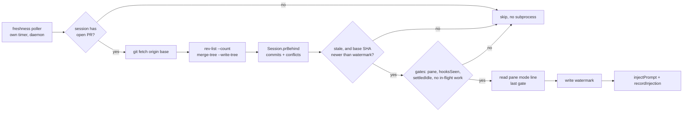

# Keeping an open PR's branch mergeable

When Mission Control has opened a pull request for a session and the base branch moves on
without it, nothing tells anyone. The branch goes stale, and the operator finds out at the
moment they try to land it - or worse, YOLO mode finds out, blocks on `conflicting`, and
sits there.

This plan adds one behaviour: **a session whose open PR has fallen behind its base branch
gets prompted, by the daemon, to merge the base in and push.** It is on by default and it
does not depend on the Foreman.

---

## 1. What the app knows today, and the hole in it

| Question | Answered by | Where |
|---|---|---|
| Does this session's branch have a PR? | `gh pr list --head <branch>` | `src/server/pr.ts:35` |
| Is that PR open or merged? | same call, `state` | `pr.ts:75` |
| Is CI green on it? | same call, `statusCheckRollup` | `pr.ts:125` |
| Would it conflict on merge? | Inspector's GraphQL `mergeable` | `src/server/inspector/github.ts:171` |
| **Is it behind its base branch?** | **nothing** | - |

`mergeable` is the near miss. It answers `MERGEABLE` / `CONFLICTING` / `UNKNOWN`, which
does not distinguish *clean and current* from *clean but fifty commits stale*. Both read
`MERGEABLE`. A repo-wide grep for `mergeStateStatus`, `behindBy`, `aheadBy` and
`baseRefName` returns nothing in `src/`.

So the signal has to be built. The rest of this plan is about where it comes from, who
acts on it, and what stops that actor from becoming a nuisance.

---

## 2. Why this lives in the daemon

The requirement says "must not rely on the Foreman being active". That is already forced,
for two reasons the Inspector plan wrote down first (`docs/plans/inspector-agent/plan.md`
§2):

- **The Foreman worker is never started by the Electron app.** It runs only under
  `make start` / `npm run dev:start`. A packaged Mission Control has no Foreman, and a
  feature the desktop build silently does not have is not a feature.
- **The Foreman ships off.** `ForemanConfigSchema` defaults `enabled: false`,
  `mode: "dry-run"`, `repoAllowlist: []` (`src/shared/protocol.ts:598`). Nothing that is
  meant to be on by default can hang off it.

There is already a precedent for exactly this, and it is the file to read before writing
any code here: **`src/server/skills/reload.ts`**, the `/reload-skills` broadcaster. Its
header comment is addressed at whoever writes this plan:

> the daemon is no longer strictly reactive. Until now it typed into a pane only downstream
> of a route call, which meant downstream of a person [...] The risk isn't this feature.
> It's the next one, written by someone who reads the old rule and reasons from it. If you
> are here to add a second autonomous writer, this paragraph is the thing you needed to
> know.

This is that second autonomous writer. Everything in §5 and §6 is inherited from it
deliberately, not reinvented.

---

## 3. Where the "behind" signal comes from

Three candidates, and the choice is not obvious.

### A. Extend the existing PR poller's `gh` call

`pr.ts` already runs one `gh pr list` per distinct worktree every 20 s
(`PR_POLL_MS`, `src/server/config.ts:100`), and adding fields to its `--json` list costs
zero new subprocesses.

Rejected as the primary signal. `gh`'s `mergeStateStatus` only reports `BEHIND` when the
repo's branch protection **requires** branches to be up to date before merging. Without
that setting, a branch fifty commits stale reports `CLEAN`. Most repos this fleet works in
do not have it, so the signal would be silently absent exactly where it is needed.

### B. Ask git, in the session's own worktree (chosen)

```
git fetch origin <base>
git rev-list --count HEAD..origin/<base>      # how far behind
git merge-tree --write-tree origin/<base> HEAD # would it conflict?
```

Definitive regardless of branch protection, and it answers a question `gh` cannot: whether
the merge would conflict, **without touching the working tree**. That matters because
"behind and clean" and "behind and will conflict" deserve different prompts, and we learn
which before typing anything.

`remoteDefaultRef(cwd)` already exists (`src/server/actions.ts:1481`) and already handles a
repo whose default branch is not `main`, preferring `origin`'s own `HEAD` symbolic ref. The
base branch of the *pull request* may differ from the repo default, so the PR's
`baseRefName` is preferred when we have it, with `remoteDefaultRef` as the fallback.

Cost: one `git fetch` per distinct worktree per sweep. That is real network I/O, so it gets
its own slower cadence rather than riding the 20 s PR tick.

### C. Ride the Inspector's 90 s tick

Rejected on scope. The Inspector ships off, and it only ever acts on PRs it can *prove*
Mission Control opened (`adoptPr`, `src/server/inspector/worker.ts:301`). This feature is on
by default and applies to any session sitting on a branch with an open PR, including one
opened by hand in the web UI. Hanging it off adoption would make it invisible in most of
the cases it exists for.

---

## 4. Where it runs

A new sibling poller, `src/server/pr/freshness.ts`, started from `src/server/index.ts`
beside `startPrPoller` and `startInspector`, on its own timer. Ticks never overlap; a slow
sweep just delays the next.

It reuses `registry.prPollTargets()` (`src/server/registry.ts:1092`), which already yields
`{ id, cwd, branch, prUrl }` for every live session with a cwd and already skips
`main`/`master`. This sweep narrows further to sessions where `prState === "open"`, so a
session with no PR, or one whose PR already merged, costs nothing.



The signal lands on the session as a new field:

```ts
/** How far this session's open PR has fallen behind its base, and whether
 *  merging it in would conflict. Null when there is no open PR, or when the
 *  sweep could not answer (a fetch failure is "unknown", never "current"). */
prBehind: { commits: number; conflicts: boolean } | null;
```

which needs a `SESSION_FIELD_COMPARATORS` entry (`byJson`, it is a nested object) or the
build does not typecheck.

---

## 5. What acts, and how

**The daemon types a prompt into the session and the agent does the merge.** Not the
alternatives, both of which were considered:

- **Enqueue a work item** (`QueueManager.add`, `src/server/queue.ts:67`) is nicer in
  principle: ordered, visible on the card, waits out a busy session. It is a dead end here,
  because *delivery* of a queue item is the Foreman worker's job. The daemon can enqueue -
  nothing stops it - but nothing in the daemon ticks a queue, so an enqueued item on a
  Foreman-less machine sits forever. That is precisely the failure this feature is required
  not to have.
- **The daemon runs the merge itself.** Tempting once `merge-tree` has already proved the
  merge is clean: no tokens, deterministic, no prompt in anyone's transcript. Rejected for
  v1 because it writes into a worktree an agent may be mid-edit in, and because it cannot
  handle the conflicting case anyway, so it is a second code path rather than a replacement.
  Kept as a possible fast path later (see §10).

Delivery is `injectPrompt` (`src/server/actions.ts:585`), the same call the work queue,
dispatch and `/reload-skills` all use. It goes through `withPaneLock`
(`src/server/actions.ts:95`) already, so it cannot interleave with a Foreman send or a
human's keystrokes.

The text is composed in `@shared/pr-freshness.ts`, not typed at the call site, for the
reason `composeWrapup` and `autoWrapupPayload` live in shared: the settings panel has to be
able to show the operator the exact sentence the daemon will type. Shape:

> `origin/main` is 12 commits ahead of this branch. Merge it in, resolve any conflicts, and
> push, so PR #418 stays mergeable.

with the conflict prediction included when we have it, because "this will conflict" changes
how the agent approaches the task.

Immediately after a successful inject, `recordInjection(session.id, text, "harness")`
(`src/server/injections.ts`). Without it the conversation log reads as the human
interrupting their own agent with an instruction they never gave. `TurnOrigin` already has
a `"harness"` member for daemon-typed turns; no new variant is needed.

---

## 6. The gates before the keystroke

Inherited from `reloadNeeded` (`src/server/skills/reload.ts:140`) and the Foreman's send
guard (`queueSendStillValid`, `src/server/foreman/queue-apply.ts:186`). Cheapest first,
because the last one costs a subprocess and everything above it exists to avoid running it.

---

## 7. Not nagging: the watermark

Without this, the sweep re-prompts every tick forever, which is the single most likely way
this feature gets switched off.

Skills solved the same problem with a generation watermark plus an ack row
(`getSkillsAcks` / `setSkillsAck`). The natural watermark here is **the base SHA we last
prompted about**:

```
pr_sync_prompts(note_key, pr_key, base_sha, prompted_at)   -- new table
```

Re-prompt only once `origin/<base>` has moved *past* the SHA we last asked about. One
prompt per base advance. Ignore it and you are not nagged; the next time main moves, you
are asked again, which is the correct behaviour rather than a compromise.

Keyed on `noteKeyFor(session)` and the PR key, not `session.id`, for the reason every other
durable per-session fact is: `id` re-mints on restart.

A new table needs no `migrate()` work. (A new *column* would - see `CLAUDE.md`.)

Two orderings copied verbatim from `reloadOne` (`reload.ts:240`):

- **Write the watermark before typing.** A crash in between costs a missed prompt rather
  than a repeated one.
- **Roll back only on `pasted: false`.** `pasted: true` means the text is in the composer
  and only the Enter failed; retyping over it concatenates and mangles the prompt.

The retry rule leans harder here than it did for skills, and the plan should say why.
`/reload-skills` re-reads a directory, so a duplicate cost two lines of transcript, and
`reload.ts` deliberately chose "retry" over "never retry" on those grounds. **This prompt
pushes.** A second merge is very nearly a no-op, so this is not the double-PR hazard that
made auto-wrapup choose "never retry" - but it is closer to that end than to skills', and
the never-retry rule is the one to adopt.

---

## 8. Consent, and the default-on question

Every autonomous writer in this repo ships **off**, with an empty allowlist, and each one
argues for that posture in its own plan: the Foreman, the Inspector, YOLO mode. This one is
asked to ship **on**. That inversion has to be argued explicitly, because the next person
will read "default on" and reason from it - the same failure mode `reload.ts` warns about.

The argument: this writes to **our own PR branch**, on a branch the agent already authored,
merging the base *into* the feature branch. It never writes to a base branch, never
comments under the operator's GitHub identity, and never lands anything. Compare:

| Grant | What it can do |
|---|---|
| Inspector | comment publicly, under your identity, on a PR |
| YOLO mode | merge to the default branch |
| **This** | **push a merge commit to a feature branch we opened the PR for** |

That is a strictly smaller grant than either, and it is the one grant whose *absence* is
itself a hazard, since a stale branch is what blocks the other two.

Config lives under its own `app_config` key with its own schema in `protocol.ts`, **not** as
a field on `ShippingConfigSchema`. That file's own comment is the reason:

> Its own key rather than a section of the Inspector's, because it is its own grant. See
> `ShippingConfigSchema`: "you may comment here" and "you may merge here" are different
> permissions, and a shared blob is how one of them ends up implying the other.

Adding a field to Shipping's blob would mean arming this by turning YOLO mode on.

Its allowlist **inverts the house convention**: empty means *everywhere*, because the
feature is default-on. That inversion is surprising enough to need a comment saying so at
the schema, or the next reader will assume it acts nowhere and "fix" it.

---

## 9. Surfaces this touches

| Surface | Change |
|---|---|
| `@shared/pr-freshness.ts` | new: `branchIsStale` predicate + prompt composer, shared so the daemon and the panel cannot disagree |
| `src/server/pr/freshness.ts` | new: the sweep, the gates, the inject |
| `src/server/index.ts` | start/stop it beside `startPrPoller` |
| `src/shared/types.ts` | `Session.prBehind` |
| `src/server/registry.ts` | `SESSION_FIELD_COMPARATORS` entry (`byJson`) |
| `src/server/db.ts` | `pr_sync_prompts` table + accessors |
| `src/shared/protocol.ts` | new config schema + patch schema |
| `src/server/routes.ts` | GET/PUT for the config, through `parseBody` |
| `src/web/components/...` | the toggle, in a panel (see decision 3) |
| `session-bits.tsx`, `SessionTile.tsx`, `RailRow.tsx` | the stale marker, in **all three** mark vocabularies |
| `README.md` | a section, and a Configuration line for the env override |

The three-surface rule on the marker is the easy thing to get wrong: `CostChip` is the
worked example of doing it right, with one shared predicate deciding where the line sits
rather than three thresholds.

---

## 10. Open decisions

Presented via `request_plan_decisions` rather than settled here.

1. **Signal source.** Local `git rev-list` + `merge-tree` (recommended, §3B), or extend the
   existing `gh` call and accept that it only sees `BEHIND` under branch protection.
2. **Clean merges.** Always prompt the agent, or let the daemon perform a merge itself when
   `merge-tree` proves it clean and the worktree is idle and clean, prompting only on
   conflict?
3. **Settings home.** A new section inside the Shipping panel, its own top-level settings
   category, or fold the toggle into Harnesses?
4. **Codex.** Resolved: Mission Control-launched sessions use launch-scoped hooks; passive
   discovery alone never authorizes automation. See
   [Foreman](../../../README.md#foreman-auto-responder).

---

## 11. Testing

`node:test` + `node:assert/strict`, flat in `test/`, no jsdom.

- `pr-freshness-predicate.test.ts` - the shared predicate as a table: current, behind-clean,
  behind-conflicting, unknown-after-fetch-failure. Unknown must never read as current.
- `pr-freshness-targets.test.ts` - the pure selector, the `reloadTargets` discipline: `now`
  injected, no I/O, every gate in §6 as a row. Includes the Codex row and the
  no-open-PR row.
- `pr-freshness-watermark.test.ts` - prompted once per base advance; not re-prompted on the
  next tick; re-prompted after the base moves; watermark written before the inject and
  rolled back only on `pasted: false`.
- `pr-freshness-gate.test.ts` - no mode line means no keystroke. This is the one that
  protects the dialog.
- `session-contracts.test.ts` - already fails until `prBehind` has a comparator.
- E2E, per the house rule on bug fixes and new behaviour alike: open a PR from a session,
  push a commit to main, and watch the prompt arrive in the pane and the merge land.

---

## 12. Out of scope

- **Sessions with no live pane.** A PR can be behind while its session is long gone. There
  is nothing to type into, and inventing a headless merge runner is a different feature.
- **Anything about the base branch itself.** This never pushes to `main`.
- **Rebase.** Merge only. A rebase rewrites published history on a branch a reviewer may
  already be reading, and `ShippingConfig.method` is about how a PR *lands*, which is a
  different question from how it stays current.
