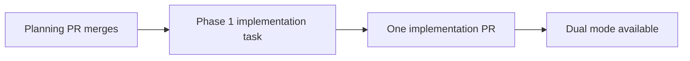
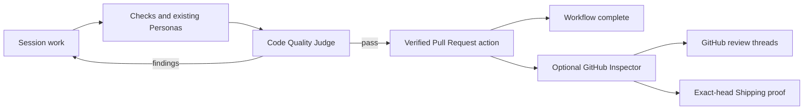

# Phased implementation: Code Quality Judge dual mode

Status: approved, scheduled, and gated on planning publication

## Source of truth

- Approved source plan: [`plan.md`](plan.md)
- Supporting investigation: [`../../reports/inspector-pre-pr-assessment/report.html`](../../reports/inspector-pre-pr-assessment/report.html)
- Detailed implementation phase: [`phase-1-code-quality-judge-dual-mode.md`](phase-1-code-quality-judge-dual-mode.md)

The source plan's reviewed decisions are requirements:

1. Use the dual-mode architecture.
2. Name the local pre-PR Persona **Code Quality Judge**.
3. Name the existing optional remote service **GitHub Inspector**.
4. Keep GitHub Inspector's remote behavior and Shipping role intact.
5. Create and schedule the merge-aware implementation work.
6. Run the scheduled implementation task with **Codex 5.6 Sol** and **xhigh** effort.

## Investigated findings

Repository inspection confirmed the approved path does not need a new runtime concept:

- `scripts/builtin-personas.ts` already compiles any new eligible `personas/*.md` document into the
  packaged built-in catalog.
- Workflow Personas already receive intent, human decisions, prior feedback, local diff including
  dirty/untracked work, transcript, standards, and evidence fingerprints. They run without tools.
- No-Mistakes Review v8 already places the verified Pull Request action immediately before End.
- `{ kind: "none" }` is an existing completion policy and completes a successful End without
  consulting the Inspector ledger.
- Built-in workflow versions, node ids, edge ids, Persona ids, and session-action snapshots are
  append-only. v9 must be added while v1 through v8 remain unchanged.
- The existing `inspector` settings, routes, config, database, events, marker, worker, and Shipping
  contracts are durable internal names. The selected GitHub Inspector rename is presentation only.
- Old built-in versions and custom workflows can still use the `inspector` final-gate policy, so
  their rendered copy must say GitHub Inspector even though the current v9 uses no final gate.

The source plan's initial estimate was 300 to 600 hand-authored non-test lines plus generated data.
After tracing the current UI and compatibility tests, the refined gross estimate is **500 to 850
non-test production lines added or materially changed**, including the generated Persona module and
current documentation. Approximately **350 to 600** of those lines are hand-authored. Tests and e2e
evidence are excluded from both ranges.

Assumptions behind the estimate:

- no database migration, route change, new event, or new workflow node kind;
- no modification to the Inspector worker or Shipping predicate;
- a roughly 100-line focused Persona brief;
- one append-only built-in workflow literal/version and its description;
- a presentation-only terminology audit across several existing UI surfaces; and
- focused compatibility, engine-ordering, render, and Playwright coverage.

## Phase-count rationale

Create exactly **one implementation phase**.

Although the estimate is above 200 lines, the work is one vertical product contract: the new local
role, the v9 graph that runs it, and the GitHub Inspector label that keeps the remote service
unambiguous. Splitting the Persona/workflow change from the settings/docs rename would create an
intermediate release where two different reviewers are both called Inspector, or where current
documentation describes a workflow version that is not yet present. There is no migration or
independent foundation whose early merge would reduce risk. Existing tests and append-only versions
provide the safe boundary inside one reviewable pull request.

## Phase table

| Phase | Implementation unit | Direct prerequisites | Execution | Value at merge |
|---|---|---|---|---|
| 1 | [Code Quality Judge dual mode](phase-1-code-quality-judge-dual-mode.md) | Planning session publication | Codex 5.6 Sol, xhigh | Local review runs before the verified PR action; optional remote behavior is clearly GitHub Inspector |

## Scheduled task

| Phase | Task id | Backlog state | Direct dependency | Stored execution profile |
|---|---|---|---|---|
| 1 | `a59d9f2f-2786-4099-a750-f3fe86865eb9` | Backlogged and enabled | This planning session (`58712017-e25f-49a6-abb1-ecaebc7f31e8`) | Codex, `gpt-5.6-sol`, `xhigh` |

The scheduling API creates a default-agent backlog row and exposes no model or effort fields. With
the human's explicit approval, the task was created behind the unfinished planning-session
dependency, immediately updated through the normal backlog task-edit endpoint, and read back before
the planning pull request was opened. The dependency prevented dispatch during that transition.

## Dependency graph and merge order

There is one direct dependency edge: the Phase 1 task depends on this planning session. It remains
backlogged until the planning pull request publishes these paths to the default branch. There are no
phase-to-phase edges and no concurrency groups. Merge order is planning PR, then Phase 1 PR.

## Product flow delivered by Phase 1

The local and remote branches deliberately answer different questions. Code Quality Judge evaluates
the submitted local snapshot and participates in repair. GitHub Inspector observes and reviews
pushed PR heads, owns its public GitHub conversation, and continues to supply Shipping provenance.

## Cross-phase contracts

With one phase, these are compatibility boundaries inside the implementation rather than handoffs
between teams:

- **Identity:** add `builtin:code-quality-judge`, `nmr-code-quality-judge`, and
  `builtin-workflow:no-mistakes-review@9`; preserve every earlier id.
- **Workflow:** v9 alone adds Code Quality Judge and changes current completion to `none`; v1 through
  v8 remain frozen and resolvable.
- **Execution:** Code Quality Judge is a normal tool-less Persona. The graph, not a global setting,
  decides whether it runs.
- **PR proof:** the existing Pull Request action remains the only v9 stage that proves publication.
- **Remote behavior:** GitHub Inspector keeps the current worker, settings values, trust grant,
  ledger, comments, and Shipping integration.
- **Terminology:** user-visible local review says Code Quality Judge; user-visible remote review and
  legacy/custom final gates say GitHub Inspector; internal `inspector` names remain stable.

## Final verification strategy

The phase file owns the exact command list. At feature level, delivery is complete only when:

- generated Persona bytes match the authored Markdown;
- unit tests pin the v9 graph, v1 through v8 immutability, repair-before-PR ordering, verified PR
  handoff, and no-final-gate completion;
- render tests pin GitHub Inspector wording without renaming internal contracts;
- Playwright shows Code Quality Judge before Pull Request and shows the renamed GitHub Inspector
  settings/brief location using only faked agents and `gh`;
- typecheck, lint, the full unit suite, build, smoke, and the full e2e suite pass; and
- successful visual evidence is attached to the implementation pull request and not committed.

## Cross-phase audit

Final audit on 2026-08-15:

- Every approved source-plan requirement maps to Phase 1 exactly once.
- The rejected local-first observer/attestation work and privileged-stage work map to no phase.
- No phase edits persistence, APIs, GitHub behavior, or Shipping policy.
- The task dependency graph has no missing or transitive-only edge.
- One repository and one implementation pull request are sufficient.
- The phase file records the requested Codex 5.6 Sol, xhigh execution profile and the implementation
  task was read back with that profile after creation.
