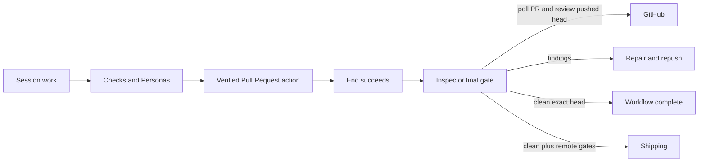
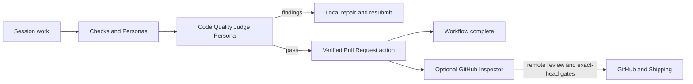
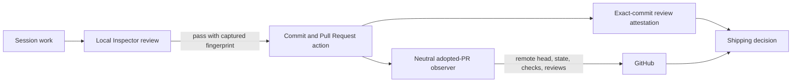

# Move Inspector review before the pull request

Status: approved for phased implementation

## Executive finding

Creating a built-in Code Quality Judge Persona and adding it before the Pull Request action is
enough to move the **review conversation** before the PR. It is not enough to replace the current
Inspector subsystem.

The current Inspector combines four responsibilities:

1. a model review of a diff;
2. a durable ledger of PRs Mission Control proved it opened;
3. GitHub review behavior, including push detection, inline comments, replies, deduplication, and
   thread resolution; and
4. exact-head provenance used by Workflow final gates and Shipping.

A Persona already supplies the first responsibility with a different evidence bundle and repair
loop. The other three remain external lifecycle work. This means the proposed local **Code Quality
Judge plus a GitHub Inspector setting** is a sound low-risk product shape only if **GitHub Inspector
remains a separate optional service**. A true conversion that removes its GitHub polling and
comments needs a replacement PR observer and, if Shipping remains, a durable local-review
attestation keyed to the exact commit that reaches GitHub.

Approved decision: **Option A, dual mode**. Ship the pre-PR **Code Quality Judge** Persona in a new
immutable version of the built-in No-Mistakes Review workflow, stop making that version wait on the
post-PR Inspector gate, and relabel the existing optional service as **GitHub Inspector**. This moves
the default review experience before PR creation without weakening current users, custom workflows,
or Shipping. It also creates a reversible proving period before retiring the remote reviewer.

The supporting investigation is in
[`docs/reports/inspector-pre-pr-assessment/report.html`](../../reports/inspector-pre-pr-assessment/report.html).

## Goal and non-goals

### Goal

Let a workflow run a Code Quality Judge review and repair loop before it opens a pull request while
the current GitHub reviewer remains available as the separately configured GitHub Inspector.

### Non-goals

- No implementation in this plan.
- No edits to existing published workflow versions or append-only Inspector markers.
- No assumption that a local pass may authorize Shipping unless the reviewed local state is proven
  to be the exact remote PR head.
- No second GitHub poller for the same adopted PR facts.
- No silent loss of historical Inspector rows, comments, workflow runs, or settings.

## What exists now

### The workflow path

The current built-in No-Mistakes Review v8 runs checks and Personas, sends the verified Pull Request
session action, reaches End, and then applies an Inspector completion policy. The final gate is not a
workflow node. It is a fixed policy that reads the durable Inspector ledger after End.

Personas run from an immutable local snapshot containing:

- the raw and refined human goal;
- recorded human decisions and prior Persona feedback;
- the session transcript;
- the local branch diff, including dirty and untracked work;
- changed-path repository standards; and
- a stable evidence fingerprint used by the repair loop.

They return a structured pass or fail verdict. A failure becomes a workflow repair packet, and the
next submission re-runs the graph against fresh evidence.

### The current Inspector path

The Inspector daemon worker adopts only PRs backed by a `gh pr create` hook signal. Every enabled
sweep fetches an authoritative GitHub snapshot for those rows, records remote head, state, branch,
title, review decision, checks, mergeability, reviews, and threads, then optionally reviews and
posts.

Its review-specific behavior includes:

- a PR diff and PR title/body rather than the workflow's local goal/transcript bundle;
- read-only `Read`, `Grep`, and `Glob` tools for Claude, with explicit deny paths;
- an `INSPECTOR.md` brief loaded fresh each round;
- stable finding fingerprints across pushes;
- validation against commentable GitHub diff lines;
- one GitHub review per round, with inline findings and body-only fallback;
- replies in its own threads and resolution of its own threads;
- reconciliation after an ambiguous post and exponential failure backoff; and
- a current-head clean-review record consumed by Shipping.

There is also a separate general PR poller in `src/server/pr.ts`. It keeps session PR chips and task
merge completion current. It does not currently replace the adopted-PR observation contract or the
full snapshot Shipping consumes.

## What a cloned Persona can and cannot replace

| Capability | Cloned pre-PR Persona | Consequence |
|---|---:|---|
| Review before PR creation | Yes | This is the natural Persona/workflow use case. |
| Review dirty and untracked local work | Yes | Better timing than the remote reviewer for early repair. |
| Read human intent, decisions, transcript, and standards | Yes | Richer product context than the PR-only prompt. |
| Structured pass/fail and repair rounds | Yes | Workflow already owns retries, delivery, history, and restart recovery. |
| Per-Persona provider/model and immutable guidance snapshot | Yes | No Inspector-only model setting is required for the local role. |
| Open arbitrary repository files with read tools | No | Personas are tool-less today; they see bounded captured evidence only. |
| Read PR title/body | No | The PR does not exist yet. Relevant intent should come from workflow context. |
| Prove the reviewed bytes are the final remote head | No | A later commit, push, or PR action can move HEAD unless a new attestation contract pins it. |
| Detect each later push and re-review it | No | A local workflow submission is event-driven, not a GitHub push watcher. |
| Inline comments, follow-up replies, thread ownership/resolution | No | These are intentionally GitHub-specific and disappear in a local-only design. |
| Stable finding deduplication across remote pushes | No | Workflow attempts are durable, but use a different requested-change model. |
| Adopt only PRs Mission Control opened | No | The hook and adoption ledger remain necessary for remote action. |
| Supply the verified Pull Request action with remote head/state | No | A GitHub observer must continue to populate durable observations. |
| Authorize current Shipping | No | Shipping requires a published live review of the exact PR head today. |

The missing capabilities are not all requirements for a pre-PR review. They are requirements only
for GitHub conversation, exact-head delivery proof, or unattended merge. The design should separate
those concerns rather than make the Persona impersonate them.

## Flow change

### Today

### Approved option: Code Quality Judge plus GitHub Inspector

### Options B and C

## Options considered

### Option A: dual mode, Code Quality Judge plus optional GitHub Inspector

Selected.

Append a new built-in Code Quality Judge Persona and No-Mistakes Review version. Place the Code
Quality Judge after the existing deep reviewers and before the verified Pull Request action. Set the
new version's completion policy to `none`, so the normal workflow completes once the PR action proves
the reviewed branch was published. Keep older immutable versions and custom workflows readable and
runnable.

Rename the existing Settings category and user-facing final-gate language to **GitHub Inspector**.
Its existing enable, dry-run/live, provider/model, trust, review ledger, Shipping dependency, and
GitHub behavior remain intact. Enabling it means "also review pushed PR heads on GitHub", not
"enable the local Persona". The Persona is selected by the workflow graph, like every other
Persona.

Estimated effort: **small to medium**, likely one implementation phase and one reviewable PR. Rough
planning range: **300 to 600 non-test implementation lines**, plus generated built-in Persona data,
tests, e2e coverage, and documentation. The largest work is compatibility/copy, not new runtime
machinery.

Tradeoffs:

- Lowest migration risk and fully reversible through append-only workflow versioning.
- Preserves GitHub discussion, exact-head post-push review, custom Inspector gates, and current
  Shipping unchanged.
- Produces two reviews when GitHub Inspector is enabled: one local and one remote.
- The local Persona is tool-less, so it cannot match Claude GitHub Inspector's surrounding-file
  exploration. It is closer to the current Codex Inspector, enriched with workflow context.
- The default workflow no longer waits for remote Inspector, so "workflow complete" means the PR
  was verified, not that the optional GitHub review finished. Shipping still waits independently.
- A global setting cannot safely skip or inject the local Persona into immutable published graphs.
  Workflow selection remains the correct owner of that choice.

Implementation outline if selected:

1. Author `personas/code-quality-judge.md`, compile it through the built-in Persona generator, and
   make its guidance local-workflow aware rather than copying public-comment instructions verbatim.
2. Append the next No-Mistakes Review version with the Persona before Pull Request and
   `completionPolicy: { kind: "none" }`. Never edit prior versions.
3. Relabel current settings, workflow final-gate copy, docs, and search terms as GitHub Inspector,
   while preserving persisted `inspector` ids, config keys, marker versions, schemas, and tables.
4. Add focused built-in workflow/Persona tests and Playwright coverage for the renamed settings and
   new workflow presentation.

### Option B: true local-first conversion with a neutral PR observer

Move all model review into a pre-PR Persona and remove active GitHub review/comment behavior. Split
the current worker so a neutral adopted-PR observer continues to record remote head, state, branch,
title, checks, mergeability, review decisions, and threads without spawning a model or posting.
Retain historical Inspector tables and comments as read-only history until a later migration proves
they can be archived safely.

To preserve Shipping, add a durable local-review attestation keyed to the exact full commit SHA that
the Pull Request action publishes. A Persona pass over dirty work is not sufficient. The pipeline
must prove a clean committed snapshot was reviewed and that the observer sees that same SHA on the
remote before Shipping can weigh CI, human review, mergeability, unresolved threads, soak, and its
compare-and-swap merge.

Estimated effort: **large**, likely two or three implementation phases and PRs. Rough planning range:
**900 to 1,500 non-test implementation lines**, plus migration/compatibility tests and broad workflow,
Shipping, settings, and e2e changes.

Tradeoffs:

- Achieves the strict product goal: no Inspector model polling, comments, replies, or thread
  resolution on GitHub.
- Keeps verified PR actions, task completion, Ship log history, multi-repo PR proof, and Shipping's
  remote safety checks through one neutral observer.
- Removes the public review conversation and the ability to answer or close Inspector threads.
- Requires a new exact-commit attestation contract. Without it, Shipping must be disabled or
  weakened, which this plan does not recommend.
- Requires careful compatibility language because persisted `inspector` identifiers and historical
  rows cannot simply be renamed or deleted.
- The general PR poller is reusable input, but not a drop-in replacement. Its current payload and
  persistence are narrower than the adopted ledger and Shipping snapshot.

Implementation outline if selected:

1. Establish the pre-PR Persona and new built-in workflow version.
2. Extract adoption and remote observation from `inspector/worker.ts` into a daemon-owned PR observer
   with one authoritative GitHub read path for adopted PRs.
3. Define and persist a local review attestation keyed by repository, workflow submission, evidence
   fingerprint, and full commit SHA. Make Pull Request completion refuse a remote head that lacks the
   matching attestation.
4. Rebase Shipping on the attested SHA plus the observer's existing remote gates. Remove live-review
   posture and open Inspector findings from the merge predicate only after the new proof is in place.
5. Retire active GitHub comment/reply/resolve controls, preserve historical read surfaces, and update
   docs and e2e coverage.

### Option C: first-class privileged pre-PR Inspector stage

Create a distinct workflow evaluator, or a persisted Persona execution capability, that reuses the
current Inspector brief and read-only tool grant locally. It would appear as an authored pre-PR
stage, return workflow-compatible verdicts, and retain surrounding-file exploration. Pair it with
the neutral observer and exact-commit attestation from Option B if GitHub comments are removed.

Estimated effort: **very large**, likely three or four implementation phases and PRs. Rough planning
range: **1,300 to 2,100 non-test implementation lines**, plus generated/type/schema, migration,
graph-editor, run-detail, engine, security-contract, and e2e tests.

Tradeoffs:

- Highest review fidelity: local timing and workflow context with the current Inspector's repository
  exploration capability.
- Keeps an Inspector-specific provider/model choice if desired.
- Adds a new persisted workflow concept or widens Persona execution permissions. Either choice
  crosses schemas, immutable snapshots, validation, graph editing, execution, recovery, exports,
  and security tests.
- Tool access is safer before PR publication because the output remains local, but it is still a
  privileged model call over repository content and must keep deny-path enforcement.
- More bespoke than the Persona system. It should be chosen only if surrounding-file exploration is
  important enough to justify a new first-class contract.

Implementation outline if selected:

1. Choose between a new append-only workflow node kind and an explicit Persona execution profile.
   Prefer the profile only if it can remain generic and policy-free.
2. Adapt the Inspector prompt/output into workflow `PersonaVerdict` and repair packets without
   carrying GitHub comment markers, line constraints, or thread concepts into the local runtime.
3. Preserve the current read grant and deny-path contract through the shared LLM runner.
4. Implement the neutral observer and exact-commit attestation required for verified PR actions and
   Shipping.
5. Extend Library, workflow builder, run detail, exports, tests, e2e, and documentation.

## Why a Settings toggle is not the owner of the local stage

Published workflow versions snapshot their graph and completion policy. Runs are pinned to a
version so later edits cannot change work already in progress. A global `enable Code Quality Judge`
switch would either mutate the meaning of a published graph after publication or require the engine
to silently skip a named node. Both conflict with the current workflow contract.

The clean ownership split is:

| Choice | Owner |
|---|---|
| Run the pre-PR Code Quality Judge | Workflow graph/version |
| Which provider/model that Persona uses | Persona snapshot and normal model ladder |
| Also review and converse on GitHub | GitHub Inspector settings |
| Permit public GitHub comments | GitHub Inspector live mode plus repository trust |
| Permit unattended merge | Shipping settings plus exact-head review provenance |

## Compatibility constraints shared by every option

- Keep `mission-inspector:v1` readable forever. Existing GitHub comments carry it.
- Keep persisted workflow completion kind `inspector` readable for older published versions, even
  if new drafts stop offering it.
- Append a built-in workflow version. Never edit or reorder versions, node ids, edge ids, Persona
  ids, or persisted status values.
- Preserve the `gh pr create` adoption proof. A PR URL or branch match is not authorship.
- Keep the daemon as the only SQLite writer and the owner of durable PR observation.
- Do not add browser polling. Observation changes continue through daemon state and SSE.
- Keep one authoritative adopted-PR GitHub read path. The existing general PR poller may be extended
  or composed with it, but not duplicated.
- Treat a local review of dirty work as different from a review attestation of a clean full commit.
- Any UI or copy change requires a Playwright spec; runtime changes require focused node tests,
  workflow restart/recovery tests, and exact-head/Shipping tests.

## Verification strategy after selection

All options require:

- focused built-in Persona and workflow-version tests;
- a regression test proving the pre-PR review runs before the Pull Request action;
- repair-loop coverage proving a failed local review returns to the session and re-runs on fresh
  evidence;
- typecheck, lint, unit tests, build, smoke, and Playwright e2e for visible behavior; and
- documentation updates to workflows, Inspector/Shipping, Settings/Trust, architecture, and any
  changed configuration names.

Options B and C additionally require:

- upgrade coverage for the existing Inspector config and ledger;
- restart recovery of adopted PR observation and local review attestations;
- exact full-SHA matching from reviewed local commit through verified PR observation;
- Shipping refusal for an unreviewed, dirty, amended, or later-pushed head;
- task completion and multi-repo PR observation tests; and
- proof that no active code path posts, replies, or resolves on GitHub.

## Decision record

Resolved in plan review on 2026-08-15:

| Decision | Adopted choice |
|---|---|
| Product path | Option A, dual mode |
| Local role name | Code Quality Judge |
| Remote service name | GitHub Inspector |
| Follow-up | Create a phased implementation plan and schedule its implementation tasks |

Options B and C remain above as considered alternatives and are not implementation scope.
