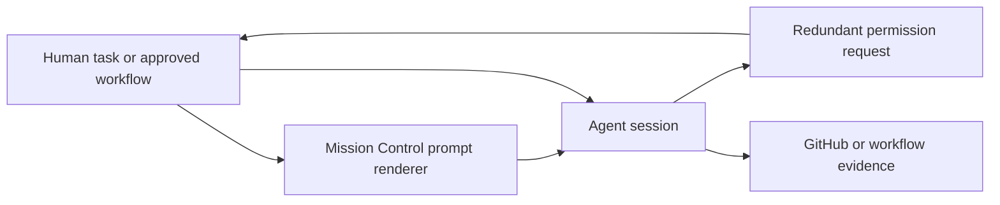
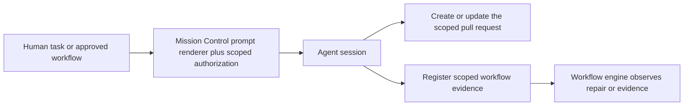

# Preauthorized PR and workflow actions

Status: Approved on 2026-08-17

## Approved decisions

- Apply the authorization as an always-on Mission Control execution contract. Do not add a setting or opt-out UI.
- Create a phased implementation plan and schedule its implementation task after the plan artifacts are committed and pushed.

## Outcome

Mission Control-authored execution prompts will tell agents that two already-scoped actions do not need another conversational permission check:

1. When the task or workflow calls for a pull request, the agent may commit the scoped work, push its task branch, and create or update that pull request without asking again.
2. When a Persona workflow exposes `submit_workflow_evidence`, the agent may register task-produced, checkout-relative evidence under an issued repository scope without asking for approval of the payload or destination. The agent must not ask the human to resubmit the workflow after a repair.

The authorization is conditional, not an instruction to perform either action in every task. A scout's no-PR contract, a task that does not request shipping, repository boundaries, evidence validation, and the prohibition on merging remain authoritative.

## Why this is happening

Codex is stopping on redundant conversational approvals even though Mission Control has already established the operational scope. A representative failure is an agent that reruns the requested focused command successfully, then refuses to register the log until the operator approves the exact file, `repositoryScope`, and service destination in prose.

The same gap appears around pull request creation. The task or workflow asks for a PR, but the prompt does not state plainly enough that this external write is already authorized by the operator's Mission Control action.

## Repository findings

- `src/server/task-contract.ts` is the central composer for task delivery. Both fresh dispatch in `src/server/dispatcher.ts` and assignment to a live session in `src/server/tasks.ts` call `withTaskKindContract`, so this is the correct place for an all-task execution authorization.
- `src/server/workflows/agent-contract.ts` currently tells eligible ship tasks how to use `submit_workflow_evidence`, but it describes the tool without explicitly preauthorizing the exact class of scoped write or telling the agent not to request resubmission.
- `src/server/mission-mcp.ts`, the Claude ask channel, and the Codex launch adapters already register and preapprove required Mission MCP tools. `test/mission-mcp.test.ts` pins that behavior. The reported stop is therefore a prompt-level authorization gap, not a reason to widen sandbox access or add a second allowlist.
- `src/server/workflows/feedback.ts` renders every daemon-authored repair, Inspector, unchanged-evidence, legacy PR handoff, and SessionAction packet delivered to a working agent. These follow-up turns need the same authorization because the opening task prompt may have been compacted out of context.
- The workflow engine already owns automatic resumption for versions published with `resumptionPolicy: "auto"`; manual and Preview workflows remain operator-controlled in the Runs UI. The agent should complete its repair and evidence registration, then stop. It should never turn workflow resubmission into a new permission question.
- `actions/pull-request.md` is snapshotted into immutable published workflow versions. Editing that document in place would rewrite the action bytes embedded in No-Mistakes Review v8-v10. The authorization must live in the runtime delivery envelope, outside the frozen `promptMarkdown` snapshot.
- Existing repository memory states that a task which asks for a PR already authorizes a scoped push to this repository. The prompt should expose that durable convention instead of making every session rediscover it.

## Adopted policy: always-on contract

Use an always-on Mission Control execution contract.

Authorization does not expand the task. It only removes a duplicate confirmation for actions that another task or workflow instruction already requires, and it explicitly does not authorize merging or crossing repository and evidence boundaries. Making that invariant optional would preserve the recurring stall on installations where the switch is disabled, create a new persistence and UI surface, and make workflow packets depend on a setting unrelated to their immutable scope.

## Proposed design

### 1. One prompt policy, rendered in context

Add a small server-side prompt-policy module that owns the exact authorization language. Its renderer will take explicit context rather than emit one unconditional paragraph:

- task or workflow execution;
- whether scoped workflow evidence is available;
- whether the prompt is a workflow continuation.

The rendered contract will say:

- PR creation or update is already authorized only when the task or current workflow asks for it;
- the authorization covers the task branch and repository named by Mission Control, not arbitrary repositories;
- merge is not authorized;
- an explicit no-PR instruction still wins;
- an available `submit_workflow_evidence` call is already authorized for task-produced, checkout-relative files and issued repository scopes, including `all` when the task received that scope;
- the agent must call the tool directly rather than asking for approval of the text payload or destination;
- workflow resubmission belongs to Mission Control's engine or the Runs UI, so the agent completes the repair, stages any new evidence, and does not ask the human to resubmit.

Keeping these sentences in one module prevents the task composer, repair renderer, and PR action wrapper from drifting into different meanings.

### 2. Cover both initial task-delivery paths

Update `withTaskKindContract` in `src/server/task-contract.ts` to include the shared authorization for every task kind. Preserve the operator's intent as the unchanged prefix.

Order the suffixes so broad authorization cannot override a narrower task contract:

1. shared conditional authorization;
2. the task-kind contract;
3. the workflow-evidence usage contract when eligible.

That order leaves the scout's `Do NOT open a pull request` rule later and more specific, while plan and ship tasks can rely on the standing authorization when their own instructions call for a PR.

Strengthen `workflowEvidenceContractAppendix` so eligible ship tasks are told that registration is already approved for the issued locators and that they must not stop for a payload/destination confirmation or ask the operator to resubmit the workflow.

### 3. Reinforce authorization in every workflow continuation

Use the same prompt-policy module from `src/server/workflows/feedback.ts`:

- `finalizePacket` will retain the authorization in the guaranteed suffix used by Persona repair, Inspector repair, unchanged-evidence nudges, and the legacy PR handoff, including when the evidence body is truncated;
- `renderSessionAction` will place the platform authorization in its runtime envelope before the frozen action Markdown;
- the frozen `SessionActionSnapshot.promptMarkdown` remains unchanged and remains the final, task-specific instruction, so existing no-merge, repository, evidence, and quality constraints still narrow the action;
- already-prepared durable delivery rows keep their stored payload; only newly rendered deliveries receive the new envelope.

The runtime envelope avoids editing `actions/pull-request.md`, avoids regenerating its source module, and avoids appending a new built-in workflow version for what is a platform authorization rule rather than a graph change.

### 4. Preserve capability and security boundaries

Do not change Codex to full access, disable approval review globally, auto-answer arbitrary permission prompts, or add a new MCP tool. Existing sandbox, Mission MCP registration, issued repository slots, path checks, size limits, UTF-8 validation, and server-side session attribution continue to enforce what an agent can actually do.

The prompt closes a redundant consent loop. It does not replace enforcement.

### 5. Document the behavior where operators look for it

Update:

- `docs/sessions.md` to explain that Mission Control-authored task and workflow prompts carry conditional PR authorization and that this is distinct from sandbox approval posture;
- `docs/workflows.md` to explain direct evidence registration, engine/UI ownership of resubmission, and the rule that agents do not ask the operator to resubmit;
- no Settings documentation, schema, route, or UI changes are required.

## Prompt flow change

Before:



After:



The agent still asks when a genuinely new decision is required. It no longer asks the human to approve an action already selected and bounded by the task or workflow.

## Tests and verification

Add or update focused tests that prove behavior rather than only matching one sentence:

- task-contract tests cover every task kind, preserve the original intent prefix, prove both delivery seams still use the composer, and prove a scout's no-PR rule remains later and authoritative;
- workflow-evidence contract tests assert explicit authorization for issued paths/scopes and the absence of a resubmit request;
- workflow feedback tests cover normal and truncated repair packets, Inspector packets, unchanged-evidence nudges, legacy PR handoffs, and runtime-wrapped SessionActions;
- SessionAction tests prove the stored snapshot Markdown remains byte-identical inside the new runtime envelope;
- existing Mission MCP tests continue to prove the tool is registered and launch-preapproved, with no sandbox widening;
- documentation tests are updated where they pin the prompt contract.

Run:

```sh
node --test --import ./test/setup-state.mjs --import tsx test/scout-prompt.test.ts
node --test --import ./test/setup-state.mjs --import tsx test/plan-prompt.test.ts
node --test --import ./test/setup-state.mjs --import tsx test/workflow-feedback.test.ts
node --test --import ./test/setup-state.mjs --import tsx test/session-action-durability.test.ts
node --test --import ./test/setup-state.mjs --import tsx test/mission-mcp.test.ts
npm test
npm run typecheck
npm run lint
npm run build
npm run smoke
```

The approved always-on path has no dashboard UI change, so it does not require a new Playwright spec.

## Acceptance criteria

- A Mission Control task prompt that calls for a PR tells the agent it may create or update the scoped PR without asking for another confirmation.
- An eligible workflow-evidence prompt tells the agent it may submit the exact scoped evidence payload directly, including an issued `repositoryScope: "all"`, without asking the human to approve the file or destination.
- Repair and action packets tell the agent not to ask the human to resubmit the workflow.
- A scout still receives an unambiguous no-PR instruction, and authorization never turns into an obligation.
- No prompt authorizes merge, arbitrary repositories, arbitrary external services, or evidence outside Mission Control's existing validation boundary.
- Existing MCP preapproval and sandbox posture remain unchanged.
- Published workflow versions and frozen SessionAction Markdown remain unchanged.
- Newly rendered workflow packets preserve the authorization even when the evidence body is truncated.

## Implementation follow-up

The approved repository-verified breakdown is in [`phased-plan.md`](phased-plan.md), with its rendered [`phased-plan.html`](phased-plan.html) and the detailed one-shot implementation guide in [`phase-1-preauthorize-agent-actions.md`](phase-1-preauthorize-agent-actions.md).

## Delivery

Implement this as one coherent server-and-documentation change. It has no schema migration and no graph-version migration. Commit the implementation on a feature branch, open a reviewable pull request without asking for separate permission, and let the existing workflow and Inspector gates evaluate it.
