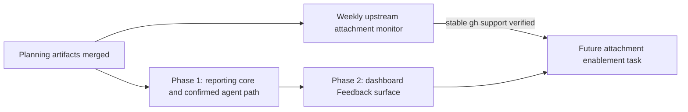

# Public product issue reporting: phased implementation

**Source plan:** [plan.md](plan.md)

**Approved decisions:** five report types; CLI-only issue creation; production-disabled image
attachments built against the anticipated repeated `--attach` shape; dashboard confirmation for
agent reports; `mancej/mission-controller-control-issues` as the shipped default; and a weekly
Monday 09:00 `America/New_York` upstream-release monitor.

## Implementation shape

The feature is split into two serial merge units:

1. a complete daemon and MCP reporting path that can publish a text-only issue after dashboard
   confirmation;
2. the direct dashboard Feedback surface, including its visible but disabled attachment control.

This is the fewest safe split. The estimated production change is **850 to 1,150 non-test lines**:
roughly 450 to 650 for shared contracts, GitHub execution, HTTP and MCP confirmation, then 400 to
500 for App state, modal UI, palette/topbar integration and styling. Tests, fixtures and
documentation are excluded from that estimate.

One phase would combine an irreversible external writer, subprocess outcome classification,
token-scoped MCP behavior, a blocking human review, a retained modal draft, and the topbar's measured
responsive geometry. That is too broad for one mid-tier implementation and review pass. Splitting at
the already-operable agent path gives Phase 1 a real outcome and lets Phase 2 consume a merged HTTP
contract. Splitting further would create horizontal schema, test, documentation or disabled-control
phases with no independent value.

## Repository findings incorporated

- `src/server/task-sources/github-issues.ts` already contains the proven three-way reading of
  `gh issue create`: success with URL, retry-safe CLI refusal, and unknown outcome after process
  death or malformed success. Phase 1 extracts that classification for reuse instead of copying it.
- `src/server/util/exec.ts` accepts stdin, so report Markdown travels through
  `gh issue create --body-file -` rather than process argv or a temporary file.
- `ghBin()` in `src/server/config.ts` and `MISSION_GH_BIN` are the single executable and test seams.
- `/mcp/reviews` plus an `input` review with selectable decisions already provide a token-guarded,
  durable, blocking dashboard answer. The new MCP tool reuses that channel; it does not add a review
  kind, database column, event or second confirmation UI.
- `buildApp` is a positional dependency list used by many tests. A product-issue service seam must be
  appended as the last optional parameter, while production passes its singleton from
  `src/server/index.ts`.
- `src/server/uploads.ts` resolves only daemon-issued basenames inside the uploads directory and
  rejects symbolic links and expired files. The attachment-capable test seam must additionally
  re-sniff bytes and enforce count and aggregate limits before forming anticipated `--attach` argv.
- `useImageDrop` already makes `disabled` block paste, drop and selection while retaining one shared
  upload implementation. Phase 2 reuses it and never forks a feedback-only uploader.
- The command palette's fixed actions live in `commandProvider`; the topbar tool glyphs live in the
  final `tb-tools` group. The topbar is governed by `topbarLadder.ts`, source guards, Playwright's
  `topbar-one-row.spec.ts`, and Electron geometry tests.
- UI changes require Playwright coverage against the built dashboard. The shared fake `gh` already
  records argv and prevents a signed-in developer machine from creating real issues.
- Recurring missions already support the chosen cron, time zone, coalescing, overlap suppression,
  pause and archive. The upstream monitor is an operational definition, not scheduler code.

## Phase graph



The phase tasks are serial because Phase 2 imports Phase 1's shared draft, preview, preflight and
result contracts and calls its routes. The weekly monitor is not an implementation phase: it may run after
the planning paths reach the default branch, and it schedules the future enablement task only after
the initial feature and stable upstream contract both exist.

## Phase table

| Phase | Outcome | Direct prerequisites | Merge value |
|---|---|---|---|
| [Phase 1](phase-1-reporting-core-and-agent-path.md) | Text-only public product issues through the daemon and user-confirmed MCP tool | Planning artifacts | Agents can prepare a five-type report, a human confirms it in Mission Control, and `gh` returns a safe result |
| [Phase 2](phase-2-dashboard-feedback-surface.md) | Always-reachable direct Feedback modal with disabled future screenshot affordance | Phase 1 | Users can file the same report directly; topbar, palette, retained draft and built-browser behavior are complete |

## Cross-phase contracts

Phase 1 owns these names and semantics. Phase 2 consumes them without creating a parallel type or
changing the wire shape:

- the five-value report-type tuple and exhaustive type-to-label map;
- bounded title, details and `attachmentUploadIds` draft fields;
- a server-derived preview carrying the exact target, fixed labels, allowlisted environment,
  rendered public body, capability state, and the bounded draft/request identity it represents;
- trusted `source:dashboard` versus `source:agent` derivation at separate route boundaries;
- `mancej/mission-controller-control-issues` default plus exact `owner/name` override validation;
- fixed `status:needs-triage` and one source label, with no caller-defined labels;
- deterministic Markdown body and `mission-control-product-report:v1` marker;
- success, retry-safe refusal, invalid configuration and unknown-outcome result variants;
- production attachment capability disabled with no operator override;
- one repeated anticipated `--attach <resolved path>` pair per image only under an injected test
  capability;
- dashboard confirmation before any MCP-triggered `gh` call.

No phase adds task persistence, a product-report database table, an SSE event, a background poller,
or another GitHub credential source. The existing GitHub Issues task source remains the inbound
bridge into the backlog.

## Merge order and concurrency

There is one execution lane:

```text
planning PR -> Phase 1 -> Phase 2
```

No implementation phases run concurrently. Phase 2's UI would otherwise have to guess a draft and
result contract while Phase 1 is still free to change it. The future attachment enablement task is
outside this graph and is created only by the approved recurring monitor after upstream release.

## Final verification strategy

Each phase runs focused tests with the required test-state preload. Phase 1 proves schema bounds,
label derivation, stdin body transport, outcome classification, preflight, the hard attachment gate,
MCP registration and confirmation. Phase 2 adds static rendering, palette and topbar guards plus a
Playwright journey against the built daemon and fake `gh`.

The completed feature runs:

```sh
npm run typecheck
npm run lint
npm test
npm run build
npm run smoke
npm run test:e2e
```

Manual verification creates one disposable text-only issue in the public target, verifies body and
labels, and closes it. No phase uses a real screenshot upload before the release-follow-up verifies
stable CLI support.

## Operational follow-up

After these planning artifacts are published, create the approved recurring mission with cron
`0 9 * * 1`, time zone `America/New_York`, `skip-active`, `coalesce-latest`, low priority and Codex.
Its task checks issue #13256, a stable `gh` release and official help. It does nothing until all
release gates pass and this plan resolves on the default branch. It then creates exactly one task
titled **Enable GitHub CLI image attachments for product reports** and includes its schedule id in
that task. It remains enabled but creates no duplicate while the task or its pull request is active.
The enablement task adjusts the isolated adapter, enables production input, verifies a disposable
image issue, and opens the implementation pull request. A later checker occurrence archives the
schedule only after the task succeeds and that pull request is merged.

## Complete cross-phase audit

- Every approved report type, label and public-target decision is owned by Phase 1 and consumed by
  Phase 2.
- Dashboard confirmation is complete in Phase 1; Phase 2 does not add a weaker agent route.
- The disabled attachment contract spans both phases with the same field and server gate. Neither
  phase claims upstream support exists.
- Phase 1 leaves an operable agent path. Phase 2 leaves the complete direct-user path. Neither merge
  relies on a later repair to stay safe.
- The monitor is operational state with no code dependency on unmerged phase files. Its checker
  refuses to schedule enablement until the source plan exists on the default branch.
- No concurrent merge can introduce incompatible contracts because Phase 2 directly depends on
  Phase 1 and the future enablement task depends on the final initial feature plus upstream release.
