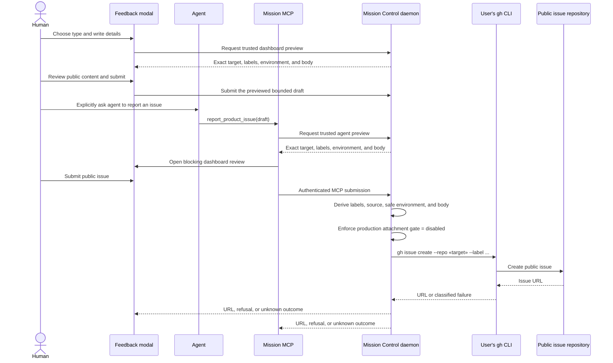

# Public product issue reporting

**Status:** Approved on 2026-08-18. The operator selected dashboard confirmation for MCP reports,
`mancej/mission-controller-control-issues` as the shipped public target, a weekly Monday 09:00
`America/New_York` attachment-release check, and a phased implementation follow-up.

**Rendered review:** [plan.html](plan.html)

## Outcome

Give every Mission Control user one easy, public path for reporting product feedback, and give an
agent the same capability when the user explicitly asks it to report something. Both paths produce
one structured GitHub issue in the dedicated public issue repository through the reporter's existing
GitHub CLI authentication. The operator's GitHub task source can then sweep new reports into Mission
Control for evaluation without this feature creating a second intake system.

The dashboard experience is intentionally small: open **Feedback** from an always-reachable topbar
glyph or the command palette, choose one of five report types, enter a title and details, review the
public-content warning, and submit through `gh issue create`. The screenshot dropzone is built in the
same surface but visibly disabled until first-party GitHub CLI attachment support ships and a
follow-up task verifies its final contract. A successful submission becomes a link to the new issue.
A failed submission stays editable and explains whether retrying is safe.

## Confirmed product decisions

| Decision | V1 contract |
|---|---|
| Product track | This is a user-facing capability with public side effects and browser behavior. |
| Report types | `bug`, `feature-request`, `documentation`, `usability`, and `other`. Exactly one is required. |
| Type ownership | The reporter chooses the type. The daemon maps it to one fixed GitHub label; callers cannot submit arbitrary labels. |
| Intake labels | Every issue also receives `status:needs-triage` and exactly one source label: `source:dashboard` or `source:agent`. |
| Deeper triage | Area, severity, duplicate, priority, and disposition labels are assigned during evaluation, not by the reporter. |
| GitHub identity | Mission Control uses the reporter's installed `gh` binary and existing `gh auth`; it stores no GitHub token. |
| Screenshot rollout | Build the Dispatch-style upload contract and anticipated `gh issue create --attach` adapter now, but hard-disable production attachment input and execution. A release-follow-up task verifies the shipped CLI contract before enabling it. |
| Agent path | Add a Mission MCP tool for reports explicitly requested by the user. It converges on the same daemon service as the dashboard. |
| Agent consent | Every MCP report opens a bounded dashboard preview and blocks until the human submits or dismisses it. No agent call directly publishes. |
| Public target | Ship `mancej/mission-controller-control-issues` as the fixed default, with the validated downstream-fork override described below. |
| Task source | Creating and enabling the GitHub Issues task source is an operator rollout step. The reporting feature never dispatches an agent. |
| Upstream monitor | A recurring Mission Control mission checks GitHub CLI issue #13256 and stable CLI documentation every Monday at 09:00 `America/New_York`. It deduplicates the enablement task, remains enabled while that work is active, and archives itself only after the task completes and its pull request merges. |

## Why this shape fits the existing product

Repository findings verified on 2026-08-18:

- `src/web/components/ImageDrop.tsx`, `src/server/uploads.ts`, and `POST /api/uploads` already provide
  the Dispatch-style drop/paste interaction, image sniffing, a 10 MiB per-image limit, local preview,
  server-issued upload ids, and safe resolution inside Mission Control's upload directory.
- Those existing uploads are local filesystem artifacts. `withAttachments()` appends their local
  paths to an agent prompt; those paths are not public GitHub URLs and must never be placed in a
  public issue.
- `src/server/task-sources/github-issues.ts` already creates GitHub issues through `gh`, maps the
  resulting URL, and preserves the critical distinction between a retry-safe refusal and an unknown
  outcome that may already have created an issue.
- `src/server/config.ts` already owns `ghBin()`, including the `MISSION_GH_BIN` test seam. This feature
  must reuse it rather than add another GitHub executable lookup.
- The GitHub Issues task source already filters by `labelsAny`, copies labels when configured, and
  records seen issues durably. `status:needs-triage` is therefore a sufficient stable sweep label.
- Mission MCP tools are registered in `src/mcp/server.ts`, declared in `MISSION_MCP_TOOLS`, validated
  again by daemon request schemas, and exercised through the built-bundle smoke check. The MCP child
  already authenticates to the daemon with the per-machine token and can identify its session.
- The topbar is a measured one-row layout. A new glyph must join the existing tool group and update
  its geometry guards; the command palette should open the same modal rather than implement another
  reporting surface.
- There are no existing `.docs/architecture` diagrams to update. The new external request flow is
  recorded below in this plan, with an inline SVG rendering in `plan.html`.

GitHub's current official CLI documents title, body, labels, issue type, assignees, milestone,
project, relationships, templates, and web mode for `gh issue create`, but no file attachment flag.
GitHub CLI issue #13256 proposes either a standalone attachment uploader or `--attach` on issue and
pull-request commands. As of 2026-08-18 it is open, assigned, labeled `blocked`, and has no linked
branch or pull request. The issue says the GitHub platform may need a new REST or GraphQL surface
before the CLI can implement the feature. The operator has nevertheless approved the proposed
`gh issue create --attach` shape as the implementation assumption, provided production attachment
execution remains disabled until a stable release and official CLI help confirm the actual contract.

References:

- [GitHub CLI: `gh issue create`](https://cli.github.com/manual/gh_issue_create)
- [GitHub Docs: attaching files](https://docs.github.com/en/get-started/writing-on-github/working-with-advanced-formatting/attaching-files)
- [GitHub CLI issue #13256: first-party attachment upload](https://github.com/cli/cli/issues/13256)

## User experience

### Entry and draft lifetime

Add one compact **Feedback** glyph to the topbar's tool group, next to Settings and Alerts, with an
accessible name and tooltip that say **Report product feedback**. At narrow widths it remains a glyph
like the existing tools. Add one static command-palette action with the same wording and common search
terms such as bug, issue, feature request, docs, and usability. Both entry points call one App-owned
opener and mount the same modal.

The draft lives in `App`, not inside the modal, so closing and reopening does not discard text or
finished image uploads. This matches Dispatch's useful draft lifetime without sharing its much larger
task schema. **Clear** discards the draft deliberately. A confirmed successful submission clears it;
a refusal or unknown outcome does not.

### Form

The modal contains only:

1. **Type**, a required five-option control in the confirmed order: Bug, Feature request,
   Documentation, Usability, Other.
2. **Title**, required and bounded.
3. **Details**, required and bounded. The prompt copy changes by type, but the persisted shape stays
   one field rather than five incompatible forms. Bug copy asks for observed behavior, expected
   behavior, and reproduction; feature-request copy asks for the current limitation and desired
   outcome.
4. **Screenshots**, rendered as a disabled Dispatch-style dropzone in the initial release with the
   explanation **Screenshot upload is waiting for first-party GitHub CLI support** and a link to
   issue #13256. Build the state, server-issued locator contract, previews, validation, and
   attachment strip now, but do not allow paste, drop, selection, or a non-empty attachment request
   in production. The dormant adapter anticipates one repeated `--attach <resolved-image-path>`
   argument per image. Only the release-follow-up may correct that shape and enable the control.
5. A visible notice: **This report and its screenshots will be public on GitHub. Review them for
   secrets and personal information before submitting.**

The daemon appends a small generated environment section containing only allowlisted facts useful to
triage: Mission Control version, operating-system family, CPU architecture, and dashboard mode
(browser or Electron). It never includes usernames, home paths, repository paths, environment
variables, session transcripts, prompts, logs, tokens, hostnames, or process arguments. Generated
context is shown in the final preview before publication.

### Success and failure

On success, replace the primary action with **View GitHub issue** and render the returned issue URL.
The modal may then close without losing the result. On a normal `gh` refusal, keep the draft and the
submit action because nothing was published. On an unknown outcome, keep the draft but withdraw the
submit action for that opening and say the issue may already exist; opening GitHub to check is the
primary recovery. This reuses the safety rule already established by task-source pushes and prevents
a timeout from becoming a duplicate public issue.

## Labels and issue body

The server owns an exhaustive report-type-to-label map:

| UI and API value | GitHub label | Meaning |
|---|---|---|
| `bug` | `bug` | Existing behavior is incorrect or broken. |
| `feature-request` | `feature-request` | A new capability or material extension is requested. |
| `documentation` | `documentation` | Product or contributor documentation is missing, misleading, or unclear. |
| `usability` | `usability` | The capability exists but is difficult to find, understand, or operate. |
| `other` | `other` | Valid product feedback that does not fit the other four choices. |

Every issue also receives `status:needs-triage`. The caller channel is derived by the daemon and adds
`source:dashboard` or `source:agent`; neither UI nor MCP input accepts these labels directly. The
target repository must create all eight labels before enabling submissions. Missing labels are a
visible preflight or submission failure, never silently omitted.

The body is deterministic Markdown. The disabled initial release omits the Screenshots section;
the enabled follow-up adds it only if the final CLI contract requires body placeholders or returned
URLs:

```markdown
## Details

«reporter-authored details»

## Environment

- Mission Control: «version»
- Platform: «OS family / architecture»
- Client: «browser or Electron»

<!-- mission-control-product-report:v1 -->
```

The marker is versioned and append-only. It identifies in-product submissions for later analysis
without exposing a local identifier. The issue title is the reporter's title without a type prefix;
the label already owns type.

## Request flow

The dashboard and agent paths converge before any GitHub subprocess runs. The only external writer
is the daemon-owned product-issue service.



Report submission adds no task row, database migration, SSE event, session mutation, or background
poller. The existing task source remains the inbound bridge from the public repository into the
backlog. The separate upstream-release monitor below uses the existing recurring-mission system and
does not become part of this request path.

## Shared contract and daemon ownership

Add a browser-safe report contract, preferably in a focused `src/shared/product-issues.ts` module
with route schemas composed from `src/shared/protocol.ts`:

- an append-only tuple for the five report types;
- bounded `title` and `details` fields;
- bounded server-issued screenshot locators as a forward-compatible field that currently accepts
  only an empty list in production;
- an exhaustive label map and source type;
- a result union that distinguishes success, refusal, invalid configuration, and unknown outcome.

The mutating HTTP route uses `parseBody` and never hand-parses JSON. A focused daemon service owns
preflight, body construction, fixed argv construction, subprocess execution, URL parsing, and
failure classification. It receives `source` from its trusted caller boundary rather than from the
public request shape. It runs `ghBin()` with a fixed argv array and `--repo owner/name`; it never
uses a shell or requires a checkout of the public issue repository.

Give the service one injected attachment capability. Production wiring passes **disabled** and has
no operator-facing override. Tests can inject the anticipated capability to prove that each upload
id is re-resolved, re-sniffed, bounded, and emitted as a separate
`--attach <resolved-image-path>` argv pair without a shell. The disabled capability rejects every
non-empty attachment list before starting `gh`. The release-follow-up owns checking the real
stable-CLI syntax, adjusting the adapter and schemas if necessary, adding a minimum-version or
capability check, and changing production wiring to enabled.

Provide a read-only preflight used when the modal opens. It verifies that `gh` is available and
authenticated, that the configured target repository is reachable, and that the required labels
exist. Preflight has a short timeout and returns actionable sentences. It does not create labels or
mutate the target repository.

Provide separate trusted dashboard and token-authenticated MCP preview routes. Each accepts the same
bounded draft as its matching mutation route, assigns the source at the route boundary, and returns
the exact target, fixed labels, allowlisted environment, and rendered public body. The dashboard
submits the previewed draft; the MCP tool obtains this server-derived preview before opening its
blocking review, then submits the original bounded draft only after confirmation. The mutation
service derives and validates everything again, so a stale or fabricated preview is never authority.

The target repo defaults to `mancej/mission-controller-control-issues`, with a
`MISSION_PRODUCT_ISSUES_REPO` override for downstream forks and isolated tests. The value is parsed
as exact `owner/name`, is shown in the modal, and is never accepted from a report draft. This
prevents a caller from turning a product-report tool into an arbitrary issue writer.

## MCP capability

Register `report_product_issue` in `src/mcp/server.ts`, add it to `MISSION_MCP_TOOLS`, and validate
its input again at the daemon route. The tool accepts the same five-type enum, title, details, and
only the approved bounded screenshot locator shape. It accepts no repository, labels, assignees,
milestone, project, arbitrary filesystem path, or raw environment block.

The tool description says it prepares a public GitHub issue and may be called only when the user has
explicitly asked the agent to report the product issue. Every call creates a bounded dashboard
preview and blocks until the human submits or dismisses it. Submission returns the issue URL or the
same retry-safety distinction as the UI; dismissal returns a typed cancellation without calling
`gh`. The tool is not added to any task kind's mandatory preapproved tool list merely by existing.

Any screenshot locator from MCP must resolve to a server-issued Mission Control upload, remain
inside the upload directory after realpath resolution, pass image sniffing again, and stay within
the same count and byte limits as the dashboard. An agent can never publish an arbitrary checkout or
host file through this tool.

Until the release-follow-up enables attachments, the MCP tool description states that screenshots
are unavailable and its schema accepts only an empty locator list. This keeps agent and dashboard
behavior identical while preserving the intended wire field for the follow-up.

## GitHub CLI attachment release monitor

Create one enabled recurring mission after this plan is approved. It runs with cron
`0 9 * * 1` in `America/New_York`, using `skip-active`, `coalesce-latest`, low priority, the Codex
harness, and the current repository. Every occurrence files a bounded checker task and stops,
exactly like any other recurring mission.

The checker treats issue closure alone as insufficient. It verifies all of the following against
primary sources:

1. GitHub CLI issue #13256, or its official successor, identifies a shipped implementation.
2. A stable GitHub CLI release contains the attachment capability.
3. The official `gh` manual or `gh issue create --help` documents the final command, argument
   repetition, supported file types, repository context, output, failure behavior, and minimum
   version.
4. `docs/plans/product-issue-reporting/plan.md` resolves on the implementation repository's default
   branch before any task is created from it.

If any release check fails, the checker records the evidence in its task outcome and makes no
repository or schedule mutation. Once all release checks pass, it searches task history and open or
merged pull requests for the deterministic follow-up title **Enable GitHub CLI image attachments for
product reports**. An active task or open pull request makes the occurrence a no-op. If no active
task and no open or merged implementation pull request exists, it creates exactly one ship task
pointing at this plan. A terminal failed task with no implementation pull request is retry-eligible
on a later occurrence. The schedule stays enabled so it can observe completion without racing a
duplicate task.

The follow-up task verifies the released CLI against the fake and a disposable public issue,
corrects the anticipated argv or response contract, enables production capability detection,
enables the dashboard and MCP attachment inputs, updates documentation, and runs the full focused
and browser verification. A later checker occurrence archives the recurring mission through the
validated loopback schedule route only after it observes both the task's successful completion and
the implementation pull request's merged state. Mission Control has no hard-delete operation for
recurring missions; archive is the intended self-cleanup because it removes the live schedule while
retaining the occurrence audit.

```mermaid
sequenceDiagram
    participant Timer as Recurring mission
    participant Check as Release checker task
    participant GitHub as Issue, release, and gh manual
    participant Backlog as Mission Control backlog
    participant Follow as Attachment follow-up task
    Timer->>Check: File one low-priority checker task
    Check->>GitHub: Verify shipped stable CLI contract
    alt Attachment support not fully released
        Check-->>Timer: Finish with evidence; remain enabled
    else Stable contract verified
        Check->>Backlog: Inspect deterministic task and pull request state
        alt No active task or implementation pull request
            Check->>Backlog: Create one deterministic follow-up task
            Backlog->>Follow: Dispatch after normal backlog gates
            Follow->>Follow: Adapt contract, enable, test, and open PR
        else Task active or pull request open
            Check-->>Timer: Finish without duplicate; remain enabled
        else Task complete and pull request merged
            Check->>Timer: Archive schedule and retain audit
        end
    end
```

## Public repository and task-source rollout

Repository creation and task-source enablement are operational prerequisites, not hidden code-side
effects of this feature. Before enabling the shipped target:

1. Create the public repository at `mancej/mission-controller-control-issues` and enable public
   issues.
2. Create `bug`, `feature-request`, `documentation`, `usability`, `other`,
   `status:needs-triage`, `source:dashboard`, and `source:agent` with documented descriptions and
   colors.
3. Publish a security policy and issue guidance that direct secrets and vulnerabilities away from
   the public tracker.
4. Configure a GitHub Issues task source against the Mission Control implementation repository,
   with `repo` set to the public report repository, `labelsAny: ["status:needs-triage"]`, and
   `copyLabels: true`.
5. Run task-source preflight and one manual sweep before enabling its schedule. Task sources create
   backlog rows only; the operator separately chooses the evaluation workflow and dispatch policy.

The application does not create the repository, labels, security policy, task source, or workflow.
Those actions change external or operator-owned state and are verified in rollout.

## Compatibility and safety boundaries

- This is additive. Existing Dispatch attachments continue to resolve to local prompt paths and are
  not changed into public uploads.
- No secret, token, or new GitHub OAuth flow is introduced. `gh` remains the credential owner.
- Demo mode and tests must never reach GitHub. They use the existing `MISSION_GH_BIN` fake seam, and
  demo mode either hides the submit action or returns an explicit inert-mode refusal.
- Reports are always public. The warning and final preview are present for dashboard and MCP
  confirmation flows; no automatic log collection exists.
- The initial production build cannot upload an attachment even if a caller fabricates a non-empty
  locator list. The gate is server-side, has no user-operable override, and is tested before `gh`
  execution.
- A missing target repository, missing label, unauthenticated `gh`, timeout, malformed success URL,
  and subprocess signal death are separate tested outcomes.
- Concurrent double-submit is guarded in memory by a draft/request id for the duration of the
  attempt. Ambiguous completion never enables blind retry in the same opening.
- Report type values and the body marker are append-only. A future type is appended and must update
  the exhaustive label map, UI options, MCP schema, docs, and tests together.
- The task source's own persisted kind and seen-item contracts are unchanged.

## Implementation surfaces

The phase plan may adjust names where repository evidence warrants, but should preserve ownership:

| Area | Existing or expected surface |
|---|---|
| Shared report vocabulary | New focused shared module plus route schemas in `src/shared/protocol.ts` |
| GitHub execution and preflight | Focused daemon service reusing `ghBin()` and existing run-result semantics |
| HTTP | `src/server/routes.ts`, read-only preflight plus trusted dashboard/MCP preview and mutation routes |
| Upload resolution | Reuse `src/server/uploads.ts`; do not trust browser paths or MCP paths |
| Attachment capability | Injected daemon adapter; production disabled, fake-enabled tests anticipate repeated `--attach` argv |
| MCP | `src/mcp/server.ts`, `src/server/mission-mcp.ts`, bundle smoke and registration tests |
| Dashboard state | `src/web/App.tsx`, one App-owned draft/opener/result |
| Modal | New focused component reusing `ImageDrop`, `AttachmentStrip`, `Tooltip`, and overlay conventions |
| Entry points | Topbar tool group and a static command-palette action that call the same opener |
| Styling and geometry | `src/web/styles.css`, `src/web/topbarLadder.ts`, existing Electron/topbar guards |
| E2E fake | Extend the shared fake `gh` to record product-issue argv and return controlled outcomes |
| Documentation | `docs/ui.md`, `docs/configuration.md`, `docs/security.md`, and task-source guidance |
| Release automation | Existing recurring-mission API and one low-priority monitoring definition; no scheduler code change |

## Test and verification contract

### Unit and contract tests

- The five-type tuple and exhaustive label mapping compile and map exactly as approved.
- Body generation escapes no reporter Markdown but keeps generated sections and the v1 marker
  deterministic; bounds count UTF-8 bytes where public payload size matters.
- GitHub argv uses the fixed target, one label argument per derived label, body-file or safe argv
  transport, and never a shell.
- Success URL parsing, retry-safe refusal, timeout/signal unknown outcome, malformed success output,
  missing labels, unavailable repo, and unauthenticated CLI are distinct.
- Production rejects every non-empty screenshot locator list before GitHub is called. With the
  injected fake capability enabled, locators accept only fresh server-issued uploads inside the
  upload root; traversal, symlinks out, stale ids, non-images, excessive count, and excessive
  aggregate bytes fail before GitHub is called.
- The fake attachment-capable `gh` receives one anticipated `--attach` pair per resolved image. A
  contract fixture isolates this assumption so the release-follow-up changes one adapter rather
  than every caller.
- The MCP registry and built bundle expose exactly the declared tool, validate the schema twice, do
  not allow repository/label/path overrides, and preserve dashboard/MCP source attribution.
- Static React rendering covers all five types, draft/success/failure states, public warning,
  preflight, upload-in-progress, refusal, and unknown-outcome copy.
- Palette and topbar ladder tests prove the new entry remains reachable and the topbar remains one
  row at supported widths.

### Browser end-to-end tests

Add a Playwright spec because this is a new UI feature. Against the built daemon and fake `gh`, prove:

1. the topbar entry and command-palette entry open the same retained draft;
2. each of the five report types creates the exact derived label set, with no caller-defined labels;
3. the screenshot dropzone is visible but disabled, explains the upstream dependency, and neither
   paste, drop, selection, nor a fabricated HTTP payload invokes attachment upload;
4. a successful response shows and opens the issue URL, then clears the next draft;
5. an ordinary refusal keeps a safe retry, while an unknown outcome withdraws it for that opening;
6. a missing or unauthenticated CLI produces actionable preflight copy;
7. demo mode causes no fake `gh` invocation;
8. the new topbar glyph stays accessible at each measured layout rung;
9. an attachment-enabled fake build exercises paste/drop, preview, safe upload-id resolution, and
   anticipated repeated `--attach` argv without enabling that path in production wiring.

The fake agent binaries remain in force, so the spec spends no model tokens.

### Commands

Run focused unit and HTTP files while iterating, always with the repository's test preload, then:

```sh
npm run typecheck
npm run lint
npm test
npm run build
npm run smoke
npm run test:e2e
```

UI verification includes the Playwright flow and the relevant Electron topbar geometry test. Manual
verification uses a disposable text-only test issue in the public repository, confirms
labels/body/source, confirms attachment controls remain disabled, and closes the test issue without
deleting evidence from the implementation PR. Native image upload is manual verification owned by
the later release-follow-up, not by this initial build.

## Approved review decisions

- **MCP consent:** dashboard confirmation. The MCP call posts a bounded public preview and blocks
  until the human submits or dismisses it.
- **Target repository:** `mancej/mission-controller-control-issues` is the shipped default.
- **Release monitor:** weekly at 09:00 Monday in `America/New_York`, expressed as
  `0 9 * * 1`, with missed runs coalesced and overlap skipped while a prior checker is active.
- **Implementation follow-up:** create merge-aware phase documents and schedule their dependent
  Mission Control tasks.

## Verify-claims ledger

### Verified claims

- Existing Dispatch images become daemon-local paths, not public URLs. Basis: inspected
  `ImageDrop.tsx`, `attachments.ts`, `uploads.ts`, and `POST /api/uploads`.
- GitHub CLI lacks a supported issue attachment flag as of 2026-08-18. Basis: official current CLI
  manual plus the open first-party attachment feature request linked above.
- GitHub CLI issue #13256 is open, assigned, labeled `blocked`, and has no linked development as of
  2026-08-18. Its proposal includes both a standalone uploader and `gh issue create --attach`, while
  its implementation notes identify a possible GitHub API dependency. Basis: inspected the linked
  first-party issue and its current metadata.
- GitHub native issue attachment is documented as a web-composer operation. Basis: official GitHub
  attachment documentation linked above.
- Existing GitHub issue push code already preserves refusal versus unknown outcome. Basis: inspected
  `github-issues.ts`, `push.ts`, HTTP tests, and Playwright coverage.
- The task source can sweep one stable triage label and copy the remaining labels. Basis: inspected
  the shared GitHub source schema, implementation, settings UI, and task-source documentation.
- The Mission MCP child authenticates to the daemon and the tool vocabulary is checked against the
  built bundle. Basis: inspected `src/mcp/server.ts`, `src/server/mission-mcp.ts`, and smoke tests.

### Confirmed inputs

- Product reporting includes five v1 types: bug, feature request, documentation, usability, other.
- Agents may report through Mission MCP only when the user has explicitly prompted them to do so.
- The destination is a dedicated new public GitHub repository, and the operator will configure the
  inbound task source that evaluates its issues.
- V1 is CLI-only. It builds an anticipated repeated-`--attach` adapter but keeps screenshot input and
  execution disabled until a recurring mission detects a stable release and schedules the verified
  enablement follow-up.
- MCP publication requires dashboard confirmation, the shipped default is
  `mancej/mission-controller-control-issues`, and the upstream monitor runs weekly at the approved
  cron and time zone.

### Accepted contained assumption

- **Future CLI attachment contract:** accepted assumption, not a verified fact. The operator has
  explicitly authorized implementation against repeated `--attach` arguments even though #13256 is
  blocked and describes more than one possible surface. The production gate prevents this assumption
  from affecting users; the release-follow-up must reconcile every actual contract difference before
  enabling it.

**Verdict:** `CLEAR_WITH_ACCEPTED_ASSUMPTION`. All product decisions are approved. The only unverified
future claim is isolated behind a production-off capability gate and an evidence-gated follow-up, so
it does not block phasing or the initial release.
