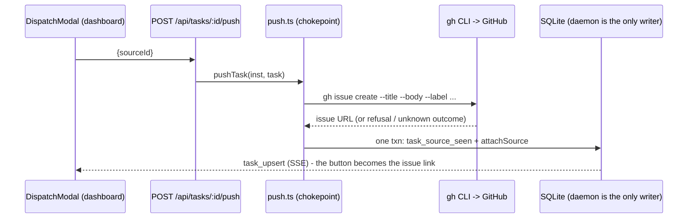

# Push a backlog task to a task source (GitHub issue from a task)

## Context

Task sources today are strictly inbound: a configured `github-issues` source sweeps open issues into the backlog (`sweep` + `preflight` are the entire `TaskSourceImpl` contract, and `ingest.ts` is the only writer). There is no way to go the other direction - to take a task that was born in Mission Control and file it as a GitHub issue so it is tracked upstream and visible to teammates sweeping the same repo. This feature adds that one outward verb, GitHub only (Jira explicitly out of scope and not forced to implement it).

Decisions locked with the operator:

- Push targets a **configured github-issues source** whose `repoRoot` matches the task's. No sourceless fallback; no matching source means the action is hidden with a hint.
- UI surface is the **edit-backlog-task modal only** (DispatchModal edit mode). After a push, and for swept-in tasks, the same spot renders a link to the issue (this makes `Task.source` visible in the UI for the first time).
- The issue carries **title = task title, body = task intent, labels = the source's `labelsAny` filter labels** (one `--label` each), so the pushed issue matches the filter the source sweeps.
- The local task **stays in the backlog**, now linked via `task.source`; the seen row (`task_source_seen`) stops the source's next sweep from re-filing it as a duplicate.
- The new `ghBin()` override converts **every** `gh` call site in this change: the three `github-issues.ts` sites plus `src/server/pr.ts` and `src/server/inspector/github.ts` - one consistent seam immediately (resolved in plan review).

Safety property that shapes everything: a retried `gh issue create` that actually landed the first time double-creates an issue. So refusal (nothing published, retry safe) and unknown outcome (may have landed, do NOT blindly retry) must stay distinct end to end. Reuse the existing vocabulary: `RunResult.outcomeUnknown` from `src/server/util/exec.ts`, the `wasRefused` reading in `src/server/inspector/github.ts`, and the 200/409/502/504 status split already used by `src/server/open-targets/index.ts:87-122`.

## The flow this adds

One new outward path from the daemon to GitHub, on explicit operator action only. The inbound sweep path is unchanged.

## Implementation steps

### 1. Shared contract - `src/shared/task-source.ts` (pure, browser-safe, no node: imports)

- `TaskSourceKindInfo` gains `canPush: boolean`; `TASK_SOURCE_KIND_INFO` sets `"github-issues": true`, `jira: false` (the Record makes every kind declare it).
- New types:
  - `PushDraft { title: string; intent: string }`
  - `PushResult { ref: TaskSourceRef | null; error: string | null; outcomeUnknown: boolean }`
  - `type PushContext = SweepContext` (same lends: sourceId, resolved repoRoot, signal)
- `TaskSourceImpl` gains optional `push?(config, draft, ctx): Promise<PushResult>` - present exactly when `canPush`, fires only on explicit operator action, never from the sweep loop.
- Rewrite the header contract comment (lines 5-25) honestly: sweeps stay read-only; a kind may declare `push`, which writes to the EXTERNAL system and still never writes our DB - `push.ts` is the one DB writer on this path, exactly as `ingest.ts` is for sweeps.

### 2. Registry - `src/server/task-sources/index.ts`

- `ErasedTaskSource` gains `canPush: boolean` and `push: ((config: unknown, draft, ctx) => Promise<PushResult>) | null`.
- `erase()` wires `push` when the impl has one, parsing config at the boundary like `sweep`; a rejected config becomes `{ref: null, error, outcomeUnknown: false}`.
- New exports (call sites never test `inst.kind`):
  - `canPushTo(inst: TaskSourceInstance): boolean`
  - `pushToSource(inst, draft, ctx): Promise<PushResult>` - returns `{ref: null, error: "<kind> cannot receive pushed tasks", outcomeUnknown: false}` for a null push; catches throws as refusals (a throw is our own code; `run()` never throws and reports its own outcomeUnknown).

### 3. gh bin override - `src/server/config.ts` + `src/server/task-sources/github-issues.ts`

- `ghBin(): string` in config.ts returning `envVar("GH_BIN") || "gh"` (so `MISSION_GH_BIN` overrides, for e2e fakes).
- Replace `run("gh", ...)` with `run(ghBin(), ...)` at **every** call site: the three github-issues.ts sites (sweep, preflight, new push), the two in `src/server/pr.ts`, and all sites in `src/server/inspector/github.ts`. Mechanical substitution; no behavior change when the env var is unset.
- Consequence for e2e: once `daemon.ts` sets `MISSION_GH_BIN`, the PR poller's `gh pr list` also reaches the fake - so `FAKE_GH` must answer `pr list` with `[]` (see step 9), keeping existing e2e specs quiet.

### 4. GitHub push impl - `src/server/task-sources/github-issues.ts`

- Exported pure halves (the testable part, same style as `ghIssueListArgs` / `sweepResultFrom`):
  - `ghIssueCreateArgs(cfg, draft): string[]` = `["issue","create","--title",draft.title,"--body",draft.intent, ...(cfg.repo ? ["--repo", cfg.repo] : []), ...cfg.labelsAny.flatMap(l => ["--label", l])]`
  - `pushResultFrom(res: RunResult, ctx): PushResult`, rules in order:
    1. `res.outcomeUnknown` -> `{ref: null, error: "gh issue create did not report back - the issue may exist; check GitHub before retrying", outcomeUnknown: true}`
    2. non-zero exit -> first stderr/stdout line as error, `outcomeUnknown: false` (this is where a nonexistent `--label` surfaces, loudly)
    3. exit 0 -> last non-empty stdout line is the issue URL; `ref = {sourceId: ctx.sourceId, externalId: externalIdFor(url), url}` (reuse existing `externalIdFor`)
    4. exit 0 with no parseable URL -> `outcomeUnknown: true`, never success and never a retryable refusal (the issue exists but cannot be identified)
- Module-private `push()` = `run(ghBin(), ghIssueCreateArgs(...), {cwd: ctx.repoRoot, timeoutMs: GH_TIMEOUT_MS})` then `pushResultFrom`. Register it on the `githubIssues` impl object. `jira.ts` untouched.

### 5. TaskManager - `src/server/tasks.ts`

New synchronous `attachSource(id, ref: TaskSourceRef)` (sync so it can run inside `inTransaction`):

- Guards re-checked here, under the transaction: task exists, `status === "backlog"`, `source === null`; refusals are returned, not thrown.
- Persists + emits via `registry.upsertTask({...t, source: ref, updatedAt: ...})` - the db upsert already writes `source_id/external_id/source_url` and emits `task_upsert`, so no new event type and `useEventStream.ts` is untouched.

### 6. Push chokepoint - NEW `src/server/task-sources/push.ts` (mirror of `ingest.ts`, with dep seams)

`pushTask(inst, task, tasks, deps: {push?, remember?, transaction?, log?}) : Promise<PushTaskResult>` where `PushTaskResult = {ok: true; task} | {ok: false; kind: "unpushable" | "conflict" | "upstream" | "unknown-outcome"; error}`. Order:

1. `canPushTo(inst)` false -> `unpushable`.
2. `task.status !== "backlog"` / `task.source` set / `inst.repoRoot !== task.repoRoot` (string compare, both stored resolved; do not re-resolve) -> `conflict`.
3. Module-level in-flight `Set<string>` per task id (mirrors the sweeper's `entry.sweeping` guard), held in try/finally -> `conflict` if already pushing.
4. `pushToSource(inst, {title, intent}, {sourceId: inst.id, repoRoot: inst.repoRoot, signal})`.
5. `outcomeUnknown` -> `unknown-outcome`; error or no ref -> `upstream`.
6. One transaction, **remember first**: `transaction(() => { remember(inst.id, ref.externalId, ref.url); return tasks.attachSource(task.id, ref); })`. Attach refused (task moved mid-push): the seen row still commits (a refusal is a return, not a throw) and the result is `conflict` with a message naming the created issue - the issue exists and must not be re-swept as a duplicate.

### 7. Protocol + route - `src/shared/protocol.ts`, `src/server/routes.ts`

(protocol.ts trips the grep wrapper's binary detection; use `command grep -a`.)

- `PushTaskSchema = z.object({ sourceId: z.string().min(1) })`.
- `POST /api/tasks/:id/push` beside the sibling task routes (~line 3400), `parseBody` pattern; resolve task and `taskSourceById(sourceId)`. Contract:

| Case | Status | Body |
|---|---|---|
| success | 200 | updated `Task` (like dispatch/complete siblings; modal reads `source` from the body, no SSE race) |
| bad body | 400 | `{error}` via parseBody |
| kind cannot receive pushes | 400 | `{error}` |
| no such task / task source | 404 | `{error}` (existing wording "no such task source") |
| not backlog / already linked / repoRoot mismatch / push in flight / attach refused post-create | 409 | `{error}` |
| gh refused (outcomeUnknown false) | 502 | `{error}` - nothing published, retry safe |
| outcome unknown | 504 | `{error: "...the issue may already exist - check GitHub before retrying", outcomeUnknown: true}` |

- Update the routes.ts:3213 comment block: sources pull work inward; the one outward write is this route, an explicit per-task operator action; still nothing dispatches, provisions, or types into a pane.

### 8. Web - `src/web/lib/api.ts`, `src/web/components/DispatchModal.tsx`

- `api.pushTaskToSource(id, sourceId)` -> `post` to the route; result carries `outcomeUnknown?` and the task's `source` on success.
- Source acquisition: one-shot `fetchTaskSources()` in the modal's existing on-open effect cluster (~lines 750-764), gated on edit mode with no `source`. Eligibility: `TASK_SOURCE_KIND_INFO[s.kind].canPush && s.repoRoot === editing.repoRoot` (kind info is browser-safe). Do not lift to App; the modal already owns open-scoped fetches.
- New exported pure component `PushToSourceBlock` rendered as a sibling of the schedule provenance block (after line 1064, reusing `rm-provenance-note` styling plus its own class). States (exactly one renders):
  - `task.source` or push-response ref: "Linked to GitHub issue" + `<a href={url} target="_blank" rel="noreferrer">owner/repo#123</a>` (plain text when url null). Pure from `task.source` - swept-in tasks show it with no fetch.
  - sources not yet fetched (null): render nothing (no button flash).
  - none eligible: muted hint "To create a GitHub issue from this task, add a GitHub Issues task source for this repo in Settings".
  - one eligible: button `Create GitHub issue` (visible text = accessible name; Tooltip is the description, naming the source).
  - many eligible: `<select aria-label="GitHub issue source">` + the button; defaults to first.
  - unsaved edits: button disabled, tooltip "Save your changes first - the issue carries the task's saved title and intent".
  - busy: button disabled, "Creating issue..."; fold into modal `busy` so `closable={!busy}` seals dismissal mid-push (same rationale as the existing seal).
  - failed, refused: inline error, button stays (retry is safe).
  - failed, outcomeUnknown: warning "...the issue may already exist - check GitHub before retrying", button removed for this opening.
- Reword DispatchModal.tsx:1046: a schedule-created task carrying a source is no longer a conflict once push exists ("This task is also linked to an external item below.").
- Wording sweep: `TaskSourcesPanel.tsx:29`/`:979` and any "files backlog rows and nothing else" claims; keep the pinned "never dispatches an agent" sentence verbatim (test/settings-sidebar-render.test.ts:105, test/task-sources-panel.test.ts:72-74 stay green).

### 9. E2E - `e2e/fixtures/fake-agents.ts`, `e2e/fixtures/daemon.ts`, NEW `e2e/specs/push-task-to-github.spec.ts`

- `FAKE_GH` in fake-agents.ts (model: FAKE_CMUX): records `{argv, cwd}` to `MC_E2E_RECORD_DIR`; `issue create` prints `https://github.com/acme/demo-repo/issues/123`; `issue list` and `pr list` print `[]` (the PR poller now reaches the fake too); else exit 0. Add to `FakeAgents.bins`; daemon.ts sets `MISSION_GH_BIN`.
- Spec 1 "pushing a backlog task creates the issue, links the task, and records it as seen": seed one github-issues source (`repoRoot: daemon.repo`, `config: {labelsAny: ["mission","triage"]}`) via `PUT /api/task-sources/config`; seed a backlog task (line-drawers' seedTask pattern, `workflowId: null` quirk); open board -> click `.bl-title` -> click "Create GitHub issue"; assert (a) link `acme/demo-repo#123` in the modal, (b) `GET /api/tasks` read-back has `source.externalId === "acme/demo-repo#123"`, (c) recorded gh argv has `issue create --title ... --body ... --label mission --label triage` with cwd = repo, (d) `GET /api/task-sources/config` status shows `seenCount === 1`.
- Spec 2 "no eligible source hides the action": source on a different repo; button absent; hint sentence renders.
- e2e/README.md traps apply: no `{exact: true}` on button names, tooltip prose via `.tt-desc` portal, `expect.poll` for the argv file.

### 10. Unit tests (node:test + node:assert/strict)

- `test/task-source-contract.test.ts`: canPush matches impl push presence for every kind; pushToSource on jira is an error, never silent; push parses config at the boundary.
- `test/github-issues-map.test.ts`: ghIssueCreateArgs full/minimal argv; pushResultFrom URL->ref, refusal, outcomeUnknown propagation, exit-0-no-URL -> outcomeUnknown.
- NEW `test/task-source-push.test.ts` (dep-seam style of task-source-ingest.test.ts): non-backlog / already-linked / repo-mismatch refused before the push spy runs; upstream refusal writes nothing; unknown outcome writes nothing; success writes seen row + link in one transaction; task-moved-mid-push keeps the seen row and names the issue; concurrent second push refused; attachSource round-trip against a real db (HARNESS_HOME preamble caution: dynamic import after env setup).
- `test/backlog-edit-render.test.ts`: swept-in task shows its link statically; no button before sources land; PushToSourceBlock per-state renders (one/many/none eligible, busy, refused-keeps-button, unknown-removes-button).

### 11. Docs

- `docs/dispatch-and-backlog.md` task-sources section: name the one outward verb; a "Push a task to GitHub" paragraph (what the issue carries, labelsAny behavior and the missing-label hard failure, seen-row guarantee, the 504 "check GitHub" rule); Jira does not accept pushes.
- README.md: verify no task-source claims need touching (grep found none).

## Files touched (summary)

`src/shared/task-source.ts`, `src/shared/protocol.ts`, `src/server/task-sources/{index,github-issues,push(new)}.ts`, `src/server/config.ts`, `src/server/tasks.ts`, `src/server/routes.ts`, `src/server/pr.ts` + `src/server/inspector/github.ts` (ghBin substitution), `src/web/lib/api.ts`, `src/web/components/DispatchModal.tsx`, `src/web/components/TaskSourcesPanel.tsx` (wording), `e2e/fixtures/{fake-agents,daemon}.ts`, `e2e/specs/push-task-to-github.spec.ts` (new), tests as listed, `docs/dispatch-and-backlog.md`.

## Resolved plan-review decisions

1. **gh bin override scope**: convert every `gh` call site now (`github-issues.ts`, `pr.ts`, `inspector/github.ts`) - one consistent seam immediately.
2. **Follow-up**: the dashboard review initially selected "stop after this plan"; the operator later explicitly requested phasing, so the work is decomposed in [phased-plan.md](phased-plan.md) and scheduled as dependency-linked backlog tasks.

## Verification

1. `npm run typecheck && npm run lint && npm test` (includes the new unit tests; the exhaustive ServerEvent switch and `Record<TaskSourceKind, ...>` enforcements prove the contract changes compile everywhere).
2. `npm run build && npm run smoke`, then `npm run test:e2e` for the new spec (needs `npx playwright install chromium` once).
3. Manual E2E on a real repo: configure a github-issues source for this repo with a labelsAny that exists, create a backlog task, push it from the edit modal, confirm the issue on GitHub carries title/body/labels, the modal link opens it, and a manual "Sweep now" files **zero** new tasks (seen-row proof). Run a dedicated vite port + daemon per the worktree rule (:5173 serves the main checkout).
4. Failure paths manually: push with a labelsAny label that does not exist on the repo (expect the inline gh error, button retained); force a timeout if convenient (expect the 504 wording, button removed).

## Risks

- The 502/504 split is the load-bearing safety property; `pushResultFrom` tests pin all three exit readings. Any path mapping a dead gh to 502 invites a double-created issue.
- `--label` hard failure on a missing repo label is accepted by design; gh's own stderr names the label.
- The whole-codebase `ghBin()` substitution reaches the PR poller and the Inspector: with `MISSION_GH_BIN` set in e2e, `FAKE_GH` must answer `pr list` with `[]` or existing specs would see gh errors where they previously saw a missing binary.
