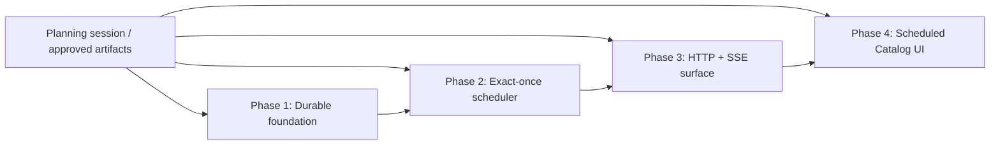

# Recurring Missions: Scheduled Catalog — Phased Implementation Plan

Status: ready to schedule  
Source plan: [`plan.md`](plan.md)  
Approved mockups: [`../../mockups/recurring-missions/index.html`](../../archive/mockups/recurring-missions/index.html)
Scheduling receipt: [`scheduled-tasks.md`](scheduled-tasks.md)  
Investigated baseline: planning checkout `35807b9`; implementation target `origin/main`
`a4b9fce` as observed on 2026-07-23

## Approved requirements carried forward

- V1 provides **durable local catch-up**. If Mission Control runs again, each crossed
  schedule instant is accounted for exactly once, but the UI never promises that work ran
  while the laptop was asleep or powered off.
- The scheduler creates an ordinary backlog task and stops there. Foreman remains the only
  autonomous dispatch path and retains its existing capacity, dependency, allowlist, and
  pane-safety gates.
- Recurring Missions is its own subsystem, not a `TASK_SOURCE_KIND`.
- Schedule revisions and occurrence history are durable and immutable enough to explain
  which template and policy produced every run.
- The operator gets the complete Scheduled Catalog: catalog/detail, create/edit,
  daemon-calculated preview and standby simulation, pause/resume, Run now, archive, and
  paginated history.
- OS-assisted wake and an always-on runner remain separate follow-up projects.

## Repository investigation and resolved discrepancies

### Implement against the post-planning default branch

The planning checkout is detached at `35807b9`, while `origin/main` is already at
`a4b9fce`. The default branch added durable task dependencies, the per-task autopilot
`enabled` gate, workflow/persona managers, additional overlays, vendor-neutral task homes,
and a larger `buildApp` constructor after this checkout was cut.

Every implementation phase must start from the default branch after the planning pull
request merges. In particular:

- preserve `Task.dependencies`, `Task.enabled`, `homeName`, and `terminalResourceId`;
- extend the current `Task` row mapping and upsert statement rather than copying the older
  task shape from this planning checkout;
- append `recurringMissions` to the then-current overlay registry instead of replacing its
  newer Files and Workflow entries;
- add any route dependency after the current Persona and Workflow manager arguments; and
- run current-main tests before treating a failure as introduced by the schedule work.

The phase documents name contracts and responsibilities as authoritative. Line numbers and
the exact surrounding code are discoveries to repeat after rebasing.

### Manual runs need durable trigger identity

The source plan originally described `trigger_kind` as conditional, while Run now was an
acceptance criterion in the same release. The source plan has been corrected: the
occurrence schema includes non-null `trigger_kind` from Phase 1. Allowed persisted values
start with `scheduled` and `manual` and are append-only.

### V1 standby correctness does not require Electron IPC

The daemon's persisted cursor plus its bounded self-rescheduling timer is sufficient for
correct catch-up: when Node resumes, the overdue timeout fires and enumerates crossed
instants. V1 therefore adds no Electron `powerMonitor` bridge. This avoids an unnecessary
second wake signal and the four-file Electron capability surface. A future notification
may reduce latency only; it may never replace the SQLite cursor or claim ledger.

### Schedule provenance is not task-source provenance

`Task.source` remains reserved for an external `TaskSourceRef`. Phase 1 adds nullable
`scheduleId`, `scheduleOccurrenceId`, and `scheduledFor` fields to `Task` and
`TaskSummary`. They survive binding to a session. Phase 4 treats the resulting mark as a
session-visible signal and covers Cards, Console detail, Board tile, and Console/Board
rail parity as well as the Board and Sitrep backlog surfaces.

### Registry notifications must not occur inside rollback-capable transactions

`TaskManager.create` currently persists through `Registry.upsertTask`, which writes and
then emits. The schedule claim transaction therefore cannot call it. Phase 1 owns atomic
claim/cursor primitives; Phase 2 calls `TaskManager` only after the claim commits and uses
a preallocated task id for crash recovery. No schedule or task event is emitted until the
corresponding durable write has succeeded.

### The running Mission Control task graph is newer than this checkout

The current default branch contains `create_task`, durable dependency edges, and
`dependsOnCurrentSession`. These implementation tasks use that runtime contract. All four
tasks depend directly on the planning session so no implementation starts before these
artifacts merge.

## Phase graph



The planning-session edge is present on every scheduled Mission Control task. Phase edges
below list only implementation-phase prerequisites.

| Phase | Name | Outcome | Direct phase prerequisites | Primary merge surface |
|---|---|---|---|---|
| 1 | [Durable schedule foundation](phase-1-durable-schedule-foundation.md) | Shared schedule model, recurrence seam, SQLite ledger, task provenance | none | shared types, package lock, DB |
| 2 | [Exact-once scheduler and catch-up](phase-2-exact-once-scheduler.md) | Inert-until-configured daemon manager, policy engine, recovery-safe task creation | Phase 1 | schedule manager, TaskManager, daemon lifecycle |
| 3 | [HTTP and live-state surface](phase-3-http-and-live-state.md) | Validated CRUD/preview/history routes plus SSE catalog state | Phase 2 | protocol, routes, Registry, EventSource, API client |
| 4 | [Scheduled Catalog UI and operational proof](phase-4-scheduled-catalog-ui.md) | Full Mission Control UI, provenance parity, Chrome DevTools and standby proof | Phase 3 | React components, App wiring, styles, UI tests/docs |

## Concurrency and merge order

The implementation is intentionally serial. Each phase consumes a contract owned by its
predecessor, and forcing parallel work would either duplicate schemas or create merge-order
assumptions in high-conflict files.

1. Merge Phase 1.
2. Rebase Phase 2 onto the merged Phase 1 and merge it.
3. Rebase Phase 3 onto the merged Phase 2 and merge it.
4. Rebase Phase 4 onto the merged Phase 3 and merge it.

Concurrency groups:

- Group A: Phase 1 only.
- Group B: Phase 2 only, after Group A.
- Group C: Phase 3 only, after Group B.
- Group D: Phase 4 only, after Group C.

No two implementation tasks are advertised as concurrently executable. That is a design
property, not an omission: Phase 2 consumes Phase 1's claim API, Phase 3 consumes Phase 2's
manager/service interface, and Phase 4 consumes Phase 3's wire contract.

## Cross-phase contracts

### Persisted identities and enums

- Scheduled occurrence identity is `(schedule_id, scheduled_for)` with both columns
  non-null.
- `trigger_kind` is non-null and its persisted value set is append-only.
- `decision_kind` is non-null and records the immutable post-claim action so recovery never
  recalculates policy from a newer revision.
- Schedule execution, missed-run, overlap, occurrence-status, and trigger-kind arrays are
  append-only.
- `executionMode` may parse future values, but V1 create/update schemas accept only
  `local-catchup`; `runnerId` remains null in V1.
- Task provenance fields are all-null for manual/external-source tasks and all-populated for
  a generated schedule task.

### Scheduling ownership

- SQLite in the daemon is the only schedule writer.
- Foreman receives no schedule DB access, prompt changes, or schedule-specific route.
- The recurrence library calculates instants only. The persisted cursor and daemon timer
  decide when evaluation happens.
- Preview and the scheduler call the same recurrence and policy functions.
- All schedule-created tasks use `backlog: true`; no scheduler code calls dispatch,
  assign, terminal, or pane APIs.

### Crash consistency

- Claim plus cursor advance is one SQLite transaction.
- Task creation happens only after that transaction commits.
- A preallocated task id makes `TaskManager.create` idempotent for recovery-safe internal
  producers without changing manual task id generation.
- Registry and SSE events follow successful writes and are never emitted from inside a
  rollback-capable transaction.

### Live-state ownership

- Catalog state is a top-level `schedules` collection in the existing SSE snapshot and
  `MissionState`.
- Occurrence history is fetched on demand and never polled.
- Reconnect replaces the schedule map from the snapshot, just as it does sessions,
  reviews, and tasks.
- The archived schedule is returned with its occurrence-history response, so a task
  provenance link can still open history after archive.

### UI and parity

- Recurring Missions is registered in `OVERLAY_IDS`; App uses the existing overlay host
  instead of a hand-maintained stand-down list.
- No keyboard shortcut ships in V1.
- The schedule editor is configuration, not a compose surface: no `DraftKind`, attachment
  state, reset nonce, or send chord.
- Scheduled provenance uses shared leaf rendering where session task metadata is shown and
  supplies an equivalent mark in Cards, Console detail, Board tile, and RailRow.
- Board backlog and Sitrep backlog both expose the schedule origin and open the same
  Scheduled Catalog selection.

## Final verification strategy

Each phase runs its own targeted tests plus typecheck. The final phase additionally runs:

```text
npm run typecheck
npm test
npm run build
npm run smoke
```

The final browser pass uses Chrome DevTools against the development dashboard to verify:

- catalog open/close and overlay shortcut stand-down;
- create, preview, save paused, enable, edit, Run now, pause/resume, archive, and history;
- live SSE updates without a catalog poll loop;
- field-level failures and disconnected/reconnected state;
- task and session provenance links in every required layout; and
- responsive layout without console errors.

Standby behavior has two proof levels:

1. deterministic fake-clock tests cross restarts, forward/backward jumps, DST transitions,
   coalescing, caps, and recovery windows;
2. a documented local dogfood run creates a paused schedule, enables it, restarts the
   daemon, performs a real laptop sleep/wake, and records the delayed occurrence in
   history.

The real sleep/wake observation is a rollout receipt, not a reason to make an
implementation pull request wait indefinitely for a human to close a laptop.

## Requirement ownership audit

| Source-plan requirement | Owning phase |
|---|---|
| Shared schedule types and append-only enums | Phase 1 |
| Exact recurrence/DST behavior and minimum interval | Phase 1 |
| Schedule, revision, occurrence tables and indexes | Phase 1 |
| Task schedule provenance and migration | Phase 1 |
| Atomic claim/cursor and history storage primitives | Phase 1 |
| Missed/overlap policy, exact-once recovery, Run now | Phase 2 |
| Self-rescheduling daemon lifecycle and outcome logging | Phase 2 |
| Validated create/update/preview/enable/archive/history routes | Phase 3 |
| Registry snapshot/events and browser EventSource state | Phase 3 |
| Complete Scheduled Catalog and task deep links | Phase 4 |
| Layout/backlog provenance parity | Phase 4 |
| Chrome DevTools verification and standby dogfood runbook | Phase 4 |
| OS wake adapter and always-on runner | Explicitly out of scope |

Every required V1 behavior has one owning phase. Later phases consume earlier contracts
without redefining them.

## Final cross-phase audit

- 2026-07-23: Rebased the design mentally against `origin/main` rather than the detached
  planning checkout; recorded task dependency, task home, workflow, overlay, and `buildApp`
  differences as entry criteria.
- 2026-07-23: Moved durable identities, enums, recurrence, claim transactions, and task
  provenance into Phase 1 so no later phase has to revise persistence.
- 2026-07-23: Phase 2's recovery audit exposed that `status = claimed` alone cannot recover
  a pending policy skip after an edit. Added non-null `decision_kind` plus optional
  blocking/coverage references to the source and Phase 1 schema.
- 2026-07-23: Kept scheduler policy and crash recovery together in Phase 2; splitting them
  would knowingly ship a duplicate-producing manager.
- 2026-07-23: Kept route schemas, Registry/SSE, and the web API client in Phase 3 so the
  wire contract is complete before UI work begins.
- 2026-07-23: Assigned all catalog screens, overlay wiring, provenance parity, docs, and
  browser validation to Phase 4, with automated standby correctness already established
  below it.
- 2026-07-23: Confirmed the four-phase graph is serial for real contract dependencies, not
  numbering convenience, and that every task will also carry the direct planning-session
  dependency required by the phased-plan workflow.
- 2026-07-23: The approved mockups referenced
  `docs/archive/mockups/feature-lab/theme.css`, which is absent from implementation baseline
  `a4b9fce` and outside this artifact-only handoff. Embedded the required base theme into
  `scheduled-catalog.css` and removed that missing dependency without changing a screen or
  copying the unrelated feature-lab mockups.
