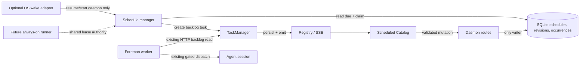

# Recurring Missions: Scheduled Catalog

Status: approved for phased implementation  
Owner: Mission Control  
Date: 2026-07-23  
Mockups: [`../../mockups/recurring-missions/index.html`](../../mockups/recurring-missions/index.html)

## Approved decisions

Approved by the operator on 2026-07-23:

- **V1 execution guarantee:** durable local catch-up. Every due instant is accounted for
  exactly once after Mission Control resumes, with actual delay visible in the catalog.
  OS-assisted wake and always-on runners remain explicit follow-up projects.
- **Implementation follow-up:** create a merge-aware phased implementation plan and
  schedule dependency-linked Mission Control tasks for every phase.

## Outcome

Add a first-class **Scheduled Catalog** where an operator can create, preview, enable,
pause, run, revise, and audit recurring missions.

Each due occurrence creates an ordinary Mission Control backlog task. It does **not**
dispatch directly, provision a worktree, or type into a pane. If Foreman later takes the
task, the existing live-mode, allowlist, dependency, agent-capacity, and pane-safety gates
remain the only autonomous path to execution.

The catalog must also be honest about laptop availability:

- The base product durably catches up after the daemon resumes, but does not claim it ran
  while the laptop was asleep.
- An optional OS integration may request a wake on platforms that support it, with an
  explicit capability check and catch-up fallback.
- A wall-clock guarantee requires an always-on execution host; a powered-off laptop cannot
  provide one.

## Why this is a separate subsystem

Recurring missions resemble task sources because both can put work in the backlog, but they
are not the same contract.

`src/shared/task-source.ts` defines a task source as a reader of an **external system**. Its
append-only `TASK_SOURCE_KINDS`, source configuration, sweep status, external identity, and
`task_source_seen` ledger all exist to answer “has this external item already been filed?”
A recurring mission is internal durable state whose identity is `(schedule_id,
scheduled_for)`. Adding `"schedule"` to `TASK_SOURCE_KINDS` would:

- make the browser and server registries lie about an external implementation;
- place recurring missions in Settings → Task sources instead of an operational catalog;
- overload `TaskSourceRef.externalId` with an internal clock instant; and
- lose the revision, catch-up, overlap, and occurrence lifecycle that schedules need.

Recurring Missions therefore gets its own shared types, SQLite tables, daemon manager,
routes, SSE events, and UI surface. Generated tasks keep `Task.source = null`; scheduled
provenance is carried in dedicated task fields.

## Product contract

### A schedule is a durable template

A schedule stores:

- a human name;
- a required task title and full task intent;
- canonical repository root;
- task kind, agent, priority, labels, model override, and effort override;
- a validated five-field cron expression;
- an IANA time-zone identifier;
- enabled/paused state;
- overlap policy;
- missed-run policy;
- execution mode;
- current revision and next due instant; and
- created/updated/archive timestamps.

The title is required. A recurring run must not launch an LLM titling call every time it
files the same work.

Edits create a new immutable template revision. Existing occurrences and tasks retain the
revision that produced them. A rename does not rewrite history.

### An occurrence is the durable unit of exactly-once work

The unique identity is:

```text
(schedule_id, scheduled_for)
```

Both columns are non-null. The unique index contains no nullable column, preserving SQLite
`ON CONFLICT` semantics.

An occurrence records one of these terminal outcomes:

- `created`: a backlog task was created;
- `coalesced`: a missed instant was represented by a later catch-up task;
- `skipped_overlap`: prior generated work was still active;
- `skipped_policy`: missed-run policy said not to create work;
- `failed`: validation or task creation failed; or
- `cancelled`: the schedule was archived before a claimed occurrence completed.

`claimed` is the only non-terminal occurrence state. It exists to recover a daemon crash
between reserving an occurrence and creating its task.

### Generated work is ordinary backlog work

The task is created through `TaskManager`, with:

```ts
scheduleId: string | null;
scheduleOccurrenceId: string | null;
scheduledFor: number | null;
```

All three are `null` for existing and manually created tasks. Persist them as new nullable
columns on `tasks`, and add matching `addColumn` calls in `migrate()`; changing only the
`CREATE TABLE IF NOT EXISTS` block would not upgrade an existing database.

The catalog uses these fields to show “Scheduled by Dependency audit · Jul 27, 8:00 AM”
and to deep-link from a generated task to run history. `TaskSourceRef` remains unchanged.

## UX

The feature is an operational overlay, not a settings category.

Add a **Missions** button to the topbar beside Dispatch and Sitrep. The button shows an
attention badge when any enabled schedule is failing or overdue. It opens a wide overlay
registered as `OVERLAY_IDS.recurringMissions`; the overlay owns Escape and global shortcuts
stand down automatically through the existing host.

The mockup contains four complete screens:

1. [Catalog and detail](../../mockups/recurring-missions/catalog.html)
2. [Create/edit flow](../../mockups/recurring-missions/editor.html)
3. [Occurrence preview and availability](../../mockups/recurring-missions/preview.html)
4. [Run history and exact-once audit](../../mockups/recurring-missions/history.html)

### Catalog

The left side is searchable and filterable by Healthy, Paused, and Attention. Each row
shows:

- schedule name, repo, and agent;
- human cadence and time zone;
- execution mode;
- next due instant;
- last outcome; and
- derived health.

The selected detail shows the template summary, exact next occurrence, overlap and missed
run policy, execution guarantee, recent totals, Run now, Preview, Edit, Pause/Resume, and
History.

Health is derived, not hand-set:

- **healthy**: enabled, a valid next run exists, and the most recent terminal occurrence
  succeeded or was an intentional policy skip;
- **paused**: disabled by the operator;
- **attention**: enabled with an invalid/missing repo, a failed occurrence, a stale
  `claimed` occurrence, or `nextRunAt` overdue beyond the scheduler grace window.

### Create/edit

The editor separates five decisions:

1. task template;
2. cadence and time zone;
3. laptop availability;
4. overlap and missed-run guardrails; and
5. preview plus enable.

The browser offers readable presets and an Advanced cron mode. Both resolve to the same
validated five-field expression before saving. It does not accept seconds; one minute is
the smallest wall-clock unit and one hour is the minimum allowed interval between
successive computed runs. The minimum prevents a mistaken expression from filing 1,440
agent tasks per day.

The editor is configuration, not a compose surface: it does not add a `DraftKind`, an
attachment box, or a send chord. Local component state survives step changes while the
overlay remains mounted. Saving persists a revision.

Two buttons make consent explicit:

- **Save paused** stores configuration without starting the clock.
- **Save & enable** stores and enables only after the preview route succeeds.

### Preview

Preview submits an unsaved schedule definition and returns the next 10–50 instants from
the daemon’s recurrence evaluator. The browser never implements its own date math.

For each instant it displays local time, UTC time, DST offset, overlap with another
scheduled mission, and whether the selected availability policy could be late.

The same endpoint supports a non-mutating standby simulation:

```text
sleepStartedAt + resumedAt -> missed instants -> policy outcomes
```

This makes “catch up after an eight-day trip” reviewable before enablement.

### History

History is paginated and fetched on demand, never polled. It lists scheduled time, claimed
time, delay, outcome, revision, generated task, and result. Selecting an occurrence shows
the internal audit:

- daemon resumed;
- occurrence claimed;
- task created or policy skip recorded;
- SSE update emitted; and
- Foreman dispatch, if it later happened.

History stays after a schedule is archived. Archive removes it from the default catalog
but never deletes generated tasks or occurrence rows.

## Scheduling and standby modes

### Mode A: local durable catch-up — recommended v1

This is the default and the only mode required to ship the first version.

The daemon persists `next_run_at`, so process or Electron restarts lose no due instant.
When the system sleeps, JavaScript timers pause. On resume or daemon startup, the scheduler
enumerates due instants from persisted state and applies the selected missed-run policy.

Guarantee:

```text
If Mission Control later runs again, every due instant is accounted for exactly once.
```

Non-guarantee:

```text
The task may be created late; no work runs while the machine is suspended or powered off.
```

The catalog displays the actual delay. This option requires no elevated privileges and
works in browser development and packaged Electron builds.

### Mode B: OS-assisted wake — optional follow-up

This is an adapter layer, not a change to occurrence semantics. The SQLite clock remains
authoritative and catch-up remains the fallback.

On macOS:

- `launchd` `StartCalendarInterval` can run a missed calendar job after wake, but does not
  provide a general wall-clock wake guarantee.
- `pmset repeat wake ...` can request scheduled wakes, but Apple documents it as a
  `sudo` operation and the machine’s hardware, power, lid, battery, login, and FileVault
  state still matter.
- Electron `powerSaveBlocker` can prevent a currently awake machine from sleeping; it
  cannot wake a suspended or powered-off machine. Holding it for hours before a mission
  would be hostile to battery life and is not the default design.

On Windows, Task Scheduler can request wake-to-run, subject to wake timers, firmware,
power policy, and task permissions. On Linux, a system-level `systemd.timer` can combine
`Persistent=true` with `WakeSystem=true` when hardware and privileges allow it.

Because Mission Control currently targets an Electron shell on macOS, the first adapter
would be macOS-only and must be exposed through the four-file Electron capability contract:

1. `ipcMain.handle` in `src/main/index.ts`;
2. `contextBridge` in `src/preload/index.ts`;
3. the mirrored interface in `src/web/mission-desktop.d.ts`; and
4. a guarded browser call through `window.missionDesktop?`.

The adapter reports capabilities before enablement:

```ts
interface WakeCapability {
  supported: boolean;
  installed: boolean;
  requiresElevation: boolean;
  reason: string | null;
}
```

It never silently promotes local catch-up to “guaranteed.” Failure to install or fire a
wake request leaves the occurrence eligible for ordinary catch-up.

Official behavior references:

- [Apple: Scheduling Timed Jobs](https://developer.apple.com/library/archive/documentation/MacOSX/Conceptual/BPSystemStartup/Chapters/ScheduledJobs.html)
- [Apple: schedule a Mac to wake with pmset](https://support.apple.com/guide/mac-help/schedule-your-mac-to-turn-on-or-off-mchl40376151/mac)
- [Electron: powerSaveBlocker](https://www.electronjs.org/docs/latest/api/power-save-blocker)
- [Microsoft: Task Scheduler automatic maintenance and wake](https://learn.microsoft.com/en-us/windows/win32/taskschd/task-maintenence)
- [systemd.timer WakeSystem and Persistent](https://man7.org/linux/man-pages/man5/systemd.timer.5.html)

### Mode C: always-on Mission runner — only wall-clock guarantee

If “run at 8:00 AM even when this laptop is off” is a hard requirement, the schedule and
claim must be available to an always-on host. Options include a second operator-managed
Mission daemon, a small trusted home server, or a future hosted Mission Relay.

This is a larger product:

- schedule replication or a single elected scheduler;
- runner identity, enrollment, and revocation;
- encrypted credentials and repository availability on the remote host;
- leases with fencing tokens so two hosts cannot create the same occurrence;
- result and task synchronization back to the laptop; and
- explicit cost and trust controls.

Do not approximate this by having two independent local SQLite databases evaluate the same
cron. Without a shared claim authority they can both create the same task.

The v1 schema includes `execution_mode` and nullable `runner_id` so this can be added
without rewriting schedule history, but the only enabled v1 value is `local-catchup`.

### Recommended scope

Ship Mode A with the full Scheduled Catalog, exact-once occurrence ledger, visible delay,
preview simulation, and an adapter-shaped execution mode. Treat Mode B as a platform
enhancement after measuring demand. Treat Mode C as a separate remote-execution project.

## Shared contracts

Create `src/shared/schedules.ts`, with no `node:` imports:

```ts
export const SCHEDULE_EXECUTION_MODES = [
  "local-catchup",
  "os-wake",
  "remote-runner",
] as const;

export const SCHEDULE_OVERLAP_POLICIES = [
  "skip-active",
  "allow",
] as const;

export const SCHEDULE_MISSED_POLICIES = [
  "coalesce-latest",
  "create-all",
  "skip",
] as const;

export interface ScheduleTemplate {
  title: string;
  intent: string;
  repoRoot: string;
  kind: TaskKind;
  agent: AgentType;
  priority: TaskPriority | null;
  labels: string[];
  model: string | null;
  effort: ThinkingLevel | null;
}

export interface MissionSchedule {
  id: string;
  name: string;
  enabled: boolean;
  archivedAt: number | null;
  expression: string;
  timezone: string;
  overlapPolicy: ScheduleOverlapPolicy;
  missedPolicy: ScheduleMissedPolicy;
  executionMode: ScheduleExecutionMode;
  runnerId: string | null;
  revision: number;
  template: ScheduleTemplate;
  nextRunAt: number | null;
  lastOccurrence: ScheduleOccurrenceSummary | null;
  health: "healthy" | "paused" | "attention";
  createdAt: number;
  updatedAt: number;
}
```

Persisted enum arrays are append-only. Older values must stay parseable.

Mutating payload schemas live in `src/shared/protocol.ts` and are used through
`parseBody`. The preview payload reuses the same schedule definition schema as create and
update so UI preview cannot accept a value the save route later refuses.

## SQLite design

Add three new tables to `openDb()`’s existing SQL template. Do not place backticks inside
that SQL block.

### `mission_schedules`

```sql
CREATE TABLE IF NOT EXISTS mission_schedules (
  id TEXT PRIMARY KEY,
  name TEXT NOT NULL,
  enabled INTEGER NOT NULL DEFAULT 0,
  archived_at INTEGER,
  expression TEXT NOT NULL,
  timezone TEXT NOT NULL,
  overlap_policy TEXT NOT NULL,
  missed_policy TEXT NOT NULL,
  execution_mode TEXT NOT NULL,
  runner_id TEXT,
  revision INTEGER NOT NULL,
  next_run_at INTEGER,
  created_at INTEGER NOT NULL,
  updated_at INTEGER NOT NULL
);
```

The template is not duplicated on this row. `revision` points to the active immutable
revision.

### `mission_schedule_revisions`

```sql
CREATE TABLE IF NOT EXISTS mission_schedule_revisions (
  schedule_id TEXT NOT NULL,
  revision INTEGER NOT NULL,
  template_json TEXT NOT NULL,
  expression TEXT NOT NULL,
  timezone TEXT NOT NULL,
  overlap_policy TEXT NOT NULL,
  missed_policy TEXT NOT NULL,
  execution_mode TEXT NOT NULL,
  runner_id TEXT,
  created_at INTEGER NOT NULL,
  PRIMARY KEY (schedule_id, revision)
);
```

Cadence and policy travel with the revision because they explain why a historical
occurrence existed and what decision it made.

### `mission_schedule_occurrences`

```sql
CREATE TABLE IF NOT EXISTS mission_schedule_occurrences (
  id TEXT PRIMARY KEY,
  schedule_id TEXT NOT NULL,
  schedule_revision INTEGER NOT NULL,
  scheduled_for INTEGER NOT NULL,
  trigger_kind TEXT NOT NULL,
  decision_kind TEXT NOT NULL,
  claimed_at INTEGER NOT NULL,
  finished_at INTEGER,
  status TEXT NOT NULL,
  task_id TEXT,
  covered_by_id TEXT,
  blocking_task_id TEXT,
  delay_ms INTEGER NOT NULL DEFAULT 0,
  error TEXT,
  created_at INTEGER NOT NULL,
  UNIQUE (schedule_id, scheduled_for)
);
```

Indexes:

- `(schedule_id, scheduled_for DESC)` for history;
- `(status, claimed_at)` for crash recovery; and
- `(task_id)` for task-to-occurrence lookup.

New tables need no `addColumn` migration. The three new columns on `tasks` do.

`decision_kind` is the immutable intent reserved with the claim (`create_task`,
`coalesced`, `skipped_overlap`, or `skipped_policy`). It lets startup finish a claimed row
after a crash without recomputing policy from a schedule that may since have been edited.
`blocking_task_id` explains an overlap skip; `covered_by_id` explains a coalesced instant.

## Recurrence evaluator

Create `src/server/schedules/recurrence.ts` as the only cron/time-zone seam.

Use a locked, timezone-aware parser such as `cron-parser` for calculation, not for
scheduling callbacks. The database clock and self-rescheduling daemon loop decide when to
evaluate; the library only answers:

```ts
validate(expression, timezone): Result
nextAfter(expression, timezone, instant): number
between(expression, timezone, afterExclusive, throughInclusive, limit): number[]
```

Rules:

- five cron fields only;
- validate the IANA zone using `Intl.DateTimeFormat`;
- reject an expression whose first two computed occurrences are less than one hour apart;
- DST spring-forward gaps follow the parser’s documented skip behavior;
- DST fall-back overlaps create one occurrence, not two;
- persist UTC epoch milliseconds, render in the configured time zone; and
- preview and scheduler call the same functions.

Pin DST behavior with fixtures around both US transitions and a non-US zone. A dependency
upgrade must not change those expectations silently.

## Daemon lifecycle

Create `src/server/schedules/manager.ts` and start it in `src/server/index.ts` beside the
task-source sweeper. Return a stop closure and call it during shutdown.

The loop follows repository convention:

- one self-rescheduling `setTimeout`, never `setInterval`;
- one tick at a time;
- `unref()` the timer;
- catch errors inside the tick;
- sleep until the earlier of the next due instant or a bounded one-minute health check;
- run immediately at daemon startup; and
- let the first resumed timer tick perform catch-up after system standby.

V1 does not add Electron resume IPC. The persisted cursor plus the daemon's bounded
one-minute health tick is the complete correctness path: after the process resumes, the
overdue timer fires and enumerates every crossed instant. A future resume notification may
reduce catch-up latency, but if added it must follow the four-file Electron capability
contract and remain an optimization rather than a second source of scheduling truth.

The daemon stays the only SQLite writer. Foreman never reads schedule tables. It sees only
the normal backlog tasks generated by the daemon.

### Claim and recovery algorithm

For each due schedule:

1. Read the active revision and enumerate due instants from persisted `next_run_at`
   through `now`.
2. Apply missed policy and overlap policy as pure decisions.
3. For each due instant, run a DB transaction that:
   - inserts the occurrence with `status = claimed`, its immutable `decision_kind`, a
     preallocated `task_id` when work is intended, and
     `ON CONFLICT(schedule_id, scheduled_for) DO NOTHING`;
   - advances `mission_schedules.next_run_at`; and
   - returns whether this process won the claim.
4. If the outcome should create work, call `TaskManager.create` with that preallocated
   task id, required title, `backlog: true`, and schedule provenance.
5. Mark the occurrence `created`, or mark the selected skip/coalesce/failure outcome.
6. Emit schedule and task updates only after their durable writes succeed.

`TaskManager.create` gains an internal optional `id` used only by recovery-safe producers.
It first returns an existing task with that id instead of emitting a duplicate. Manual
dispatch continues to mint its own UUID.

If the daemon crashes:

- after claim but before task creation, startup finds `claimed` with no task and creates
  the preallocated task;
- after task creation but before occurrence completion, startup finds the task by id and
  marks the occurrence `created`; and
- after completion, the unique occurrence key makes the next tick a no-op.

Do not emit a task into the in-memory registry from inside a DB transaction that can still
roll back. Recovery is explicit because SSE and the Registry cannot be rolled back.

### Missed-run semantics

`coalesce-latest` is the default:

- enumerate every missed instant;
- mark earlier instants `coalesced` and point `covered_by_id` at the latest;
- create one task for the latest instant; and
- show the missed count and total delay in history.

`create-all` creates one backlog task per missed instant, capped at 50 per resume. If more
than 50 are due, create the newest 50, record older ones as `coalesced`, and show the cap
in history. This prevents an old laptop from creating an unbounded backlog.

`skip` records each missed instant as `skipped_policy`.

An occurrence that became due while the daemon was awake is not “missed” merely because
Foreman leaves its generated task in the backlog. Scheduling and dispatch are separate.

### Overlap semantics

`skip-active` checks for a non-terminal task with the same `scheduleId`:

```text
backlog | dispatching | running
```

If found, record `skipped_overlap` and name the blocking task. `done`, `cancelled`, and
`failed` are terminal and do not block.

`allow` creates the next task regardless. The default is `skip-active`.

### Run now

Run now uses the same claim and create path, but its identity is a server-minted manual
instant and it does not advance the cron cursor. It works while paused. History labels it
`manual` through the occurrence table's non-null `trigger_kind` column (`scheduled` or
`manual`).

## HTTP and SSE

Routes:

```text
GET  /api/schedules
POST /api/schedules/preview
POST /api/schedules
POST /api/schedules/:id/update
POST /api/schedules/:id/set-enabled
POST /api/schedules/:id/run-now
POST /api/schedules/:id/archive
GET  /api/schedules/:id/occurrences?before=&limit=
```

Every mutating route has a zod schema in `src/shared/protocol.ts` and uses `parseBody`.
Even bodyless-looking actions accept a schema such as `{}` or `{ enabled: boolean }`;
handlers do not hand-parse JSON.

Create/update resolves `repoRoot` through the same `resolveRepoRoot` used by dispatch.
The scheduler rechecks the repository immediately before task creation because it can be
renamed or removed after configuration. Failure records an occurrence; it does not create
a doomed task.

Add to `ServerEvent`:

```ts
| { type: "schedule_upsert"; schedule: MissionSchedule }
| { type: "schedule_remove"; id: string }
```

Add `schedules` to the `snapshot` event, `Registry.snapshot()`, and `MissionState`; load
active schedules into Registry at startup. Extend `src/web/useEventStream.ts` with both
cases. Occurrence history is fetched when opened, but catalog state is SSE-only and never
polls.

Archiving emits `schedule_remove` for the default catalog. A direct history route still
returns the archived schedule.

## UI implementation map

Add:

- `src/web/components/RecurringMissionsPanel.tsx` — overlay and screen routing;
- `src/web/components/schedules/ScheduleCatalog.tsx`;
- `src/web/components/schedules/ScheduleDetail.tsx`;
- `src/web/components/schedules/ScheduleEditor.tsx`;
- `src/web/components/schedules/SchedulePreview.tsx`;
- `src/web/components/schedules/ScheduleHistory.tsx`;
- `src/web/lib/schedules.ts` — derived health/filter/presentation helpers; and
- schedule API calls and payload types in `src/web/lib/api.ts`.

Change:

- `App.tsx` to own open/selected schedule state, render the topbar trigger, and pass live
  schedules from `useEventStream`;
- `Overlay.tsx` to register `recurringMissions`;
- `styles.css` for the surface, using existing panel, chip, button, form, and topbar
  vocabularies; and
- task/backlog presentation to show scheduled provenance.

Do not add a keyboard shortcut in v1. A later shortcut must go through `ActionId`,
`ACTIONS`, App dispatch, KeyboardPanel group, README, and keybinding tests together.

Generated-task provenance is a new task-level signal. Add its chip/mark to every backlog
surface that renders tasks. Session layout parity does not apply until a scheduled task is
bound to a session; after binding, the task link should remain available anywhere current
task metadata is shown.

## Data and request flow



The critical boundary is visible in the middle: the scheduler ends at `TaskManager`.
Foreman remains a separate HTTP-only process and schedules reach it only as ordinary tasks.

## Failure behavior

- Invalid cron/time zone: refuse save with field-level errors.
- Repository invalid on create/update: refuse mutation.
- Repository disappears at fire time: occurrence `failed`, schedule attention.
- Daemon restarts: recover `claimed` occurrences by preallocated task id.
- SSE disconnects: browser reconnect gets schedules in the full snapshot.
- Recurrence parser throws: leave `next_run_at` unchanged, record health error, retry after
  backoff; never silently skip the due instant.
- System clock jumps forward: treat crossed instants as missed and apply policy.
- System clock jumps backward: persisted `(schedule_id, scheduled_for)` identity prevents
  duplicate creation.
- Edit races a due tick: the claim transaction reads a specific revision; that occurrence
  uses it, and later instants use the new revision.
- Archive races a claim: claimed work completes or is marked cancelled; no new claim starts
  after `archived_at` is set.
- OS wake setup fails: retain local catch-up and show capability reason.
- Remote runner disconnected: do not fall back to a second independent scheduler without a
  lease; mark attention and follow the configured fallback policy.

## Testing

### Pure schedule tests

- cron validation and minimum interval;
- next-run calculation in UTC and named time zones;
- spring-forward skipped time and fall-back single occurrence;
- daily, weekly, monthly, and advanced expressions;
- missed-policy decisions;
- overlap decisions across every task status;
- health derivation; and
- preview output equals scheduler enumeration.

### Database tests

- schedule and revision round-trip;
- revision increments atomically;
- `(schedule_id, scheduled_for)` refuses duplicate claims;
- active-task lookup by `scheduleId`;
- paginated occurrence ordering;
- archive preserves history;
- nullable task provenance migrates existing DBs; and
- unique index columns are non-null.

### Manager tests with a fake clock

- one due instant creates one backlog task;
- repeated tick creates no duplicate;
- startup catches up after sleep;
- coalesce, create-all cap, and skip;
- prior active task causes `skipped_overlap`;
- crash after claim recovers the preallocated task;
- crash after task creation completes the occurrence;
- edit-versus-tick revision binding;
- repo disappears between save and fire;
- forward/backward wall-clock jumps; and
- stop closure prevents another tick.

### HTTP and protocol tests

- every mutation rejects malformed bodies through `parseBody`;
- preview is non-mutating;
- create/update canonicalize repo roots;
- pause/resume recomputes next run from the correct anchor;
- run-now works paused and does not move the cron cursor;
- archive is idempotent; and
- history pagination refuses invalid cursors/limits.

### SSE and UI tests

- snapshot includes schedules;
- event switch is exhaustive for schedule variants;
- schedule upsert/remove changes `MissionState`;
- overlay registry includes Recurring Missions;
- topbar attention badge derives from schedule health;
- catalog filters and selection;
- editor save-paused versus save-enabled;
- execution guarantee wording never calls local catch-up “on time”;
- DST/standby preview states;
- history links to generated task; and
- scheduled provenance appears on every backlog rendering surface.

### Electron wake adapter tests, if Mode B is selected

- all four Electron capability files move together;
- unsupported browser build takes the explicit unavailable path;
- capability detection reports privilege/power limitations;
- install/update/remove are idempotent;
- next wake updates when the earliest enabled schedule changes;
- wake failure falls back to durable catch-up; and
- no `powerSaveBlocker` is held outside a narrowly bounded active run.

## Rollout

1. Land shared types, tables, task provenance columns, and recurrence fixtures behind no UI.
2. Land the manager disabled by absence of schedules; prove exact-once recovery.
3. Add routes, snapshot/events, and API client.
4. Add catalog, editor, preview, history, and task provenance.
5. Add metrics/logging for due, delayed, coalesced, skipped, failed, and recovered
   occurrences.
6. Dogfood with schedules created paused, preview them, then enable a weekly low-priority
   scout mission.
7. Observe at least one real daemon restart and one real laptop sleep/wake before calling
   local catch-up stable.
8. Evaluate OS-assisted wake only after those receipts make the remaining lateness visible.

## Acceptance criteria

- An operator can create, preview, save paused, enable, edit, pause, resume, run now,
  archive, and inspect a recurring mission.
- Every generated task enters the ordinary backlog with schedule provenance.
- No schedule path directly dispatches, provisions, or types into a pane.
- The same schedule/instant cannot create two tasks across concurrent ticks or restarts.
- A daemon restart between claim and task creation recovers without duplication.
- A sleeping laptop produces an explicit delayed catch-up outcome after resume.
- The UI never promises on-time execution for a local catch-up schedule.
- DST behavior is previewed and pinned by tests.
- Existing schedules and tasks survive edits and archive with their original revision.
- Catalog state updates only through the existing SSE connection.
- Foreman remains DB-free and receives no schedule-specific code.

## Out of scope for the first release

- Cloud-hosted scheduling or remote repository credentials.
- Multiple local daemons sharing one schedule database.
- Natural-language cadence parsing; presets and validated cron are deterministic.
- Sub-minute or high-frequency jobs.
- Direct dispatch from a schedule.
- Automatic retry of a failed generated task; retries remain task behavior.
- Editing already-created tasks when a schedule revision changes.
- Deleting occurrence history.
- Treating `powerSaveBlocker` as a wake mechanism.
