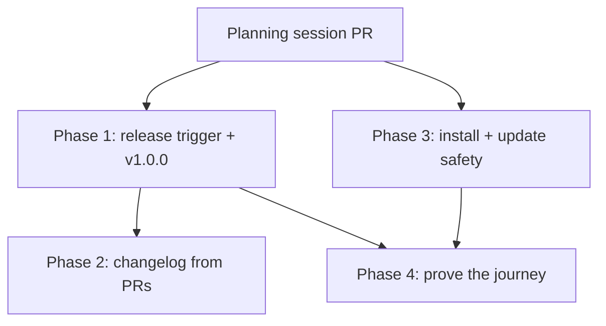

# Phased plan - Release pipeline and auto-updates

Source plan: [`plan.md`](plan.md) (rendered: [`plan.html`](plan.html)).

## What this implements

The approved plan found that Mission Control's auto-updater is built, well designed, and covered by
roughly sixty unit tests - and has never once been able to fire, because no GitHub Release has ever
existed. The `Release` workflow fails on every push to `main` with
`GitHub Actions is not permitted to create or approve pull requests`, so there are 0 releases, 0
tags, no `CHANGELOG.md`, and 245 commits waiting.

These phases unblock that, make the resulting changelog worth reading, close the install and
update-safety gaps found alongside it, and then prove the whole journey against a real release.

## Incorporated decisions

Resolved by the human in the dashboard plan review on 2026-08-21.

| | Decision | Chosen | Owned by |
| --- | --- | --- | --- |
| **D1** | How to unblock the release trigger | PAT or GitHub App token for Release Please | Phase 1 |
| **D2** | What the changelog is generated from | Pull request titles and labels | Phase 2 |
| **D3** | Whether Releases carry a downloadable dmg | No - source-build updater only | Declined; not implemented |
| **D4** | The first release number | v1.0.0 | Phase 1 |

## Findings that change the approved plan

Four things the repository disproved or complicated. Each is recorded here rather than silently
absorbed.

1. **A PAT-pushed tag triggers workflows; a `GITHUB_TOKEN`-pushed tag does not.** `ci.yml` already
   has `push: tags: ['v*']` and the `package` job gate `startsWith(github.ref, 'refs/tags/')`. So
   D1 makes the `package` job start firing on every release tag. Two comments assert the opposite
   and become wrong the moment Phase 1 lands: `.github/workflows/release.yml:24-27` and
   `docs/desktop-and-packaging.md:162-164`. Phase 1 owns correcting both.

2. **Labels are entirely unused.** 0 of the last 100 merged pull requests carry any label, and the
   repository has only GitHub's nine stock labels. D2's "titles" half works retroactively; its
   "labels" half has no data, needs a vocabulary invented, and only pays off going forward. Phase 2
   is scoped accordingly and must degrade gracefully for unlabelled work.

3. **Removing conventional commits removes the version-bump driver.** Release Please derives
   `major`/`minor`/`patch` from `feat:` / `fix:` / `!`. D2 removes that source and the approved plan
   did not say what replaces it. This is decision **C1**, flagged below.

4. **The source plan's G10 was wrong, and G8 was understated.** `e2e/specs/update-banner.spec.ts`
   does exist - the real gap is that every layer is tested against a fixture and none against
   reality. And `apply-update.mjs` deletes `previous-app.bundle` on *every* exit path, not only on
   success. Both corrected in `plan.md`.

## Open decision C1 - carried into Phase 2

**Not resolved. Do not guess it.** One of its outcomes revisits approved decision D1, so it is
surfaced here rather than decided.

Once pull request titles and labels are the changelog source, what owns the version, tag, and
Release?

- **C1-a. Keep Release Please, add `.github/release.yml`** for the Release body. Smaller diff, but
  leaves two changelogs of differing quality - a second source of truth - and still needs a bump
  driver, which means either conventional titles after all (contradicting D2) or a per-pull-request
  release label.
- **C1-b. Replace Release Please with a `workflow_dispatch` release.** A human picks the bump; the
  workflow bumps, generates notes from pull request titles and label categories, tags, and
  publishes. One changelog, one source of truth, an actual answer to "what decides the version",
  and it is the "click a button in GitHub and it does the rest" the original request described. But
  with no release pull request, D1's premise weakens - the PAT would then be needed only so the tag
  triggers CI.

**Recommendation: C1-b.** Phase 1 is deliberately robust to either outcome: its token stays useful
for tag-triggered CI, and its version-equality assertion is unchanged either way. Phase 2 is the
only phase affected.

## Sizing

Estimated **300-450 gross non-test implementation lines**, excluding tests, across all four phases.

| Phase | Estimate | Basis |
| --- | --- | --- |
| 1 | 25-40 | Two workflow lines, one config key, one regex, one `if:` gate, ~15 lines of doc prose |
| 2 | 80-150 | New `.github/release.yml`, workflow rework (much larger under C1-b), docs, runbook |
| 3 | 200-260 | CLT predicate ~25, timeout + retention ~50, gh classification + snapshot threading ~60, README ~40, plus renderer work if G9 changes the banner |
| 4 | Unknown | Verification-led; the diff is whatever the first real run breaks |

Assumptions: C1-a lands at the low end of Phase 2 and C1-b at the high end; Phase 3's G9 estimate
assumes the recommended seam 1 (reuse `phase: "error"`) rather than an eighth phase, which would
add renderer and e2e work.

### Why four phases rather than one

The total is above the 200-line one-phase threshold, so the default is still a single phase and
each split needs its own justification.

- **Phase 1 separate from everything.** It is the blocker, it is tiny, and it must land immediately
  and alone. Bundling anything with it delays the unblock and confounds its success signal - "did a
  release get cut" must not be entangled with "did the changelog rework work". It is also the only
  phase whose completion depends on a human merging a second, generated pull request.
- **Phase 2 after Phase 1.** Both edit `.github/workflows/release.yml`, so they cannot run
  concurrently. The ordering is also substantive: Phase 2 redesigns what a release cycle produces
  and should be designed against one that has actually run. Combining them would put an unresolved
  design decision (C1) inside the phase that has to ship today.
- **Phase 3 parallel to both.** Entirely disjoint file sets - `src/main/updater.ts`,
  `scripts/apply-update.mjs`, `scripts/install-app.mjs`, `scripts/init-prerequisites.mjs`,
  `README.md` against `.github/` and release config. It is also the largest phase; merging it into
  Phase 1 would bury a one-line blocker fix inside a 250-line application change and make the
  urgent part wait on the unhurried part.
- **Phase 4 last.** Gated on an event no agent controls - a human merging the release pull request
  Phase 1 produces. It cannot be an exit criterion of an earlier phase for that reason, and it is
  the only thing that tests the real seam rather than a fixture.

No preparation, test-only, or documentation-only phases were created. Documentation and tests sit
in the phase that introduces the behavior they describe.

## Phases

| # | Phase | File | Depends on | Concurrency |
| --- | --- | --- | --- | --- |
| 1 | Unblock the release trigger and cut v1.0.0 | [`phase-1-cut-the-first-release.md`](phase-1-cut-the-first-release.md) | - | Group A |
| 2 | Generate the changelog from pull requests | [`phase-2-changelog-from-pull-requests.md`](phase-2-changelog-from-pull-requests.md) | 1 | - |
| 3 | Close the install and update-safety gaps | [`phase-3-install-and-update-safety.md`](phase-3-install-and-update-safety.md) | - | Group A |
| 4 | Prove the journey against a real release | [`phase-4-prove-the-journey.md`](phase-4-prove-the-journey.md) | 1, 3 | - |

### Dependency graph

**Concurrency group A: Phases 1 and 3** may run at the same time. They share no files and neither
consumes the other's output.

**Merge order:** Phase 1 and Phase 3 in either order; Phase 2 after Phase 1; Phase 4 after both 1
and 3, and additionally after a human has merged the release pull request and `v1.0.0` exists.

Every phase task also depends on this planning session, whose pull request publishes the documents
each task points at.

## Cross-phase contracts

- **`.github/workflows/release.yml`** is owned by Phase 1, then Phase 2. Phase 2 must preserve the
  token wiring and the `scripts/assert-release-version.mjs` equality assertion regardless of what
  it does to the changelog.
- **`src/shared/update.ts`** is expected to be touched only by Phase 3. Phase 1 fixes G7 in
  `scripts/assert-release-version.mjs` specifically to keep this true. If Phase 1's
  reverse-divergence cleanup needs it, the two phases coordinate and whichever merges second
  rebases. **This is the single most likely conflict in the graph.**
- **The tag/version equality** - tag, `package.json`, and both `package-lock.json` version fields -
  is invariant across every phase.
- **The release query shape** `--exclude-drafts --exclude-pre-releases` is invariant. Filtering
  after selection cannot recover.
- **The install receipt schema** is append-only. No phase changes it.

## Final verification

The plan is delivered when:

1. `gh release list --repo mancej-cyc/ai-harness --exclude-drafts --exclude-pre-releases` returns a
   release - the exact query the installer and updater use.
2. A release's notes describe the work that shipped rather than the fraction carrying a
   conventional prefix.
3. A missing toolchain fails at install time with a clear message; a hung update is bounded; a
   lapsed credential is visible.
4. Someone has installed from a real release, been offered a real update, applied it, and seen the
   app return at the new version - **and** has seen a deliberately failed update leave the previous
   app working.
5. `docs/runbooks/release-verification.md` records the procedure.

Gap coverage: G1/G7 → Phase 1; G2/G3 → Phase 2; G5/G6/G8/G9 → Phase 3; G10 → Phase 4; G4 → declined
by D3 and explicitly not implemented.
