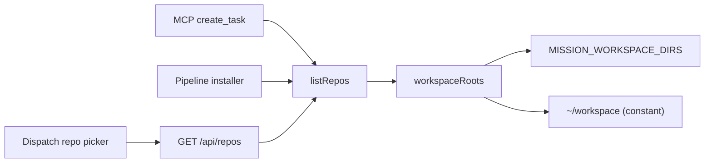
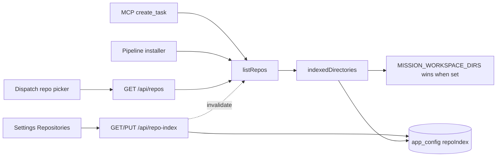

# Indexed directories for repository detection

Let an operator say, from Settings, which directories the daemon scans for git checkouts.
Ship it seeded with `~/workspace`, `~/code`, `~/dev` and `~/upstart`, and let any of those
four be removed.

## Decisions taken

Submitted in the dashboard plan review, and applied below:

| Question | Answer |
| --- | --- |
| Panel shape | **A - directory rows.** Per-row status, per-row Remove, room for the copy that explains a seeded default reporting `not found`. |
| Removal model | **Remove only, plus Restore defaults.** No per-directory enable toggle; one mechanism, and undo is Add directory or Restore defaults. |
| Environment precedence | **`MISSION_WORKSPACE_DIRS` wins, panel read-only while it is set.** |
| After this plan | **Create the phased implementation plan.** |

## The problem

Repository detection scans exactly one directory. `workspaceRoots()` in
`src/server/repos.ts` returns `[~/workspace]` unless `MISSION_WORKSPACE_DIRS` is set, and
that setting is read from the daemon's environment at call time, which means:

- It is invisible from the dashboard. Nothing in Settings mentions it, and the only
  documentation is one row of `docs/configuration.md`.
- It is a colon-separated PATH-style string an operator has to know the shape of, exported
  before the daemon starts, in whatever launched it. For the packaged macOS app there is no
  obvious place to put it at all.
- A checkout that is not under `~/workspace` is invisible to every surface that offers a
  repository, and each of them fails differently and quietly:
  - the dispatch repo picker (`GET /api/repos`) simply does not list it, so the only route
    left is knowing the exact path;
  - MCP `create_task` resolves a bare repo NAME against the same index
    (`task-repository-preparation.ts`), so an agent filing a task for `~/code/foo` files it
    against nothing;
  - the Conductor pipeline installer offers candidates from the same list
    (`pipelineInstallerCandidates`), so a repo outside the root cannot be adopted from the
    UI.

`~/code`, `~/dev` and `~/upstart` are common enough second homes that they are worth
shipping as defaults rather than making every operator discover the setting first. They are
also merely defaults: an operator who keeps nothing in `~/dev` should be able to delete that
row and stop paying for a walk that finds nothing.

## What ships

A new **Repositories** category in Settings, in the *Sessions* group, badged
*This machine*. It holds one list: the directories indexed for repository detection.

- The list arrives seeded with `~/workspace`, `~/code`, `~/dev`, `~/upstart`.
- **Remove** deletes a row, including a seeded one. Removing all four is allowed and means
  "index nothing"; the panel says so in place of an empty list.
- **Add directory** takes a typed path, accepts a leading `~`, and is validated by the
  daemon before it lands.
- **Restore defaults** re-adds any of the four that are missing, without touching the
  directories the operator added.
- Each row states what the daemon actually found there: `12 repositories`, `not found`,
  `not a directory`, or `unreadable`. A default pointing at a directory that does not exist
  is the normal case for three of the four on most machines, and a row that says so is the
  difference between a seeded list and a list that looks broken.
- **Rescan now** drops the discovery cache, so a checkout cloned a moment ago appears
  without waiting out the TTL.

Nothing about depth or skipped directory names is exposed. `MISSION_REPOS_MAX_DEPTH` and the
`SKIP` set stay where they are; this plan is about which directories are walked, not how.

### Why the defaults work without a migration

The stored value is a schema blob over `app_config`, exactly like Shipping's and the
Inspector's next door, and the default lives on the schema:

```ts
export const DEFAULT_INDEXED_DIRECTORIES = ["~/workspace", "~/code", "~/dev", "~/upstart"];

export const RepoIndexConfigSchema = z.object({
  directories: z
    .array(z.object({ path: z.string().min(1) }))
    .default(DEFAULT_INDEXED_DIRECTORIES.map((path) => ({ path }))),
});
```

Zod applies a `.default()` only when the field is `undefined`, so:

- a database that has never stored the key reads back the four defaults, on a fresh install
  and on an upgrade alike, with no seeding migration to run and nothing to re-run if it
  half-ran;
- a stored `{ "directories": [] }` reads back as empty and stays empty, so a removal is
  durable and the defaults do not grow back.

That single property is the whole "seeded but removable" behavior. There is deliberately no
`seeded: true` bookkeeping flag, because the stored list already distinguishes the two cases
that matter.

### Where the environment override stands

`MISSION_WORKSPACE_DIRS` keeps winning. When it is set, the daemon indexes exactly what it
names and the panel renders the configured list read-only, above a sentence naming the
variable and its value. Three callers depend on that precedence and none of them can be
asked to write config first:

- `e2e/fixtures/daemon.ts` points discovery at the fixture workspace by environment, for
  every spec;
- Demo mode does the same (`docs/plans/demo-mode/plan.md`);
- `test/pipeline-http.test.ts` and `test/mcp-create-task.test.ts` set it above their imports.

A read-only panel is also the honest rendering: an editable control whose value the daemon
ignores is worse than no control.

## Design

### Contract

New browser-safe module `src/shared/repo-index.ts`:

- `DEFAULT_INDEXED_DIRECTORIES` - the four paths, in rail order.
- `IndexedDirectorySchema` - `{ path: string }`, non-empty, trimmed.
- `RepoIndexConfigSchema` - `{ directories: IndexedDirectory[] }` with the default above.
- `RepoIndexConfigPatchSchema` - the partial the `PUT` accepts.
- `IndexedDirectoryView` - one row as the panel reads it: `path`, `resolved` (after `~`
  expansion and `realpath`), `status` (`"ok" | "missing" | "not-a-directory" | "unreadable"`),
  and `repoCount`.
- `RepoIndexView` - `{ directories: IndexedDirectoryView[], managedBy: "config" | "environment",
  environmentVariable: string | null, defaultsMissing: string[] }`.

It is `src/shared/` and therefore carries no `node:` import: `~` expansion and `stat` live on
the server, and this module only describes the shape.

Registry wiring, both append-only:

- `APP_CONFIG_ENTRIES` gains
  `repoIndex: fieldsEntry("repoIndex", RepoIndexConfigSchema, "repo-index", { directories: "setting" })`.
- `SETTINGS_BACKUP_DOMAINS` gains `{ id: "repo-index", surface: "settings" }`, appended last.
  The list's own rule is append, never rename or reorder, and the backup service enumerates
  `APP_CONFIG_ENTRIES` rather than a second inclusion list, so snapshot coverage follows from
  the entry.

### Server

New `src/server/repo-index.ts`, on the `src/server/shipping/config.ts` pattern:

- `getRepoIndexConfig()` / `setRepoIndexConfig(patch)` - schema-validated read and merge-write
  over `app_config`.
- `expandHome(path)` - the one place `~` becomes `homedir()`.
- `indexedDirectories(): string[]` - the environment override when set, otherwise the
  configured paths expanded and deduplicated. This is what `workspaceRoots()` becomes.
- `repoIndexView()` - the configured list joined to a `stat`/`realpath` probe per directory
  and the repo count from the current scan, for the panel.
- Write validation, refused with a message the panel prints:
  - empty or whitespace path;
  - a path that is not absolute after expansion;
  - `/` and the home directory itself, because a depth-3 walk from either is a scan of the
    whole machine dressed up as a preference;
  - a duplicate of a directory already listed, compared after expansion and `realpath` so
    `~/workspace` and `/Users/me/workspace` cannot both be added;
  - more than sixteen directories.

`src/server/repos.ts` changes in three places and keeps everything else:

- `workspaceRoots()` delegates to `indexedDirectories()`. Its doc comment stops naming
  `~/workspace` as the default and names the setting.
- `invalidateReposCache()` is exported, and `setRepoIndexConfig` calls it, so an added
  directory shows up in the picker on the next open rather than up to 30 seconds later.
- `scanRepos([])` already returns `[]`, so "index nothing" needs no special case.

Routes, beside the other config routes in `routes.ts`:

- `GET /api/repo-index` returns `RepoIndexView`.
- `PUT /api/repo-index` parses `RepoIndexConfigPatchSchema`, writes, returns the new view.
- `POST /api/repo-index/rescan` invalidates the cache and returns the fresh view.

### Web

- `src/web/useRepoIndex.ts` - a 4s polling hook with the `useShipping` write guard, so a row
  removed by a click is not restored by a poll that was already in flight.
- `src/web/components/RepositoriesPanel.tsx` - the panel. Rows carry
  `data-anchor="repositories/directories"`, the add field `repositories/add`, the rescan
  button `repositories/rescan`.
- `src/web/lib/settings-registry.ts` - a `repositories` category in the `sessions` group,
  scope `machine`, placed after `worktrees`, with keywords `repository`, `index`, `scan`,
  `directory`, `workspace`, `discovery`, `picker`, `folder`.
- `src/web/lib/settings-search.ts` - three control entries pointing at those anchors, backed
  by `backupDomains("repo-index")`.
- `src/web/components/SettingsPage.tsx` - one `case "repositories"` and the hook call.

Removal is a click with no confirm step, and undo is the Add field or Restore defaults. A
removed row is a directory that stops being walked; nothing is deleted from disk, and the
adjacent destructive controls (worktree Destroy) confirm because they delete files.

### The flow that changes

Before, the indexed directories come from the process environment or a constant:



After, they come from `app_config`, with the environment override kept ahead of it and the
panel as a second reader of the same config:



## Mock-ups

**A - Directory rows** (`mockups/a-directory-rows.html`) is the adopted design, and it is what
the Web section above describes. One row per directory with its status chip, repo count, and a
Remove button; an Add field, Restore defaults and Rescan now beneath. Four screens, switchable
in the mock-up itself: as shipped, after edits with a refused path, under an environment
override, and emptied.

`b-status-matrix.html` and `c-path-list.html` are the two explorations it was chosen over, kept
for the record rather than as live options. B is denser and reuses `settings-matrix`, but has
nowhere to explain what `not found` means on a directory the app seeded itself. C is one path
per line in a textarea, cheapest to build, and gives up per-row status, per-row removal, and a
refusal that can point at the offending line.

All three open from `mockups/index.html`.

## Tests

- `test/repos.test.ts`, extended: configured directories are scanned, the environment
  override wins over config, `~` is expanded, duplicates after `realpath` collapse, an empty
  list scans nothing, and an absent config key yields the four defaults.
- `test/repo-index-http.test.ts`, new: `GET` shape including `status` and `repoCount`, each
  validation refusal, removal durability across a re-read, Restore defaults adding only the
  missing ones, and a scan that sees a repo created after the first read once the write has
  invalidated the cache.
- `test/settings-search.test.ts` and `test/settings-sidebar-render.test.ts` walk the
  registries, so the new category and its three anchors are covered by the existing integrity
  assertions; `test/settings-backup-coverage.test.ts` covers the new domain.
- `e2e/specs/settings-repository-index.spec.ts`, new: open Settings and select
  Repositories, assert the four seeded rows, remove one and assert it is gone after a
  reload, add the fixture workspace and assert the dispatch picker then offers the fixture
  repo.

  This spec needs the daemon fixture NOT to set `MISSION_WORKSPACE_DIRS`, since the override
  would make the panel read-only. `e2e/fixtures/daemon.ts` gains an opt-in flag that omits the
  variable; because the fixture already points `HOME` at its throwaway home and seeds its repo
  into `<home>/workspace`, the shipped default `~/workspace` then resolves to exactly the
  fixture workspace, so no config-row seeding is needed. Every existing spec keeps the
  environment path unchanged. No agent is launched, so no model tokens are spent.

## Documentation

- `docs/configuration.md` - the `MISSION_WORKSPACE_DIRS` row becomes an override of
  Settings > Repositories rather than the only way to change the default.
- `docs/dispatch-and-backlog.md` - the repo picker paragraph names the setting instead of
  `~/workspace`.
- `docs/settings.md` (or the settings section of the docs index, whichever holds the category
  list) gains the Repositories category.

## Out of scope

- Scan depth and the skipped-directory set. Both stay environment-only.
- Per-directory include and exclude patterns.
- Watching directories for change. Rescan now plus the existing TTL is the whole freshness
  story.
- Anything about which repositories are TRUSTED. Indexing a directory offers its checkouts
  in a picker; it grants nothing. The Foreman, Workflows, Inspector and Shipping allowlists
  are unchanged and remain the only grants, which is why this category sits in *Sessions*
  rather than beside Trust.
