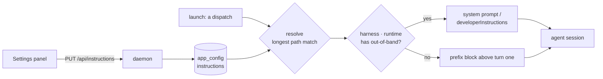

# Repository standing instructions

One box per repository, in the operator's own words, that every session Mission Control
opens into that repository is told before it starts work.

> "Never run E2E tests locally. They only run in CI."
>
> "Always prove a bug with a failing test before implementing the fix."

Today an operator who wants either of those has two bad options: retype it into every
session by hand, or commit it into the repository's `AGENTS.md` where it becomes a rule for
the whole team on every machine. This plan adds the third: a **machine-local,
per-repository standing instruction** that Mission Control composes into every session it
opens there.

---

## The problem, precisely

Mission Control already carries several kinds of standing prose, and none of them is this
one.

| Existing | Scope | Lives in | Reaches |
|---|---|---|---|
| `AGENTS.md` / `CLAUDE.md` | one repository | the repository, committed | every session, every machine, every teammate |
| [`.agents/memory`](../../repository-memory.md) | one repository | the repository, committed | same, via the root doc's reference line |
| [Foreman instructions](../../foreman.md) | the whole machine | `app_config`, local | Foreman's own review prompts, never a session |
| Ask-channel redirect | every dispatch | shipped constant | Claude terminal sessions, via `--append-system-prompt` |
| **This plan** | **one repository** | **`app_config`, local** | **every session MC opens into that repo** |

The gap is the intersection nothing covers: **repo-specific and operator-local**. That is
exactly where the user's two examples sit.

- *"Never run E2E tests locally"* is a fact about **this machine**. `npm run test:e2e` needs
  a Playwright browser `npm install` does not fetch, and the suite is sharded across two CI
  runners. It is wrong to commit, because a teammate whose machine is set up for it may well
  want to run it.
- *"Prove a bug with a test first"* is a working preference the operator holds, which they
  may not have team consensus to impose in `AGENTS.md`, and which they want applied from
  today rather than after a pull request lands.

Committing either into the repository to get it applied is a **social cost paid for a
mechanical want**. That is the whole justification for this feature. If an instruction
belongs to the repository rather than to the operator, `AGENTS.md` remains the right answer
and this plan does not replace it - the panel's own copy says so.

### It is also the only channel that reaches Claude, Codex and Pi alike

`AGENTS.md` reaches Claude and Codex natively and does not reach Pi at all, which is why
dispatch already prepends a repository-memory pointer to Pi's opening prompt
(`src/server/dispatcher.ts:507`, `src/server/memory.ts:46`). Text the daemon composes is
harness-agnostic by construction.

---

## What the operator gets

1. A **Standing instructions** panel in Settings listing every repository in the workspace.
2. Per repository: one markdown box, an `override` / `inherited` chip, and a **reach** block
   saying in plain words which sessions this will and will not touch.
3. One **machine-wide default** above the list, applying to every repository with no block
   of its own - the "one default plus repository exceptions" shape the Command Library and
   the Worktrees panel already use.
4. Visible markers, so nobody debugs an instruction they cannot see: the dispatch form says
   how much standing instruction will be sent, and the session detail carries a chip that
   reveals the exact composed text **that session received** - recorded at launch, so editing
   the rule later never rewrites what a running session is shown to have been told.

Nothing is on by default. A repository with an empty box dispatches a byte-identical prompt
to today, and that is a test rather than an aspiration.

---

## Where it lives

### Mockup 1 - the Settings rail gains one category

`src/web/lib/settings-registry.ts` is pure data, and its own doc comment says adding a
category is "appending an entry here plus a `case` in `renderCategory`, never lengthening a
scroll." This one joins the **Sessions** group with scope `machine` ("Changes what the
daemon does locally") beside Harnesses, Worktrees and Skills - because that is precisely
what it does. It never writes `~/` (so not `home`, as Skills and Cost are) and never acts on
GitHub.

```
┌─ Settings ─────────────────────────────────────────────────────────────────────┐
│                                                                                │
│  THIS SCREEN            │  Standing instructions          [ This machine ]      │
│   ▦  Display            │  ────────────────────────────────────────────────     │
│   ⌨  Keyboard           │  Text Mission Control sends to every session it       │
│   +  Dispatch           │  opens, before the session's own request. Stored      │
│                         │  here, never committed to a repository.               │
│  SESSIONS               │                                                       │
│   ⚙  Harnesses          │  ┌ Every repository ──────────────────── inherited ┐  │
│   ⑂  Worktrees          │  │                                                 │  │
│   ✦  Skills             │  │  (empty - nothing is sent by default)           │  │
│   ✎  Standing instr. ◀──│  │                                                 │  │
│   $  Cost               │  │                                    0 / 8,000    │  │
│                         │  └─────────────────────────────────────────────────┘  │
│  BACKGROUND WORK        │                                                       │
│   ●  Foreman            │  Repositories                          2 configured   │
│   ⌘  Workflows          │  ┌─────────────────────────────────────────────────┐  │
│   ⇊  Task sources       │  │ ▾ ai-harness            ~/workspace/ai-harness   │  │
│   ⇶  Conductor          │  │                            [override] [ 2 rules ]│  │
│   ◈  Models             │  ├─────────────────────────────────────────────────┤  │
│                         │  │ ▸ storefront            ~/workspace/storefront   │  │
│  LEAVES THE MACHINE     │  │                                      [inherited] │  │
│   ⌕  GitHub Inspector   │  ├─────────────────────────────────────────────────┤  │
│   ⚑  Shipping           │  │ ▸ mono/packages/api     ~/workspace/mono/pack... │  │
│   ⛨  Trust              │  │                            [override] [ 1 rule ] │  │
│                         │  └─────────────────────────────────────────────────┘  │
└─────────────────────────┴───────────────────────────────────────────────────────┘
```

### Mockup 2 - one repository, expanded

The card is the shape `WorktreeSettingsPanel`'s repository rows already draw: a disclosure
header carrying the repo name and its root, an `override` / `inherited` chip, and a **Use
global default** button disabled until there is an override to remove. `RepositoryName`
renders the leaf with the full path in a tooltip, per that component's stated rule.

```
┌ ▾ ai-harness   ~/workspace/ai-harness                    [override] [ 2 rules ] ┐
│                                                                                 │
│  Sent to every session Mission Control opens into this repository.               │
│                                                                                 │
│  ┌───────────────────────────────────────────────────────────────────────────┐  │
│  │ Never run E2E tests locally - `npm run test:e2e` needs a Playwright        │  │
│  │ browser this machine does not have. Run `npm test` and `npm run           │  │
│  │ typecheck`, and let CI cover the browser layer.                           │  │
│  │                                                                           │  │
│  │ Always prove a bug with a failing test before implementing the fix.       │  │
│  │                                                                    ▓      │  │
│  └───────────────────────────────────────────────────────────────────────────┘  │
│                                                            291 / 8,000  markdown │
│                                                                                 │
│  Reach                                                                          │
│   ✓ claude · terminal    system prompt      --append-system-prompt              │
│   ✓ claude · sdk         system prompt      systemPrompt.append                 │
│   ✓ codex  · sdk         developer instr.   developerInstructions               │
│   ✓ codex  · terminal    prompt text        composed above turn one             │
│   ✓ pi     · terminal    prompt text        composed above turn one             │
│   ✗ sessions started outside Mission Control      not reachable - see below     │
│   ✗ Foreman / Inspector / Persona review prompts  not in scope - see below      │
│   ⏱ sessions already running                     keep what they launched with   │
│                                                                                 │
│  [ Save ]  [ Revert ]                        [ Use global default ]  [ Preview ] │
└─────────────────────────────────────────────────────────────────────────────────┘
```

The **reach** block is the part that is not decoration. Any other way of shipping this
leaves the operator guessing which sessions actually got the text, and a standing
instruction that silently reaches half the fleet is worse than none: it is trusted and
wrong. The panel states the answer where the text is written, and it states it per harness
and runtime because that is the granularity at which the answer differs.

### Mockup 3 - visible at dispatch and on the session

```
┌ Dispatch ──────────────────────────────────────────────────────────┐
│  Repository   ~/workspace/ai-harness                     ▾         │
│  Agent        claude          Runtime  terminal          ▾         │
│  ┌──────────────────────────────────────────────────────────────┐  │
│  │ Fix the flaky pane-capture test                              │  │
│  └──────────────────────────────────────────────────────────────┘  │
│                                                                    │
│  ✎  standing instructions for ai-harness will be sent      [ view ]│
│     291 characters · as a system prompt                            │
│                                                                    │
│                                       [ Cancel ]  [ Dispatch ]     │
└────────────────────────────────────────────────────────────────────┘

┌ ai-harness · fix flaky pane test ──────────────────────────────────┐
│  claude · terminal · auto        ✎ standing instructions           │
└────────────────────────────────────────────────────────────────────┘
```

Both are read-only, and both name the *mechanism* as well as the size - because on Claude the
text never appears in the transcript, so a marker that only said "sent" would leave an
operator searching a conversation for something that was never in it. Neither is editable
there; one editor, in Settings, is the point.

They do **not** read the same thing, and the difference matters. The dispatch note is a
forecast - nothing has happened yet, so it reads live configuration and must follow the
repository picker. The session chip is a record: it reads what that session was given at
launch and is fixed from then on. Point them both at live configuration and the chip starts
lying the first time the operator edits a rule, which is exactly when they are most likely to
be looking at it.

---

## How it reaches a session

### The composition seam already exists

Dispatch composes its final prompt in exactly one function, `withTaskKindContract`
(`src/server/task-contract.ts:133`), reached from exactly two seams - `dispatcher.ts:417`
for a fresh dispatch and `tasks.ts:2970` for a task assigned onto a live session:

```
composedIntent  ──►  withTaskKindContract(task, composedIntent, inputs)  ──►  launch
   │                        │
   │                        ├─ executionAuthorizationContract(...)   server-owned
   │                        └─ KIND_CONTRACT[task.kind](...)         per-kind contract
   │
   ├─ intentWithRepoManifest(task)      multi-repo manifest prefix   (dispatcher.ts:1984)
   └─ withRepoMemoryPointer(root, ...)  the Pi-only memory pointer   (dispatcher.ts:507)
```

`task-contract.ts:127-133` states the ordering rule this plan obeys: **the operator's own
words stay the exact prefix**, server-owned material follows. A repository standing
instruction is server-composed but it *is* the operator's words, so it is composed as a
**prefix block above the intent** - the same position and the same reasoning as the repo
manifest. It is context the agent needs before it reads the request, not a rule about what
"delivered" means afterwards.

### Delivery is per harness *and* per runtime

Mission Control already appends to Claude's system prompt on terminal dispatch - the ask
channel's redirect (`src/server/ask-channel.ts:192`), whose doc comment records that 1260
bytes of arbitrary shell metacharacters arrived byte-identical through `tmux new-session`.
Three of the five live (harness, runtime) pairs have an out-of-band channel, and they are
not the same channel:

| Harness · runtime | Out-of-band channel | Status today |
|---|---|---|
| claude · terminal | `--append-system-prompt` | **in use** - `ask-channel.ts:192` |
| claude · sdk | `systemPrompt: { preset: "claude_code", append }` | available, **unused** - `harness/claude/sdk.ts:1130-1180` |
| codex · sdk | `developerInstructions` on `thread/start` | **in use** - `harness/codex/sdk.ts:1440` merges a configured value already |
| codex · terminal | none - launch prep is `-c` overrides and hooks only | `harness/codex/launch.ts:67-87` |
| pi · terminal | none - Pi has no file or config channel | stated at `dispatcher.ts:490-499` |

So the mechanism is declared by the harness registry the way `PermissionModeSpec.launchArgs`
and `EffortSpec.launchArgs` already are, never branched on an agent name at the call site:

```ts
// src/shared/harness-capabilities.ts
export interface StandingInstructionsSpec {
  /**
   * How this harness carries operator text that is not a conversation turn, per runtime.
   * Null for a runtime with no such channel - the text is composed into turn one instead.
   */
  outOfBand: Partial<Record<SessionRuntime, (text: string) => OutOfBandDelivery>>;
}
```

- **An out-of-band channel exists** - the text never occupies a conversation turn, is never
  summarised away by compaction, and governs every turn of the session rather than only the
  first. This is strictly the better delivery and is preferred wherever it is available.
- **No channel** (codex terminal, pi) - the text is composed into turn one as a fenced
  `## Standing instructions for this repository` block, the exact degradation Pi's memory
  pointer already makes.

Adding the two currently-unused channels (Claude SDK, and joining Codex's existing
`developerInstructions` merge) is part of this work, not a follow-up: without them the
feature would silently degrade to prompt text on two of the five pairs, and the reach block
above would have to admit it.



The diagram is one occasion. **An assignment is the other, and it does not re-enter it.**
`withTaskKindContract` is also reached from `tasks.ts:2970`, injecting into a session that is
already running - where there is no argv to append to and no `thread/start` to carry a value, so
the left half of that flow has nothing to act on. An assignment therefore resolves nothing and
replays the snapshot the launch recorded:

| Occasion | What the session gets |
|---|---|
| Launch | resolve, then out of band if the pair has a channel and a prefix if not |
| Assignment, pair **has** a channel | nothing - the block is still installed on that process |
| Assignment, pair has **none** | the snapshot's text, prefixed again, because a prefix does not govern later turns |
| Assignment, no snapshot | nothing |

Which settles a question the store would otherwise leave open:

> **A session keeps the standing instructions it launched with. An edit takes effect on the next
> session, not a running one.**

A live process's system prompt cannot be rewritten, so the alternative is not "edits reach running
sessions" - it is edits reaching them on two of the five pairs and not the other three, for the same
feature. The panel says which it is.

### Resolution is longest-path-match on the repository root

`workflow_command_overrides` already stores `repo_root` as "a repository root OR a path
beneath one - the monorepo override - and the longest match wins at resolution time"
(`src/server/db.ts:1106-1112`). This follows it exactly: a block set on
`~/workspace/mono/packages/api` beats one set on `~/workspace/mono`, and a repository with
neither falls through to the machine-wide default. Matching is on the path **boundary**,
reusing the rule `src/shared/allowlist.ts` already defines so `/repo-backup` never matches
`/repo`.

Two consequences worth writing down:

- **The key is the repository root, resolved, not the checkout path.** Every key is written
  through `POST /api/repos/resolve` → `resolveRepoPath` (`src/server/repos.ts:151`), which
  walks a linked worktree back to its owning main checkout. That is what keeps a
  `~/.treehouse/...` pool path out of durable config, and it means a session in a pool slot
  resolves the same rules as one in the main checkout. (Worktree policy keys on the *git
  common directory* instead, because it configures pools; this keys on the root, because it
  configures repositories, and it must support subdirectories.)
- **A multi-repo task gets a block per attached repository that has one.** Dispatch already
  hands the agent write access to every attached repo and already emits a manifest naming
  them (`dispatcher.ts:1984-2024`). Standing instructions for a secondary repo are composed
  as labelled blocks under that manifest, in the manifest's order. Sending only the primary
  repo's rules would be the exact laundering that `taskReposAllowlisted` refuses for consent.

---

## What this does not reach, and why the UI says so

**Sessions Mission Control did not launch.** Mission Control discovers agent sessions by TTY
and adopts them; there is no argv to carry a flag and no turn one to compose into. The only
way to reach them would be to type a turn into a live session the operator is working in -
which is what `src/server/injections.ts` exists to *record as non-human*, and which would be
indistinguishable from Foreman typing at them. This plan does not do it, and the panel says
so in a shipped, tested string rather than a placeholder. An explicit operator-initiated
injection was considered at review and deferred; it would sit on this same store.

**The dashboard composer.** `POST /api/sessions/:id/inject` (`routes.ts:3712`) passes text
through untouched, and is the only agent-facing channel with no composition step at all.
Prefixing every message would burn the instruction into the transcript dozens of times, and
where an out-of-band channel exists it already governs every turn.

**Mission Control's own review prompts** - Foreman triage, GitHub Inspector, workflow
Personas - read the [standards bundle](../../inspector-and-shipping.md) and nothing else
(`src/server/standards.ts:109`, consumed at `routes.ts:2882`, `inspector/worker.ts:898`,
`workflows/context.ts:416`). Standing instructions **do not join that bundle**, decided at
review. Joining it is genuinely useful - "never run E2E locally" is a thing an Inspector
should not fail a pull request over - but it is also a widening: the bundle is capped at
64KB per prompt and already drops the memory index first when it overflows, and what it
carries today is *what the repository asserts*, which this deliberately is not. Revisit
with evidence from the session path.

---

## Data model and routes

### Storage

An `app_config` record, following `WorktreesConfig`'s per-repository shape, rather than a
new table:

```ts
// src/shared/protocol.ts
export const STANDING_INSTRUCTIONS_MAX_LENGTH = 8_000;
export const STANDING_INSTRUCTIONS_MAX_REPOSITORIES = 200;

export const StandingInstructionsConfigSchema = z
  .object({
    /** Applies to any repository with no block of its own. Empty means send nothing. */
    default: z.string().max(STANDING_INSTRUCTIONS_MAX_LENGTH).default(""),
    /** Keyed by resolved repository root, or a path beneath one for a monorepo package. */
    repositories: z
      .record(z.string().min(1).max(4_096), z.string().max(STANDING_INSTRUCTIONS_MAX_LENGTH))
      .default({}),
  })
  .strict();
```

`app_config` because it is what Foreman instructions, `WorktreesConfig`, `AwayConfig`,
`SkillsConfig` and every other config blob in this repository use, and because a
schema-validated blob over that KV "needs no migration" - the sentence appears verbatim in
six config modules. A record rather than a `workflow_command_overrides`-shaped table because
the panel edits the default and an override in one gesture, which a single KV write makes
atomic and two tables would not.

**8,000 characters**, an order of magnitude below Foreman's 64,000, and the cap is a design
statement rather than a storage one. This text is prepended to *every* session in the
repository; at 8KB it is already comparable to the repo's own `AGENTS.md`. Anything longer
is a document, and a document belongs in the repository where it can be reviewed.

### Routes

Mirroring `/api/foreman/instructions` (`src/server/routes.ts:2895`) - the closest existing
thing to this feature, and the only prose-configuration surface in the app - including its
compare-and-swap ETag, its `bodyLimit` `413`, and its `409` conflict body, so a second
browser tab cannot silently clobber an edit:

| Method | Path | Body | Answers |
|---|---|---|---|
| `GET` | `/api/instructions` | - | default, every override, one opaque ETag |
| `PUT` | `/api/instructions` | `{ expectedEtag, default?, repositories? }` | `200` view, `409` conflict with `current`, `413` too large |
| `GET` | `/api/instructions/resolved?repoRoot=&agent=&runtime=` | - | the exact composed text and mechanism for one repo, from live config |
| `GET` | `/api/sessions/:id/standing-instructions` | - | what one session actually received at launch, or `404` |

The resolved route exists so the **Preview** button, the dispatch chip and the composed
prompt can never disagree: all three read one pure
`resolveStandingInstructions(config, repoRoot)`, and the browser never reimplements the
longest-match rule. `repositories` is a **patch**, the same convention
`WorktreesConfigPatchSchema` uses: an absent key is untouched, a string sets it, and `null`
removes that repository's block entirely. Saving one repository therefore sends one key, and
never a whole draft map that would commit text the operator had not saved.

**The last row is the one that is easy to leave out.** A session outlives the setting that
launched it, so the session chip cannot ask what the rule *is* - it has to be told what the
rule *was*. The daemon records the delivered text and its mechanism against the session at
launch, once, and never updates it. Without that, editing a rule would silently restate every
running session's history, and removing one would erase it: an operator debugging why an agent
did something would be reading the wrong instruction, or none, with nothing on screen to say
so.

---

## Testing

| Layer | What it pins |
|---|---|
| `test/` node:test | `resolveStandingInstructions`: longest match wins, path-boundary safety (`/repo-backup` vs `/repo`), empty override means "send nothing" while an absent one means "inherit", the character cap |
| `test/` node:test | composition: the block lands above the intent and below nothing; a repo with no rules produces a **byte-identical** prompt to today, on all five harness · runtime pairs |
| `test/` node:test | multi-repo: one labelled block per attached repo that has rules, in manifest order |
| `test/` HTTP | ETag conflict returns `409` carrying the current view; oversize body returns `413`; the resolved route agrees with the composer |
| `renderToStaticMarkup` | `settings-sidebar-render.test.ts` walks the registry - the new category must be reachable, contiguous within its group, and its `data-anchor`s unique |
| **`e2e/` Playwright** | **required.** Settings → Standing instructions: type a rule for a repository, save, reload, read it back. Dispatch into that repository against the fake agent and assert the rule reached it. Dispatch into a repository with no rule and assert it did not. |

The e2e spec selects by role, label and placeholder only - never `data-testid` - and runs
against `e2e/fixtures/fake-agents.ts`, so no model tokens are spent.

---

## Risks and non-goals

- **Not a replacement for `AGENTS.md`.** A rule that belongs to the repository should be
  committed to it, where a teammate on another machine and an agent nobody launched from
  Mission Control both get it. The panel says this in its header copy.
- **Context cost is real.** 8KB prepended to every dispatch is not free. The cap, the
  character counter and the dispatch chip make the cost visible both when it is written and
  when it is spent.
- **Instruction conflict is undetectable.** A standing instruction contradicting the repo's
  own `AGENTS.md` is an operator error this feature cannot catch. Composing it as a *prefix*
  is the deliberate mitigation: the execution authorization and the kind contract stay
  authoritative underneath it, exactly as `task-contract.ts` already documents.
- **Not a per-session override.** No "send this once" and no per-task exemption. If either
  turns out to be wanted it is a follow-up on the same store, not a reason to shape the
  store differently now.
- **Two out-of-band channels get their first use here.** Claude's SDK `systemPrompt.append`
  and Codex's `developerInstructions` merge are both reachable but one is unexercised in
  this codebase. Each needs a test that proves the text arrived, not merely that the option
  was passed.

---

## Decisions taken

Four choices were open at review and are now settled. They are recorded here rather than
left as alternatives, because a phase that re-litigates one of them is a phase doing the
wrong work.

| Decision | Adopted | Rejected, and why |
|---|---|---|
| **Where the editor lives** | A new **Standing instructions** settings category, in the *Sessions* group with a `This machine` scope badge | *Trust* owns the repository list but its badge is "Acts on GitHub" and its shape is a boolean grant matrix, not prose. The *Worktrees* cards already do override/inherited, but filing session behaviour inside checkout policy hides it. |
| **How the text is delivered** | **Out-of-band where the harness and runtime have a channel, prompt text where they do not** - which makes wiring Claude's SDK `systemPrompt.append` and Codex's `developerInstructions` part of this work | Uniform prompt text is simpler and visible in the transcript, but it occupies turn one, can be compacted away, and does not govern later turns. Writing into the checkout's own agent config would reach more sessions by writing repo content, which is the exact thing this feature exists to avoid. |
| **How far it reaches** | **Mission-Control-launched sessions only** - dispatch and assignment | A one-click injection into an adopted session was considered and deferred: it is a second delivery path, and the panel's honest "not reachable" line is the better first answer. Not foreclosed; it would sit on this same store. |
| **MC's own review prompts** | **No - sessions only, for now.** Standing instructions do not join the standards bundle | Foreman, the Inspector and Personas would stop flagging work for obeying an instruction the operator gave, which is real. But the bundle is capped at 64KB per prompt and already drops the memory index first when it overflows, and the bundle's meaning today is "what the repository asserts" - which this deliberately is not. Revisit with evidence from the session path. |

Two of these constrain the phasing directly. The delivery decision means **no phase may
ship a harness the reach block would have to lie about** - the out-of-band channels land
with the feature, not after it. The reach decision means the panel's "not reachable" line
is a shipped, tested string rather than a placeholder.
