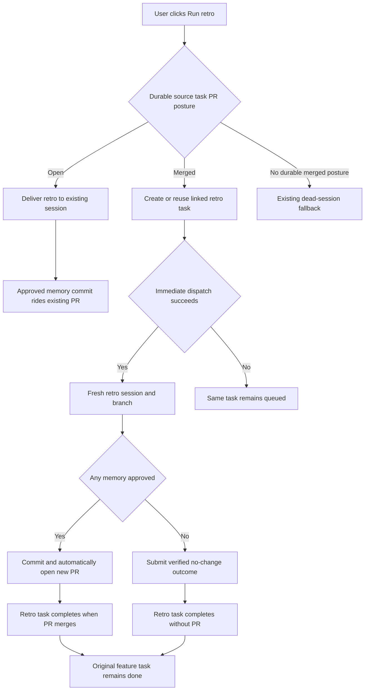

# Post-merge retro follow-up pull requests

## Answer and adopted decisions

`Run retro` does not always create a pull request. It follows the pull request state of the
work it is reviewing:

| State when `Run retro` is clicked | Retro execution | Pull request | Task completion |
| --- | --- | --- | --- |
| The work pull request is still open | Continue in the existing session and branch | Approved memory commits ride the existing pull request | The original task follows its normal merge lifecycle |
| The work pull request is already merged | Create or reuse one linked retro follow-up task and start a fresh session, worktree, and branch | Approved memory commits open a new pull request automatically | The original task remains done; the retro task completes when its own pull request merges |
| A post-merge retro approves no memories | Use the linked retro task, but create no commit or pull request | None | The retro task completes automatically with a no-change outcome |
| The source session is gone and no merged-task posture can be established | Preserve the current backlog fallback | The later dispatched task ships normally if it produces a commit | The fallback task follows its own lifecycle |

The post-merge follow-up is created once per source task work episode. Repeated clicks return
the existing follow-up rather than producing duplicate tasks, sessions, branches, or pull
requests. Mission Control tries to dispatch the follow-up immediately. If capacity or
provisioning prevents that, the same task remains visible in the backlog for retry.

These decisions were approved in the discussion that requested this plan on 2026-08-17.

## Problem

The current live-session path always injects the retro into the session that did the work.
That is correct while its pull request is open. Once that pull request has merged, however,
new memory commits cannot join it. Continuing in the old task also lets new work reopen a task
whose merge already proved completion, and an old merged binding can later be mistaken for
proof that the new retro work shipped.

The existing dead-session fallback creates a backlog task, but it does not distinguish an
ordinary unreachable session from the important post-merge case, does not start immediately,
and has no explicit no-change completion path.

## Goals

1. Keep the existing same-session behavior when the current work pull request is open.
2. Treat a merged work pull request as a durable boundary: the feature task stays complete and
   the retro becomes separately reviewable work.
3. Create the post-merge retro follow-up idempotently and preserve its relationship to the
   exact source task work episode.
4. Start the new task immediately when possible, with a backlog fallback that is honest and
   retryable.
5. Open a new pull request automatically when approved memory changes are committed.
6. Complete a no-change retro without requiring a fake commit or pull request.
7. Make every dashboard entry point tell the user whether the retro was delivered, started, or
   queued.

## Non-goals

- Reopening or changing the completion result of the original task.
- Creating a new Mission Control goal for a retro. The durable unit is a linked ship task.
- Making every retro use a separate pull request.
- Letting the daemon write memory files or perform git operations. The agent remains the git
  author, and the existing human approval ceremony remains mandatory.
- Changing the existing fallback for a dead session unless it can be tied safely to a merged
  task episode.
- Automatically merging a retro pull request.

## Proposed lifecycle

### 1. Resolve pull request posture from durable task history

The retro route first identifies the session's task and its current work episode. It asks the
task layer for a retro-specific pull request posture from the durable work-episode bindings,
rather than relying only on the session's `prUrl` projection. The query checks the current
episode's open pull request first. Only when the current episode has no open pull request may
the newest merged binding from the current or historical episodes establish the post-merge
boundary. This ordering is deliberately different from task completion, where any historical
merge remains durable outcome evidence.

For a multi-repository task, the follow-up receives the same repository set. Each approved
memory is committed in the repository it concerns and produces at most one pull request for
that repository, matching the existing multi-repository shipping rule.

### 2. Preserve the open-pull-request path

If the source task's current pull request is open, `Run retro` keeps using the current action
delivery. The retro skill commits only approved memories on the current branches and pushes
them to the pull requests already in review. It must not create a second pull request.

### 3. Create or reuse a post-merge follow-up

If the durable source episode has a merged primary pull request, the task layer atomically:

1. Looks up a retro follow-up keyed by source task and source episode.
2. Returns it when one already exists.
3. Otherwise creates one named ship task with the source repository set, session and pull
   request context, and the retro and shipping procedures required by its intent.
4. Records the source-to-retro relationship before the task can be dispatched.

The relationship belongs in normalized durable storage, not in task title text or a session
projection. Creation must be safe to repeat across double-clicks, route retries, and daemon
restart recovery.

The daemon then asks the ordinary task dispatcher to launch that backlog task. A successful
launch returns a `started` result. A recoverable launch refusal returns a `queued` result with
the same task and a human-readable reason. The original task is never reassigned and never
receives another prompt.

### 4. Ship approved memory changes

The follow-up intent invokes the retro skill and names the source session, source task,
episode, merged pull request, original branch, and former worktree as evidence pointers. The
retro skill keeps its existing approval gate and commit ownership.

When at least one approved memory is committed, the follow-up session ships the commit through
the normal pull-request procedure. Because this task has its own worktree and branch, that
procedure opens a new pull request automatically. The ordinary merge reconciler completes the
retro task only after every changed repository's pull request has merged.

### 5. Settle a no-change retro explicitly

If the human dismisses the proposal or approves no memory changes, the retro has succeeded but
there is no git change that can prove it. Add a narrow Mission Control MCP outcome operation
for a retro follow-up session. It accepts only the no-change result, verifies that the calling
session owns a task linked as a retro follow-up, and completes that retro task with an explicit
outcome such as `Retro complete: no memory changes approved`.

The operation must not complete the source task, satisfy unrelated dependencies, or offer a
general-purpose task-completion escape hatch. Its tool name must be included in Mission
Control's launch-time MCP allowlist, and its shared and MCP schemas must agree.

### 6. Report the result in the dashboard

Append response arms to `RetroResponse` without renaming the existing `delivered` or
`dispatched` arms:

- `started`: a linked post-merge retro task exists and its session launched.
- `queued`: the linked task exists but remains available in the backlog, with the reason.

All three `Run retro` entry points use one shared outcome formatter so the Action Bar, Complete
dialog, and Workflow Ladder cannot drift. The message must make clear that the original task
is still complete and link or name the new retro task when one was created.

## Changed request and completion flow

## Data and compatibility contracts

- Use the work-episode identity already owned by task bindings. Do not key idempotency only by
  task id, because a re-dispatched task is a new work episode.
- Keep retro posture separate from `primaryRepoPrForTask`: a current open episode must outrank
  historical merged outcome evidence for this decision, while task completion keeps its
  existing merged-first rule.
- Add a normalized retro-follow-up relation with a unique source-task/source-episode key and a
  unique retro-task key. Create it through the daemon-owned task/database layer.
- A fresh database and an upgraded database must both create the relation and its indexes in
  the repository's established migration order.
- Preserve the existing `RetroResponse` arm spellings. New response arms are additive.
- Keep task and session status changes on existing TaskManager and Registry paths so SSE,
  dependency edges, worktree leasing, and merge reconciliation observe the same transitions.
- A second click must never dispatch a second active session for the same follow-up.
- An old source pull request merge is not completion evidence for the retro task. Only pull
  requests bound to the retro task's own episode may settle it.

## Verification

Implementation requires focused coverage at each boundary:

- Database upgrade and idempotent source-episode linkage tests.
- Retro route tests for open, merged, duplicate-click, dispatch-success, dispatch-fallback,
  dead-session, and multi-repository cases.
- Task lifecycle tests proving the source task remains done and the retro task settles only
  from its own pull request or verified no-change outcome.
- MCP vocabulary, schema, authorization, and bundled-server smoke coverage for the no-change
  operation.
- Shared response-formatting and component tests for every response arm.
- A Playwright regression that clicks `Run retro` on a merged task, observes the separate task
  or queued explanation, and proves the original task does not reopen. The fake agents and
  local pull-request hooks remain mandatory, so no model tokens or GitHub network are used.
- Documentation updates in `docs/repository-memory.md` and any task/dispatch behavior guide
  whose current wording says the retro always rides the existing pull request.

The final implementation runs the repository's standard typecheck, lint, unit, build, smoke,
and end-to-end gates.
