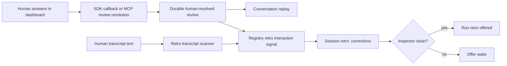

# Count human review interactions toward Retro

## Status and decision

Approved for phased implementation planning on 20 August 2026.

The human asked Mission Control to plan the fix now with the `phased-plan` procedure. There are no
open product choices in this plan. The selected direction is to treat a durable review that the
human resolved as the same retro-worthiness evidence as a human text turn beyond the opening brief.

## Problem

Mission Control offers **Run retro** only when both of these conditions hold:

1. the session has something worth cataloguing, represented by `Session.retro.reasons`; and
2. GitHub Inspector has finished cleanly, except for the weaker Complete-dialog backstop.

The `corrections` reason currently comes only from the transcript scanner. That misses human
answers delivered through Mission Control's review surfaces:

- A Claude SDK `AskUserQuestion` answer is written to the raw transcript as a pure
  `tool_result`. The Claude transcript parser deliberately drops pure tool results.
- A terminal session's `request_input` and `request_plan_decisions` answers are also MCP tool
  results rather than ordinary human text turns.
- Mission Control separately persists these decisions in `reviews` with
  `resolved_by = 'human'`, and the conversation correctly replays them as the human's words.
  Retro worthiness does not currently consume that authoritative record.

The observed failure was the finished session **Add keybinding for To review button**. The human
answered two design questions in the dashboard, Inspector reviewed PR #689 cleanly, and the session
still returned `retro: null`. With no Inspector findings to resolve, the UI had no worthiness reason
and hid the Retro action.

## Goal

Offer Retro after meaningful human steering regardless of which supported conversation channel
carried it:

- ordinary human transcript text;
- a human-resolved SDK question recorded as a review; or
- a human-resolved MCP review such as `request_input` or `request_plan_decisions`.

The result must be immediate while the daemon is running and reconstructible after a daemon restart.

## Requirements

1. A review counts only when `isHumanResolvedReview(review)` is true. This keeps the existing
   conversation-authority rule as the single definition of a human decision.
2. Human `answered`, `approved`, `rejected`, and `dismissed` reviews count. Each is a decision the
   conversation already attributes to the human.
3. Pending, Foreman-resolved, orphaned, refused, or half-written reviews do not count.
4. A successful live human resolution updates the owning session through the Registry's existing
   one-way retro-worthiness signal and emits the normal session update.
5. When a live terminal or SDK session is reconstructed after restart, durable human-resolved
   reviews for that session restore the same signal before its session payload is emitted.
6. Startup restoration must stay bounded to sessions that are actually introduced into the live
   Registry. It must not load every historical review session id into an unbounded process-lifetime
   set.
7. The transcript scanner remains the owner of ordinary typed-text detection. Automated pane or SDK
   deliveries remain excluded through existing attribution.
8. Preserve the wire value `corrections` and the existing `Session.retro` shape. No schema migration,
   new ServerEvent, or alternate UI predicate is needed.
9. The Inspector timing gate remains unchanged. A human interaction makes the session worthy; it
   does not show the card action until the existing clean-review condition is satisfied.
10. Update user-facing copy and documentation so `corrections` is explained as human steering during
    the work, which includes answering a question and is more accurate than only saying the agent
    was corrected.

## Proposed design

### One eligibility signal, two evidence sources

Keep one Registry-owned, one-way session flag for the `corrections` reason. Feed it from:

- the existing transcript poller when it sees a second unattributed human text turn; and
- `ReviewManager` after a review has been durably settled, published, and proven human by
  `isHumanResolvedReview`.

Do not teach the transcript parser to render or interpret raw tool results. The persisted review
already owns the question, selections, actor, and settlement status.

### Restart restoration

Add a focused database predicate that answers whether one session id has at least one
human-resolved review. Consult it only when the Registry first introduces that terminal or SDK
session row. If it returns true, seed the same in-memory flag before deriving `Session.retro`.

This uses durable state without creating a second durable field or retaining all historical session
ids in memory. Session eviction continues to delete the in-memory flag.

### Live settlement ordering

Review settlement keeps its current safety order:

1. deliver the answer where delivery is required;
2. commit the settled review row;
3. publish the review update;
4. mark the live session retro-worthy when the settled review is human-authored.

A failed delivery or failed transaction must never light Retro. Resolving a dangling review whose
session row is already gone should settle the review without retaining a new orphaned in-memory
signal.

## Data flow

Before this change, the `R --> W` connection is missing.

## Compatibility and ownership

- `ReviewManager` remains the sole review lifecycle owner and the point that knows whether a settle
  committed successfully.
- `isHumanResolvedReview` remains the shared human-authorship predicate for durable and live review
  paths.
- `Registry` remains the sole owner of the session projection and its emitted `Session.retro` field.
- SQLite remains daemon-only. The change adds a read helper, not a table or migration.
- `retroOffer` remains the one browser predicate. It consumes the corrected session projection and
  does not inspect reviews directly.
- `RetroReason` stays append-compatible by retaining `corrections`.

## Tests and evidence

The implementation must add focused proof for:

- a human-resolved ordinary review updating `Session.retro` live;
- a human-answered SDK question updating `Session.retro` live;
- Foreman, pending, orphaned, refused, and failed answers not updating it;
- a fresh Registry restoring worthiness for a reintroduced session from a durable human review;
- session eviction removing the in-memory signal;
- the browser receiving the session update and showing **Run retro** after an SDK question answer
  and a clean Inspector result, without requiring a composer text correction;
- the existing clean-review timing gate and the typed-transcript path remaining intact.

The browser proof belongs in `e2e/specs/retro-offer.spec.ts`, using the existing fake Claude
`AskUserQuestion` turn so no model tokens or external GitHub calls are used.

## Documentation

Update `docs/repository-memory.md` and the retro-offer evidence note in `e2e/README.md` to state that
human steering can arrive as transcript text or a human-resolved review. Update tooltip assertions
if the visible explanation changes from “corrected” to “steered.”

## Non-goals

- Automatically running a retro.
- Making every clean session retro-worthy.
- Counting permission prompts or automated Foreman decisions as human steering.
- Parsing raw tool-result protocol records as conversation text.
- Adding a new persisted retro table or column.
- Changing post-merge retro routing, skill gates, or Inspector semantics.

## Risks and mitigations

| Risk | Mitigation |
|---|---|
| Foreman answers are misattributed to the human | Reuse `isHumanResolvedReview`; do not infer from status alone. |
| A failed answer lights Retro | Mark only after delivery and durable review settlement succeed. |
| Restart restoration grows an unbounded cache | Query per newly introduced live session, then clear on normal session removal. |
| Review and transcript paths create competing UI rules | Both feed one Registry signal; the browser continues to read only `Session.retro`. |
| The widened meaning makes the tooltip inaccurate | Describe the reason as human steering while retaining the compatible wire id. |

## Completion criteria

The fix is complete when a session like **Add keybinding for To review button** gains
`retro.reasons = ["corrections"]` after the human answers its dashboard question, keeps that reason
across a daemon restart, and shows **Run retro** once the existing Inspector gate is clean, while all
non-human and unsuccessful review paths remain ineligible.
