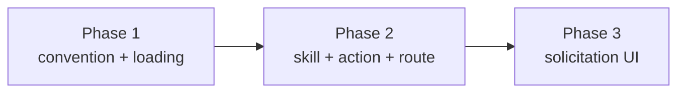

# Retro and repository memory: phased implementation

Implementation index for [plan.md](plan.md) (rendered: [plan.html](plan.html)).

## Source plan and incorporated decisions

The source plan is `docs/plans/retro-repo-memory/plan.md`, already updated with every
human decision; the alternatives it retains are recorded as rejected. The decisions this
decomposition treats as requirements:

- **Memory store: B, index plus topic files** under `.agents/memory/` in the target
  repository (`MEMORY.md` index, one front-mattered file per memory).
- **Retro runner: R1**, a built-in SessionAction plus a `retro` skill executed by the
  session itself, **with R3 as the fallback** (a dispatched retro task) when the session
  has exited.
- **Loading scope**: AGENTS.md reference line as the cross-harness mechanism, plus a
  pi-only intent pointer and a `readStandards` extension so MC's own review prompts see
  memory. The Claude system-prompt belt-and-braces is deferred.
- **Solicitation**: a gate-driven card prompt ("server proposes, human clicks"),
  conditioned on retro-worthiness, with a CompleteModal backstop; never autonomous; no
  post-Inspector workflow stage.
- **Bootstrap**: the first retro's commit creates the memory directory and adds the
  AGENTS.md reference line (idempotent, symlink-aware); feature sessions never touch it.

## Investigated findings that shaped the phases

Discrepancies between the source plan and the repository, resolved here and recorded in
the affected phase files:

1. **Pi pointer seam.** The plan named `deliverIntent`; pi never reaches it (turn one
   rides the launch argv, `dispatcher.ts:229-231, :295`). The pointer is composed into
   the intent at the `preparePiLaunch` call site. (Phase 1.)
2. **Standalone action delivery.** Session actions are delivered only by workflows to
   their bound session (`manager.prepareSessionAction`). The on-demand retro route
   composes the same primitives (`renderSessionAction`, `requiredSkillCommand`,
   injection + `rememberInjection`) instead of reusing the workflow-coupled path.
   (Phase 2.)
3. **Append-only completion vocabulary.** `repo_commit` joins
   `SESSION_ACTION_COMPLETION_KINDS`, which the change contracts freeze after merge; the
   adapter registry's exhaustive `Record` makes a missing adapter a compile error.
   (Phase 2.)
4. **Skills default off.** A new `skills/retro` directory is discovered from the
   filesystem but starts disabled in `SkillsConfig`; delivery fails closed until the
   operator enables it. Rollout documentation owns this. (Phase 2.)
5. **Gate caveats.** Inspector dry-run rounds reach "clean" without posting, and merged
   PRs read `retired`: the offer treats dry as clean and stays available on retired
   (the auto-merge backstop). (Phase 3.)

Deliberately deferred, per the source plan: the dispatch-time drift pointer for
Claude/Codex (the committed reference line covers them) and the ask-channel
system-prompt addition.

## Phases

| # | Phase | File | Delivers | Direct prerequisites |
|---|---|---|---|---|
| 1 | Memory convention and loading | [phase-1-memory-convention-and-loading.md](phase-1-memory-convention-and-loading.md) | `src/shared/memory.ts` constants; `readStandards` includes `.agents/memory/MEMORY.md`; pi dispatch pointer | none |
| 2 | Retro skill, session action, delivery route | [phase-2-retro-skill-and-session-action.md](phase-2-retro-skill-and-session-action.md) | `skills/retro`; builtin `retro` SessionAction; `repo_commit` adapter; `POST /api/sessions/:id/retro` with R3 fallback | Phase 1 |
| 3 | Retro solicitation UI | [phase-3-retro-solicitation-ui.md](phase-3-retro-solicitation-ui.md) | `Session.retro` worthiness signal; ladder/Runs/ActionBar offers; CompleteModal backstop; `e2e/` spec | Phase 2 |

## Dependency graph and concurrency

The graph is a serial chain; there are no concurrency groups. Phase 2 consumes phase 1's
shared constants; phase 3 consumes phase 2's route and action. Merge order is 1, 2, 3.
Each phase leaves the repository operable: after 1, memory-carrying repos load into
review prompts with no writer yet; after 2, the retro is HTTP-triggerable with no UI;
after 3, the feature is complete.

## Cross-phase contracts

- `src/shared/memory.ts`: `MEMORY_DIR`, `MEMORY_INDEX_PATH`, `MEMORY_REFERENCE_MARKER`
  are frozen once phase 1 merges (their values become paths committed into target
  repositories).
- `RETRO_SKILL = "retro"`, the `retro` session-action slug, and the `repo_commit`
  completion kind are persisted or append-only vocabulary, frozen once phase 2 merges.
- `POST /api/sessions/:id/retro` may gain response fields after phase 2 but not lose
  them.
- `Session.retro` is additive optional; phase 3 owns it.

## Final verification strategy

Each phase carries its own test and verification commands (typecheck, lint, `npm test`,
build + smoke where runtime surfaces change, and the `e2e/` spec in phase 3). After
phase 3 merges, the end-to-end proof of the whole feature is the e2e spec plus one
manual pass on a live repo: run a session that receives corrections, watch the offer
light at gate-clean, run the retro, approve a memory, and confirm the next dispatched
session's review prompts and (for pi) opening prompt carry it.
