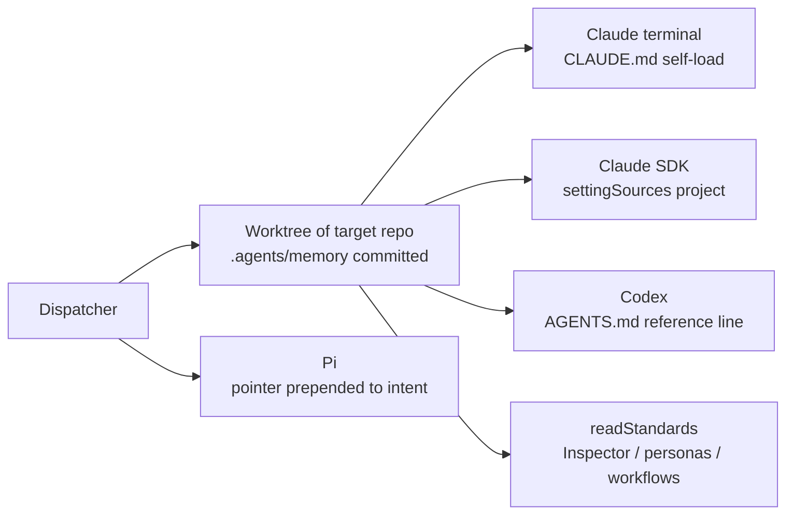
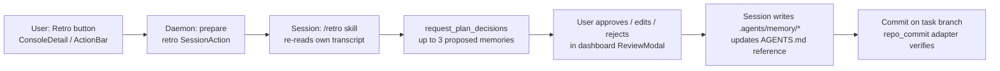

# Retro sessions and repository-scoped agent memory

## Problem

Sessions rediscover the same repo-specific traps over and over, and the corrections the
operator types into one session die with that session. Mission Control has no memory
feature today: greps for memory/notes/knowledge across `src/` and `docs/` find only
`session_notes` (Foreman's per-session disposition, upserted so each write destroys its
predecessor) and `app_config` (instance-local KV). The one durable memory that does exist
is the operator's private `~/.claude` auto-memory, which is per-operator and per-machine -
exactly what this feature must not be.

The proposed feature has two halves:

1. **Retro**: an interactive retrospective over a finished session. It inspects the full
   transcript, isolates instructions / guidance / corrections issued by the user, finds
   avoidable issues the session ran into, and recommends **up to 3 improvements** to
   catalogue. The user approves, edits, or rejects each one.
2. **Repository memory**: the approved improvements are committed into the session's
   target repository as a memory artifact that is separate from AGENTS.md but referenced
   by it, and auto-loaded into context by every session Mission Control dispatches
   against that repo.

## Requirements

| # | Requirement | Consequence |
|---|---|---|
| 1 | Memory is associated with each repository | The artifact lives in the repo, keyed by nothing but its path in the tree. Repo identity in MC is the main-checkout path (`tasks.repo_root`, `src/server/db.ts:155`; `resolveTaskRepoRoot`, `src/server/repos.ts:215`) - no remote-URL identity exists, and none is needed if the memory travels inside the repo itself. |
| 2 | Shared across sessions and users of Mission Control, not this running instance | Rules out SQLite / `app_config` as the primary store (instance-local). A git-committed artifact is shared by construction: clone the repo, get the memory. MC's own precedent agrees - `readStandards` deliberately excludes `~/.claude/CLAUDE.md` because "it is personal preference, not a contract the repo asserts" (`src/server/standards.ts:72-78`). |
| 3 | Contains repeatable optimizations / fixes / preferences for coding successfully in this repo | See "What lives in memory" below. |

## What lives in memory

The operator's existing auto-memory is the existence proof: most of its entries are
repo-scoped facts that today benefit one operator on one machine and should benefit every
session of every user. Categories, with real examples of the kind of entry:

| Category | Example entry |
|---|---|
| Tooling traps | "The Bash grep wrapper silently returns zero matches on `src/shared/protocol.ts`; reproduce negatives with `command grep` or `-a`." |
| Test invocation recipes | "Run one test file with `node --test --test-concurrency=2 --import tsx <file>`; `test:e2e` needs a prior `npm run build` and a one-time `npx playwright install chromium`." |
| Flake catalog | "http-integration's pane test fails locally when tmux `%3` hits a sibling-worktree pane; CI-green, not a regression." |
| Verification recipes | ":5173 serves the main checkout, not your worktree - run your own vite port or you verify unmodified code. Isolated E2E daemons need `MISSION_POOL_REAP_MS=0`." |
| Recovery procedures | "A killed run's fix commits survive only in the bare repo; fetch them back before rerunning." |
| Landmine map | "`findRolloutForSession` gives up after 400 files; `builtin-personas.generated.ts` is generated - change `docs/personas/*.md` and run `npm run personas`." |
| Repo conventions not yet in AGENTS.md | "Terminal write policy lives in `actions.ts`, never in `src/server/terminal/`." |
| Operator preferences (repo-scoped) | "PRs go to `mancej-cyc/ai-harness`; pass `--repo` explicitly because the old owner still redirects pushes but breaks `gh pr create`." |
| Decision provenance | "Skills are symlinked, not copied, so the file Claude reads IS the file in the repo - do not switch to copies." |

What does **not** belong: secrets, per-user paths, machine-local state, anything already
in AGENTS.md (the retro should propose promoting a memory into AGENTS.md when it hardens
into a rule, not duplicate it).

## Decisions

Adopted 2026-08-04 after review:

- **Memory store: B, index plus topic files.** A folds in as the degenerate single-file
  case; D remains the documented escape hatch for purely procedural memories; C rejected.
- **Retro runner: R1, SessionAction in the session itself, with R3 as the fallback**
  when the session has already exited.
- **Loading scope: reference line + pi intent pointer + readStandards extension.** The
  belt-and-braces Claude system-prompt pointer is deferred.
- **Solicitation:** gate-driven card prompt; see "Soliciting the retro" below.

## Memory store: baseline and three alternatives

All four shapes satisfy the requirements; they differ in scale behavior, editability, and
how much machinery MC must grow.

### A. Baseline (as proposed): single committed markdown file

`.agents/memory/MEMORY.md` at the repo root. AGENTS.md gains one stable line:
"Read `.agents/memory/MEMORY.md` before starting work." Retro appends entries; every
harness loads it by reading that line.

- **Pros**: simplest possible; one file to read, diff, and review in PRs; zero new
  formats.
- **Cons**: grows without structure; every session pays the full file in context even
  when only two entries are relevant; concurrent retros from different sessions conflict
  on one file; pruning is a manual editorial act.

### B. Index plus topic files (adopted)

`.agents/memory/MEMORY.md` is a short index - one line per memory with a link - and each
memory is its own file (`.agents/memory/<slug>.md`) with a small front-matter header
(category, date, source session, times-confirmed). This is the same shape as Claude
Code's own auto-memory, proven at exactly this job.

- **Pros**: context cost is the index, not the corpus - sessions read topic files on
  demand; retros from parallel sessions append different files and rarely conflict; each
  memory has provenance; pruning is deleting a file and an index line; the index doubles
  as the catalogue the retro browses for duplicates.
- **Cons**: two-step read for agents; an index/file drift risk (mitigated: the retro
  validates index-matches-directory before committing, and a cheap `test/` check can
  assert it for this repo).

### C. Structured catalog with generated rendering

`.agents/memory/memories.yaml` as source of truth, Zod-validated by MC
(schema in `src/shared/`), with fields like `id`, `category`, `title`, `body`,
`provenance`, `confirmedCount`, optional `staleCheck` (a command whose failure flags the
memory for review). MC renders a `MEMORY.md` from it (generated, never hand-edited).

- **Pros**: machine-readable - enables a dashboard catalogue UI, dedup by id, staleness
  sweeps, per-category loading, cross-repo analytics later.
- **Cons**: heaviest; a generated file in every target repo violates the grain of repos
  MC does not own (their CI, their conventions); agents read YAML worse than prose;
  contributors without MC cannot regenerate the rendering. The schema also becomes a wire
  contract MC must version forever.

### D. Memories as repo-local skills

Each memory becomes a skill directory (`.claude/skills/<slug>/SKILL.md`) whose
description is the trigger, so it loads only when relevant instead of always-on.

- **Pros**: zero standing context cost; the trigger mechanism is battle-tested; great fit
  for procedural memories ("how to verify a UI change here").
- **Cons**: fails requirement 3's breadth - preferences and landmines are exactly the
  memories that must load *before* the agent knows to look; Codex and Pi do not load
  Claude skill directories, so two of three harnesses see nothing; MC's skills
  reconciler (`src/server/skills/reconcile.ts`) owns `mission-`/`fleet-` prefixes in
  `~/.claude/skills` and would need a parallel per-repo mechanism.

**Recommendation: B**, with D as a documented escape hatch for the rare memory that is
purely procedural and expensive in context (the retro may propose "this one should be a
skill"). A is B with one file, so B degrades gracefully to A for repos with few memories.
C's dashboard-catalogue benefits can be layered onto B later by parsing front-matter,
without a generated file in the target repo.

## Auto-loading into dispatched sessions

The load-bearing fact from the code: for Claude SDK sessions, MC already passes
`settingSources: ["user", "project", "local"]` (`src/server/harness/claude/sdk.ts:940`),
and terminal Claude loads project CLAUDE.md itself. So for Claude, a reference line in
AGENTS.md/CLAUDE.md is sufficient - **no MC change is strictly required** for the memory
to load. The remaining harnesses need small, explicit paths:

| Harness / arm | Load path | MC change needed |
|---|---|---|
| Claude terminal | CLI loads project CLAUDE.md; the AGENTS.md reference line instructs the read | None (optional belt-and-braces: extend the existing `--append-system-prompt` in `src/server/ask-channel.ts:186-194` with a one-line memory pointer) |
| Claude SDK | `settingSources: ["user","project","local"]` already loads project instructions | None |
| Codex | Codex reads AGENTS.md natively; the reference line is a plain instruction it follows. `prepareCodexLaunch` (`src/server/harness/codex/launch.ts:67`) has no system-prompt channel, so file-based is the only shape that works | None |
| Pi | Prompt is the only channel (`src/server/harness/pi/launch.ts:22`) | Prepend a one-line memory pointer when `deliverIntent` composes turn one for pi dispatches |
| MC's own prompts (Inspector, personas, workflows) | Extend `readStandards` (`src/server/standards.ts:80`) to include `.agents/memory/MEMORY.md` in the standards bundle, under the existing 24KB/file, 64KB/bundle caps | One reader change, every review consumer inherits it |

This is why "separate file, referenced by AGENTS.md" beats "a section inside AGENTS.md":
the reference line is the single cross-harness loading mechanism, AGENTS.md stays a
stable contract humans curate, and the memory file stays a churning append-mostly log
agents curate.

### Bootstrap: who writes the reference line, and when

The reference line is written by the retro, never by feature sessions and never by the
daemon. The first retro in a repo bootstraps the whole mechanism in one approved,
reviewable commit: it creates `.agents/memory/MEMORY.md`, writes the first approved
topic files, and adds the reference line to AGENTS.md if it is absent. The line and the
first memory arrive together - before that commit there is nothing to load, so a repo
without the line is not broken, it is just a repo with no memories yet.

Mechanics the retro skill enforces:

- **Idempotent marker check.** The skill looks for the line by a stable marker string and
  adds it only when missing, so every later retro leaves AGENTS.md untouched.
- **Symlink-aware target.** The line goes into the real root doc: AGENTS.md, or CLAUDE.md
  when that is what the repo has, resolving symlinks the way `readStandards` already does
  (this very repo ships `CLAUDE.md -> AGENTS.md`). When neither exists, the retro creates
  a minimal AGENTS.md containing only the reference line.
- **Feature sessions never touch it.** A session implementing a random feature does not
  add the line - that would be an unrelated edit in its diff, violating "commit only
  task-related files". Dispatched into a repo without the line, it simply loads no
  memories, which is correct: none exist.

How agents know to load it once the line exists: Claude (terminal and SDK) and Codex load
the root doc natively, and the line is an imperative instruction ("Read
`.agents/memory/MEMORY.md` before starting work") that reaches them the same way every
other AGENTS.md rule does - instruction-following, not a special loader. Where the repo
has a CLAUDE.md, the line can additionally use Claude's `@`-import syntax so the index is
inlined at load time instead of depending on the agent choosing to read it; the
imperative sentence remains the cross-harness baseline.

Drift repair, for repos where memories exist but the line was lost (hand edits, partial
reverts):

- MC's own consumers never depend on the line: `readStandards` picks up
  `.agents/memory/MEMORY.md` by convention, exactly as the Inspector reads INSPECTOR.md.
- Every retro re-validates line-present and index-matches-directory before committing.
- Optional dispatch belt-and-braces: when the dispatcher sees `.agents/memory/MEMORY.md`
  in the target repo but no reference line, it prepends the same one-line pointer pi
  already gets to the delivered intent - MC-dispatched sessions stay covered without MC
  ever writing to a repo it does not own.

## The retro itself: three ways to run it

### R1. SessionAction typed into the finished session (adopted, with R3 as fallback)

A new built-in SessionAction (`docs/session-actions/retro.md` compiled into
`src/server/workflows/builtin-session-actions.ts`), delivered through the existing
`renderSessionAction` path (`src/server/workflows/feedback.ts:383`), invoking a new
`skills/retro` skill. The session that did the work performs its own retro: it already
holds the full context, it re-reads its transcript through
`GET /api/sessions/:id/transcript`, and it runs the interactive half by calling
`mcp__mission-control__request_plan_decisions` with up to 3 proposed memories as
selectable options (approve / edit-via-other / reject). On approval it writes the memory
files, updates the AGENTS.md reference if absent, and commits on the task branch. A new
completion adapter kind (`repo_commit`) in `src/server/workflows/session-action-adapters.ts`
proves the retro landed.

- **Pros**: reuses four existing mechanisms (session actions, skills gate, MCP reviews,
  transcript route) and adds almost no new machinery; the commit is an agent turn, which
  preserves the invariant that nothing commits on the daemon's behalf; the interactive
  retrospective is native - it is the same session talking to the same user.
- **Cons**: requires the session to still be alive; a session that ended badly may retro
  itself charitably.

### R2. Headless daemon-side review

`runClaudeText` (`src/server/claude-cli.ts:136`) over a transcript bundle built like
`buildWorkflowContext` (`src/server/workflows/context.ts:369`), producing proposed
memories as structured output; the user approves through a `ReviewManager` decision form;
an injection into the session (or a fresh one-shot) performs the commit.

- **Pros**: works on any session, including dead ones; an outside reviewer is less
  charitable than self-review; `humanTranscriptDecisions` (`context.ts:147`) already
  extracts the user-correction turns the retro needs.
- **Cons**: someone still has to commit, so R2 collapses into R1 or a dispatched task at
  the end anyway; the transcript window is byte-bounded, and a full-transcript sweep for
  long sessions needs new paging logic; costs a headless model call per retro.

### R3. Dedicated retro session dispatched against the repo

Dispatch a fresh task whose intent is "retro session X", pointing at the transcript.

- **Pros**: full session powers (tools, browser, tests) to *verify* a proposed memory
  before cataloguing it; survives the original session.
- **Cons**: heaviest; the fresh session lacks lived context and must reconstruct
  everything from transcript bytes; doubles session count for a lightweight ceremony.

**Recommendation: R1**, with R2's transcript-extraction helpers reused inside the retro
skill's instructions ("fetch your transcript, focus on human turns"), and R3 reserved as
the manual fallback for sessions that already exited (the dashboard button dispatches a
retro task when the session is gone).

Two transcript-fidelity caveats shape the skill instructions regardless of choice:
scaffolding stripping (`conversationText` / `substantivePrompt`,
`src/server/harness/claude/scaffolding.ts:99,163` - about half of "user" turns are
machine noise without it) and injection attribution (`originOf`,
`src/server/injections.ts:74`) which is in-memory only, so a retro run after a daemon
restart cannot fully distinguish Foreman-typed turns from human ones. The retro treats
attribution as best-effort and says so.

## Soliciting the retro

The right moment to ask is after the PR exists and the Inspector's findings are all
addressed: by then the session holds everything worth remembering (the coding, the user's
corrections, and the findings-and-fixes cycle), and the branch is usually still open, so
approved memories ride the same PR through normal review. Two mechanisms were weighed:

**A workflow step after the Inspector does not exist to hook.** The Inspector is not a
graph node; it is the completion policy that runs after the graph's End. The gate's clean
transition writes `completed` directly (`src/server/workflows/manager.ts:2828-2848`), and
`compactGate` treats `completed` as the end of the story
(`src/server/workflows/store.ts:191-202`). A retro authored as a late graph stage (the
shape of v8's `pull_request` action stage, `builtin-workflows.ts:446`) is expressible
today but fires *before* the Inspector has said anything - the wrong moment. A true
post-gate slot would mean a new node class and a change to the run state machine's
terminal contract. Rejected for v1; if a per-repo "always retro" policy is wanted later,
the completion policy (not the graph) is where it would raise the same offer described
below.

**A card prompt driven by the gate signal (chosen).** The predicate is already computed
and on the wire: `WorkflowRunSummary.gate === "clean"` means exactly "adopted PR,
reviewed head equals target head, zero unresolved findings". For sessions without a
bound workflow, the weaker universal predicate is PR-present plus inspector-clean
(`inspectorChipView` tone `insp-clean`, `src/web/components/session-bits.tsx:954-983`).
The offer renders through the existing run-action descriptor pattern
(`src/web/workflows/run-actions.ts:65-105`) - the same "server proposes, human clicks"
shape as **Prepare PR in session** - so it appears on the Board tile's workflow ladder,
the Grid card, and the Runs page, plus a Retro entry in the ActionBar
(`src/web/components/ActionBar.tsx:413-533`) for detail view. Clicking POSTs a new route
that delivers the retro SessionAction into the session. Nothing is ever typed
autonomously.

**Conditioning, so the offer is not ceremony:** light it only when the session is
retro-worthy - the transcript contains human-correction turns
(`humanTranscriptDecisions`) or the Inspector raised findings that were then resolved
(resolved `inspector_comments` rows). A clean run with no corrections has nothing to
catalogue and gets no prompt.

Backstops:

- The Complete flow (`CompleteModal.tsx`) offers a retro for sessions that never produce
  a PR, under the same retro-worthiness condition.
- If shipping auto-merges on clean before the user clicks, the offer stays; the retro
  then commits on a small follow-up branch through the R3 fallback path.
- **Never autonomous**: `src/server/skills/reload.ts:19-33` documents the one sanctioned
  autonomous pane-writer and warns against adding a second. The server only ever
  proposes; the user always clicks.

## Guardrails

- The daemon never commits; the agent turn commits. Memory writes go through the session,
  on the task branch, reviewable in the PR like any other change.
- Up to 3 recommendations per retro, hard cap; the user approves each individually.
  A retro may also propose *removing* a stale memory - pruning is a first-class outcome.
- Memory files respect the standards caps (24KB/file) so `readStandards` inclusion never
  silently truncates; the retro skill enforces entry brevity.
- The retro must not propose anything AGENTS.md already states; when a memory has been
  confirmed repeatedly, the retro proposes promoting it into AGENTS.md and deleting the
  memory.
- No secrets, tokens, user paths, or machine state in memory files - the skill
  instructions say so and the approval step is the human backstop.

## Testing

- `test/`: reader logic (memory discovery, index/directory consistency, caps), the
  `repo_commit` completion adapter, `readStandards` extension, pi intent-pointer
  composition.
- `e2e/`: the retro offer through the fake-agent harness - the offer appears only when
  the gate reads clean and the retro-worthiness condition holds, click it, see the
  decision form render with proposed memories, submit approvals, assert the session
  receives the action text. UI surfaces get Playwright specs per project policy.

## Out of scope (this plan)

- Cross-repo or org-level memory aggregation.
- Automatic memory injection for non-MC sessions (the committed file already serves them
  by convention).
- A dashboard memory-catalogue browser (layerable on shape B later).
