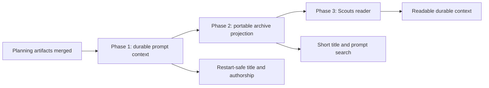

# Phased plan: short scout titles and preserved prompt context

## Source

- Approved source plan: [`plan.md`](plan.md)
- Rendered source plan: [`plan.html`](plan.html)

The user explicitly asked to phase this scope and schedule it as Mission Control tasks. The source
plan contains no unresolved product choice.

## Incorporated decisions

| Decision | Adopted selection | Owning phase |
| --- | --- | --- |
| Archive title | Use the live session card's `session.name`; recover from the frozen episode name, then legacy task title | 1 freezes, 2 projects |
| Original prompt | Preserve exact `task.intent` before `question` preview clipping | 2 |
| Later context | Preserve human user prompts from this scout episode in conversation order | 1 attributes, 2 collects |
| Exclusions | No assistant, tools, system text, hidden reasoning, scout appendix or attributed automation | 1 and 2 |
| Archive role | Prompt context is metadata and search material, never a report fallback | 2 and 3 |
| Publication | Freeze at reservation; never append to a published bundle | 2 |
| Compatibility | Additive version 1 field; old bundles expose no trail | 2 and 3 |
| Follow-up | Create a phased implementation plan and dependency-linked tasks | This document |

## What the repository investigation changed

The initial scout recommendation was a title source change plus a manifest prompt array. The deeper
trace added one prerequisite phase:

1. **A final transcript window is incomplete by design.** `TranscriptMessages.window` keeps a head
   and tail, so long conversations can omit middle follow-ups. The work needs bounded forward paging
   from the task-delivery byte boundary.
2. **Attribution is not durable today.** `src/server/injections.ts` forgets Foreman, Workflow and
   harness origins on restart. A capture after restart could archive automation as if the human wrote
   it. Scout-scoped attribution must survive until the capture job freezes.
3. **Queued text is not yet a prompt.** `PendingTurnManager.submit` creates an editable outbox row.
   Journal only SDK acceptance or verified terminal pickup, or recalled text will be preserved as
   context the agent never received.
4. **There are two task-delivery seams.** Fresh dispatch and assignment both compose the scout
   appendix. The transcript anchor and session-name snapshot must cover both, including Pi's
   launch-time prompt.
5. **The rail already uses archive title.** The server projection creates the short rail title with
   no React edit, but it is still visible behavior and needs Playwright coverage in Phase 2.
6. **The reader heading uses the clipped question.** Phase 3 must change it to archive title before
   adding prompt context, or the selected page will still lead with the long request.

No code in `ai-conductor` participates in scout capture, archive storage or the Scouts page. All
implementation phases target `ai-harness` only.

## Phase map

| Phase | Name | Depends on | Independently delivers |
| --- | --- | --- | --- |
| 1 | [Durable scout prompt context](phase-1-durable-scout-prompt-context.md) | none | Work-episode title/offset snapshot, accepted-turn journal, durable attribution and bounded forward transcript paging |
| 2 | [Portable scout title and prompt projection](phase-2-portable-scout-title-and-prompts.md) | Phase 1 | Short archive titles, additive prompt manifest, recovery-safe capture, detail API and prompt search |
| 3 | [Scout prompt context reader](phase-3-scout-prompt-context-reader.md) | Phase 2 | Concise reader heading, visible prompt trail, search language, responsive styles and complete E2E proof |

## Dependency graph



## Concurrency and merge order

The phases are strictly serial.

- Phase 2 consumes Phase 1's task boundary, durable authorship and forward transcript page
  contracts. Reimplementing those inside capture would create two sources of truth.
- Phase 3 consumes Phase 2's portable read model and search vocabulary. Building it against a local
  component-only type would produce a temporary API contract that Phase 2 later removes.

Merge order is Phase 1, then Phase 2, then Phase 3. Each task also directly depends on the current
planning session, as required by the scheduling workflow.

## Why three phases

Phase 1 is the subtle correctness boundary. It decides whether a turn was actually delivered, which
work episode owns it, and whether its author was the human. Reviewing that underneath manifest,
index and UI changes would make the privacy and restart guarantees hard to see.

Phase 2 is one server-side vertical slice. Once merged, newly published bundles already have short
titles, durable prompt data and search. Phase 3 is then a conventional read-model consumer with the
repository's required browser proof.

Phase 1 is additive and temporarily unconsumed. That is a bounded trade: its tables and paging
capability are fully tested, do not change existing behavior, and let the capture phase rely on one
reviewed contract rather than land delivery semantics and archive publication at once.

## Cross-phase contracts

- **C1, one episode boundary (Phase 1):** `(task_id, episode_id)` owns the frozen session name,
  transcript path and byte offset established at the actual task-delivery seam.
- **C2, accepted turns only (Phase 1):** an editable, recalled, refused, failed or unresolved
  uncertain pending row is not a prompt. Positive SDK acceptance or verified terminal pickup is.
- **C3, durable authorship (Phase 1):** human and non-human delivery attribution survives daemon
  restart until archive reservation. No later phase infers author from role alone.
- **C4, bounded transcript walk (Phase 1):** archive collection pages forward from a byte anchor and
  never uses a head-tail window or unbounded remainder read.
- **C5, title identity (Phases 1 and 2):** capture uses live `session.name`, then the episode's frozen
  session name, then legacy `task.title`. It never calls a model or derives a second short title.
- **C6, prompt semantics (Phase 2):** one initial entry is exact `task.intent`; later entries are
  human follow-ups. The delivered scout appendix and every attributed automated turn are excluded.
- **C7, bounded honesty (Phase 2):** 256 entries, 256 KiB per entry and 3 MiB total are hard portable
  bounds. Any omission sets `truncated`; the initial prompt is retained before newest follow-ups.
- **C8, immutable recovery (Phase 2):** title and prompts freeze on `ArchiveCaptureJob`. Publication,
  replay and restart read the job, not a live task or transcript.
- **C9, portable authority (Phase 2):** the verified manifest is the durable source of title, prompt
  detail and prompt search. SQLite remains a rebuildable projection.
- **C10, report separation (Phases 2 and 3):** prompt context cannot satisfy completion and never
  becomes report HTML. The authored report remains the primary artifact.
- **C11, safe reader (Phase 3):** prompt text renders as escaped plain text outside the iframe. The
  report keeps its existing sandbox and evidence navigation.
- **C12, old bundle behavior (Phases 2 and 3):** an archive with no prompt field remains readable and
  keeps its current question fallback. No published bundle is rewritten.

## Merge-boundary operability

1. **After Phase 1:** existing behavior is unchanged. A running scout has restart-safe prompt
   context and all current tests remain green. The new paging API is bounded and unit-tested.
2. **After Phase 2:** newly completed scouts have the correct short rail title, portable prompt
   history and prompt search. Operators can retrieve prompt detail through the existing detail API;
   the report reader still works and no archive is unreadable.
3. **After Phase 3:** the reader exposes that context, uses the concise title consistently and has
   end-to-end coverage of human versus non-human turns.

No phase depends on a later phase to repair a broken database, unreadable bundle or misleading
intermediate title.

## Final verification strategy

Each phase runs its focused commands. After Phase 3 merges, run:

```sh
npm run typecheck
npm run lint
npm test
npm run build
npm run smoke
npm run test:e2e -- e2e/specs/scout-archive.spec.ts
```

The final acceptance flow proves one identity across time:

1. observe the short title on a live scout card;
2. deliver a human follow-up and an attributed automated instruction;
3. submit and publish the scout report;
4. remove the session and rebuild the derived archive index;
5. find the archive by a phrase unique to the follow-up;
6. verify the rail and reader retain the live title, the original request and human follow-up, but
   not the automated instruction.

## Requirement ownership audit

| Source-plan requirement | Owner |
| --- | --- |
| Same title as live session card | Phase 1 snapshot, Phase 2 projection, Phase 3 reader |
| Exact initial task intent | Phase 2 |
| Later human prompts in order | Phase 1 attribution, Phase 2 collection |
| No automated, assistant, tool, system or hidden content | Phase 1 attribution, Phase 2 filter, Phase 3 E2E |
| Long-session completeness without unbounded reads | Phase 1 paging, Phase 2 collector |
| Recovery after daemon/session loss | Phase 1 durability, Phase 2 capture job |
| Additive manifest and old-bundle compatibility | Phase 2 |
| Prompt search | Phase 2 projection, Phase 3 copy and E2E |
| Visible Prompt context | Phase 3 |
| Report remains required and immutable | Phase 2 tests and docs, Phase 3 separation |
| No ai-conductor change | Non-goal in every phase |

Every requirement has one behavior owner or an explicit producer-consumer split. No requirement is
left to an unnamed cleanup phase.

## Final cross-phase audit

- Reconciled the phase documents against the source plan after all three were written.
- Confirmed every persisted vocabulary change is append-only and every database change has an
  upgrade path.
- Confirmed title selection has one server owner and React consumes the archive title rather than
  deriving another one.
- Confirmed prompt collection freezes before immutable publication and restart recovery never needs
  a vanished transcript.
- Confirmed Phase 2's visible rail change and Phase 3's reader change each carry Playwright coverage.
- Confirmed the task graph is a single serial chain with direct dependencies only.
- Confirmed the secondary `ai-conductor` checkout has no implementation phase and needs no pull
  request.
