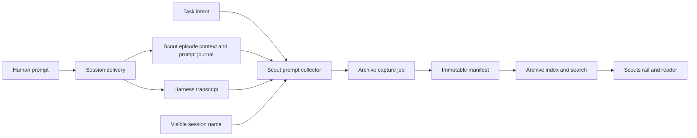

# Short scout titles with preserved prompt context

## Outcome

A completed scout uses the same short, model-generated name that was visible on its live session
card as the archive title. The archive separately preserves the original task intent and every
later human prompt that Mission Control can attribute to that scout's work episode.

The report remains the scout's answer. Prompt history is durable context and search material, not a
fallback report and not a copy of the whole conversation.

## Current behavior

The live and archived surfaces currently answer the title question from different fields:

- The session card renders `session.name` in `src/web/components/session-bits.tsx`.
- Scout capture freezes `task.title` in `src/server/scouts/task-gateway.ts`. For scouts created from
  a long request, that can be the whole prompt.
- The same gateway stores `task.intent` as `archive.question`, but clips it to the 1,000-character
  `ARCHIVE_TEXT_LIMITS.question` bound.
- `src/server/archives/capture.ts` writes only `title`, `question`, `summary`, tags, provenance and
  artifacts into the portable manifest.
- `docs/archives.md` explicitly excludes the conversation, so later prompts disappear with the
  task, session and harness-owned transcript.

The transcript layer already normalizes Claude, Codex and Pi into `TranscriptMessage`, including a
`role`, text, timestamp and optional non-human `origin`. Two constraints prevent capture from simply
reading a final window:

1. `TranscriptMessages.window` is a bounded head-and-tail view, so a long session can omit prompts
   in the middle.
2. `src/server/injections.ts` keeps non-human attribution only in memory. After a daemon restart, an
   automated Foreman, Workflow or harness instruction can look like a human turn.

Those constraints shape the implementation below.

## Adopted product decisions

| Question | Decision |
| --- | --- |
| What is the archived title? | The session's visible `session.name`, clipped only to the portable title bound. Fall back to the episode's frozen session name, then `task.title`, only when the live session is gone. |
| What prompt starts the trail? | The exact stored `task.intent`, before the existing `question` preview clipping. |
| Which later turns are retained? | Human-authored user prompts delivered during this task's work episode, in conversation order. |
| What is excluded? | Assistant prose, tool calls and results, hidden reasoning, system text, the scout contract appendix, and user-role turns attributed to Foreman, Workflow or the harness. |
| Does prompt history replace the report? | No. `report/report.html` remains the required primary answer and completion gate. |
| Can a published archive change after a later prompt? | No. Prompt context freezes at archive reservation and follows the existing immutable publication rule. |
| What happens to older bundles? | They parse with an empty prompt trail. The version 1 manifest extension is additive and older readers ignore it. |

The user explicitly selected phased planning and task scheduling for this scope. There are no open
product choices in this plan.

## Portable prompt contract

Extend the version 1 manifest's `archive` object with an optional `prompts` value:

```json
{
  "prompts": {
    "entries": [
      { "kind": "initial", "text": "Find why reconnect loses permissions", "at": null },
      { "kind": "follow_up", "text": "Also check whether Pi behaves the same way", "at": "2026-08-14T15:18:00.000Z" }
    ],
    "truncated": false
  }
}
```

The shared TypeScript model uses camel case while serialization keeps the file's snake-case
convention. `kind` is append-only and starts with `initial` and `follow_up`. Exactly one initial
entry is required when `prompts` is present, and it is first.

Keep `archive.question` for compatibility, list density and foreign bundles. New local captures
derive it from the initial prompt using the existing 1,000-character bound. It is a preview, while
`prompts.entries` is the durable context.

Add bounded prompt limits beside `ARCHIVE_TEXT_LIMITS`: at most 256 entries, at most 256 KiB of
UTF-8 text per entry, and at most 3 MiB of prompt text per manifest. Preserve text byte-for-byte
inside those limits. If any entry or the total crosses a bound, keep the initial prompt and the
newest follow-ups that fit, set `truncated: true`, and never present the trail as complete. The
existing 4 MiB manifest limit remains the final publication guard.

Add `prompt` at the end of `ARCHIVE_SEARCH_SEGMENT_KINDS`. Index each prompt in bounded overlapping
segments using the same literal-search rules as report text, so a later clarification is findable
without replacing the concise title in the rail.

## Durable work-episode context

Add a scout-specific daemon-owned context store rather than making the portable archive depend on a
live transcript:

- One `scout_prompt_contexts` row per `(task_id, episode_id)` freezes the session id, current
  `session.name`, transcript path and byte offset at the task-delivery boundary.
- `scout_prompt_turns` records successfully delivered user-role text for that episode, its origin,
  delivery time and a stable sequence. Human text is retained exactly; non-human rows are retained
  long enough to keep transcript attribution correct across a daemon restart.
- Rows are local capture coordination, like `archive_capture_jobs`. They are not a read model and
  never become an alternate archive source of truth.

Both task delivery seams must open the context after the final prompt is composed and before it is
sent: fresh dispatch in `src/server/dispatcher.ts` and assignment in `src/server/tasks.ts`. Pi's
launch-time prompt records offset zero because the prompt travels in the launch message.

Record a follow-up only after the runtime has accepted it:

- an immediate human `/inject` records after a successful delivery;
- the durable pending-turn path records after SDK acceptance or verified terminal pickup, not when
  a draft is queued;
- recalled, refused, failed and uncertain pending turns do not become archived prompts until their
  delivery is resolved positively;
- existing non-human delivery paths record their origin through the same journal boundary.

The context's frozen name updates when the same live session is renamed, so a normal capture and an
exit-recovery capture agree with the last title the card showed.

## Prompt collection at capture

At scout archive reservation, a focused collector builds one bounded trail:

1. Start with `task.intent` as the initial entry.
2. Walk normalized transcript records forward from the context's byte offset through a new bounded,
   paged `TranscriptMessages.after` capability. Do not use `window` or an unbounded whole-file read.
3. Match journaled origins before applying the existing in-memory attribution. Keep user-role turns
   attributed to the human, and exclude every attributed non-human turn.
4. Remove the delivered opening turn, which contains the task intent plus the scout contract
   appendix, because the exact intent is already entry one and the appendix is product machinery.
5. Merge delivered human journal rows that are absent from the readable transcript. This preserves
   accepted prompts when a transcript is unavailable, rotated or not yet flushed.
6. De-duplicate by journal identity first and by normalized text plus timestamp only as a recovery
   fallback. Preserve conversation order.
7. Apply the portable entry and byte bounds and carry the honest `truncated` flag.

Freeze the resulting title and prompt trail onto `ArchiveCaptureJob`. Recovery reads only the job,
never a task or transcript that may already be gone. `src/server/archives/capture.ts` copies that
frozen value into the manifest before the existing stage, verify and atomic rename sequence.



## Reader behavior

The Scouts rail continues to render `archive.title`; changing the capture source makes it short
without adding a second title rule in React. The selected reader changes its heading from the
clipped `question` preview to `detail.title` and adds a **Prompt context** section before the report:

- the initial request is labelled **Original request**;
- later entries are labelled **Follow-up** and show a timestamp when one was recorded;
- prompts render as escaped plain text, not Markdown or HTML;
- a truncated trail says that older or oversized prompt text was omitted;
- an older archive with no prompt trail keeps its current question heading and report reader.

Search snippets name their source as `prompt`. Update the search placeholder to mention prompts.
The report preview, evidence spine, sandbox, deletion and bundle paths do not change.

## Compatibility and migration

- Add database tables and capture-job columns through `src/server/db.ts`'s existing migration path.
  Fresh and upgraded databases must both open.
- Existing `archive_capture_jobs` rows read with an empty prompt trail and their existing title.
- Existing manifests omit `prompts` and continue to parse. No published bundle is rewritten.
- New manifests remain format version 1 because unknown fields are already ignored by older version
  1 readers. New search vocabulary is appended, never renamed or reordered.
- The filesystem bundle remains canonical. SQLite prompt context is needed only until the archive
  job freezes it; the derived archive index remains rebuildable from manifests.

## Success criteria

1. A newly archived scout's rail title equals the name shown on its session card, not the task's
   long prompt.
2. The original task intent is preserved beyond the 1,000-character question preview, subject only
   to explicit archive bounds that report truncation.
3. Human follow-up prompts from the scout's work episode appear in chronological order and are
   searchable after the task, session, worktree and source transcript are gone.
4. Foreman, Workflow and harness instructions never appear as human prompt context, including after
   a daemon restart between delivery and capture.
5. Assistant prose, tools, hidden reasoning and the scout appendix are not archived.
6. A queued then recalled or failed prompt is not archived as if the agent received it.
7. Capture recovery publishes the exact title and prompt trail already frozen on its job.
8. Older archives and unfinished pre-migration capture jobs continue to parse and render.
9. The report remains required and immutable; prompt context never satisfies scout completion.
10. The behavior works for fresh dispatch, assignment, terminal and SDK sessions, with Pi using its
    launch-time prompt boundary.

## Non-goals

- Archiving assistant answers, tool traffic, system prompts, hidden reasoning or full transcripts.
- Reconstructing prompt trails for already-published archives.
- Editing a published archive when somebody messages the old session later.
- Replacing model-generated session naming or generating another title during capture.
- Importing arbitrary terminal keystrokes that never become a normalized user turn.
- Changing scout report authoring, evidence selection, retention, deletion or sandbox policy.
- Changes in `ai-conductor`; the scout task gateway, archive format, capture and Scouts UI all live in
  `ai-harness`.

## Verification

Focused unit and HTTP tests must cover migrations, prompt-journal delivery semantics, transcript
paging and attribution, manifest parse and serialization, capture-job recovery, index rebuild and
search. UI work requires Playwright coverage using fake agents and an isolated `MISSION_HOME`.

The complete feature finishes with:

```sh
npm run typecheck
npm run lint
npm test
npm run build
npm run smoke
npm run test:e2e -- e2e/specs/scout-archive.spec.ts
```

The browser acceptance flow creates a scout whose task title is deliberately long, verifies the
short live card name, sends a human follow-up, lets a non-human instruction pass through the same
conversation, completes capture, removes the live session, then proves the Scouts rail, reader and
search preserve the right title and only the human prompt context.
