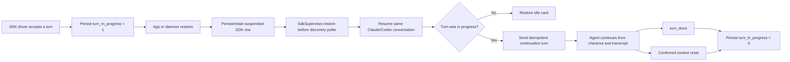

# Auto-continue interrupted SDK sessions after app restart

## Outcome

When Mission Control restarts, every SDK-runtime session still reattaches to the same
Claude or Codex conversation, and any session that was in the middle of a turn
automatically continues without the user pressing Restart or sending another prompt.
Sessions that were already idle are restored quietly and remain idle.

## Baseline before this change

Before this change, the repository already had the durable half of restart recovery:

- `sdk_sessions` stores the Mission Control session id, harness-native conversation id,
  checkout, task, model, effort, permission mode, and lifecycle status.
- `SdkSupervisor.stopAll()` records a clean shutdown as `suspended`, not `exited`.
- `SdkSupervisor.restore()` runs before `startPoller(registry)`, relaunches each live row
  with its existing `agent_session_id`, and registers the restored card before startup
  reconciliation.
- Resume deliberately launches with `prompt: ""`, so the original task intent is not
  replayed.

That last choice preserved conversation identity but did not recover interrupted work.
For Claude, the relaunched streaming query waited for a new user turn. Codex could report
an in-progress turn from `thread/resume`, but Mission Control had no durable,
harness-neutral fact saying whether the pre-restart turn needed a continuation. The result
was a session that existed again but appeared paused until the user nudged it.

## Design

### 1. Persist whether a turn still needs completion

Add `turn_in_progress INTEGER NOT NULL DEFAULT 0` to `sdk_sessions`.

- Add it to the fresh `CREATE TABLE` definition in `src/server/db.ts`.
- Add an `addColumn()` migration in `migrate()` so existing installations receive it.
- Project it as `turnInProgress: boolean` in `SdkSessionRow` and
  `SdkSessionWrite` in `src/server/sdk/store.ts`.
- Preserve it when a row is adopted during resume; relaunching a handle must not clear
  the recovery intent.

This is a boolean, not a new lifecycle status. `status` answers whether the driver is
starting, running, suspended, exited, or failed. `turn_in_progress` answers whether the
conversation owes work after it is reattached.

### 2. Maintain the flag at the supervisor boundary

`SdkSupervisor` is the single owner because it sees both accepted sends and driver
lifecycle events:

- Set the flag before adopting a newly launched session whose first prompt is already
  being executed.
- Set it after `handle.send()` acknowledges a normal or recovery turn.
- Also set it on driver `state: working` events as a backstop for harness-originated
  activity.
- Clear completed work on `turn_done`; a confirmed successful context reset is the
  intentional exception that clears all outstanding work for the idle replacement.
- Do not clear it when shutdown interrupts the driver or when a request was pending. A
  permission or user-input request was part of the unfinished turn and must be asked
  again after recovery.

The accepted-delivery write and the vendor process cannot form one transaction, so the
guarantee is intentionally at-least-once across a crash in the few instructions between
those systems. The recovery prompt must therefore be idempotent in wording.

### 3. Continue only interrupted sessions during restore

Keep the existing startup ordering and conversation resume:

1. Read live SDK rows.
2. Relaunch the harness with `resume: row.agentSessionId` and `prompt: ""`.
3. Adopt the handle and register the card.
4. If `row.turnInProgress` is true, send one recovery turn through the existing
   per-session serialized `SdkSupervisor.send()` path.
5. Leave `turn_in_progress` true until the driver emits the final `turn_done` or confirms a
   successful context reset onto an idle replacement.

Use a recovery prompt along these lines:

> Mission Control restarted while your previous turn was still in progress. Continue that
> work from the current checkout and conversation. Inspect the current state before acting,
> do not repeat completed work, and ask again for any approval or input you still need.

For Claude this starts the continuation turn the resumed streaming query is waiting for.
For Codex, `send()` already chooses the correct transport: it steers a turn that
`thread/resume` reports as active, or starts a new turn if the restored thread is idle.
No harness-specific branch belongs in the supervisor.

If the app restarts again before the final `turn_done` or a confirmed context reset, the
flag remains set and the same cautious recovery turn is sent again. That is preferable to
silently stranding the session, and the prompt explicitly tells the agent to inspect current
state and avoid repeating completed work.

### 4. Keep failure and task reconciliation semantics unchanged

- A conversation that cannot be resumed still follows `registerAndEvict()` so
  `session_remove` settles its task and other durable bindings.
- An idle suspended session is relaunched but receives no unsolicited work.
- SDK restore remains before `startPoller(registry)` so startup reconciliation cannot
  reclaim the worktree of a session that is being recovered.
- No browser protocol or layout change is required. The recovery turn and subsequent
  activity appear through the existing transcript and session-state events.

## Restart flow

## Files that move together

| Area | Change |
|---|---|
| `src/server/db.ts` | Add the fresh-schema column and upgrade migration. |
| `src/server/sdk/store.ts` | Read, write, and update `turnInProgress`. |
| `src/server/sdk/supervisor.ts` | Maintain the flag and enqueue recovery after adopt. |
| `test/sdk-db.test.ts` | Prove upgrade migration, default value, and round-trip behavior. |
| `test/sdk-supervisor.test.ts` | Prove working sessions continue, idle sessions do not, and repeated restarts remain recoverable. |
| `test/claude-sdk-adapter.test.ts` | Prove a resumed Claude handle accepts the recovery turn. |
| `test/codex-sdk-adapter.test.ts` | Prove recovery steers an active resumed turn and starts a turn when the resumed thread is idle. |
| `README.md` | Replace the user-facing manual re-prompt limitation with the recovery behavior. |
| `docs/plans/agent-sdk-sessions/plan.md` | Point the broader SDK architecture plan to this recovery contract. |

## Verification

Add coverage for these cases:

1. An upgraded pre-feature database receives `turn_in_progress` with default `0`.
2. A newly launched first turn and an acknowledged follow-up persist `1`.
3. The final `turn_done`, after all accepted queued work completes, persists `0`.
4. Clean shutdown preserves `1` while changing lifecycle status to `suspended`.
5. Restore of an interrupted Claude session resumes the same conversation and sends
   exactly one continuation turn in that daemon lifetime.
6. Restore of an interrupted Codex session uses its existing steer/start behavior.
7. Restore of an idle SDK session sends nothing.
8. A second restart before the final `turn_done` sends recovery again; a restart after that
   final completion does not.
9. A failed conversation resume still follows the existing eviction and task-settlement
   path.
10. Clearing an active Codex thread confirms an idle replacement, persists `0`, and a
    restart sends no continuation.

Run the focused SDK/database tests, then the repository typecheck and full test suite.

## Non-goals

- Replaying the original task prompt. That can duplicate already completed work.
- Persisting or reconstructing a vendor approval request. Recovery asks the agent to
  raise any still-needed request again through the normal structured channel.
- Changing terminal-runtime sessions, which already survive daemon restarts in their
  terminal backend.
- Adding a user preference in the first version. The behavior applies only to turns that
  were positively known to be unfinished.

## Decision

Adopted: auto-continue only SDK sessions whose durable row says a turn was in progress.
Restored sessions that were intentionally idle receive no unsolicited work.
