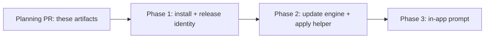

# Phased plan: self-updating local install

**Source plan:** [`plan.md`](plan.md)
**Retained issue:** [mancej-cyc/ai-harness#642](https://github.com/mancej-cyc/ai-harness/issues/642)
**Date:** 2026-08-18

## Incorporated decisions

The operator resolved all load-bearing inputs before decomposition. Each is a requirement below, not
an open question:

1. Install by cloning the repository and running an install script. No Homebrew Cask, no private tap,
   no Jamf, no UMT.
2. Check for updates with the `gh` CLI against this repository's GitHub Releases.
3. Apply an update by rebuilding from source at the release tag, then swapping the app bundle.
4. The updater owns a private clone; the user's own worktree is never touched by it.
5. No percentage rollout in v1.
6. Developer ID signing and notarization are out of scope for v1.

The two decision gates #642 flagged as blocking are both resolved and both dissolved: artifact access
no longer exists as a surface, and the architecture question moved from "which Macs do we build for"
to "the install refuses on a non-arm64 host".

## Investigated findings that changed the plan

Recorded in full in the source plan. The four that changed phase boundaries:

- `gh` is already a hard, already-authenticated dependency
  (`src/server/task-sources/github-issues.ts:21,224-225`), so the update transport introduces no
  credential and needs no phase of its own.
- `make install-app` already builds, packages, and copies to `/Applications`
  (`Makefile:99-104`). Phase 1 extends an existing path rather than inventing one.
- The app cannot replace itself while running, and neither the app bundle nor the updater-owned clone
  survives the swap. The apply step is therefore a detached helper copied to a temporary location
  first. This is the single largest source of implementation risk and it lives in Phase 2.
- There is exactly one existing main-to-renderer push channel, `mission:open-settings`
  (`src/main/index.ts:46-54`), and its `did-finish-load` race guard is the pattern the update state
  push must follow.

## Sizing estimate

**Estimated non-test implementation lines: 1,100 to 1,500.**

Assumptions behind the range: the install script and apply helper are `.mjs` in the established
`scripts/` style with real error handling and idempotency, which is verbose relative to its logic; the
renderer work reuses existing banner and hook conventions rather than introducing a layout system; and
docs prose is excluded from the count while being required in each phase.

Rough distribution:

| Area | Lines |
|---|---|
| Install script, receipt contract, Makefile and docs wiring | 250 - 350 |
| Release Please configuration and release workflow | 80 - 120 |
| `src/shared/update.ts` state union | 60 - 90 |
| `src/main/updater.ts` controller, scheduling, `gh` invocation, version compare | 300 - 400 |
| `scripts/apply-update.mjs` detached rebuild, verify, swap, rollback, relaunch | 200 - 280 |
| Menu, tray, native dialog path | 60 - 90 |
| IPC, preload, ambient declaration | 50 - 80 |
| Renderer hook, banner, App wiring, styles | 250 - 320 |

### Phase-count rationale

The estimate is far above the 200-line one-phase threshold, so more than one phase is permitted. Three
are justified; a fourth is not.

- **Phase 1 cannot merge into Phase 2.** Phase 2's controller compares the running version against a
  release and reads the receipt to find the clone. Both the receipt contract and the existence of
  GitHub Releases are Phase 1 outputs. Combined, the phase would be roughly 1,000 lines spanning CI
  configuration, a shell-level install path, and a main-process state machine, and a reviewer could
  not evaluate the release identity work independently of the runtime work that consumes it.
- **Phase 2 cannot merge into Phase 3.** Phase 2 is the highest-risk work in the plan: a process that
  outlives the app, rebuilds it, and swaps its bundle, with rollback. It needs to be reviewable and
  revertible on its own. It is also independently operable and shippable, because the menu command
  plus a native dialog is a complete update experience for a power user without any renderer change.
- **Phase 3 is a genuine vertical slice**, not a layer split: preload, IPC, declaration, hook,
  component, styles, render tests, and an E2E spec all land together because none of them is
  observable alone.
- **No fourth phase.** Documentation, tests, and packaging changes stay with the behavior that
  introduces them. Signing, Jamf, Intel, and a canary ring are out of v1 scope entirely rather than
  deferred to a cleanup phase.

The native dialog in Phase 2 is not throwaway work replaced by Phase 3. It remains the path used when
the window is hidden, which is the state this app is designed to sit in.

## Phases

| # | Phase | File | Direct prerequisites | Merge unit |
|---|---|---|---|---|
| 1 | Install path and release identity | [`phase-1-install-and-release-identity.md`](phase-1-install-and-release-identity.md) | none | one PR |
| 2 | Update engine and apply helper | [`phase-2-update-engine-and-apply.md`](phase-2-update-engine-and-apply.md) | Phase 1 | one PR |
| 3 | In-app prompt and controls | [`phase-3-in-app-prompt.md`](phase-3-in-app-prompt.md) | Phase 2 | one PR |

Every phase lands entirely in `mancej-cyc/ai-harness`. No phase touches a second repository, so no
phase needs dashboard dispatch with repositories attached.

## Dependency graph

**Concurrency groups:** none. The chain is strictly sequential, and this is a real constraint rather
than a presentation order. Phase 2 consumes Phase 1's receipt schema and needs releases to exist to
test against. Phase 3 consumes Phase 2's `UpdateSnapshot` union and its IPC command names.

**Merge order:** 1, then 2, then 3.

## Cross-phase contracts

These are the interfaces that cross a phase boundary. The phase that owns each is the only one that
may change its shape; later phases consume it.

| Contract | Owner | Consumed by |
|---|---|---|
| Install receipt, split across a browser-safe schema module and a separate I/O module, naming the updater-owned clone path, installed version, release tag, and install timestamp | Phase 1 | Phase 2 |
| Updater-owned clone location and the guarantee that it is clean and updater-exclusive | Phase 1 | Phase 2 |
| `vX.Y.Z` tag equals `package.json` version equals packaged `app.getVersion()` | Phase 1 | Phase 2 |
| Install script contract: idempotent, re-runnable, accepts a target ref, exits non-zero on failure | Phase 1 | Phase 2 |
| `UpdateSnapshot` discriminated union in `src/shared/update.ts`, browser-safe with no `node:` imports | Phase 2 | Phase 3 |
| `mission:update-*` IPC command names and the `mission:update-state` push channel | Phase 3 | none in v1 |
| Quit ordering: `setQuitting(true)` before the app is asked to exit for an update | Phase 2 | Phase 3 |
| Apply helper invocation contract: argv, temporary-copy rule, exit codes | Phase 2 | none in v1 |

## Final audit

Performed over the complete set on 2026-08-18.

- Every requirement in the source plan and every approved decision is owned by exactly one phase.
  Decisions 1 and 2 land in Phase 1, decisions 3 and 4 in Phase 2, decision 5 is a scope exclusion
  recorded in both, and decision 6 removes work from every phase.
- Every consumer follows its prerequisite. No phase reads a contract that a later phase defines.
- Concurrency claims are honest: none are made, because none hold.
- One defect was found and fixed rather than deferred. Documentation had been scoped only into Phase 1,
  which would have left the updater and the banner undocumented and broken the source plan's definition
  of done. `docs/desktop-and-packaging.md` is now scoped into Phases 2 and 3 as well, following the rule
  that documentation belongs to the phase that introduces the behavior. Recorded in both phases' audit
  records.
- Two risks are carried openly in Phase 3 rather than resolved on paper: the flat-versus-namespaced
  preload shape, and the topbar geometry interaction with a new full-width banner. Both are decisions the
  implementing agent should make against the code, with the reasoning recorded in its pull request.
- The final state matches the source plan and depends on no undocumented cleanup.

**Inspector round 1, 2026-08-18.** Three `major` comments, all addressed in the phase files and recorded
in their audit records:

- *Receipt I/O in `src/shared/`* - split into a browser-safe schema module plus a separate I/O module.
  The review's premise that `src/shared/` admits no `node:` imports is contradicted by
  `src/shared/harness-runtime.mjs` and `src/shared/claude-settings.ts`, so the I/O stays there by
  precedent and the split is defensive. Phase 1.
- *Snapshot subscription race* - correct, and the plan was wrong. Read-then-subscribe loses any
  transition landing in the gap; the order is now subscribe-then-read, with an out-of-order guard and a
  test. Phase 3.
- *No E2E for the native controls* - replaced the bare exemption claim with a testable command seam, and
  argued the residual gap explicitly: Chromium cannot drive an Electron menu or native modal, and the
  contract itself names the Electron tests as the layer for what a browser cannot see. **One open
  question for the plan owner** is recorded in Phase 2 rather than decided unilaterally: whether to move
  the menu, tray, and dialog into Phase 3 so this phase has no user-visible surface at all, which would
  satisfy the contract literally at the cost of Phase 2's independent shippability.

**Inspector round 2, 2026-08-18.** One `major` comment, valid and fixed. The cross-phase contracts table
assigned the `mission:update-*` commands and the `mission:update-state` push to Phase 2, which
contradicted Phase 2's own non-goals (it excludes all IPC) and Phase 3's scope (it implements them). The
table was the wrong artifact: Phase 3's inherited-contracts list had correctly omitted IPC all along.
Phase 3 is now recorded as the owner, consumed by nothing in v1. No phase scope changed - only the index
was wrong.

## Final verification strategy

Per-phase gates are in each phase file. Across the whole feature, the plan is done when:

- `npm run typecheck`, `npm run lint`, `npm test`, and `npm run test:electron` pass.
- `npm run build` and `npm run smoke` pass, since build and runtime surfaces change.
- `npm run test:e2e` passes with the Phase 3 spec covering the banner flow against a fake bridge, and
  never spending model tokens or downloading a real artifact.
- A real end-to-end acceptance run, performed manually and recorded on the Phase 2 and Phase 3 pull
  requests: install version N-1, publish N, accept the prompt, confirm the rebuild, swap, relaunch,
  daemon health, and that the existing database reopens.
- A deliberate failure injection: break the build at the target tag and confirm the previous app
  bundle still launches.
- `docs/overview.md` and `docs/desktop-and-packaging.md` match the implemented behavior.
