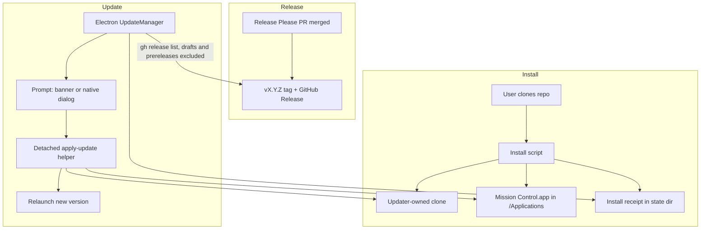

# Self-updating local install for the macOS app

**Status:** Approved root plan, ready for phased implementation
**Date:** 2026-08-18
**Supersedes:** the distribution half of [mancej-cyc/ai-harness#642](https://github.com/mancej-cyc/ai-harness/issues/642)
**Retained issue:** [mancej-cyc/ai-harness#642](https://github.com/mancej-cyc/ai-harness/issues/642)

## Recommendation

A user installs Mission Control by cloning this repository and running one install command. The
installed app then keeps itself current: the Electron main process asks the `gh` CLI whether a newer
stable GitHub Release exists - drafts and prereleases excluded by the query that selects it - prompts
the user, and on acceptance rebuilds the app from that release tag in a clone the updater owns, then
swaps the result into `/Applications`.

Homebrew is not used. Neither is UMT, Jamf, a private tap, a hosted update feed, or any signed
artifact origin. The evidence for removing each is recorded under
[Distribution mechanism investigation](#distribution-mechanism-investigation).

## Why this replaces the Cask plan

Issue #642 proposed a private Homebrew Cask for installation plus `electron-updater` against a
generic HTTPS feed. Internal investigation on 2026-08-18 disproved the premises that plan rested on,
and the operator selected a local-install architecture instead.

The consequences are large and almost entirely subtractive:

| #642 required | This plan | Why |
|---|---|---|
| Developer ID signing, hardened runtime, notarization, stapling | Not required for v1 | The app is built on the user's own Mac and never crosses a download quarantine boundary. The existing ad-hoc signature is what already ships today |
| A private Homebrew Cask and `homebrew-internal` tap repository | Removed | See the investigation below. Homebrew itself is entitlement-gated at Upstart |
| A hosted artifact origin, `latest-mac.yml`, immutable versioned paths, `SHA256SUMS` | Removed | `gh` reads GitHub Releases directly with the user's existing credentials |
| `electron-updater`, Squirrel.Mac, ZIP payload | Removed | The update is a rebuild plus a bundle swap, not a binary patch |
| `stagingPercentage` promotion through 5/25/50/100 | Removed for v1 | Small internal audience. Recovery is a fix-forward patch release |
| Cross-repository Cask pull request | Removed | Single repository. No second repository is touched |
| Release Please owning version, tag, changelog, GitHub Release | **Retained** | The update check needs a trustworthy version signal to compare against |
| Main-process ownership of checks, prompts, and installation | **Retained** | Unchanged ownership split |
| Renderer receives only sanitized state, acts through preload | **Retained** | Unchanged browser boundary |
| `setQuitting(true)` before the app is replaced | **Retained** | Still load-bearing, for the same reason |

Two properties of the new design are worth stating plainly, because they are the reason it is
cheaper rather than merely different:

1. **No credential and no hosting is introduced.** `gh` is already a hard dependency of this
   application and is already authenticated. `src/server/task-sources/github-issues.ts:21` records
   the existing rule verbatim: this "adds NO token storage, no OAuth flow and no new" credential
   surface. The updater inherits that property instead of weakening it.
2. **No Apple developer dependency.** Signing and notarization were #642's longest-lead item and
   required cross-team Apple admin access. A locally built app needs neither.

## Distribution mechanism investigation

Recorded so a later session does not repeat it.

### UMT is the wrong tool

UMT is the "Upstart Magic Tool", a CLI distribution system installed per-developer with
`git clone git@github.com:teamupstart/umt.git ~/.umt && ~/.umt/umt bootstrap`. It manages developer
toolchains (`brew`, `asdf`, language runtimes) inside the engineer's home directory. It has no
manifest, recipe, or catalog format for applications and does not install GUI apps. It is also
effectively unmaintained: the EPA space page states "Officially the EPA team 'owns' UMT but,
realistically, there is nobody remaining on the EPA team with any experience modifying, supporting,
or maintaining UMT."

### The private tap exists and is abandoned

`teamupstart/homebrew-upstart` is real (INTERNAL visibility, created 2021-04-14), and it is not a
usable distribution channel:

- Last push 2022-06-03. Eight commits, all between 2021-02-10 and 2021-04-14.
- Contents are an empty `README.md` and exactly one file, `Formula/openshift-cli.rb`, pinned to
  OpenShift v3.11.
- No `Casks/` directory. It has never distributed a GUI application.
- Its bottle `root_url` is `https://homebrew.bintray.com/bottles/`, and Bintray shut down in May
  2021, so its single formula is also broken.

Homebrew is additionally gated: Jira `TEAM-542963` "Homebrew: Desktop App" grants "access to the
Homebrew installer in ITSS" through Okta group `00gvtzw8d8aGdDkY14x7`. A brew-based install cannot
assume the user has `brew` at all.

### Jamf Self Service is the real internal standard, and is not needed here

For internal macOS GUI apps the documented Upstart path is Jamf Self Service. `UNIFYCHANGE-35`
"Factory (macOS) - Add Package to Jamf Self Service" records the pattern: upload `Factory.pkg` to
Jamf Pro, scope a Smart Computer Group by an Okta group, expose a policy with a Self Service
trigger. `ITENG-730` shows the same route for Codex CLI with a
`jamfselfservice://content?entity=policy&id=983` deep link. Owning team is "IT - Eng & Dev Team".

This is the correct destination if Mission Control ever ships to a broad internal fleet. It is
deliberately not used for v1: it requires a `.pkg` target, an IT ticket per package, IT ownership of
the release cadence, and this repository is not under `teamupstart`. Revisit when the audience
outgrows a self-service clone-and-build.

For completeness, Upstart's default posture for internal HTTP surfaces is VPN and Cloudflare Access
gating with an Okta entitlement under `.upst.dev`, not unlisted URLs. That retires #642's
"link-accessible artifacts" recommendation independently of everything above.

## Verified repository facts

Confirmed against the checkout on 2026-08-18. The claims #642 recorded still hold.

| Surface | Current state | Evidence |
|---|---|---|
| Version | `0.1.0`; no `v*` tag exists; no `CHANGELOG.md` exists | `package.json:3`; `git tag`; repository root |
| Install command | `make install-app` already builds, packages, and copies to `/Applications` | `Makefile:99-104` |
| Documented install | `make app` / `make install-app`, with a quarantine workaround note | `docs/overview.md:158-177` |
| Package config | arm64-only `dmg` plus `dir`; `identity: null`; `hardenedRuntime: false`; `asar: false` | `electron-builder.yml:14,48-61` |
| Release CI | One `package` job on `macos-14`, tag or dispatch only, uploads `release/*.dmg` as a workflow artifact. No release or publish workflow exists | `.github/workflows/ci.yml:335-359` |
| Quit behavior | `win.on("close")` hides unless `isQuitting()`; `before-quit` sets the flag, destroys the tray, stops the daemon | `src/main/window.ts:110-115`; `src/main/index.ts:82-86`; `src/main/lifecycle.ts:5-10` |
| IPC style | Flat `mission:` prefix, registered once in `registerIpc()` | `src/main/index.ts:56-69` |
| Push channel | Exactly one exists, `mission:open-settings`, including a `did-finish-load` race guard | `src/main/index.ts:46-54` |
| Preload bridge | Flat object on `missionDesktop`; `onOpenSettings` returns an unsubscribe closure | `src/preload/index.ts:1-24` |
| Menu and tray | Separate modules taking handler objects; no update command | `src/main/menu.ts:10-35`; `src/main/tray.ts:18-23` |
| `gh` dependency | Already required and already authenticated; error phrasing for missing or unauthenticated `gh` exists | `src/server/task-sources/github-issues.ts:21,224-225` |
| External tool PATH | The app resolves a login-shell PATH before spawning tools | `src/main/path-env.ts:59-63` |
| Updater deps | `electron-updater` and `electron-log` are both absent; `electron-builder` is `^26.15.3` (devDependency) | `package.json:78-89` |
| Fake bridge precedent | `e2e/specs/context-menu.spec.ts:138-172` injects a partial `window.missionDesktop` with `configurable: true` | that file |

## Approved decisions

Selected by the operator on 2026-08-18. These are requirements, not open questions.

1. **Install path:** the user clones the repository and runs an install script. No Cask, no Jamf,
   no tap.
2. **Update transport:** the `gh` CLI against GitHub Releases on this repository. No hosted feed and
   no stored credential.
3. **Update mechanic:** rebuild from source at the release tag, then swap the app bundle. Not a
   prebuilt artifact download, which would reintroduce notarization.
4. **Source clone:** the updater owns a private clone. The user's own worktree is never pulled,
   stashed, or rebuilt by the updater.
5. **Rollout:** no percentage rollout in v1. Recovery is a fix-forward patch release.
6. **Signing:** Developer ID signing and notarization are out of scope for v1.

## Target architecture

### Ownership boundaries

| Owner | Responsibilities | Must not own |
|---|---|---|
| Install script | Establish the updater-owned clone, build, install to `/Applications`, write the receipt | Update scheduling or prompting |
| Electron main process | Schedule and run checks, compare versions, publish safe state, spawn the apply helper, order the quit correctly | Rebuilding or swapping the bundle itself, because it is the thing being replaced |
| Apply helper | Wait for exit, fetch the tag, build, verify, swap, relaunch, roll back on failure | Deciding whether an update should happen |
| Renderer | Present update state and send explicit user actions through preload | Process spawning, filesystem writes, `gh` invocation, version decisions |
| Release Please and CI | Version, lockfile, changelog, tag, GitHub Release | Anything on a user's machine |

### Why the helper must be a detached process outside the bundle

The app cannot replace itself while running. The apply step therefore runs as a detached process that
outlives the app, and it must be copied to a temporary location before it starts, because both the
app bundle and the updater-owned clone are rewritten during the swap. A helper executing from either
location would be replaced mid-run.

## Security and failure rules

- **Only the canonical repository's releases are trusted, on the install path as well as the update
  path.** The slug is one exported constant, not user-configurable in v1, and every `gh` invocation
  passes it explicitly with `--repo`. Without that, `gh` infers the repository from whichever checkout
  it runs in, so the documented install command run inside a fork would install fork-controlled code
  under the same tag name while the receipt and the updater still claimed the canonical repository. An
  install from a non-canonical origin is refused unless explicitly requested, and such an install
  records its real repository and leaves the updater disabled.
- **Select the candidate release from an explicitly filtered list; never filter after asking for "the
  latest".** Drafts and prereleases are excluded by the query that chooses the release, not by a check
  applied to whatever "latest" returned. Filtering afterwards cannot recover: once a prerelease has
  been selected as latest, the check declines it and has no way to reach the newest stable release, so
  every stable user silently stops receiving updates until another stable release ships, with no error
  raised anywhere. Phase 2 carries the exact command and a regression test.
- Never install a version lower than the running one.
- One check and one apply at a time. A repeated action returns the live operation.
- Build into the clone and verify the packaged app's version equals the target tag before swapping.
- Keep the previous bundle until the swap succeeds, and restore it if any step fails.
- The updater is independent of daemon health: a broken daemon must not prevent repairing the app.
- Redact absolute paths and command output that could carry tokens from anything the renderer sees.
- Never send raw `gh` stderr, exception stacks, or filesystem paths across the preload bridge.
- Preserve `asar: false`, the `files` allowlist, `skills/`, and the daemon state directory.
- The updater publishes a `disabled` state, with a reason, when it is not packaged or has no receipt.

## Known boundaries and non-goals

- **Not the LaunchAgent.** `scripts/install-service.mjs` installs a daemon LaunchAgent that runs from
  a repository clone via `tsx`. Updating the app bundle does not update a LaunchAgent pointed at a
  different clone. v1 documents this rather than unifying it.
- **Not the user's dev worktree.** By decision 4 the updater never touches it.
- **Not Intel.** `electron-builder.yml` pins `arch: arm64`. The install script refuses on a non-arm64
  host with a clear message rather than silently producing a broken build.
- **Not a downgrade path.** Recovery is a higher patch version.
- **Not Windows or Linux.** The install script targets macOS, as `install-service.mjs` already does.
- **No telemetry.** A local rotating update log only.

## Definition of done

- A clean supported Mac installs the app by cloning the repository and running one documented command.
- The install writes a receipt naming the updater-owned clone and the installed version.
- The packaged app checks GitHub Releases through `gh` without any stored credential.
- An eligible update produces an accessible in-app prompt, and a native path when the window is hidden.
- The user can defer or accept; accepting rebuilds, swaps, and relaunches into the new version.
- A failed build or verification leaves the previous working app in place.
- The quit ordering is not trapped by hide-on-close, and the daemon shuts down cleanly.
- The updated app reopens the existing Mission Control database.
- Release Please owns the version, lockfile, generated `CHANGELOG.md`, tag, and GitHub Release.
- Typecheck, lint, unit, Electron, build, smoke, and E2E pass at their appropriate gates.
- `docs/overview.md` and `docs/desktop-and-packaging.md` match the implemented behavior.

## Open inputs

None blocking. Deferred by decision: Jamf packaging if the audience broadens, a prerelease canary
ring, Intel support, and signed prebuilt artifacts if local build time becomes a real problem.
