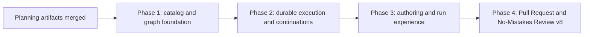

# Phased implementation: SessionAction workflow stages

Source plan: [`plan.md`](plan.md)

Status: scheduled for implementation

## Approved product decisions

The source plan records three approved decisions. They are requirements for every phase:

1. SessionActions are revisioned reusable library entities. A published workflow snapshots the
   selected action's exact name, description, prompt, required skill, completion adapter, source
   id, and source revision.
2. SessionAction stages may appear anywhere in a pipeline. When the bound session finishes the
   action, Mission Control captures fresh evidence and activates only downstream stages against
   that new evidence.
3. Inspector remains the immutable post-End completion policy. Pipeline and run surfaces render it
   as a fixed footer stage, but Graph view and the persisted graph gain no Inspector node.

## Investigated findings that determine the split

### One submission currently means one repair round and one evidence snapshot

`workflow_submissions` has a unique `(run_id, round)` index. Every new submission activates from
Session, and node attempts plus edge receipts are scoped to that submission. Continuing after a
mutating session turn cannot reuse the parent submission without making attempts on different
evidence look equivalent. It also cannot use the existing repair submission path because that
restarts the graph and consumes the repair budget.

Phase 2 therefore owns a durable `(round, segment)` continuation model. No authoring surface is
released before this runtime and its restart tests exist.

### SessionAction is a stage kind, not a third evaluator

Persona and Check nodes both evaluate one immutable submission, emit pass/fail, and may share an
all-pass Join. SessionAction writes to the bound conversation, waits, may change the repository,
and emits completion rather than a verdict. Phase 1 changes the stage projection to a
discriminated union and adds an append-only `complete` port. It must not coerce action output into
`PersonaVerdict` or route infrastructure failure back to Session.

### Pull Request already has a legacy post-End implementation

`WorkflowManager.preparePr`, `renderPrHandoff`, the `pr_handoff` delivery kind, required-skill
resolution, delivery consent, uncertain-write handling, and Inspector PR provenance already serve
No-Mistakes Review versions 5 through 7. Phase 4 extracts reusable mechanics but preserves that entry path
for every pinned legacy version. The new built-in action uses a new generic action delivery linked
to a node attempt; historical `pr_handoff` rows and recovery remain readable.

### A settled idle needs durable pickup proof

The session is usually idle immediately before Mission Control injects an action. That stale state
cannot count as completion. Phase 2 persists the post-send transcript anchor, requires a later
pickup signal, then waits for `settledIdle` while excluding `needs-you`. This rule must survive a
daemon restart and applies to every completion adapter.

### Inspector stays outside the graph

The existing graph, validator, engine, and published contracts deliberately exclude Inspector.
Converting it to a node would combine a second lifecycle migration with SessionAction. Phase 3
adds a fixed footer projection only. End remains graph success; Inspector still claims that success
through `WorkflowCompletionPolicy`.

## Phase graph

| Phase | File | Outcome | Direct prerequisites |
|---|---|---|---|
| 1 | [`phase-1-catalog-and-graph-foundation.md`](phase-1-catalog-and-graph-foundation.md) | Revisioned SessionAction catalog, immutable snapshots, graph node, stage union, and hidden authoring foundation | Planning artifacts merged |
| 2 | [`phase-2-durable-execution-and-continuations.md`](phase-2-durable-execution-and-continuations.md) | Crash-safe action delivery, pickup/settle observation, fresh-evidence segments, and downstream-only activation | Phase 1 |
| 3 | [`phase-3-authoring-and-run-experience.md`](phase-3-authoring-and-run-experience.md) | SessionActions library UI, Pipeline/Graph authoring, run presentation, and fixed Inspector footer | Phase 2 |
| 4 | [`phase-4-pull-request-and-no-mistakes-v8.md`](phase-4-pull-request-and-no-mistakes-v8.md) | Verified Pull Request adapter, legacy handoff compatibility, No-Mistakes Review v8, and final docs | Phase 3 |

## Scheduled Mission Control tasks

| Phase | Task id | Direct task prerequisite | Planning-session prerequisite |
|---|---|---|---|
| 1 | `f5c2d81d-8c76-403f-b2bd-75b9700184cc` | None | Yes |
| 2 | `bdd16d0b-3ff5-4d9a-a8e2-bd55b12acc22` | Phase 1 | Yes |
| 3 | `98c96169-441e-4729-baf8-37ea76f8b46c` | Phase 2 | Yes |
| 4 | `8b79a2d5-ae63-472c-bdbf-5ebb7da39481` | Phase 3 | Yes |

Each task embeds its complete phase Markdown under `Authoritative phase instructions` and links
back to the source plan, phased index, and phase file. The direct task edges intentionally form a
serial chain. The current-session edge keeps every phase backlogged until this planning pull
request merges.

## Concurrency and merge order

There is one concurrency group per phase. The implementation is intentionally serial:

1. Phase 1 owns durable names, schemas, graph ports, snapshots, and stage shapes consumed by every
   later phase.
2. Phase 2 changes `workflow_submissions`, attempts, deliveries, engine activation, capture, and
   recovery. Phase 3 cannot honestly expose arbitrary action placement before that lands.
3. Phase 3 owns shared builder and run components that Phase 4 extends with PR-specific states and
   the fixed built-in pipeline.
4. Phase 4 changes the existing PR handoff, Inspector-facing presentation, built-in workflow
   catalog, and the final documentation. Running it beside Phase 3 would create direct conflicts in
   run UI, workflow stages, styles, and README prose.

No phase may be merged out of order. Each scheduled task depends directly on the preceding phase
and on the active planning session, whose PR carries these artifacts.

## Cross-phase contracts

### Names and persisted identifiers

- `session_action` is the graph node and new delivery kind spelling.
- `complete` is the action's only graph source port.
- `session_turn` and `pull_request` are the first append-only completion adapter ids.
- `waiting` is appended to node-attempt states.
- `pr_handoff` remains a readable and executable legacy delivery kind.
- No existing node kind, source port, attempt state, delivery kind, check slot, built-in id, or
  workflow version id is renamed or reordered.

Phase 1 owns these spellings. Later phases consume them without aliases.

### Evidence identity

- `round` continues to count repair rounds.
- `segment` counts immutable evidence snapshots inside one repair round.
- only fail/repair increments `round` and restarts at Session;
- SessionAction completion increments `segment`, captures fresh evidence, and resumes from the
  completed action's `complete` route;
- every node attempt reads exactly one segment's context and evidence;
- action segments never consume `maxRepairRounds`.

Phase 2 owns the migration and every query change needed to keep these statements true. UI in
Phase 3 must display them, not reinterpret them.

### Delivery and completion

- exact action prompt text comes from the immutable published snapshot;
- optional skill ids resolve to harness-native commands at preparation and immediately before send;
- Preview prepares but never types;
- Live uses the existing Workflows switch, repository allowlist, note identity, pane lock, and
  uncertain-write policy;
- pre-delivery idle never completes an action;
- generic completion requires pickup followed by settled idle;
- Pull Request completion additionally requires matching durable PR provenance;
- action refusal or infrastructure failure never becomes a Persona failure or repair packet.

### Built-in and legacy behavior

- built-in SessionActions are compiled app data, not seeded rows;
- workflow versions snapshot actions and never consult mutable action text at runtime;
- No-Mistakes Review versions 1 through 7 remain byte-compatible and keep their legacy post-End PR
  preparation behavior;
- version 8 alone adds the Pull Request graph stage and changes its missing-PR policy to `wait`;
- Inspector remains the only PR review poller and remains outside persisted graphs.

## Merge checkpoints

After each phase, audit the next phase against the merged source rather than assuming line numbers
or temporary APIs survived review:

1. Re-run typecheck, lint, focused and full tests, build, and smoke as required by the phase.
2. Re-open an old workflow graph and a built-in version through the current store.
3. Re-check the append-only tuples and database upgrade fixture.
4. Re-read the downstream handoff and update it if review changed an owned contract.
5. Do not release hidden authoring controls until Phase 2 recovery tests pass.

## Final verification strategy

The completed sequence must prove these end-to-end cases:

1. Create and publish a custom SessionAction between two evaluation stages. The action is sent
   once, the session picks it up and settles, a new segment is captured, upstream attempts remain
   on the parent evidence, and only downstream nodes activate on the child evidence.
2. Put two actions in one repair round. Each creates one ordered segment and neither spends the
   repair budget.
3. Fail an evaluator after an action. The repair submission starts the next round at Session and
   reruns the whole graph.
4. Stop the daemon at every action boundary and verify recovery never sends or completes twice.
5. Run No-Mistakes Review v8. Pull Request invokes the required skill, waits for matching durable
   PR provenance and fresh evidence, reaches End, then enters the fixed Inspector footer.
6. Bind and execute a version 1 through 7 workflow and verify its immutable graph and legacy PR
   handoff remain unchanged.
7. Exercise Preview, Live unauthorized, refused, uncertain, needs-input, exited session, stale
   conversation, wrong PR, delayed PR, and already-matching PR paths.

The final phase runs `npm run typecheck`, `npm run lint`, `npm test`, `npm run build`, and
`npm run smoke`, plus Electron/runtime visual verification for the library, builder, run view,
Board ladder, and Inspector footer.

## Artifact audit

- Every approved decision is owned: Phase 1 owns the entity and graph shape, Phase 2 owns arbitrary
  placement semantics, Phase 3 owns reusable UI and footer presentation, and Phase 4 owns verified
  PR behavior and the built-in pipeline.
- Every source-plan requirement appears in exactly one phase's scope and in later phases only as an
  inherited contract.
- There are no claimed parallel phases with overlapping contracts or files.
- No phase leaves a visible action node that the runtime cannot execute.
- Documentation lands with the phase that exposes or changes the corresponding behavior.
- HTML rendering is omitted because the `html-plans` skill is not available in this session; the
  Markdown source and detailed phase files are authoritative.
