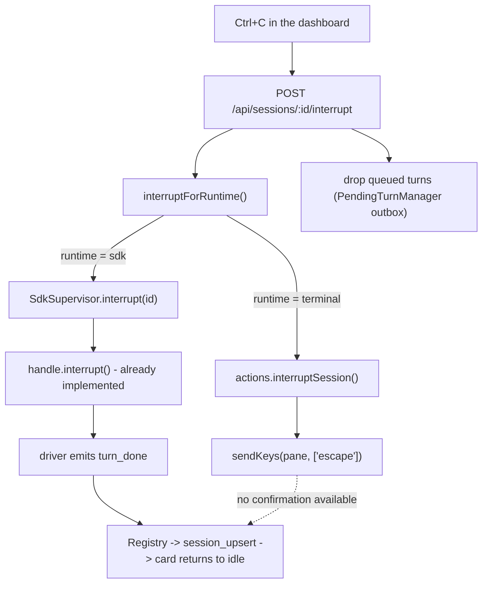

# Session interrupt - stop a running agent with Ctrl+C

Give the operator one gesture that stops whatever the selected agent is doing right now,
clears what was queued behind it, and puts the cursor in the composer - so the next
instruction can be typed immediately instead of after the agent finishes work nobody
wants any more.

## The problem

Today the dashboard has exactly two ways to make an agent stop: wait, or kill the whole
session. `POST /api/sessions/:id/kill` terminates the session - it does not interrupt a
turn. There is nothing between "let it run" and "end it".

That gap is felt every time an agent is sent down the wrong path. The operator watches it
spend minutes on work that is already known to be wrong, because the only alternative
destroys the conversation that holds all the context worth keeping.

## The approved shape

**Ctrl+C is the dashboard gesture. The wire action is per-runtime, and it is not Ctrl+C.**

This distinction is the whole design. In both the Claude Code and Codex TUIs, `Esc`
interrupts the running turn while `Ctrl+C` clears the input line and, pressed twice,
quits the CLI. Forwarding the operator's literal Ctrl+C to a terminal pane would kill the
session it was meant to interrupt. The repository already knows this - `codex/sdk.ts:466`
refers in passing to "the pane path's Escape".

So one gesture resolves to one of two mechanisms:

| runtime | mechanism | status today |
|---|---|---|
| `sdk` | the driver's own interrupt primitive | **already implemented**, private |
| `terminal` | `Escape` into the bound pane | key does not exist in the vocabulary |

### Submitted decisions

These were selected by the operator and are requirements, not open questions:

1. **Scope: both runtimes, SDK first.** Two merge units. The SDK path is a route and a
   control over drivers that already work; the terminal path is a vocabulary change that
   touches four backends. Splitting them keeps each pull request reviewable, and the
   first is independently useful the day it lands.
2. **Binding: `ctrl+c`, yielding to an active text selection.** Ctrl+C is copy on Windows
   and Linux, which the Electron shell inherits. When there is a live selection the
   browser keeps the keystroke; otherwise it stops the agent. Rebindable like every other
   action.
3. **Follow-through: stop, drop the queue, focus the composer.** Interrupting while
   leaving queued turns to fire afterwards would restart the work the operator just
   stopped. The queue is cleared and the composer takes focus, because typing the
   replacement instruction is the reason the gesture exists. See the finding below on
   which queue that actually is.
4. **Feedback: a transient "interrupting" presentation.** The terminal path is
   fire-and-forget - an `Escape` written into a pane cannot be confirmed - so the card
   shows an optimistic interrupting state that resolves on the next real reading or times
   out back to working.

## Request flow

The new path reuses the existing runtime fan-out rather than adding a second one.
`injectPromptForRuntime` (`src/server/sdk/deliver.ts`) and `requestSessionStop`
(`src/server/sdk/control.ts`) are the two templates; interrupt becomes the third helper
of the same shape.

The dashed arrow is the honest part of the picture: on the terminal runtime nothing
reports back that the interrupt landed, which is what decision 4 exists to present.

## Verified findings

Checked against the repository at `eee83d2`.

**The SDK drivers already interrupt.** `SdkSessionHandle.interrupt()` is declared at
`src/server/harness/types.ts:676` and implemented by both drivers -
`src/server/harness/claude/sdk.ts:412` calls the vendor SDK's `query.interrupt()`, and
`src/server/harness/codex/sdk.ts:463` issues a `turn/interrupt` RPC. Nothing above the
driver reaches them: the only callers are `stop()` and `clearContext()`. There is no
supervisor method, no route, no protocol type, no API client method, and no UI. Pi has no
driver at all (`sdk: null`), so it is terminal-only by construction.

**The turn bookkeeping reconciles itself.** This corrects the assumption a first reading
suggests. `sdk_sessions.turn_in_progress` and the supervisor's in-memory `unfinishedTurns`
drive restart recovery, and an interrupt that left them set would have the daemon re-drive
the cancelled turn. But they are maintained by the event pump, not by the caller: a
`turn_done` event decrements and rewrites both (`supervisor.ts:772-777`). Both drivers
emit `turn_done` after an interrupt - Claude on the CLI's `result` message
(`claude/sdk.ts:849`), Codex through `turn/completed` into `finishTurn`
(`codex/sdk.ts:858`, `:1083`). So the interrupt control must **not** adjust that
bookkeeping by hand; doing so would double-decrement. The phase's job is to pin the
self-reconciliation with a test.

**Not serializing the interrupt has a precedent.** `SdkSupervisor.send()` runs through a
per-session FIFO (`serialize()`), and an interrupt queued behind the turn it is meant to
stop is useless by definition. `stop(id)` is already documented as "deliberately NOT
queued behind pending sends" (`supervisor.ts:472`) for exactly this reason. Interrupt
follows `stop`, not `send`.

**The terminal key vocabulary has eight keys and no escape.**
`src/server/terminal/types.ts:105` defines `KEYS` as `enter`, four arrows, `shift-up`,
`shift-down`, `shift-tab`. Every backend renders a total `Record<Key, string>`, so adding
one key fails typecheck in tmux, wezterm, ghostty, and cmux until each declares what it
looks like. Three test files iterate `ALL_KEYS` and will require the same.

**The queue to drop is Mission Control's outbox, and only that one.** A first reading of
the vendor SDK suggests otherwise, so this is worth stating precisely. The Claude Agent
SDK does maintain a driver-side command queue and its wire protocol does expose
`cancel_queued` - described in the vendored types as what "a remote UI's Stop button"
sets. But the public `Query.interrupt()` in the pinned version (0.3.220) **takes no
arguments** (`sdk.d.ts:2293`), so `cancel_queued` is not reachable through the API this
driver uses, and neither is the `cancel_async_message` follow-up.

That turns out not to matter, because Mission Control never builds a driver-side queue.
There are exactly two send paths: `deliver.ts:57` calls `supervisor.send()`, which is
serialized and whose mid-turn deliveries *steer* into the active turn rather than queue
behind it; and `pending-turns.ts:538` calls `sendWhenIdle()`, which by construction only
delivers to an idle session. Queued work lives in `PendingTurnManager`
(`src/server/pending-turns.ts`), which has per-turn `recall`. So decision 3 is satisfied
by dropping the outbox rows. The interrupt receipt's `still_queued` should be logged
rather than acted on - the local wrapper type currently discards it
(`claude/sdk-types.ts:86` declares `interrupt(): Promise<unknown>`) - and a non-empty
list would be a genuine surprise worth seeing.

**Ctrl+C reaches the handler from inside the composer, which is wanted.** App.tsx's
keydown handler skips shortcuts while typing, except for chords carrying ⌘ or ⌃
(`chordHasCommandModifier`, `keybindings.ts:399`). Ctrl+C qualifies, so the gesture works
mid-sentence while composing the replacement instruction.

**But copy does not only live in the composer, and that is where decision 2 has teeth.**
The handler's `typing` flag (`App.tsx:1418`) is true only for focus inside
`input, textarea, select, [contenteditable='true']`. Selecting a transcript line, a diff
hunk, or captured terminal output is none of those, so such a selection falls straight
through to the shortcut dispatch at `:1834`, which calls `preventDefault()` unconditionally
once a card is selected (`:1839`) - as does the board-overview arm. Copying read-only text
off a card is the most common copy in this app, so the selection yield has to be a gate
ahead of every dispatch path rather than a condition inside the composer bypass. Placed
wrongly, the gesture would ship having broken copy for the case operators use most.

**`Escape` cannot be the binding.** `RESERVED_KEYS` (`keybindings.ts:285`) blocks Escape
from being bound at all - it owns the overlay-peel ladder. This constrains only the
dashboard chord; Escape remains the byte written into the pane.

**A new `SessionState` is the expensive way to show "interrupting".** The union at
`src/shared/types.ts:59` is a wire contract with exhaustive records over it in
`session-contracts.test.ts`, `format.ts` tone mapping, board columns, and the console
rail. The existing `stopping` state is close but means eviction is coming, which is a
different promise. Decision 4 is therefore satisfied with client-side optimistic state
cleared by the next `session_upsert`, leaving the durable union untouched.

**The capability must split across the shared/server boundary.**
`HarnessCapabilities` (`src/shared/harness-capabilities.ts:338`) is browser-safe and
cannot import `Key` from `src/server/terminal/`. It carries only what the browser asks -
whether to offer the control - while the concrete keystroke lives beside `ControlSpec` in
each `src/server/harness/*/control.ts`. This is the split `runtimes`/`sdk` and
`resumes`/`resume` already use, including their "one fact in two files" agreement tests.

## Scope

**In scope:** interrupting the current turn on both runtimes; dropping the session's
queued turns; the `ctrl+c` binding with selection yielding, including from inside the
composer; the transient interrupting presentation; a visible control in the action bar so
the gesture is discoverable; Playwright coverage on both runtimes.

**Out of scope:** interrupting from the conversation transcript's own reply box beyond
what the global binding already provides; interrupting a session that is not the selected
one; any change to `kill` semantics; queue-aware interrupt for the Foreman or workflow
origins beyond dropping their outbox rows like any other.

## Phasing

Split into two merge units, indexed in [phased-plan.md](phased-plan.md):

1. **SDK runtime interrupt, end to end** - the capability slot, the supervisor control,
   the route, the queue drop, the binding, the presentation, and the action-bar control.
   Terminal sessions get the control in a disabled state with a reason.
2. **Terminal runtime Escape path** - the `escape` key across four backends, the guarded
   pane writer, and the capability declaration that lights the control up for terminal
   sessions.
