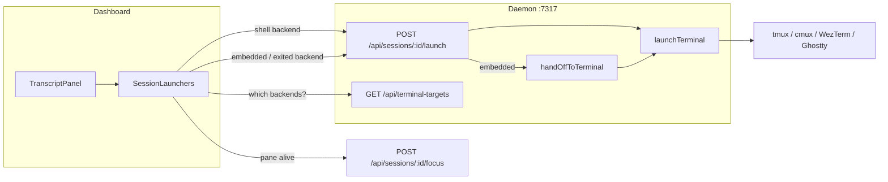

# Open a terminal, or the session's own agent CLI, from the conversation pane

Two controls at the top of every conversation. **Terminal** opens a shell in the session's
worktree. The agent control focuses a live pane, hands a live embedded conversation to a
terminal, or resumes an exited conversation whose checkout and id survive.

Mockups: `docs/mockups/session-launchers/index.html`. Option 01 (conversation toolbar) was
selected, along with three behavioural decisions recorded under
[Decisions taken](#decisions-taken).

## The idea this rests on

The **Terminal** button opens the backend list. The agent control is plain only when it can
focus a live pane; every no-pane state that can safely continue opens the same backend list:

| Button | argv |
|---|---|
| Terminal | the operator's shell (`$SHELL`, else `/bin/sh`) |
| Agent, live pane | none - use the existing focus route |
| Agent, embedded | the existing `handOffToTerminal` lifecycle, through the selected backend |
| Agent, exited | the harness's resume argv, through the selected backend |

So this introduces **no new backend registry**. `launchHome({ name, cwd, argv, sidePane })`
(`src/server/terminal/home.ts`) already proved the adapters can open a window at a cwd. This
plan adds one target-specific launcher over that registry, one route for the shell and agent
payloads, delegates embedded sessions to the existing handoff, resumes exited conversations
under an exclusive claim, adds one browser-readable view of which backends can open a
window, and adds one toolbar.

What it does add is a **capability that was declared in the wrong place** - see phase 1.

## Decisions taken

1. **Placement: option 01, the conversation toolbar.** A `flex: none` row becomes the first
   child of `TranscriptPanel`, above the scrolling log. `TranscriptPanel` *is* the
   conversation pane, so one component reaches every layout that shows a conversation -
   Cards (`SessionCard` when expanded) and Console/Board (`ConsoleDetail`). There is no
   parity rule to remember and nothing for a fourth layout to forget. `SessionTile` and
   `RailRow` render no transcript and are correctly untouched.

2. **The agent button never resumes beside a live pane.** Opening
   `claude --resume <id>` beside a live pane starts a second process on one conversation
   file. So the button *focuses* when there is a pane and uses the existing handoff when the
   session is embedded (`runtime: "sdk"`), stopping its live driver before reopening the
   conversation. The focus case is a plain button with no terminal to choose. Embedded and
   exited sessions open the backend chooser; an exited session resumes only when its
   checkout and conversation id survive.

3. **Ship the four backends that exist.** tmux, cmux, WezTerm, Ghostty. Terminal.app,
   iTerm2, Kitty and Alacritty are not "off" - there is no adapter, and adding one is an
   `EmulatorId` plus a full `TerminalEmulator` implementation, which is its own piece of
   work. They are not listed at all rather than listed as permanently unavailable: a row
   for something this build has no adapter for is a promise, not a capability.

## Phase 1 - resuming is a harness capability, not an embedded-driver one

**The defect this fixes existed before this change.** The argv that continued a conversation
lived on
`SdkSpec.resumeArgv` (`src/server/harness/types.ts`), so the fact "how do I continue this
conversation from a terminal" is reachable only for a harness that also happens to have an
embedded driver. Pi has no driver, although its CLI can resume a session; any future
terminal-only harness would have the same false negative. Measured against the installs on
this machine, all three harnesses can do it:

| Harness | Resume argv | Measured against |
|---|---|---|
| claude | `--resume <id>` | already shipping in `claude/sdk.ts` |
| codex | `resume <uuid>` | `codex resume --help` - "Session id (UUID) or session name" |
| pi | `--session <id>` | `pi --help` - "Use specific session file or partial UUID" |

These are measured, not assumed. `HARNESSES.codex.tui` is the standing example of what
declaring a capability `null` on an assertion nobody checked costs.

Changes, following the purity split the harness registries already use:

- **`@shared/harness-capabilities.ts`** gains `resumes: boolean` - the pure half, "can this
  harness continue a conversation from its CLI at all". The browser needs this to label and
  disable the control and cannot import a spec that calls `statSync`.
- **`src/server/harness/types.ts`** gains `resume: ResumeSpec | null` on `Harness`, where
  `ResumeSpec = { argv(agentSessionId: string): readonly string[] }` - the impure half.
- **`SdkSpec.resumeArgv` is deleted.** `sdk/handoff.ts` reads `resumeFor(session.agent)`
  instead. One fact, one place; today it is one fact in a place only one harness can reach.
- A test pins that `resumes` and `resume` agree, the same one-fact-in-two-files pin
  `harness-sdk.test.ts` applies to `runtimes` / `sdk`.

`null` stays a first-class answer: a harness that genuinely cannot resume declares it and
every reader takes the already-tested unavailable path.

## Phase 2 - what can open a window here, and one route that does it

### `GET /api/terminal-targets`

Modelled on `GET /api/open-targets`, including its browser-side 60s cache
(`src/web/lib/openTargets.ts` is the shape to copy). Returns one row per registered backend:

```ts
interface TerminalTargetView {
  id: TerminalBackendId;
  label: string;      // from the adapter
  glyph: string;      // new required field on Multiplexer / TerminalEmulator
  blurb: string;      // "New tab in the worktree."
  detail: string | null;  // "cli spawn --cwd", when nameable
  unavailable: string | null;  // null when usable, else WHY
}
```

`unavailable` is a **sentence, never a boolean**, for the reason `OpenTargetView` gives:
"tmux is not installed" and "tmux is installed but nothing can raise it" are different
things for a human to do.

Availability per axis:

- **Emulator**: `spawn` non-null and `binPresent(bin)`.
- **Multiplexer**: `sessions` non-null and `binPresent(bin)` **and** its `attachArgv` is
  non-null **and** some emulator is available to run that argv. `spawnDetached` creates a
  *detached* session - correct for a dispatched agent, invisible for "open me a terminal".
  A tmux row that opened nothing would be the worst kind of working button. When it is
  available the row says so: "New session, raised in WezTerm". cmux draws its own window and
  declares `attachArgv: null`, so it is judged on `spawnDetached` alone.

Nothing is cached server-side - same reasoning as `binPresent`, which reads the filesystem
on every 1500ms discovery tick.

`glyph` becomes a required field on both adapter interfaces rather than a lookup table in
shared, so a new backend does not compile until it says what it looks like - the same
enforcement `Record<AgentType, …>` gives the harness axis.

### `POST /api/sessions/:id/launch`

Body validated by `LaunchSessionTerminalSchema` in `@shared/protocol.ts` through `parseBody`:

```ts
{ backend: z.enum(TERMINAL_BACKEND_IDS), payload: z.enum(["shell", "agent"]) }
```

Order of refusals:

1. Unknown session → 404.
2. `payload: "agent"` with `"focus"` → 409 naming the existing focus action.
3. `payload: "agent"` with `"handoff"` → the existing `handOffToTerminal` lifecycle through
   the selected backend.
4. `payload: "agent"` with `"resume"` → claim the lingering session id, transfer any active
   task binding before launch, and run the harness's measured resume argv through the
   selected backend. A repeated request is refused while the claim is held.
5. Any other agent result → 409 with `agentLaunchBlockedReason(session)`. **The daemon owns
   this rule, and the browser reads the same predicate to decide the button's shape** - the
   two must not disagree, the same reason `resolveDispatchRuntime` composes
   `resolveSessionRuntime` rather than restating it.
6. Shell payload with `!session.cwd` → 400, "this session has no checkout to open a terminal
   in". `Session.cwd` is genuinely nullable: discovery could not read the process cwd and no
   pane reported a path.
7. Selected backend unavailable → 409 with the same sentence the view carries.

Both payloads ultimately reach
`launchTerminal(backend, { name, cwd: session.cwd, argv })`, restricted to the requested
backend. Only their daemon-owned argv and lifecycle differ.

The route **never resolves a shell from the checkout.** `$SHELL` comes from the daemon's own
environment with `/bin/sh` as the floor; a repo-supplied value would be arbitrary code
execution on a click.

### The shared predicate

`@shared/session-launch.ts`:

```ts
agentLaunchAction(session): "focus" | "handoff" | "resume" | null
agentLaunchBlockedReason(session): string | null
```

`"focus"` for a running session with a pane. `"handoff"` for a live SDK session whose
harness can resume and whose checkout and conversation id are known. `"resume"` for an
exited session with the same durable facts, ignoring its lingering pane handles. `null`
otherwise, with a sentence saying why. It takes the narrow shape `canMessage` takes, not a
whole `Session`, so a `DiscoveredSession` caller can use it too.

## Phase 3 - the toolbar

`src/web/components/LaunchMenu.tsx`, structured exactly like `OpenInMenu.tsx`:

- `LaunchList({ targets, failed, onChoose })` exported separately so `renderToStaticMarkup`
  tests can reach it without a DOM.
- `SessionLaunchers({ session })` renders the pair.
- The same four effects: close when disabled, a **capture-phase** `keydown` using
  `stopImmediatePropagation()` for Escape and ArrowDown/ArrowUp, a capture-phase
  `pointerdown` dismiss, and initial focus of the first enabled row. These are grepped for
  by `open-in-menu.test.ts` today and will be by the new test - the app has global chords on
  every key, so a menu that only calls `stopPropagation()` still fires them.

Mounted as the first child of `.transcript` in `TranscriptPanel.tsx`. That component's
`sessionId` / `agent` props collapse into one `session: Session` prop - both call sites
(`SessionCard.tsx`, `ConsoleDetail.tsx`) already hold the full session, so this is fewer
props, not more.

The agent button wears the harness accent through the inline `--agent-accent` that
`agentAccentStyle` already puts on `.transcript`. **No vendor name reaches `styles.css`** -
`agent-accent.test.ts` fails if one does. New rules go in a `/* ---- conversation launchers
---- */` section beside the transcript section, not at the end of the file.

Layout consequences to check rather than assume:

- `.transcript` is `display: flex; flex-direction: column`, and both
  `.card.expanded .transcript-log` and `.detail-conv > .transcript .transcript-log` rely on
  `flex: 1 1 auto; min-height: 0`. The toolbar must be `flex: none` or it competes with the
  log for height.
- The popover is right-anchored (`right: 0`), which is correct here because the controls sit
  at the right edge of the strip. This was a real bug in the option 03 mockup, where the
  same anchor put 306px of menu off the left of the pane.
- Console detail CSS reaches into the transcript with descendant selectors
  (`.detail-conv > .transcript`), so changing this DOM has no compile-time signal in the
  console layout. Both layouts get opened before this is called done.

No keyboard shortcut ships in this change. The README invariant is that every shortcut works
in every layout, and adding one means `ActionId` + `ACTIONS` + a dispatch branch + an
`ActionBarHandle` method + a `CommandBar` keycap + a README row + a `keybindings.test.ts`
case. Worth doing once the placement has been lived with, not on the same change.

## Data flow



The agent button focuses an existing pane directly. Embedded and exited sessions use the
same chooser as the shell launcher, then POST the selected backend to the launch route.

## Tests

`node:test` + `node:assert/strict`, flat in `test/`, each opening with what is at stake.

| File | Pins |
|---|---|
| `harness-resume.test.ts` | `Record<AgentType, ResumeSpec \| null>` is complete; `resumes` and `resume` agree; `handoff.ts` composes argv from the harness, not `SdkSpec` |
| `terminal-target-contract.test.ts` | Driven with injected deps so every branch is testable off-platform: an uninstalled backend refuses with a sentence and **spawns nothing**; tmux is unavailable when no emulator can raise it and says so when one can; cmux is judged without `attachArgv` |
| `session-launch-http.test.ts` | Via `buildApp` with stub registries: unknown session, no cwd, an unregistered backend id rejected by the enum, `payload: "agent"` on a pane-backed session refused with the focus sentence, missing `agentSessionId` refused, exited resume claims and task transfer, and the shell argv never read from the checkout |
| `session-launch-predicate.test.ts` | Every session shape maps to focus / handoff / resume / blocked; exited sessions ignore stale panes and require durable resume facts |
| `launch-menu.test.ts` | `renderToStaticMarkup` over `LaunchList`: an unavailable row is `disabled` and shows the reason *instead of* the blurb; a failed fetch reads differently from an empty list; the component contains no backend id or vendor string; the Escape handler greps as capture-phase with `stopImmediatePropagation()` |

## Done means

- README gains a section under the session capabilities describing the Terminal menu, the
  agent button's focus/handoff/resume behavior, and which four backends are supported.
- No `CHANGELOG.md` edit.
- All three layouts opened in a real build against a real session before this is called
  done - a diff is not evidence a UI works, and `:5173` serves whichever checkout started
  it, not necessarily this worktree.

## Deliberately not in scope

- **An iTerm2 / Terminal.app adapter.** A new `EmulatorId` and a full `TerminalEmulator`
  implementation, AppleScript-driven the way Ghostty is. Its own change.
- **A remembered default per button** (mockup option 04). It needs a persisted preference
  and a first-run answer; revisit once the placement has been used.
- **A keyboard shortcut**, for the reason given in phase 3.
- **Opening a terminal on a session with no checkout.** Both launchers render disabled with
  a sentence rather than disappearing, so the control does not flicker as discovery
  settles.
