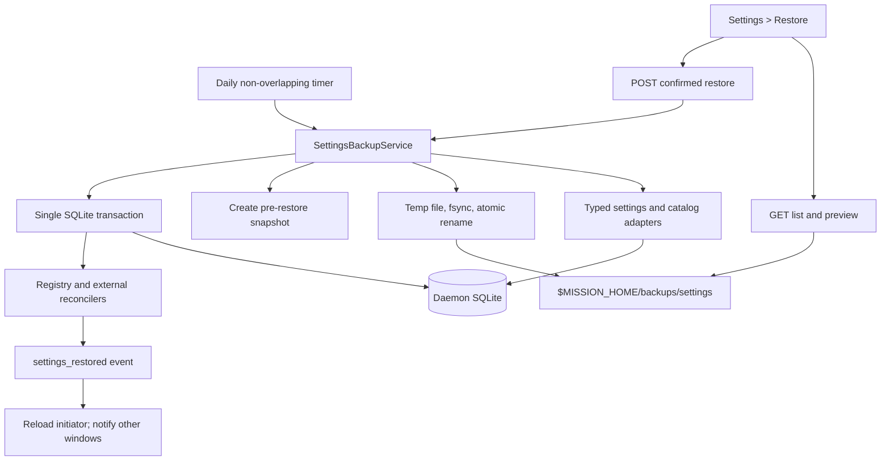

# Daily settings backup and restore

## Plan status

Approved in Mission Control review `ab03c39b-0ed0-4ac1-8f02-4241656cf162`. The implementation will
use versioned logical JSON snapshots retained for 90 daily generations plus 10 pre-restore safety
generations. The approved design also enforces an
automatic-or-red coverage invariant: every new Settings control is either backed up automatically
or makes typecheck or a focused coverage test fail until its restore behavior is declared.

## Outcome

Mission Control will create one durable snapshot of operator-owned configuration for every local
calendar day the daemon runs. Snapshots live under
`$MISSION_HOME/backups/settings/`, which resolves to
`~/.mission-control/backups/settings/` on a default installation. A new **Restore** category in
Settings lists compatible snapshots, previews what a selected snapshot would change, and restores
it only after explicit confirmation.

The snapshot includes all daemon-backed settings, every operator-owned Persona and session action,
the workflow Command catalog, workflow drafts and published versions, and archived catalog rows.
Restore does not roll back task, session, run, binding, schedule, review, usage, or archive history.

## Repository findings that shape the design

| Finding | Evidence in the current repository | Consequence |
|---|---|---|
| Dashboard preferences are already daemon-backed | `src/server/ui-config.ts` stores Display, Keyboard, Dispatch, alerts, and card preferences in `app_config.ui`; `localStorage` is only a first-paint cache | Daily backup can capture UI preferences without a browser being open |
| Most durable settings are schema-validated `app_config` blobs | Harnesses, Worktrees, Skills, Cost, Foreman, Workflows, Task sources, Pipelines, Models, Inspector, Shipping, away mode, and standing instructions each own a typed blob | Capture resolved, typed domain values rather than copying arbitrary `app_config` rows |
| `app_config` also contains operational projections | Foreman leases, backlog plans, cost telemetry timestamps, and other watermarks share the table | Backing up the whole table would mix settings with live coordination state |
| `getAppConfig` and `setAppConfig` currently accept any string key | Configuration and operational writers use the same unclassified generic API | Add one typed key registry so every current and future key is deliberately classified and backup coverage cannot be forgotten silently |
| Personas and workflow authoring data are relational | `personas`, `session_actions`, `workflow_commands`, `workflow_command_overrides`, `workflow_definitions`, and `workflow_versions` are separate tables | The backup service needs explicit catalog adapters in addition to config blob adapters |
| Built-ins are compiled app data | Built-in Personas, actions, and workflows are generated from repository sources and never round-trip through SQLite | Exclude built-ins; the installed app version supplies them |
| Published workflow versions and operational history share identifiers | Bindings and runs point at immutable `workflow_versions`; versions embed Persona and action snapshots | Restore must never delete or rewrite a published version that newer history may still reference |
| Catalogs are projected into the Registry and SSE | Persona, action, Command, and workflow summaries are initialized into Registry maps and then updated by events | A database commit alone is not a complete live restore |
| Some settings have filesystem effects outside the database | Skills reconciles symlinks and Cost edits `~/.claude/settings.json` | Restore needs preflight plus idempotent post-commit reconciliation and visible warnings |
| Background loops use non-overlapping `setTimeout` chains | Schedules, task sources, skills reload, archives, and worktree maintenance follow this shape | Daily backup should use the same lifecycle pattern, with injected clock and timer seams |

## Snapshot scope

### Included

The logical payload is organized by domain, with each domain owning its validation and restore
adapter:

| Domain | Snapshot content | Restore rule |
|---|---|---|
| UI | The complete normalized `UiConfig` | Replace the domain value and refresh the browser cache on reload |
| Harnesses, Worktrees, Models | Dispatch defaults, native worktree policy, and daemon model choices | Replace typed values, then publish the existing invalidation signals |
| Skills and Cost | User-selected skill toggles and cost telemetry intent | Do not restore generation or health timestamps; reconcile symlinks and Claude settings from restored intent |
| Foreman and away mode | Foreman policy, role models, allowlists, authored instructions, and away thresholds | Replace typed settings; never restore a Foreman lease, planner projection, or backlog plan |
| Workflows policy | Live delivery, repository grants, default workflow, and retention values | Replace policy after validating every referenced workflow id against the staged catalog |
| Task sources and Pipelines | Configured sources, observed repositories, provider choices, and launch policy | Replace consent/config only; never restore seen-item or pipeline run projections |
| Inspector, Shipping, Trust, standing instructions | Review/merge policy and repository allowlists | Replace typed config, refresh status projections, and preserve ledgers |
| Personas | Every operator-owned active or archived row, including exact Markdown, model choice, and import provenance | Restore values as a new monotonic revision; archive current rows absent from the snapshot |
| Session actions | Every operator-owned active or archived row and its exact instruction contract | Restore values as a new monotonic revision; archive rows absent from the snapshot |
| Workflow Commands | Every fixed slot, its default argv, run budget, and repository overrides | Replace values while advancing the slot revision |
| Workflow definitions | Every operator-owned draft, policies, binding defaults, archive state, and selected published version | Restore values as a new draft revision; archive definitions absent from the snapshot |
| Workflow versions | Every immutable operator-owned published version present at snapshot time | Insert a missing exact version, verify an existing id is byte-compatible, and never update or delete a version |

Archived rows are included because archive is reversible configuration, not deletion. Absolute
repository paths and Persona import provenance remain in the file because they are required to
restore the configured behavior. Snapshot files therefore contain private local configuration even
though current settings stores intentionally contain no credentials.

### Excluded

- Tasks, queues, schedules, schedule occurrences, sessions, goals, notes, work episodes, and
  worktrees.
- Workflow bindings, runs, submissions, attempts, evidence, events, and delivery history.
- Inspector, shipping, Foreman, usage, pipeline, archive, ensemble, and other operational ledgers.
- Tokens, process environment, external CLI credentials, native harness configuration other than
  the precise files Mission Control already reconciles for Skills and Cost.
- Built-in Personas, session actions, and workflows supplied by the installed build.
- Importing a snapshot from an arbitrary path, cloud sync, encryption, and cross-machine transfer
  UI in the first release. Operators may copy the ordinary local files themselves.

## Approaches considered

### Option 1: versioned logical JSON snapshot, recommended

Build a schema-versioned envelope from typed settings getters and catalog readers. Store normalized
domain data rather than raw SQLite rows. Restore through a domain registry that validates the whole
payload before changing anything and applies catalog rollback as a forward mutation.

Advantages:

- Precisely matches the requested scope and excludes operational rows by construction.
- Human-inspectable, portable, easy to checksum, and independently versionable from the SQLite
  schema.
- Supports safe migration of an older snapshot into a newer build.
- Automatically captures new fields inside a registered settings blob and every new singleton key
  once its required settings classification is declared.
- Can preserve monotonic revisions and immutable workflow history during restore.
- Focused tests can exercise each domain without replacing the live database file.

Costs:

- Requires a one-time refactor that classifies every existing `app_config` key and makes future
  unclassified keys fail typecheck or coverage tests.
- A new relational catalog or filesystem side effect still requires an explicit adapter because
  safe merge, revision, and reconciliation behavior cannot be inferred.
- Requires restore adapters and live reconciliation hooks rather than a file swap.

### Option 2: configuration-only SQLite snapshot

Create a small second SQLite database containing selected config and catalog tables, then attach it
during restore.

Advantages:

- Retains relational types and can use SQL transactions for copying data.
- Avoids JSON size limits and custom canonicalization.
- Familiar tooling for operators who already inspect SQLite.

Costs:

- Couples every snapshot to the table schema and migration history of the producing build.
- Selected tables still cannot be copied back literally without breaking revisions and workflow
  references, so most logical restore rules remain necessary.
- Harder to inspect safely in the UI and harder to validate before attaching.
- A table added later can silently fall outside the snapshot unless the same domain coverage
  discipline exists.

### Option 3: full `harness.db` online backup and replacement

Use SQLite's online backup mechanism for a coherent copy of the entire daemon database, then replace
the live database during a controlled restart.

Advantages:

- Smallest backup implementation and strongest whole-database disaster-recovery story.
- Captures every current and future table automatically.
- SQLite provides a coherent view while the daemon is writing.

Costs:

- Restores tasks, sessions, leases, runs, usage, schedules, and ledgers that the user did not ask to
  roll back.
- Database state can be inconsistent with existing worktrees, external pull requests, skill links,
  Claude settings, and running processes.
- Requires stopping or restarting the daemon and cannot provide a settings-only preview.
- A backup produced by a newer schema is unsafe to open in an older build.

This remains a sensible future **full disaster recovery** feature, but it is not a settings restore.

### Option 4: append-only settings change journal

Record every settings mutation as an event and reconstruct state at a chosen point in time.

Advantages:

- Fine-grained audit trail and arbitrary point-in-time reconstruction.
- Small incremental writes after the initial baseline.

Costs:

- Requires routing every current and future writer through a new event boundary.
- Historical state before the feature ships still needs a baseline snapshot.
- Catalog imports, archive/unarchive, immutable workflow versions, and external side effects make
  replay substantially more complex than daily recovery needs.
- A journal becomes a second durable source of truth unless carefully reduced against SQLite.

This is excessive for daily snapshots and is not recommended for the first release.

## Recommended architecture

### One owner and one classified configuration registry

Add a daemon-owned `SettingsBackupService`. It is the only code that discovers, writes, validates,
lists, previews, prunes, or restores settings snapshots. `buildApp` receives the singleton service;
routes return 503 in focused tests that do not provide it, following the existing optional-service
pattern.

Add a browser-safe `APP_CONFIG_ENTRIES` registry as the single classification for every durable
`app_config` key. Each entry declares:

- the stable key;
- either a whole-value `setting`, `derived`, or `operational` classification, or an exhaustive
  `Record<keyof Config, Classification>` when one stored object mixes those concerns;
- the schema and current snapshot version for a setting;
- generic restore or the id of a specialized restore/reconcile hook.

Change the generic database helpers to accept only registered keys. A new `app_config` writer that
uses an undeclared string then fails during implementation instead of silently falling outside the
backup. The backup service enumerates every whole-value or field-level `setting` automatically;
`derived` and `operational` values are excluded automatically. On restore it merges setting fields
over the current parsed value so runtime fields remain current. This is required for mixed objects
that already exist: Skills keeps `generation` and `generationAt` as derived watermarks, and away mode
keeps `away` and `awaySince` as operational state while its thresholds remain settings. Existing
modules remain the owners of defaults, merge behavior, and side effects rather than moving those
decisions into the registry.

The service separately composes a small `SETTINGS_BACKUP_CATALOGS` registry for relational settings
whose restore behavior cannot be generic. Each catalog entry owns:

- a stable id and snapshot schema version;
- `capture()` for normalized operator intent;
- `preflight()` for compatibility and external-write blockers;
- `restoreInTransaction()` for durable state;
- `reconcileAfterRestore()` for Registry, worker, loop, or filesystem projections.

These registries are the coverage contract, not parallel key lists. A config module refers to its
one `APP_CONFIG_ENTRIES` descriptor for reads and writes, and the backup service enumerates that same
descriptor. A focused coverage test pins the complete setting/derived/operational partition and the
small set of relational catalog adapters.

### Future compatibility contract

The design minimizes maintenance without pretending unknown behavior is safe:

- Adding a field to an existing registered settings object requires no backup-service change, but it
  cannot compile until the exhaustive field map classifies it. A `setting` field is then captured
  and restored automatically; a `derived` or `operational` field is deliberately excluded.
- Adding a new singleton `app_config` setting requires one normal declaration in
  `APP_CONFIG_ENTRIES`. Once classified as `setting`, capture and generic restore include it without
  editing `SettingsBackupService`.
- Adding a derived or operational key requires the same one declaration, which proves it was
  deliberately excluded rather than forgotten.
- Adding a relational settings catalog or a setting that edits external files requires one catalog
  adapter or reconciliation hook. The service core and file format machinery remain unchanged.
- A newer build restores an older snapshot through per-entry and envelope migrations. A missing
  field receives the owning schema's historical migration/default rule.
- An older build never restores a newer snapshot whose versions or keys it cannot understand. It
  shows the file as incompatible instead of discarding unknown settings. Safe forward evolution is
  guaranteed; unsafe downgrade restore is deliberately refused.

This is the practical maintenance floor. Zero-touch inclusion of arbitrary future rows would also
include arbitrary future leases and watermarks, while zero-touch restoration could not know whether
a new value needs revision advancement, external reconciliation, or referential protection.

### Coverage invariant: automatic or red

Yes, the recommended design can make the requested A-or-B outcome a repository invariant rather
than a review convention. It extends the existing `SETTINGS_CONTROLS` registry, which already
indexes every user-facing control and is checked against rendered anchors, with mandatory backup
metadata:

```ts
type SettingsBackupCoverage =
  | { kind: "domain"; domains: readonly SettingsBackupDomainId[] }
  | {
      kind: "not-applicable";
      reason: "read-only" | "operational-action" | "derived-status";
    };
```

Every static control must supply this field. Dynamically generated controls, such as a harness row
or skill row, inherit it from their owning domain descriptor. Every referenced Settings-surface
`SettingsBackupDomainId` must resolve exactly once to either a `setting` entry in
`APP_CONFIG_ENTRIES` or a relational catalog adapter with capture, validation, migration, preview,
restore, and reconciliation behavior. A category with controls cannot exist with an unclassified
persisted value, and an unused Settings-surface backup domain also fails coverage. Persona, session
action, Command, and workflow domains declare a separate `library` surface: they are required in the
snapshot catalog but are not falsely forced to invent Settings controls for Library-owned data.

The result has no silent third state along supported code paths:

- **A: automatic.** A field classified as `setting` in an existing registered object is serialized
  and restored automatically. A new generic singleton key is included as soon as its required
  `setting` classification is added, without editing the backup service.
- **B: red build.** A new schema field without exhaustive classification or a new Settings control
  without coverage metadata fails TypeScript. A referenced domain without a registered
  capture/restore owner, an unclassified generic persistence key, or a registry/control mismatch
  fails a focused test before merge.

Read-only status, derived telemetry, and operational buttons are not fake settings. They must still
declare `not-applicable` with a reason so an omission is explicit and reviewable. Existing
search-anchor tests continue to prove that rendered Settings controls are represented in
`SETTINGS_CONTROLS`; the new checks connect that same registry to backup coverage instead of
creating a parallel hand-maintained list.

The honest boundary is deliberate bypass: no application can stop a future developer from using a
new raw SQLite writer, omitting a control from the existing Settings registry, and disabling the
tests in the same change. The implementation should make that exceptional path difficult by typing
generic config helpers against `APP_CONFIG_ENTRIES` and keeping direct database writes limited to
explicit relational adapters. Under the repository's supported Settings and persistence paths, the
A-or-B guarantee is enforceable in CI.

### Flow



### Snapshot envelope and files

Create browser-safe schemas in `src/shared/settings-backups.ts`. The envelope contains:

- `schemaVersion`, initially `1`;
- an opaque snapshot id and `kind` (`daily` or `pre_restore`);
- `createdAt`, producing app version, and local calendar date for daily uniqueness;
- a versioned map of every whole value or object field that `APP_CONFIG_ENTRIES` classifies as
  `setting`, plus the versioned relational catalog payloads;
- non-sensitive counts used by the list without returning the complete payload;
- a SHA-256 digest over the canonical payload.

Use `daily-YYYY-MM-DD.json` for the idempotent daily file and
`pre-restore-<UTC timestamp>-<random suffix>.json` for safety snapshots. Write a sibling temp file
with mode `0600`, flush it, atomically rename it, and keep the directory at mode `0700`. Never expose
an arbitrary path in an API. Listing accepts only regular files with owned filename shapes, enforces
a bounded file size, parses with the versioned schema, verifies the digest, and reports incompatible
or unreadable entries without offering Restore.

### Daily lifecycle

Start the loop only after the daemon wins the loopback port, preserving the single-writer boundary.
On its first tick, ensure the current local date has a daily snapshot. Then schedule the next tick
for just after local midnight, capped to a short health interval so clock jumps, DST, laptop sleep,
and delayed timers are re-evaluated. The loop is a self-rescheduling `setTimeout` chain, never
overlaps itself, is `unref()`ed, and contains errors without stopping future ticks.

If Mission Control is not running for a calendar date, it does not fabricate an empty missed-day
file. The next launch snapshots the current state for the current date. Concurrent manual restore
and scheduled capture operations serialize through one process-local mutex.

### Restore is a forward mutation

Restore runs in this order:

1. Resolve the selected id only through the service catalog, reread the file, verify its expected
   digest, apply envelope and per-entry migrations, reject unknown newer entries, and validate every
   setting and relational catalog.
2. Build a redacted preview against current state. Count added, changed, archived, and reactivated
   Personas, actions, workflows, and changed settings domains without returning Markdown or argv
   content in the list response.
3. Preflight external effects, including Skills catalog blockers and the Cost settings file. A known
   blocker refuses before any durable write.
4. Create and verify a `pre_restore` safety snapshot of the current configuration. If this fails,
   refuse the restore.
5. In one SQLite transaction, replace config domain intent and update relational catalog state.
6. Restore Persona, action, Command, and workflow values while advancing their revision above every
   revision already stored. Archive current catalog items absent from the selected snapshot instead
   of hard-deleting them.
7. Insert any missing immutable workflow versions from the snapshot. If an existing version id has
   different bytes, abort as corruption. Never delete or rewrite current versions, even those newer
   than the selected snapshot. Point the restored definition at the version selected by the snapshot,
   while future version numbers and draft revisions continue above the database high-water marks.
8. Commit, rebuild the Registry's Persona, action, Command, and workflow projections, refresh
   settings status and dependent background projections, and run idempotent Skills and Cost
   reconcilers.
9. Return `restored` plus any post-commit reconciliation warnings. Persisted intent remains the source
   of truth; startup reconciliation retries a filesystem effect that failed after commit.

This preserves active bindings and historical runs because their immutable version rows and all
operational tables remain untouched. A run already in progress keeps executing its published
snapshot. New bindings and dispatches see the restored settings after the commit.

### Live browser behavior

Add a content-light `settings_restored` server event with the snapshot id, restore timestamp, and
client-generated request id. After the initiating Restore page receives success, it calls the
existing `hydrateUiConfig()` cache refresh and then reloads to obtain the fresh Registry snapshot.
The request id lets that window suppress its own cross-window notice. Other open windows show a
persistent notice that settings changed and offer **Reload now**; they do not automatically reload
and discard an unsaved Library draft. The daemon's runtime behavior changes immediately regardless
of whether another browser has reloaded.

`Registry` gains explicit catalog replacement methods that compute its new maps after the transaction.
The rare global `settings_restored` event is the invalidation boundary for cached settings hooks;
ordinary per-setting writes keep their existing focused events and polls.

## HTTP surface

All routes are loopback-only with the rest of `/api`:

| Route | Result |
|---|---|
| `GET /api/settings-backups` | Bounded newest-first metadata for valid, incompatible, and unreadable snapshots, plus the retention policy and last backup error |
| `GET /api/settings-backups/:id/preview` | Digest-bound, redacted difference summary and compatibility warnings |
| `POST /api/settings-backups/:id/restore` | Requires the preview digest and an explicit confirmation literal; returns restored metadata, safety snapshot id, and reconciliation warnings |

The server caps list length and payload size. Unknown ids are 404, changed digests are 409, invalid or
newer schemas are 422, a restore already in progress is 409, and external preflight blockers are 409.
Unexpected I/O failures are reported without including snapshot payloads in logs.

## Settings user experience

Add a registry entry named **Restore** in the **Sessions** group with `home` scope because a restore
may update Skill symlinks and Claude's settings file. The panel contains:

- backup status, destination, retention sentence, last successful daily snapshot, and last error;
- a newest-first snapshot table with date, kind, producing version, counts, size, and compatibility;
- a selection control with **Preview restore**;
- a confirmation dialog showing redacted domain changes, the safety snapshot that will be created,
  exclusions such as tasks and run history, and a required **Restore settings** action;
- success with the safety snapshot id, or a precise refusal/warning with retry guidance;
- an empty state that explains the daemon creates today's snapshot shortly after it starts.

Unreadable or newer snapshots stay visible for diagnosis but cannot be selected. Restore is never an
optimistic UI mutation. Buttons disable while preview or restore is in flight, focus returns to the
selected row after dismissal, and status uses text in addition to color.

Add the category through `SETTINGS_CATEGORIES`, `renderCategory`, and Settings search anchors. Do not
add a separate navigation list or a `data-testid`.

## Retention options

### 90 daily plus 10 safety, recommended

Keep the newest 90 `daily` snapshots and newest 10 `pre_restore` snapshots. Prune only after a new
snapshot has been fully verified, never before. This covers roughly a quarter while bounding large
Persona and workflow catalogs.

### Unlimited history

Never prune automatically. This gives maximum recovery depth and simplest semantics, but growth is
unbounded and a machine with large Markdown catalogs accumulates duplicate daily payloads forever.

### 30 daily plus 5 safety

Use a smaller fixed window. Disk use is tightly bounded, but the recovery horizon is short for a
feature meant to protect configuration that may be changed only occasionally.

Retention is fixed in the first release rather than adding a setting about how settings backups are
backed up. A later release may make it configurable without changing the file format.

## Security and integrity

- Resolve the backup root from `STATE_DIR`, not a second `~` expansion, so `MISSION_HOME`, demo, and
  tests remain isolated.
- Create the root and files with owner-only permissions and refuse symlinked snapshot entries.
- Bound file count, individual bytes, aggregate list work, Markdown fields, and catalog entries before
  parsing deeply.
- Verify digest and schema again at restore time rather than trusting a prior list or preview.
- Do not log payloads, instructions, repository allowlists, Persona Markdown, or command argv.
- Do not include tokens, auth environment, leases, watermarks, or generated Skills reload state.
- Treat a snapshot from a newer schema as readable metadata but not restorable by an older build.
- Keep the automatic writer inside the daemon. It writes only the backup directory and never types
  into a pane or launches an agent.

## Failure and recovery behavior

| Failure | Behavior |
|---|---|
| Daily capture fails | Record a bounded last error, keep the previous files, and retry on the next health tick |
| Temp write or verification fails | Remove only the exact temp file; never replace the prior daily snapshot |
| Snapshot is edited between preview and restore | Digest mismatch refuses with 409 and requires a new preview |
| Snapshot schema is newer | Show it as incompatible and disable Restore |
| Any staged domain is invalid | Refuse before the safety snapshot or database transaction |
| Safety snapshot fails | Refuse restore; current settings remain unchanged |
| SQLite restore fails | Roll back every durable domain; keep the safety snapshot |
| Post-commit filesystem reconcile fails | Report success with a warning, expose drift in the owning panel, and retry from persisted intent at startup |
| Catalog entry was created after the snapshot | Archive it as a forward mutation; do not hard-delete or orphan references |
| Existing immutable version conflicts by id | Abort as corruption; never overwrite history |

## Implementation map

- `src/shared/app-config-entries.ts`: stable keys and the exhaustive setting/derived/operational
  classification consumed by the database helpers and backup service.
- `src/shared/settings-backup-domains.ts`: stable domain ids and the coverage type shared by the
  Settings control registry and backup adapters.
- `src/shared/settings-backups.ts`: envelope, per-entry versions, metadata, preview, route body,
  limits, and migration schemas.
- `src/server/settings-backups/config-registry.ts`: schemas and generic or specialized hooks for the
  entries classified as settings.
- `src/server/settings-backups/catalogs.ts`: the small relational catalog registry and forward
  restore rules.
- `src/server/settings-backups/store.ts`: secure path resolution, bounded reads, digest verification,
  atomic writes, listing, and retention.
- `src/server/settings-backups/service.ts`: capture, preview, safety snapshot, transactional restore,
  and post-commit reconciliation.
- `src/server/settings-backups/loop.ts`: daily lifecycle with injected clock and timer seams.
- `src/server/index.ts`: construct the singleton, start and stop the loop after the port bind, and
  inject the service into `buildApp`.
- `src/server/routes.ts`: list, preview, and confirmed restore routes through shared schemas.
- Existing config owners: expose backup adapters and add idempotent restore/startup reconcilers where
  external effects exist.
- `src/server/registry.ts`, `src/shared/types.ts`, `src/web/useEventStream.ts`: catalog replacement and
  `settings_restored` invalidation.
- `src/web/components/RestoreSettingsPanel.tsx`, `src/web/components/SettingsPage.tsx`,
  `src/web/lib/settings-registry.ts`, `src/web/lib/settings-search.ts`, and `src/web/lib/api.ts`: the
  Restore category and interaction, plus mandatory backup coverage metadata on every Settings
  control.
- `src/web/styles.css`: panel, snapshot table, preview, warning, and narrow-layout rules in the
  Settings section.
- `docs/skills-and-settings.md`, `docs/configuration.md`, and the README feature/configuration areas:
  behavior, default path, included/excluded scope, retention, recovery, and `MISSION_HOME` behavior.

## Verification plan

### Unit and route tests

- Capture includes every registered settings domain, every operator-owned active and archived
  Persona/action/workflow row, Commands and overrides, and immutable versions; it excludes exact
  operational `app_config` keys and tables.
- Every existing `app_config` key is classified exactly once; mixed objects classify every schema
  field exactly once; an unregistered key cannot be passed to the generic database helpers; and a
  setting field added inside a registered object changes no backup-service code.
- Every `SETTINGS_CONTROLS` entry declares either one or more valid backup domains or an explicit
  non-applicable reason; every referenced domain resolves exactly once; every persisted settings
  domain is referenced; and every rendered control remains indexed by the existing anchor tests.
- Compile-time fixtures prove a control cannot be added without coverage metadata. Runtime coverage
  tests prove an unknown domain, orphan adapter, unclassified key, or category/control mismatch
  fails rather than silently omitting data.
- A synthetic new key classified as `setting` is automatically captured and generically restored,
  while synthetic `derived` and `operational` keys are automatically excluded.
- Envelope v1 round-trips, digest verification catches edits, size/count limits fail closed, newer
  schemas and entry versions are incompatible, and older schemas migrate deterministically.
- Atomic write failure preserves the previous daily file; one local date produces one daily file;
  sleep, clock jumps, DST boundaries, and thrown ticks still reschedule without overlap.
- Retention prunes only after a verified write and never crosses kind budgets.
- Preview is redacted and accurately counts additions, changes, archives, reactivations, and domains.
- Restore validation is all-or-nothing; a transaction failure leaves every setting and catalog row
  unchanged.
- Restore advances revisions, archives later-created rows, preserves newer immutable versions,
  refuses byte-conflicting version ids, preserves active bindings/runs, and leaves every operational
  table unchanged.
- Skills and Cost preflights refuse known blockers; post-commit reconciler failures are warnings and
  startup retry is idempotent.
- Registry replacement and `settings_restored` update the snapshot and exercise the exhaustive event
  handler.
- Routes cover 404, 409, 422, 503, digest binding, explicit confirmation, and bounded metadata.
- Settings registry, route, search-anchor, render, focus, and narrow-layout tests include Restore.

Use the repository's isolated single-file command with `test/setup-state.mjs` for focused Node tests.

### Browser test

Add a Playwright spec that uses the built daemon and fixture database to:

1. open `#/settings/restore` through the rail and a cold deep link;
2. verify a seeded historical snapshot is listed with no arbitrary file content exposed;
3. preview a snapshot and read the included/excluded warning;
4. confirm restore and observe UI config, Persona, workflow, and Command changes after reload;
5. prove a task and workflow run seeded after the snapshot remain untouched;
6. prove a pre-restore safety snapshot appears;
7. show an incompatible and a digest-corrupt file as disabled with visible reasons;
8. prove a second window receives the reload notice without losing an unsaved Library draft.

Selectors use roles, labels, and visible text. The spec launches no real agent and spends no model
tokens.

### Gates

Run focused backup/restore tests, `npm run typecheck`, `npm run lint`, `npm test`, `npm run build`,
`npm run smoke`, and the focused Restore Playwright spec followed by `npm run test:e2e`. UI runtime
evidence belongs in gitignored artifacts and the pull request, never in the repository.

## Acceptance criteria

- A default install writes owner-only snapshots under
  `~/.mission-control/backups/settings/`; an overridden `MISSION_HOME` writes under that isolated
  home instead.
- Exactly one verified daily snapshot is kept for each local date the daemon runs.
- The snapshot includes all registered operator configuration, Personas, session actions, Commands,
  workflow drafts, and immutable workflow versions, including archived rows.
- Adding a field to a registered settings object requires no backup-service edit but cannot compile
  until classified. A field classified as `setting` and a newly classified whole-value `setting`
  entry are captured automatically; derived and operational fields remain current during restore.
- Adding a Settings control without backup-domain coverage or an explicit non-applicable reason
  fails typecheck. A missing, unknown, duplicated, or orphaned domain mapping fails focused tests.
  Therefore a supported new setting is automatically covered or keeps CI red until coverage is
  implemented.
- Newer builds migrate and restore older snapshots; older builds visibly refuse newer snapshots
  rather than dropping unknown configuration.
- Snapshot and restore exclude credentials and all operational history named in this plan.
- Restore requires selection, digest-bound preview, explicit confirmation, and a verified safety
  snapshot.
- Restore never decreases a revision, deletes immutable workflow history, or orphans a current or
  historical binding/run.
- Existing runs continue on their published snapshots; new work sees restored configuration.
- The initiating browser reloads into restored state; other windows receive a non-destructive reload
  notice.
- Corrupt, oversized, symlinked, or newer snapshots cannot be restored and explain why.
- Relevant tests and repository gates pass, and product/configuration documentation matches the
  shipped behavior.

## Approved decisions

1. Use versioned logical JSON snapshots. Configuration-only SQLite, full database replacement, and
   an append-only journal remain rejected alternatives for the first release.
2. Retain the newest 90 daily snapshots and newest 10 pre-restore safety snapshots.
3. Create and schedule a phased implementation plan after finalizing this root plan.
