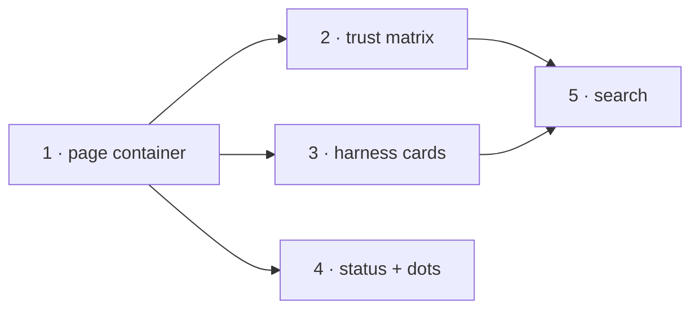

# Settings redesign - phased implementation

Source plan: [`plan.md`](plan.md) (approved; the operator selected the combined
prototype - page container + Trust matrix + harness cards + search - as the target,
with [`prototype.html`](prototype.html) beside this file as the visual reference).
This index decomposes it into five merge-safe phases.

## Incorporated human decisions

- The combined B+E+F+D direction was explicitly approved after reviewing seven mockups;
  mockup C (hub landing) was not adopted.
- The phased implementation itself was requested in the operator's own words ("write up
  a phased-plan to implement it"), so no further follow-up decision gate was posed.
- Design choices resolved during planning and recorded in `plan.md` as D1-D7: modal
  retirement in favor of a routed page, Display merge, Trust as a view over three
  stores, SSE (not polling) for status, the gear navigating rather than opening the
  palette, and the risky-toggle exemption from inline search flipping.

## Investigated findings that shaped the phase boundaries

- Routing, the page shell, and the keyboard stand-down already have a worked example
  (the Workflows page: `useWorkflowRoute.ts`, `AppPageShell`, App's
  `route.page === "workflows"` guard), so the container is a self-contained first
  phase.
- The three allowlists share schemas, routes, and the add/patch/stale-guard pattern;
  Trust needs no daemon change, making it a pure-web phase gated only on the page.
- `cost_fleet` is the worked example for a scalar SSE status frame; `settings_status`
  follows it exactly (event + snapshot + `MissionState` + `useEventStream` case), so
  status is an independent daemon+web phase.
- The search index must cover Trust and the harness cards to ship complete, which
  orders search after Phases 2 and 3 rather than straight after 1.
- `settings-sidebar-render.test.ts`, `overlay-registry.test.ts`,
  `agent-accent.test.ts`, and `keybindings.test.ts` pin today's shapes; each phase
  names the tests it reworks.

## Phases

| # | Phase | File | Direct prerequisites | Concurrency group |
|---|-------|------|----------------------|-------------------|
| 1 | Settings page container and grouped registry | [`phase-1-settings-page.md`](phase-1-settings-page.md) | - | A (alone) |
| 2 | Trust matrix over the three allowlists | [`phase-2-trust-matrix.md`](phase-2-trust-matrix.md) | Phase 1 | B |
| 3 | Harness cards | [`phase-3-harness-cards.md`](phase-3-harness-cards.md) | Phase 1 | B |
| 4 | Settings status on the live channel + dots | [`phase-4-status-signal.md`](phase-4-status-signal.md) | Phase 1 | B |
| 5 | Settings search | [`phase-5-settings-search.md`](phase-5-settings-search.md) | Phases 2, 3 | C (may overlap Phase 4) |

## Dependency graph

Phases 2, 3, and 4 are mutually independent and may merge in any order once Phase 1 is
on main. Phase 5 needs 2 and 3 merged (index completeness); it does not depend on 4 and
may run while 4 is in flight - the expected `SettingsPage` rail-area merge conflict is
textual, not contractual.

## Merge order

1 → { 2 | 3 | 4 in any order } → 5. Every phase leaves the repository operable: the
page ships whole in Phase 1; Trust replaces the panel editors in the same PR that adds
the matrix (no orphaned editors, no dead surface); dots ship with their event; search
ships with its complete index.

## Cross-phase contracts

Owned by the earliest phase; later phases consume, never redefine.

- **Phase 1 owns**: the `MissionRoute` settings variant and hash grammar; the
  `SETTINGS_CATEGORIES` entry shape (`id`, `label`, `icon`, `group`, `scope`,
  `keywords`) and the ordered `SETTINGS_GROUPS` registry; the
  `data-anchor="<category>/<slug>"` convention with its uniqueness test; the rule that
  `SettingsPage` owns the five category-scoped hooks and receives App-owned state
  (`foreman`, `cost`, `llm`, `layout`) as props.
- **Phase 2 owns**: the `trust` category id and its anchors; the rule that the three
  panels summarize and link rather than edit repo lists.
- **Phase 3 owns**: the per-harness card anchors (`harnesses/<agent>`).
- **Phase 4 owns**: the `SettingsStatus` shape, the `settings_status` event, and
  `MissionState.settingsStatus` as the only client-side source of those facts.
- **Phase 5 owns**: `SETTINGS_CONTROLS` as the one control-level index and the
  risky-toggle exemption list.

## Final verification

After Phase 5 merges: a manual end-to-end pass against a live daemon on a non-main
checkout (per README "Verifying") covering - deep-link into every category from a cold
tab; grant/revoke each Trust column and confirm the owning subsystem's behavior; flip
Inspector mode and YOLO with the page closed and watch the gear dot move with no
polling in the network tab; `⌘K` → "soak" → Enter lands flashing on the Shipping soak
control; chord recording still swallows Escape while the palette is closed. Plus
`npm run typecheck && npm test && npm run build` at every phase boundary (CI runs the
same on Node 24 and 26).

## Task mapping

One Mission Control ship task per phase, created in topological order, each depending
on its direct prerequisites' task ids and on the planning session (whose PR carries
these documents). Recorded at scheduling time in the planning session's report.
