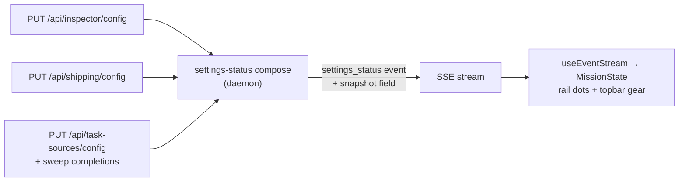
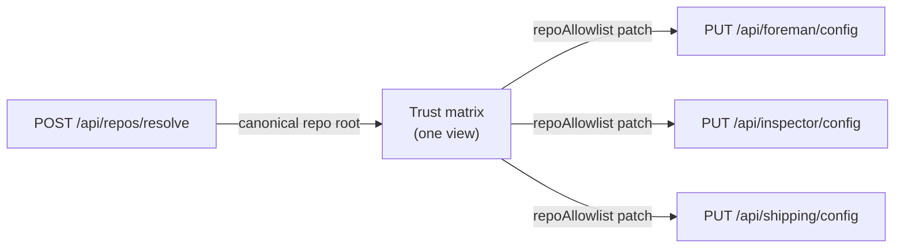

# Settings redesign: page container, trust matrix, harness cards, search

Move Settings from the 820px modal to a routed page with a rail grouped by blast radius,
unify the three repo allowlists into one Trust view, rework the Harnesses panel into
per-harness cards, surface subsystem status as rail dots, and add a search palette over
every control.

> **Decided.** The operator reviewed a full settings audit (11 panels, ~70 controls) with
> seven mockup directions, then approved a combined interactive prototype -
> [`prototype.html`](prototype.html) beside this plan - merging the page container
> (mockup B), the Trust matrix (mockup E), harness cards (mockup F), and settings search
> (mockup D), with the grouped rail and status dots from mockup A. That prototype is the
> visual and behavioral target; this plan translates it into repository terms. The
> mockup C "hub" landing page was considered and not adopted.

This is the successor to `docs/plans/settings-panel-layout/plan.md`, which built the
current two-pane modal so that "adding a category is adding a peer, not lengthening a
scroll". The peer list has since grown to eleven, the peers span four very different
blast radii, and the heaviest panel (Task sources) became a sub-application. The
structure needs a second step.

## Problems being solved

- **F1 - one flat rail, four blast radii.** Appearance (one localStorage checkbox) and
  Shipping (merges to a default branch under the operator's GitHub account) sit as
  visual peers. Nothing in the nav says which settings stay in the browser, which
  reconfigure the machine, which edit `~/.claude/settings.json`, and which act publicly.
- **F2 - category scale varies ~60x and the container fits neither end.** Task sources
  is a directory + drill-in editor + imperative actions squeezed into a back-stack
  inside 820px; Appearance is one toggle in the same pane.
- **F3 - trust is scattered.** Foreman-may-send-live, Inspector-may-post, and
  Shipping-may-merge are three separate `repoAllowlist` editors on three panels. The
  code already shares one predicate (`repoAllowlisted`); the UI has no shared surface,
  and the one dangerous combination - merge granted, review not - is only discoverable
  via prose warnings on the Shipping panel.
- **F4 - status is computed, then buried.** Whether the Inspector is live, YOLO is
  armed, or a task source failed its last sweep is known to the panels but invisible
  from the rail, the gear, and everywhere else.
- **F5 - cross-panel dependencies navigate by prose.** "Turn it on in Settings →
  Inspector" is text, while the deep-link mechanism (`initialCategory`) already exists.
- **F6 - ~70 controls, no search.** Finding "soak" requires already knowing it is a
  Shipping concept.
- **F7** (recorded, deliberately not solved here): Foreman's enable/mode/queues live in
  the topbar popover by design. The split stays; the panel keeps saying so, and gains a
  real link where it used to have a sentence.

## Decisions

Resolved by the approved prototype and by repository doctrine; requirements, not open
questions.

- **D1 - Settings becomes a routed page and the modal is retired.** Same container
  pattern as the Workflows page: a `MissionRoute` page with hash deep-links
  (`#/settings`, `#/settings/<category>`). The gear, the native `⌘,` menu (the existing
  `mission:open-settings` IPC channel is reused unchanged; only App's listener changes
  behavior), and every "manage in Settings" link become navigations. Escape on the page
  (when no palette is open and focus is not in a text field) returns to the fleet,
  preserving the modal's muscle memory.
- **D2 - The rail groups by blast radius, and Layout + Appearance merge into Display.**
  Groups in order of consequence: *This screen* (Display, Keyboard), *Sessions*
  (Harnesses, Skills, Cost), *Background work* (Foreman, Task sources, Models), *Leaves
  the machine* (Inspector, Shipping, Trust). Every group and category carries a scope
  badge: This browser / This machine / Writes ~/ / Acts on GitHub. `SETTINGS_CATEGORIES`
  stays the single data-driven registry (the render test keeps walking it) and grows
  `group`, `scope`, and `keywords` fields.
- **D3 - Trust is a view, not a store.** A new category in the *Leaves the machine*
  group renders one matrix: rows are repositories, columns are the three existing
  allowlists (Foreman sends live · Inspector posts reviews · YOLO merges). Each cell
  writes to its own subsystem's existing `PUT /api/{foreman,inspector,shipping}/config`
  route; nothing about storage, schemas, or the daemon's consent gates changes. The
  merge-without-review blind spot renders structurally (an amber cell with both fixes
  offered) instead of only as Shipping's prose. The three panels' repo editors become
  grant summaries deep-linking to Trust.
- **D4 - Harnesses renders as one card per harness.** Model and effort together, the
  accent from `AGENT_IDENTITY` arriving as an inline `--agent-accent` (no agent id may
  appear in `styles.css`; `agent-accent.test.ts` pins this), capability-driven badges
  ("no permission modes" from the capability registry, never a literal), and the launch
  sentence composed from the current values. Cards derive from `AGENT_TYPES`, so a third
  harness is one more card with zero new layout.
- **D5 - Settings search is a palette over a registry-derived index.** Opened by a new
  rebindable global shortcut (default `⌘K`) or the rail search box; the topbar gear
  keeps its one job, navigating to the page. The index derives from `SETTINGS_CATEGORIES` plus a co-located control-level list -
  never a second hand-kept list. Boolean controls toggle inline in the results; every
  other hit jumps to its category and flashes the control via a `data-anchor`
  convention. Risky toggles are exempt from inline flipping: YOLO mode and the
  Inspector's enable/mode always jump to their panel so their consent copy is on screen
  when they change.
- **D6 - Status reaches the rail over SSE, not a new poll.** The live channel is SSE
  only (house rule), so a new `settings_status` `ServerEvent` (and snapshot field)
  carries the small status tuple the dots need: Inspector enabled+mode, Shipping armed,
  count of failing task sources. Emitted on the config writes and sweep completions that
  change it. Rail dots: Inspector live (green), YOLO armed (amber), failing source
  (red), Foreman on (purple, derived from the Foreman state App already owns). The
  topbar gear inherits the worst dot.
- **D7 - What carries over untouched.** The panels' internal honesty is a requirement:
  the "can't reach the daemon - these are defaults, not state" warnings, the
  empty-means-cleared model fields with their env-layer source notes, the consent copy
  that persists while a risk persists, and all capability-computed reach sentences.

## Flows that change

Two load-bearing arrows change; everything else is re-arrangement inside the web app.

**Settings status joins the live channel.** Today Inspector/Shipping/Task-source state
is polled by hooks that exist only while the modal is open. The rail dots need that
state whenever the app is open, so the daemon starts emitting it:

**Trust fans one view out to three existing stores.** No new route, no new table; the
matrix reads three configs and each cell edit PUTs to the config that owns it:

## Requirements

### Page and rail (mockup B container, mockup A rail)

- R1: `MissionRoute` gains `{ page: "settings"; category: SettingsCategoryId }`;
  `#/settings` and `#/settings/<category>` parse and format; unknown categories fall
  back to the default category (Display).
- R2: `SettingsPage` replaces `SettingsModal`; the settings entry in `OVERLAY_IDS` is
  removed and `overlay-registry.test.ts` updated. Rail keeps the WAI-ARIA tablist
  semantics and roving tabindex of the modal rail.
- R3: Fleet keyboard shortcuts stand down while the settings page is showing, exactly as
  they do for the Workflows page.
- R4: The category-scoped state hooks (`useSkills`, `useHarnesses`, `useInspector`,
  `useShipping`, `useTaskSources`) move from the modal to the page and keep their
  poll-while-open semantics.
- R5: Task sources renders master-detail at page width: metrics strip, search, health
  filter chips, directory list, and the editor side by side - no back-stack.
- R6: Every control row carries `data-anchor="<category>/<slug>"`. This is the anchor
  contract search consumes; anchors are unique across the page.
- R7: `styles.css` gains a settings-page section; every removed `className` is grepped
  out of the stylesheet in the same change.

### Trust (mockup E)

- R8: A `trust` category (group *Leaves the machine*) renders the matrix over the three
  `repoAllowlist`s; adding a repo resolves through `POST /api/repos/resolve` first and
  grants nothing until a cell is clicked ("adding is configuration; enabling is
  consent").
- R9: A cell edit patches only the owning subsystem's config and survives the panels'
  4s config polls (same stale-closure guard the three panels use today).
- R10: The merge-without-review blind spot renders on the matrix (amber cell + footnote
  offering both fixes) whenever YOLO is armed, using the same facts the daemon's
  `inspectorPosture` gates on.
- R11: Foreman, Inspector, and Shipping panels stop editing repo lists; each shows its
  grant count and deep-links to Trust. Shipping's dependency warnings become links
  (R-F5) to the Inspector panel and to Trust.

### Harness cards (mockup F)

- R12: One card per `AGENT_TYPES` entry with model + effort selects (choices from
  `modelChoicesFor` / the `effort` capability), the auto-mode master toggle above, and
  accents via inline `--agent-accent` only.

### Status (mockup A dots)

- R13: `settings_status` `ServerEvent` + snapshot field carrying
  `{ inspector: { enabled, mode }, shipping: { autoMerge }, taskSources: { failing } }`,
  emitted from the three config PUT handlers and the task-source sweep path, and reduced
  into `MissionState` by `useEventStream`.
- R14: Rail dots per D6 and a worst-state dot on the topbar gear.

### Search (mockup D)

- R15: A `settingsSearch` rebindable global action (default `⌘K`) plus the rail search
  box open the palette; Escape closes it; arrows/Enter navigate; the palette
  coexists with the Keyboard panel's capture-phase chord recorder unchanged.
- R16: The index derives from the registry (`SETTINGS_CATEGORIES` keywords + a
  co-located control list with label, description, category, anchor, kind); a test walks
  it and fails on a control naming a missing category or duplicate anchor.
- R17: Boolean controls flip inline in results except the risky set (D5); all other hits
  jump and flash their `data-anchor` target.

### Done means (every phase)

- R18: README updated in the same change; `node:test` tests beside the feature; no new
  build entry points; no em dashes in copy; the panels' honesty inventory (D7) intact.

## Out of scope

- The hub landing page (mockup C) and any status rollup banner.
- Folding the Foreman popover's enable/mode/queues into the panel (F7 stays a link).
- Inline palette editing of non-boolean scalars (soak, intervals) - those jump.
- New persistence, new tables, or any change to allowlist storage or consent semantics.
- The Electron capability surface: `mission:open-settings` is reused as-is.

## Phasing

Implementation is decomposed in [`phased-plan.md`](phased-plan.md): five phases -
page container first, then Trust / harness cards / status concurrently, then search
last over the completed registry.
