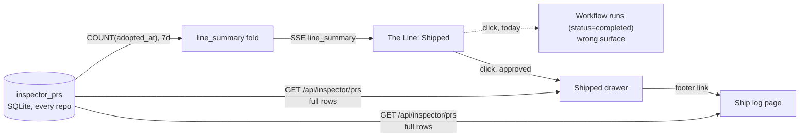

# Shipped surface

Approved: clicking Shipped opens a Shipped drawer in The Line, and the drawer's
footer links to a new cross-repo Ship log page. PR titles are stored at adoption.
The adopted mockups are rendered in [plan.html](plan.html).

## Decision record (submitted 2026-08-02)

- Surface: **Drawer + ship log (A then B)**. The drawer gives the in-place glance,
  consistent with Intake, Review, and Decide; its footer links to the full page.
- Data: **store PR titles at adoption**. Per-PR cost approximation and an embedded
  merge matrix (repos x days heatmap) were considered and not adopted. The matrix
  remains a candidate ship-log module for later.
- Follow-up: **phased implementation plan**.

## Problem

Clicking Shipped today navigates to the Workflow runs page filtered to
`status=completed` (`src/web/lib/line-targets.ts`). That target is wrong in both
directions:

- Sessions ship code without ever passing through a workflow run.
- A completed workflow run does not guarantee any code shipped.

Meanwhile the number on the bar is real: it is a 7-day `COUNT` over the
Inspector's adoption ledger (`inspector_prs.adopted_at`). The ledger already
holds one row per PR across every repository the fleet touches, but no surface
in the app renders those rows. The click should land on the PRs the count is
made of.

## Data inventory

| Field | Exists today | Where |
|---|---|---|
| owner / repo / number / url | yes | `inspector_prs` |
| branch (`head_ref_name`) | yes | `inspector_prs` |
| merge state (`merged_at`, `observed_state`: OPEN / CLOSED / MERGED) | yes | `inspector_prs` |
| owning session | yes | `inspector_prs.session_id` |
| adopted time | yes | `inspector_prs.adopted_at` |
| list endpoint | yes | `GET /api/inspector/prs` (`loadInspectorInspections`) |
| PR title | no | in scope: stored on the ledger, written by the first Inspector poll after adoption (approved) |
| per-PR cost | no | not adopted; the KPI keeps the fleet-wide daily average |

## Flow change

The summary path is untouched. Only the click target changes, plus two surfaces
reading rows the browser can already fetch.

## Adopted 1 - Shipped drawer

Clicking Shipped opens a drawer under the strip, exactly like Intake, Review,
and Decide already do (`LINE_DRAWER_STAGES` gains `"shipped"`, and the
`line-targets.ts` entry flips from the runs route to the drawer). Rows are the
adoption ledger newest-first: merge-state glyph, `owner/repo#N`, title (falling
back to branch), owning session, relative time. Filter chips split All / Merged /
Open / Gone. The footer totals the week and links to the ship log.

## Adopted 2 - Ship log page

A new routed page (`MissionRoute` gains `{ page: "shipped" }`). Top: a KPI row -
shipped this week with delta and sparkline, merged count and rate, the existing
fleet-wide per-PR cost figure, active repos. Left: a repository rail, one row per
repo with its count and a merged / open / gone mix bar, doubling as a filter.
Main: the ledger grouped by day, each row carrying repo, merge state, title,
branch, and session.

This is the cross-repo surface: every row is repo-tagged, and the rail shows
where the week's work landed at a glance.

## Implementation notes

- `LINE_DRAWER_STAGES` gains `"shipped"`; new drawer body beside
  `IntakeDrawer.tsx` / `ReviewDrawer.tsx` / `DecideDrawer.tsx`; a glyph entry in
  `LineDrawer.tsx`; an `App.tsx` branch for the open drawer.
- `src/web/lib/line-targets.ts`: shipped flips from
  `{kind:"route", route:{page:"runs", ...}}` to `{kind:"drawer", stage:"shipped"}`;
  `test/line-drawer.test.ts` updates with it.
- New `MissionRoute` page `"shipped"` in `useWorkflowRoute.ts`, a slot in
  `AppPageShell.tsx`, and the page component.
- PR title: `addColumn` migration on `inspector_prs` (beside its upgrade path in
  `src/server/db.ts`). The adoption signal carries no title (the hook sees only
  the `gh pr create` URL), so the Inspector's per-tick poll writes it -
  `PrSnapshot.title` is already fetched - and rows fall back to `head_ref_name`
  until the first poll.
- Both surfaces read `GET /api/inspector/prs`; raise or parameterize the
  `loadInspectorInspections(50)` limit if a week exceeds it.
- UI changes require Playwright specs in `e2e/` (drawer open, chips filter,
  footer link navigates, page renders rows), plus README updates.

Rendered page with the adopted mockups: [plan.html](plan.html).
