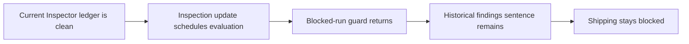
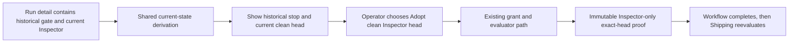

# Spent Inspector Gate Reconciliation

Status: Approved

## Approved decisions

- Implement **truthful state plus the existing grant path**. Keep the spent workflow state and Shipping veto, show the historical workflow observation separately from current Inspector truth, and reuse the audited grant path as `Adopt clean Inspector head` when the exact current head is Inspector-clean.
- Create a phased implementation plan and schedule its implementation task or tasks after publishing the plan artifacts.

## Goal

Make a spent workflow Inspector gate tell the truth when the current pull-request head has since been reviewed clean, and give the operator one clear, safe path to let that workflow adopt the clean head.

The follow-up must preserve exact-head Inspector proof, durable workflow ownership, immutable Inspector-only repair audit, and the existing rule that Shipping never merges around an active workflow gate.

## Evidence summary

PR #591 demonstrated two records that diverged:

- The workflow gate snapshot remains pinned to head `54d0bd2d`, `waitReason: "findings"`, and four finding fingerprints.
- The current Inspector ledger is on head `fbba204b`, with zero open findings and all four historical fingerprints resolved.

The run detail API already returns both records. The mismatch persists because:

1. Inspector updates still schedule workflow gate evaluation.
2. `evaluateInspectorGate` returns immediately for a `blocked` spent run.
3. `recheckInspector` schedules that same no-op evaluation while reporting success.
4. The UI renders the historical `waitReason` without qualifying it against the current Inspector ledger.
5. The existing `grantRepairRounds` path already restores an Inspector-only spent gate to `waiting_for_new_head`, after which the normal exact-head and immutable-submission checks apply.

## Constraints

- Do not release the Shipping veto merely because historical finding rows are now resolved.
- Do not complete from a stale or non-current Inspector head.
- Do not let the browser mutate gate state or decide that a gate passed.
- Do not create a second source of Inspector truth.
- Keep the run's historical failed head and findings visible as history.
- Preserve the repair budget as an explicit operator boundary unless the selected option explicitly changes that contract.
- Any UI change requires a Playwright specification.

## Selected solution

### Truthful state plus the existing grant path

Keep the durable spent state and Shipping veto. Derive a current-state presentation from the Inspector ledger and finding rows already included in `WorkflowRunDetail`:

- Show `Last workflow observation` with the failed head and historical findings.
- Show `Current Inspector` with the reviewed head and current open/resolved counts.
- When the current open PR head is Inspector-clean and the run is spent, present the existing grant action contextually as `Adopt clean Inspector head`.
- The action still calls the existing grant route. It does not directly complete the workflow. The restored evaluator must observe the exact current head, create the normal immutable `inspector_only` submission, and complete only if the Inspector ledger remains clean.
- Suppress the spent gate's current `Recheck GitHub Inspector` action, which reports success but cannot pass the blocked-run guard.
- When the current head is not clean, keep the ordinary `Grant more rounds` recovery and describe the historical findings as the reason the workflow stopped, not as a claim about current Inspector state.

This solution needs no schema, no new endpoint, no Shipping change, and no new budget policy.

## Decision rationale

It fixes the false statement and dead action at the point where they are produced, uses the current Inspector ledger already on the wire, and reuses the recovery path whose compare-and-swap, round grant, Inspector-only submission, and exact-head checks already exist. It preserves the deliberate safety boundary instead of inventing a silent exception to it.

## Proposed implementation

1. Add one shared browser-safe derivation for a spent Inspector gate's current condition. It must distinguish:
   - historical findings still open on the current reviewed head;
   - historical findings resolved but current head not yet reviewed;
   - current exact head reviewed clean;
   - unavailable or inconsistent Inspector evidence.
2. Use that derivation in the run detail, workflow ladder, compact ladder preview, next-move descriptor, and no-move sentence so every surface tells the same story.
3. Preserve the historical snapshot in the gate facts and audit packet. Do not rewrite it from browser state.
4. For a spent gate with a clean current head, reuse the existing `grant-rounds` endpoint and label the action `Adopt clean Inspector head`. The daemon remains responsible for re-entering the gate and proving the head again.
5. Remove `Recheck GitHub Inspector` from spent blocked gates. Keep it on live waiting states where the evaluator can act.
6. Update the Workflows guide to distinguish a historical stopped-gate snapshot from current Inspector status and document the contextual recovery label.

## State flow

Current:

Recommended:

## Acceptance criteria

- A spent gate never says findings still need resolution when every retained fingerprint is resolved.
- Run detail clearly separates the last workflow observation from current Inspector status.
- A clean current Inspector head yields one primary recovery action named `Adopt clean Inspector head`.
- That action uses the existing grant route and cannot directly mark the workflow complete.
- The workflow completes only after the daemon revalidates the adopted open PR, exact current head, live Inspector review, and zero current findings.
- A dirty, unreviewed, mismatched, closed, or unavailable current head cannot produce the contextual clean-head action.
- A spent blocked gate does not offer a recheck action that can only no-op.
- The ordinary `Grant more rounds` and `Cancel run` recoveries remain available where current evidence is not clean.
- Shipping's gate order and merge verdict remain unchanged.
- Historical gate state and events remain auditable after recovery.

## Verification

- Focused `node:test` coverage for the shared derivation and action selection, using the required `test/setup-state.mjs` preload.
- Focused workflow manager coverage proving the existing grant path adopts the later clean exact head and still refuses mismatched or dirty evidence.
- Rendering tests for run detail and ladder copy.
- A Playwright specification that displays a spent historical gate with a clean current Inspector head, shows `Adopt clean Inspector head`, invokes the existing route, and observes the workflow advance.
- `npm run typecheck`
- `npm run lint`
- `npm run build`
- `npm run test:e2e` after the successful build

## Out of scope

- Changing Shipping's merge gate order.
- Automatically retiring or completing spent runs.
- Adding a new Inspector budget or workflow setting.
- Rewriting historical gate snapshots.
- Recovering PR #591 as part of implementation verification.
