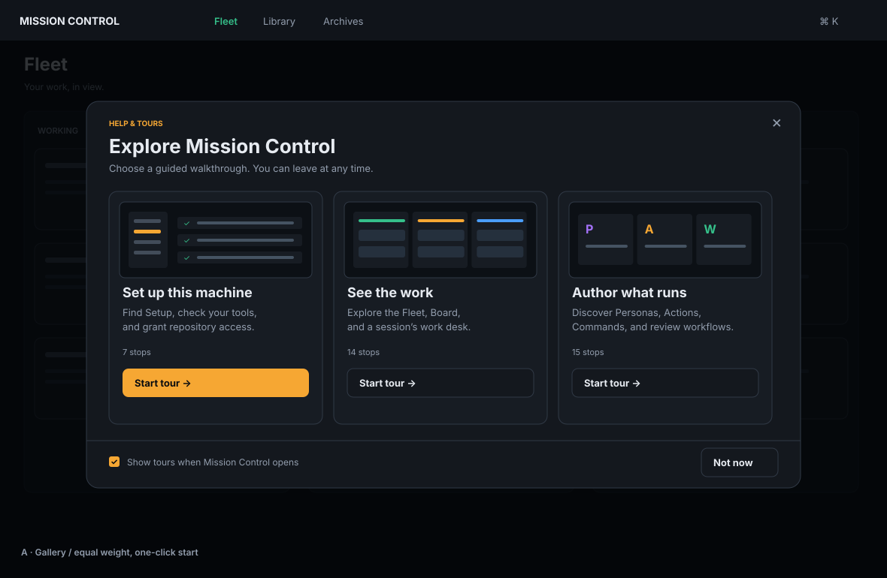
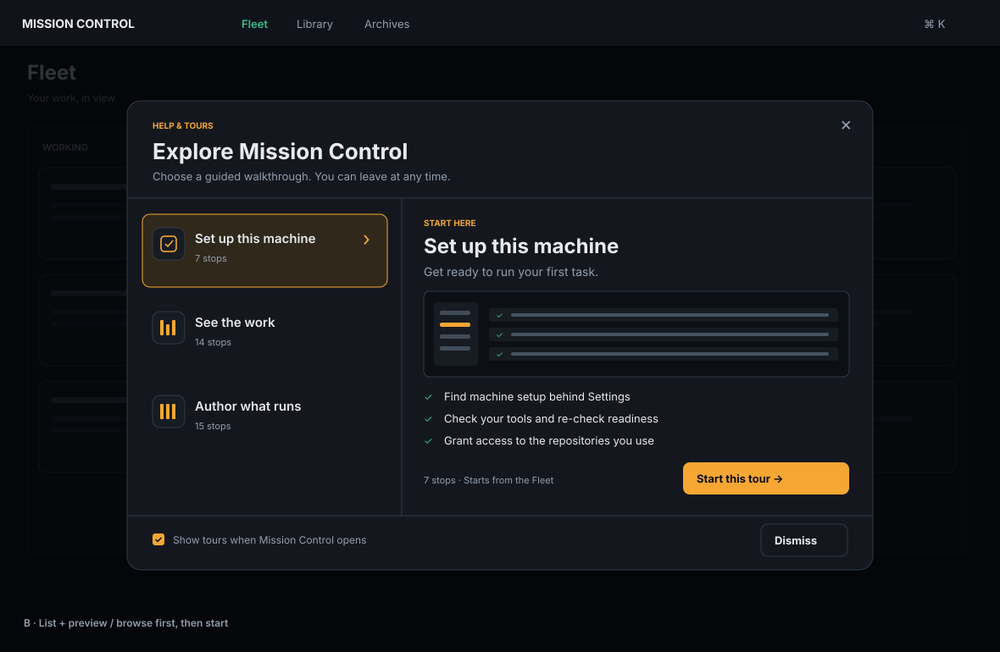
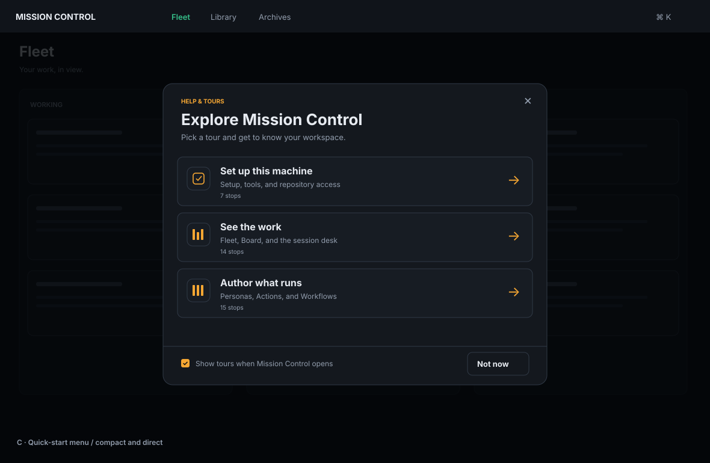
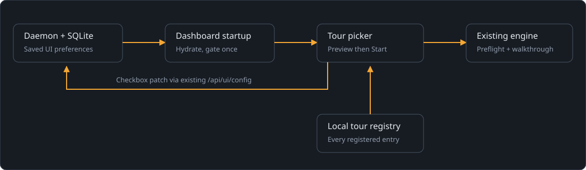

# Startup tour picker

Status: approved by the operator on 2026-09-15. Scope: planning documents and mockups only. No application behavior is implemented by this task.

## Outcome

When a person opens Mission Control, show a dismissible modal containing every registered tour. They can inspect a tour, explicitly start it, and walk through it with the existing guided-tour engine.

## Recorded human decisions

| Decision | Submitted selection | Consequence |
| --- | --- | --- |
| Layout | **B. List and preview** | Show the tour catalog beside the selected tour's description, learning outcomes, illustration, and Start this tour button. |
| Startup | **Every open, with an opt-out** | Show once per new dashboard document, including a new window or reload, for both new and existing profiles. Save an opt-out. Refocusing an existing window never retriggers it. |

The first two selections were returned by Mission Control's structured request_input tool. Final approval and the implementation follow-up were returned by request_plan_decisions: **Approve this plan** and **Create phased implementation plan**. Alternatives A and C below are retained as the requested design record; they are not implementation alternatives still awaiting a choice.

## Scope and product requirements

Configured tours means the tours registered in the current build's `TOUR_ENTRIES`: **See the work**, **Author what runs**, and **Set up this machine** today. Future registrations appear automatically through the same catalog. This feature does not add a tour editor, per-tour enable/disable settings, new tours, progress tracking, completion badges, or resume behavior.

| ID | Requirement and observable acceptance |
| --- | --- |
| TP-01 | After authoritative UI preference hydration, a new dashboard document opens the picker once when startup display is enabled. Reload and a second window qualify; route changes, SSE reconnects, rerenders, and returning focus do not. |
| TP-02 | The picker lists every registered tour exactly once. Setup is recommended and initially previewed; the remaining entries retain registry order. Selecting a row changes only the preview. |
| TP-03 | Start this tour invokes the existing start path for the selected ID. Opening, browsing, and dismissing the picker create no tasks or tours. A successful start replaces the picker with exactly one walkthrough at its first stop. |
| TP-04 | Dismiss, the close button, Escape, and clicking the backdrop dismiss the picker without changing the underlying route or saved startup preference. It stays closed for that document. |
| TP-05 | Show tours when Mission Control opens defaults on for new and existing profiles. An accepted change persists through reload, daemon restart, and another window using the same state home. Failed saves are reported and do not falsely appear saved. |
| TP-06 | Browse tours in Settings > Help & tours and the command palette reopens the picker regardless of the startup preference. Existing per-tour launch controls still work. |
| TP-07 | The picker participates in the overlay registry, traps focus while topmost, restores an appropriate focus target on dismissal, and never competes with another walkthrough or a higher-priority dialog. Keyboard users can select and start every tour. |
| TP-08 | Dirty-route preflight, tour target readiness, existing resource cleanup, snapshot restoration, and Setup's Trust landing remain intact. A refused preflight starts nothing. |
| TP-09 | The selected layout works in light/dark themes, reduced motion, and narrow/short windows. The dialog content clears its border and its controls remain reachable without horizontal page scrolling. |
| TP-10 | Browser coverage uses fake agents and proves catalog selection reaches each actual walkthrough. Documentation states the new startup behavior and reusable entry points. |

## Mockups and selected direction

These are design illustrations using Mission Control's dark palette and the actual tour names. The background contains illustrative placeholder work, not operator data. The startup checkbox is a proposed preference that is enabled by default and saved per Mission Control state home. Stop counts describe current authored tours, not saved progress. No time estimates, completion badges, or resume behavior are promised.

### A. Card gallery



Three equal cards show all tours, each with a small product illustration, summary, stop count, and direct Start tour button. Setup is the suggested first choice; nothing starts without a click.

- Best for: visual discovery and a small catalog.
- Tradeoff: occupies more space; a growing catalog requires scrolling.
- Estimated implementation effort: medium, roughly 300 to 500 non-test lines including launch integration, preference handling, and styling.

### B. List and preview (selected)



A list keeps every tour available while the preview explains the selected tour. Setup is initially previewed. Selecting another row only changes the preview; Start this tour begins the walkthrough. The illustration and learning outcomes change with the selection.

- Best for: helping a new user decide which tour answers their question.
- Tradeoff: starting a tour other than the initially previewed tour takes two actions. The preview stacks below the list on narrow screens.
- Estimated implementation effort: medium, roughly 400 to 650 non-test lines including launch integration, preference handling, and styling.

### C. Quick-start menu



A compact list presents the title, short description, and stop count. Activating a row starts its tour immediately. All three current tours fit in a small modal.

- Best for: repeat visits and quick selection with minimal reading.
- Tradeoff: less explanation before starting; the entire row is the launch control.
- Estimated implementation effort: small to medium, roughly 250 to 450 non-test lines including launch integration, preference handling, and styling.

## Interaction details

### Opening and discovery

- Open only after `useUiConfigHydrated()` reports the daemon-backed preference. Cached defaults alone must never flash the modal before a saved false value arrives. Hydration failure leaves the dashboard usable and follows the existing bounded-backoff hydration retry behavior.
- A per-document handled latch prevents repeat automatic openings. Mark it when the picker is actually shown, manually opened, or a tour successfully starts through any entry point. A disabled preference settles startup for this document; enabling it later takes effect on the next document, without reopening over current work.
- If another overlay or a tour owns the screen when startup becomes eligible, wait for the overlay host to become idle. A tour that already started cancels the pending automatic offer. Never stack the picker over an active tour or confirmation.
- Deep links remain deep links: opening or dismissing the picker does not navigate. It may appear over any dashboard route. Returning to a minimized Electron window does not constitute a new open. A renderer reload does.
- Manual opening works before preference hydration: the catalog is available, while the checkbox is disabled with a loading explanation until its saved value is known. Opening manually consumes the document's automatic offer.
- Add Browse tours to the existing Settings Help & tours group and a matching palette command. Keep the three existing direct tour shortcuts. No new topbar segment, route, or keyboard shortcut is required.

### Selection and tour handoff

- Use a labeled list of native radio controls, styled as rows, for the tour selection. A selected row has both a visible selection marker and an accessible checked state. Arrow keys select within the list; Tab reaches the preview's primary action.
- The preview contains the authored tour title, a concise summary, three learning outcomes, a decorative product illustration, the number of authored stops, and Start this tour. Counts come from the registered definition's stops, never a hand-kept numeric list or flattened spotlight beats.
- Setup is the initial selection and appears first without mutating the shared registry's existing discovery order. Declare the recommendation once beside the registry. If that recommendation is absent in a future catalog, select the first entry. Reopening starts at this default, with no remembered selection requirement.
- In the same launch handler, call the existing `startTour(selectedId, originBookmark)` preflight. Only a true result closes the picker as a successful handoff. The active-run ref already prevents fast repeated starts; do not create a second controller or queue a second tour.
- If navigation is held by a dirty draft, keep the picker mounted beneath the existing leave dialog. Stay returns to the picker with the draft intact. Leave performs the existing route transition and returns to the selected preview; the user presses Start this tour again. There is no hidden deferred tour callback. This deliberately preserves the router's current contract.
- Successful launch unmounts the picker without running its ordinary dismissal refocus. The walkthrough owns focus. The tour receives the bookmark captured before the picker opened, not a now-removed row or Start button.
- On ordinary picker dismissal, restore the manual invoker, or a stable dashboard control such as Settings for an automatic opening. On tour exit, preserve the existing bookmark restoration and declared exit route. Setup's absent-invoker fallback remains its Trust rail row. For other tours launched from the automatic picker, use a stable dashboard fallback if the original bookmark cannot be restored. A late focus callback must not steal focus once the operator has moved elsewhere.
- Completing or exiting a tour returns to its existing destination, without automatically reopening the picker. Browse tours is available for another tour. The existing See the work demo-session lifecycle and cleanup remain the engine's responsibility.

### Preference and compatibility

- Add `showToursOnStartup: boolean` to the existing `UI_CONFIG_DEFAULTS` and Zod UI-config contract, defaulting to true. Store it through the existing `/api/ui/config` patch flow into daemon-owned `app_config.ui`; no new table, endpoint, IPC channel, or polling is needed.
- An existing record or legacy browser import without this field receives true. Explicit false is preserved. The old `guidedTour: false` value records consumption of a different one-time behavior and must not disable this new feature on upgrade.
- Replace App's automatic `FIRST_RUN_TOUR` launch with the picker gate. Retain the old serialized `guidedTour` field and existing compatibility parsing, but stop using it to start tours in this client. The old local pending-consumption marker must neither hide the picker nor trigger writes from the retired consumer. Remove the unused hook/consumer and its private tests only after confirming no remaining callers; replace the relevant regression coverage with the new startup contract.
- Move the Setup recommendation to a clearly named catalog recommendation constant; retire the misleading first-run-launch name if it has no remaining live consumers. Do not alter persisted tour IDs or authored steps.
- Save checkbox changes immediately through `updateUiConfig`. Allow one save at a time. While saving, disable the checkbox and show Saving. Dismissal and tour start remain available.
- On failure, restore the last accepted value using the existing optimistic-write rollback contract. Show an inline error if the picker remains open, otherwise a dashboard toast explaining that the preference was not saved. Provide a retry by changing the checkbox again; do not introduce hidden background retries or a second persistence store.
- Saved preferences are scoped to the Mission Control daemon's state home, not an authenticated account. New documents read the current saved value. Live synchronization to an already-open second window remains outside scope, consistent with the current UI-config store.

### Layout and accessibility

- Use the existing `Overlay` and a new registered tour-picker ID, with an accessible dialog name of Explore Mission Control. The current primitive owns stacking and dismissal, but does not supply general focus trapping; the new dialog must own that behavior using existing focus-containment conventions.
- Apply `.modal` and its shell-owned inset. Use `.modal-bleed` only for the divided list/preview region and footer bands that need to reach the edge. Do not duplicate the horizontal inset on child elements.
- Desktop: approximately 880px dialog width, a 300px tour list, flexible preview, and a footer containing the checkbox and Dismiss. Use max-width/max-height against the viewport and scrollable content; keep close and primary actions reachable.
- Narrow windows: stack the tour list above the preview, allow footer controls to wrap, and use one clear content scroll region. Do not shrink the desktop SVG mockup to implement the UI. Verify at 390 by 844 and 1024 by 600, including browser zoom behavior.
- Match current tokens rather than introducing a new palette. Decorative illustrations carry no essential information and are hidden from assistive technology. Respect reduced motion and the desktop no-drag rule.
- Empty catalog: skip automatic display; manual opening says No tours are available and keeps dismissal available. Do not render an enabled Start action. Current registry contracts normally make this defensive state unreachable.

## Architecture and flow

Today the browser hydrates UI config from the daemon and, for an unconsumed fresh profile, starts Setup directly. The proposal uses that same preference path to gate a catalog modal. The browser reads the tour registry locally; an explicit Start passes the selected ID to the existing preflight and walkthrough engine. Only preference changes write the new flag through the daemon to SQLite. Browsing the picker performs no tour-task requests. Existing walkthrough actions retain their current server routes.



## Repository findings and implementation route

| Owner | Verified baseline and proposed work |
| --- | --- |
| `src/web/tour/entries.ts` | Owns discovery metadata for all three tours. Add catalog summary/outcomes and recommendation here, preserving title ownership in `tours/*.md`. Provide a generic decorative fallback for future entries. |
| `src/web/tour/definitions.ts` and `contracts.ts` | Own the exhaustive tour definitions. Derive stop counts from each definition at the App/catalog adapter boundary, keeping Settings and palette metadata free of driver/runtime imports. |
| `src/web/App.tsx` | Owns startTour, snapshots, active-run exclusion, and finishTour. Replace only the automatic start trigger; add picker state, its startup latch, captured invoker, palette action, and guarded handoff. Preserve existing per-tour bindings. |
| `src/web/lib/guided-tour.ts` | Implements the consumed one-time flag and retry marker. This client path is superseded by the picker startup gate; use the removal discipline above rather than leaving two automatic starters. |
| `src/shared/protocol.ts`, `src/server/ui-config.ts`, `src/web/lib/uiConfig.ts`, `src/web/lib/uiCache.ts` | Existing schema, persisted UI blob, authoritative hydration, legacy adoption, and per-field write rollback. Extend the schema and test defaulting, round-trips, legacy adoption, and error behavior without adding another store. |
| New `src/web/components/TourPicker.tsx` and optional focused startup helper | Proposed ownership for rendering, selection, focus, and the small eligibility rule. Names are proposed, not existing APIs. Keep navigation and tour runtime ownership in App. |
| `src/web/components/Overlay.tsx`, `src/web/components/SettingsPage.tsx`, `src/web/lib/palette-index.ts`, `src/web/styles.css` | Register the dialog; add Browse tours through established discovery/action patterns; style the selected layout with current tokens. Extend the palette target union wherever its existing definitions require it. |
| `e2e/fixtures/test.ts` and explicit browser/dev setup fixtures | Currently disable guidedTour for unrelated tests. Add an explicit startup-picker fixture option defaulting off for unrelated tests; the dedicated startup spec opts in. Audit hand-built fixtures too. |
| `e2e/specs/tour-engine.spec.ts` and existing tour specs | Two first-run tests currently assert automatic Setup and one-time consumption. Replace those assertions with the approved picker behavior while retaining engine, cleanup, Settings, and palette regressions. Update fixed counts for the additional Browse tours control. |
| `docs/ui.md`, `README.md` | Describe the startup picker, its opt-out and scope, manual reopening, and continuing lack of progress/resume. Existing shipped behavior docs stay unchanged until the implementation lands. |

Confidence is high for these ownership findings: they were inspected in the current checkout. The router interface comment says a same-route navigation returns false, but the implementation returns true; the plan follows the implementation and requires a same-route launch regression. No unrelated router rewrite is proposed.

Implementation order within one coherent delivery: extend metadata/preference and their focused checks; build the modal; replace automatic launch and wire manual entry points; cover actual walkthrough handoff and edge cases; update product documentation. Any implementation phase breakdown is a follow-up decision, not a dependency on a separate engine rebuild.

## Verification and acceptance evidence

| Coverage | Cases and expected proof |
| --- | --- |
| TP-01, TP-05 | Unit/store/cache tests for missing/default/explicit-false preferences, legacy guidedTour values, stale cache before hydration, write rollback, and the per-document latch. Browser cases cover new profile, upgraded profile, reload, second window, saved opt-out, re-enable, delayed/failed hydration, and rejected saves with the modal open or already dismissed. |
| TP-02, TP-03, TP-10 | Browser spec checks all registered titles/counts, selection-only preview updates, same-route starts, each chosen first stop, and one controller under rapid clicks. Unit tests derive metadata and stop counts from registries. |
| TP-04, TP-06 | All dismissal paths preserve route/state; Settings and palette reopen after opt-out; existing per-tour commands still start the selected tour. |
| TP-07, TP-09 | Keyboard selection, Tab containment, Escape and overlay precedence, focus restoration after dismissal/start/finish, reduced motion, theme parity, narrow/short viewport scrolling, and `expectContentClearsBorder` for the new dialog. Capture gitignored screenshots of actual implementation. |
| TP-08 | Dirty editor Stay/Leave/start-again sequence; other-overlay deferral; active-tour exclusion; full Setup, Library, and See the work regressions including cleanup and Setup's Trust landing. |

The implementation must add a Playwright spec such as `e2e/specs/tour-picker.spec.ts`. Browser tests use the repository fixtures and fake agents for both CLI and SDK launch paths. Do not add data-testid attributes.

Run appropriate focused unit tests through the command contract in root AGENTS.md. Cover the existing UI-config store/cache/race tests, startup and catalog helper tests, overlay registry, palette, and setup/tour contracts that changed. Then run:

```sh
npm run typecheck
npm run lint
npm run build
npm run smoke
npm run test:e2e -- e2e/specs/tour-picker.spec.ts e2e/specs/tour-engine.spec.ts e2e/specs/setup-banner-and-tour.spec.ts e2e/specs/library-tour.spec.ts e2e/specs/see-work-tour.spec.ts
npm run test:e2e
```

Run the full browser suite once after focused tests pass because the startup default and shared fixture affect every dashboard visit. Later CI or workflow repair rounds run issue-specific tests, then push, following the repository's repair rule. These are future implementation commands; this planning task must not claim they verify an unimplemented feature.

For this plan, verify reproducible Markdown-to-HTML rendering, all three embedded mockups, zero network dependencies, and no horizontal page overflow in both themes at desktop and narrow widths. Register the final plan text, required unchanged contracts, the actual structured decisions, and rendered mockup evidence for workflow review. Evidence remains gitignored.

## Supersession and boundaries

This plan supersedes only the direct one-time automatic Setup launch described in `docs/ui.md` under Guided tours and its first-run effect/tests. It preserves the registered tours, all walkthrough content, normal manual tour starts, server demo recipes, target readiness, cleanup, Setup's declared exit route, and the existing setup reminder banner. The banner may remain behind the picker and becomes visible on dismissal.

No runtime changes, model calls, production configuration changes, new service, external dependency, or tour-task dispatch occur in this planning task. SVG mockups are intentional design deliverables; verification screenshots and transcripts are separate gitignored evidence.

## Approved follow-up

The operator approved this complete plan and requested phased implementation planning. See [the phased implementation index](phased-plan.md) and [its rendered review page](phased-plan.html). Implementation tasks depend on this planning session and remain backlogged until the planning pull request merges. This planning task does not implement the feature.
