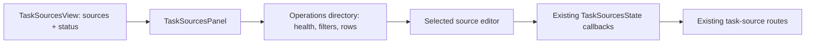

# Task source operations overview in Settings

## Goal

Replace the one-large-card-per-source Task sources panel with the operations-first
Settings layout selected from mockup #3. It must make dozens of configured sources
scannable by health, type and schedule, while retaining access to every existing
per-source setting and safety action.

## Scope

1. Add an operations summary (configured, healthy, attention, pending) and compact
   filterable source rows to `TaskSourcesPanel`.
2. Keep the existing source editor, but show it only for the selected source so the
   directory is not flooded by expanded forms.
3. Provide filters for all/healthy/attention/pending/paused, text search, and source-type
   filtering.
4. Keep Add a source and all existing operations: enable, sweep, preflight, forget seen,
   edit source configuration and remove.
5. Extend the panel tests to pin the overview health/count behavior and selected-editor
   navigation, while preserving the existing safety copy tests.

## UI behavior

The default pane is a directory:

- Summary cards and an attention callout describe the fleet.
- A search box and filters constrain compact rows.
- Each row shows source name, type, repository/scope, interval and current health.
- Selecting a row replaces the directory with that source's existing editor and a
  “All task sources” back control.
- Add source stays in the directory header; the initial implementation retains the
  existing source-type selector and repository chooser rather than claiming to implement
  Jira or Slack connectors.

## Data flow

No daemon contract changes are needed. The panel derives its overview from the existing
`TaskSourcesView.sources` and `TaskSourcesView.status` response; mutations continue through
the existing `save`, `sweep`, `preflight` and `forget` callbacks.

## Verification

- Update static-render panel tests for the overview and its health states.
- Run the focused tests, typecheck and project test/lint commands.
- Commit on a feature branch and run the repository’s no-mistakes PR workflow.
