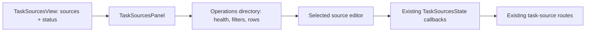

# Task source operations overview in Settings

## Goal

Replace the one-large-card-per-source Task sources panel with the operations-first
Settings layout selected from mockup #3. It must make dozens of configured sources
scannable by health, type and schedule, while retaining access to every existing
per-source setting and safety action.

## Scope

1. Add an operations summary (configured, healthy, attention, pending) and compact
   filterable source rows to `TaskSourcesPanel`.
2. Keep the existing source editor, but show it only for the selected source so the
   directory is not flooded by expanded forms.
3. Provide filters for all/healthy/attention/pending/paused, text search, and source-type
   filtering.
4. Keep Add a source and all existing operations: enable, sweep, preflight, forget seen,
   edit source configuration and remove.
5. Invalidate pre-pause health, including an in-flight result from the old lifecycle, so a
   re-enabled source cannot appear healthy until a fresh sweep. Preserve a manual sweep
   performed while the source is paused as fresh status.
6. Restore focus to the selected directory row on return, or to the directory itself when
   the current filters hide that row, and consume the restoration request in either case.
7. Extend the panel tests to pin the overview health/count behavior and selected-editor
   navigation, while preserving the existing safety copy tests.

## UI behavior

The default pane is a directory:

- Summary cards and an attention callout describe the fleet.
- A search box and filters constrain compact rows.
- Each row shows source name, type, repository/scope, interval and current health.
- Selecting a row replaces the directory with that source's existing editor and a
  “All task sources” back control.
- Search and filter state survives the editor round trip. Returning restores focus to the
  former row when it is still visible, otherwise to the directory container.
- Add source stays in the directory header; the initial implementation retains the
  existing source-type selector and repository chooser rather than claiming to implement
  Jira, Slack, Linear or other connectors.

## Data flow

The API response shape is unchanged. The panel derives its overview from the existing
`TaskSourcesView.sources` and `TaskSourcesView.status` response; mutations continue through
the existing `save`, `sweep`, `preflight` and `forget` callbacks. The daemon's in-memory
status lifecycle changes: disabling a source invalidates its previous health and any sweep
that began before the transition, while a sweep begun while paused remains current after
re-enabling.

## Verification
