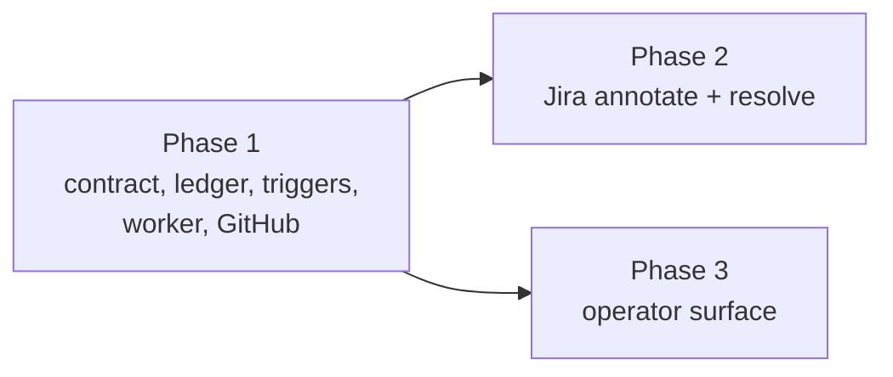

# Phased plan: writing back to the task source

Source plan: [`plan.md`](plan.md) (rendered: [`plan.html`](plan.html)).

## What was approved

Seven decisions came back from the dashboard review of the source plan. All are requirements
here, not open questions:

| Decision | Taken | Owned by |
|---|---|---|
| How a write-back is delivered | A durable ledger plus a worker | Phase 1 |
| Which moments write back | Both: a pull request first linked to the task, and the task completing | Phase 1 |
| How a Jira issue is resolved | A target status named per source, matched against the transitions available from the issue's current status | Phase 2 |
| How the pull request is linked onto a Jira issue | A remote link keyed by the PR url, **and** a comment. Putting the Jira key in the branch we cut was declined | Phase 2 |
| What resolve does to a GitHub issue | Closes it, with the reason configurable per source | Phase 1 |
| When a resolve may fire | Off by default per source, held for a 5 minute settle window with a live re-check | Phase 1 |
| What happens after the plan | Create this phased implementation plan | this document |

## What the repository said

Checked before the boundaries were drawn. Three findings changed the shape of the split:

1. **The capability/verb pattern already exists.** `TaskSourceImpl` carries an optional `push`
   gated on a required `canPush`, and `test/task-source-contract.test.ts` pins the pair. Two more
   pairs need no new mechanism, and the contract test makes a kind that advertises a verb it
   does not implement a hard failure. That is what forces Phase 1 to land Jira with
   `canAnnotate: false, canResolve: false` and Phase 2 to flip them in the same commit as the
   implementation, and it is the only edit Phase 2 makes to a Phase 1 file.
2. **Both observation points are synchronous and cannot await.** `acceptPrForEpisode` runs inside
   the PR poller's reconciliation and `finishCompletion` runs inside `session_upsert` /
   `session_remove` listeners that read the registry on the next line. Neither can spawn a
   subprocess. This is what makes the ledger structural rather than a durability nicety, and it
   is why the ledger and the worker cannot be deferred to a later phase.
3. **`JIRA_BIN` is a hardcoded constant, not a seam.** `ghBin()` exists precisely because an
   unfaked `gh` on a signed-in machine publishes for real; the Jira CLI has the identical
   exposure with no equivalent seam. `jiraBin()` therefore ships inside Phase 2 rather than as a
   later cleanup, because Phase 2 is the first thing that could move a real issue.

Two things in the source plan survived contact with the code unchanged and are worth recording:
`PUT /api/task-sources/config` takes the whole instance list, so the new `writeback` field rides
it with no route change (which is what makes Phase 1 operable with no web work); and
`finishCompletion` really is the single writer of `status: "done"`, so there is exactly one place
to call.

## Sizing, and why three phases

Estimated non-test implementation lines, counting doc comments (which this repository requires and
which are a real share of every file here), excluding tests, fixtures and documentation:

| Area | Estimate |
|---|---|
| Shared contract | 140 - 170 |
| Registry (`erase`, the four exports) | 80 - 100 |
| `db.ts` table, indexes, helpers | 160 - 200 |
| `registry.ts` signal and two emissions | 50 - 70 |
| `writeback.ts` (enqueue, notices, worker) | 280 - 340 |
| `tasks.ts` seam | 20 - 30 |
| GitHub verbs | 110 - 150 |
| Jira verbs, matcher, preflight, `jiraBin()` | 320 - 400 |
| Daemon wiring | 15 - 25 |
| Routes and settings status | 60 - 90 |
| Web (api, hook, panel fieldset) | 200 - 250 |
| **Total** | **1,435 - 1,825** |

Assumptions: the comment density of `push.ts` (290 lines for one verb and its chokepoint) and
`jira.ts` (1,364 lines for one read path) is the right reference, not a terse codebase's. The
estimate is a planning signal, not a promise about diff size.

Far above the 200-line one-phase threshold, so more than one phase is defensible. The count is
three, and each additional boundary earns itself:

- **Phase 1 cannot be smaller.** Every cut inside it leaves a dead surface: a ledger nothing
  writes to, a worker with nothing to deliver, or a trigger with nowhere to put what it saw. It
  is the smallest set that produces working behavior, and it is testable end to end through a
  route that already exists.
- **Phase 2 is a separate merge unit because it is a separate kind**, which is the seam the
  registry is built around. Combining it with Phase 1 would put the largest single file in the
  feature (Jira's two rungs, the transition matcher, the egress-guard assertions) into the same
  pull request as the foundation, and a reviewer would be reading a state machine and a Jira
  workflow API in one sitting. It also carries the one irreversible act in the feature and its
  own safety fix (`jiraBin()`), which deserve their own review.
- **Phase 3 is a separate merge unit because it is the only phase with a UI surface**, and
  therefore the only one that owes a Playwright spec, a settings anchor and operator
  documentation. Folding it into Phase 1 would make Phase 1's pull request span a SQLite state
  machine and a React fieldset; folding it into Phase 2 would serialize it behind Jira for no
  reason, since it depends on nothing Jira produces.

No preparation, test-only, documentation-only or cleanup phase exists. Tests, migration
compatibility, documentation and fixture safety each ship inside the phase that introduces the
behavior they cover.

## Phases

| # | Phase | File | Depends on | Delivers |
|---|---|---|---|---|
| 1 | The write-back contract, the delivery ledger, and GitHub issues | [`phase-1-ledger-triggers-and-github.md`](phase-1-ledger-triggers-and-github.md) | - | A GitHub source comments the PR and the outcome onto its issue, and closes it after the settle window |
| 2 | Jira annotate and resolve | [`phase-2-jira-writeback.md`](phase-2-jira-writeback.md) | Phase 1 | A Jira source posts a remote link and a comment, and moves the issue to a named target status |
| 3 | The operator surface | [`phase-3-operator-surface.md`](phase-3-operator-surface.md) | Phase 1 | The switches, the queue, retry and discard in Settings, with an e2e spec and the operator docs |

## Dependency graph and concurrency

Direct edges only: Phase 2 depends on Phase 1, Phase 3 depends on Phase 1, and **Phase 3 does not
depend on Phase 2**. Every phase task additionally depends on the planning session that wrote
these files, so nothing dispatches before the artifacts reach the default branch.

Concurrency groups:

- **Group A:** Phase 1, alone.
- **Group B:** Phase 2 and Phase 3, together.

The two in Group B may merge in either order, which the audit verified rather than assumed:

- They share no owned source file. Phase 2 changes `config.ts`, `jira.ts`, two booleans in
  `src/shared/task-source.ts`, and the Jira e2e fixture. Phase 3 changes `routes.ts`,
  `settings-status.ts`, the web layer, and the panel spec.
- Two documents are touched by both in disjoint regions, with ownership written into both phase
  files: `e2e/README.md` (environment table vs spec inventory) and `docs/dispatch-and-backlog.md`
  (the existing `### Jira` section vs a new `### Writing back to the source` section).
- Phase 3 is forbidden from asserting either Jira capability boolean, because Phase 2 flips them
  from false to true. Its disabled-state assertion runs against a synthetic capability instead.

Merge order: Phase 1, then Phase 2 and Phase 3 in whichever order they become green.

## Cross-phase contracts

Phase 1 owns and freezes, and the later phases may only read:

- `WRITEBACK_SIGNALS`, `WRITEBACK_ACTIONS` - append-only, persisted in the ledger.
- `WritebackNotice`, `WritebackResult`, `WritebackContext`, `TaskSourceWritebackSchema`,
  `TaskSourceWritebackStatus`.
- The `canAnnotate` / `canResolve` flags and the `annotate` / `resolve` slots, reached only
  through `canAnnotateTo` / `canResolveTo` / `annotateWith` / `resolveWith`. No call site tests
  `inst.kind`.
- The `task_source_writeback` columns, the unique key
  `(source_id, external_id, signal, action, dedupe_key)`, what `dedupe_key` holds per signal (the
  pull request url; the task id plus its `completedAt`, so a reopened-then-recompleted task is a
  new delivery rather than a silent collision), and the five `state` values.
- `countWritebacks`, `retryWritebacks` and `discardWritebacks`, and `taskSourcesView()` returning
  `writeback: []` until Phase 3 replaces it. `src/server/db.ts` has exactly one owner.
- The `task_pr_linked` signal and the `WritebackEnqueuer` seam on `TaskManager`.

Phase 2 owns: `jiraBin()` as the only way to name the Jira binary; Jira's two capability booleans
from its merge onward; `MISSION_JIRA_BIN` in the e2e daemon fixture; the Jira write-back paragraph
in `docs/dispatch-and-backlog.md`.

Phase 3 owns: `settings-status.ts`'s reading of the queue; the two write-back routes; every file
under `src/web/`; `e2e/specs/task-source-writeback.spec.ts`; and the `### Writing back to the
source` documentation section.

## Final verification

Each phase runs its own commands, listed in its file. Across the set, the properties that must
hold at the end and that no single phase can assert alone:

1. With every write-back switch off - the default, and therefore every existing installation -
   the ledger stays empty and no subprocess is spawned. Asserted in Phase 1 and unchanged after.
2. `test/task-source-contract.test.ts` passes with both kinds' flags matching their slots, which
   is only fully exercised once Phase 2 has merged.
3. No `gh` or `jira` subprocess in any test or e2e run resolves to a real binary
   (`MISSION_GH_BIN` from before this work, `MISSION_JIRA_BIN` from Phase 2).
4. `npm test`, `npm run typecheck`, `npm run lint`, `npm run build`, `npm run smoke` pass on
   every phase; `npm run test:e2e` on Phases 2 and 3.
5. The documentation on the default branch describes what the default branch does, at every
   intermediate merge and not only at the end. That is what the Jira-paragraph ownership split
   exists to guarantee.

## Audit

Performed over the complete set after the last phase file was written.

- **Every source-plan requirement is owned by exactly one phase.** Traced item by item across the
  plan's thirteen implementation steps, its test list and its documentation list.
- **Every consumer follows its prerequisite.** Phase 3 consumes the three ledger helpers and
  `TaskSourceWritebackStatus`, all from Phase 1. Phase 2 consumes the contract and the ledger,
  both from Phase 1. Nothing consumes anything from Phase 3.
- **Three defects were found in review round 1 (PR #944)** and fixed before Phase 1 merges,
  because each touches a contract Phase 1 freezes: the `task-completed` dedupe key silently
  dropped a reopened task's real completion; `closeReason` stored a value
  `gh issue close --reason` does not accept; and the retry / discard SQL was named in the source
  plan but owned by no phase. Recorded in the Phase 1 and Phase 3 audit records.
- **Two hazards were found and fixed during the original audit**, and both are recorded in the
  affected phase files' audit records:
  - Phase 1's worker calling `publishSettingsStatus` was ambiguous about who extends
    `settingsStatus()`. Split: Phase 1 triggers the recompute, Phase 3 owns
    `src/server/settings-status.ts` and what it counts. No file is edited by both.
  - Phase 3 originally documented the Jira write-back that Phase 2 implements, which would have
    shipped documentation describing something the build could not do if Phase 3 merged first.
    The Jira paragraph moved to Phase 2, and each phase's documentation is now true at its own
    merge in either order.
- **The final state matches the source plan** with no undocumented cleanup: the last merge, in
  either Group B order, leaves the contract, the ledger, both kinds, the operator surface, the
  spec and the documentation all present.
