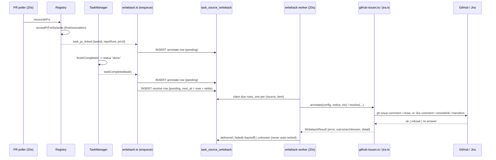
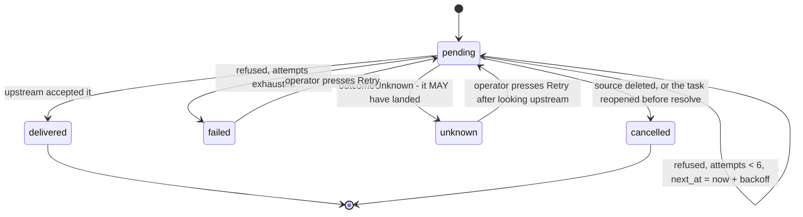

# Writing back to the task source: link the PR, and optionally resolve the issue

## Context

Task sources today go one way and a half. Inbound, a configured `github-issues` or `jira`
source sweeps its upstream on a schedule and files candidates the backlog can act on
(`sweep` + `preflight`, with `src/server/task-sources/ingest.ts` as the only DB writer).
Outbound, exactly one verb exists: `push` files one of OUR backlog tasks as a GitHub issue,
on an explicit per-task click, through `src/server/task-sources/push.ts`.

What is missing is the part a person watching the tracker actually needs. A task swept from
`MC-431` gets worked, opens a pull request, and merges, and `MC-431` never hears about any of
it. Somebody reading Jira sees an issue sitting in "In Progress" with no link to the work, and
somebody reading the backlog sees a `done` task whose upstream is still open. The link that
`Task.source` already holds is used only to render a chip in the dashboard.

This plan adds the other direction: **when a task's pull request appears, and when the task
completes, write that back onto the item it came from** - and, when the operator has said so
per source, resolve the item.

The shape is deliberately not "a Jira feature" and not "a GitHub feature". It is a third verb
pair on the existing `TaskSourceImpl` contract, so a kind declares what it can do and the
call sites never test `inst.kind`. That is the same split `push` already made, and the same
one `HARNESS_CAPABILITIES` / `HARNESSES` makes.

### What already exists that this builds on

| Thing | Where | What it gives us |
|---|---|---|
| `TaskSourceImpl` with `preflight` / `sweep` / optional `push` | `src/shared/task-source.ts:220-247` | The contract to extend, and the `canPush` precedent for declaring a capability on the browser-safe half |
| The erased registry and `pushToSource` | `src/server/task-sources/index.ts:102-192` | Boundary config parsing, and the "never test `inst.kind`" call-site rule |
| `Task.source`, a `TaskSourceRef` or null | `src/shared/types.ts:2097`, columns at `src/server/db.ts:743-745` | The link back. Null on nearly every task, which is what keeps this feature invisible to people who do not use sources |
| `task_source_seen` | `src/server/db.ts:1847-1853` | The precedent for a ledger table that outlives the task it refers to |
| `acceptPrForEpisode` / `acceptRepoPrForEpisode` | `src/server/registry.ts:4307`, `:4505` | Both compute `firstAssociation` already - the exact instant a pull request becomes this task's |
| `onTaskPrMerged` / `onPrMergesRecorded` | `src/server/registry.ts:1489-1513` | The pattern for a documented, non-throwing internal signal off the PR poller |
| `finishCompletion` | `src/server/tasks.ts:4181-4212` | The single writer of `status: "done"` |
| `ghBin()` | `src/server/config.ts:237-239` | The one seam every `gh` subprocess resolves through, and the e2e fake's entry point |
| The Jira auth ladder and egress guard | `src/server/task-sources/jira.ts:144-281`, `:1257-1310` | CLI first, REST fallback, UpstartClaw; and the refusal that stops `JIRA_API_TOKEN` reaching a non-Jira host |
| `PushTaskOutcome`'s four-way failure kind | `src/server/task-sources/push.ts:71-77` | The refusal / unknown-outcome vocabulary this must reuse rather than reinvent |

### What deliberately does not exist yet, and stays that way

There is **no generic webhook or integration-hook concept** anywhere in the codebase, and
this plan does not add one. A general "fire an HTTP request on an event" mechanism would be a
new trust surface (arbitrary outbound URLs, arbitrary payloads, a credential store) for a need
that two adapters answer. What this adds is generic in the way the codebase is already generic:
a typed verb on a registry, with a `Record<TaskSourceKind, ...>` that will not compile until a
new kind has said what it can do.

## The flow this adds

Two observation points enqueue a durable delivery; one worker drains it. Nothing on a hot path
makes a network call, and nothing that leaves the process runs inside a registry listener.



A second flow worth stating on its own is what happens to a delivery that does not succeed,
because "failed" and "we cannot tell" must never be collapsed:



## Design

### 1. The shared contract (`src/shared/task-source.ts`)

Browser-safe, no `node:` imports, because the settings panel renders from it.

```ts
/** Why a write-back is owed. APPEND-ONLY: persisted in the delivery ledger. */
export const WRITEBACK_SIGNALS = ["pr-opened", "task-completed"] as const;
export type WritebackSignal = (typeof WRITEBACK_SIGNALS)[number];

/** What is owed. APPEND-ONLY, same reason. */
export const WRITEBACK_ACTIONS = ["annotate", "resolve"] as const;
export type WritebackAction = (typeof WRITEBACK_ACTIONS)[number];

/**
 * The facts one write-back may state upstream. A SNAPSHOT, never the live `Task`.
 *
 * The same reason `PushDraft` is not the `Task`: an implementation must not be able to read
 * a status, a worktree or an id off the thing it is publishing. It is also what lets a
 * delivery survive the task being deleted between the observation and the attempt.
 */
export interface WritebackNotice {
  signal: WritebackSignal;
  action: WritebackAction;
  /** The item upstream, e.g. "acme/demo#123" or "MC-431". */
  externalId: string;
  /** Deep link back to the item, when the source recorded one. */
  externalUrl: string | null;
  taskTitle: string;
  /** The pull request this is about, or null for a completion that opened none. */
  prUrl: string | null;
  /** Which repository the pull request is in - a multi-repo task owes one notice per repo. */
  repoRoot: string;
  /** The completion's own words, for `task-completed`. Null otherwise. */
  outcome: string | null;
  /** When the fact was OBSERVED, not when delivery is attempted. */
  observedAt: number;
}

/** The outcome of one write-back. Mirrors `PushResult`, for the same reason. */
export interface WritebackResult {
  error: string | null;
  /**
   * The write MAY have landed and we cannot tell. The load-bearing flag, exactly as on
   * `PushResult`: a duplicate comment is noise, but a duplicate transition can move an
   * issue a human just moved back.
   */
  outcomeUnknown: boolean;
  /** One line for the panel, e.g. "commented" or "moved to Done". */
  detail: string | null;
}

/** The same lends as a sweep and a push. */
export type WritebackContext = SweepContext;
```

`TaskSourceKindInfo` gains two required booleans, so `Record<TaskSourceKind, ...>` makes a new
kind declare both:

```ts
/** This kind can write a link back onto an item it swept (a comment, a remote link). */
canAnnotate: boolean;
/** This kind can mark an item resolved (close it, transition it). */
canResolve: boolean;
```

`TaskSourceImpl` gains two optional verbs, present exactly when the flags say so:

```ts
annotate?(config: C, notice: WritebackNotice, ctx: WritebackContext): Promise<WritebackResult>;
resolve?(config: C, notice: WritebackNotice, ctx: WritebackContext): Promise<WritebackResult>;
```

`test/task-source-contract.test.ts` pins both directions, exactly as it already pins `canPush`:
a kind that advertises a capability it does not implement is a switch that fails when flipped,
and a kind that implements one it does not advertise is a feature nobody can reach.

Per-source consent lives on the instance, beside `defaults`:

```ts
export const TaskSourceWritebackSchema = z.object({
  /** Comment the pull request onto the item when one is first linked to the task. */
  onPrOpened: z.boolean().default(false),
  /** Comment the outcome onto the item when the task completes. */
  onCompleted: z.boolean().default(false),
  /**
   * Also resolve the item on completion. Requires `onCompleted`; a resolve with no trigger
   * is refused at the schema rather than stored as a switch that does nothing.
   */
  resolve: z.boolean().default(false),
});
```

All three default off, for the same reason `TaskSourceInstance.enabled` does: adding a source
is configuration, and writing to somebody else's tracker is consent.

Kind-specific parameters stay in the kind's own `config`, where the panel already renders them:

- `GithubIssuesConfigSchema` gains `closeReason: z.enum(["completed", "not_planned"]).default("completed")`.
- `JiraConfigSchema` gains `resolveTransition: z.string().max(120).default("")` (the target
  status name, e.g. `Done`) and `linkVia: z.enum(["comment", "remote-link", "both"]).default("both")`.

Jira's `resolveTransition` is storable-but-empty for the same reason `jql` is: the schema must
parse `{}`. The emptiness is caught where it can be explained - `preflight` names it when
`writeback.resolve` is on, and `resolve` returns a refusal naming the fix rather than a
silent no-op.

### 2. The delivery ledger (`src/server/db.ts`)

A table, not a fire-and-forget listener. Three facts force it:

1. The observation points are synchronous and on hot paths. `acceptPrForEpisode` runs inside
   the PR poller's reconciliation, and `finishCompletion` runs inside `session_upsert` and
   `session_remove` listeners that read the registry on the very next line. Both are documented
   "listeners must not throw" (`src/server/registry.ts:1444`, `:1492`, `:1508`). Neither can
   await a subprocess or an HTTPS round trip.
2. An external write fails. `gh` is not signed in, the VPN is down, Jira 503s. A signal that
   fires once and is lost is a link that silently never appears, which is worse than no feature.
3. A completion is **reversible**. `settleIfEpisodeFinished` concludes a task on an idle agent
   and `reopenIfWorkResumed` (`src/server/tasks.ts:1346`) puts it back when the agent turns out
   to be working. Closing the upstream issue in the same tick as an inferred completion would
   close an issue whose work is still going.

```sql
-- One owed write-back to an external item. A row OUTLIVES the task that caused it, and holds
-- no reference to one: the payload is a snapshot, so a task deleted between the observation
-- and the attempt still delivers what was true when it was observed. Same stance as
-- task_source_seen above, for a different reason - there it is "a task you deleted stays
-- deleted", here it is "a fact you observed stays true".
CREATE TABLE IF NOT EXISTS task_source_writeback (
  id           INTEGER PRIMARY KEY AUTOINCREMENT,
  source_id    TEXT NOT NULL,      -- TaskSourceInstance.id
  external_id  TEXT NOT NULL,      -- the item upstream, e.g. owner/repo#123 or MC-431
  signal       TEXT NOT NULL,      -- pr-opened | task-completed
  action       TEXT NOT NULL,      -- annotate | resolve
  -- What makes this delivery ONE delivery: the pull request url for pr-opened, the task id
  -- for task-completed. NOT NULL and never empty, because SQLite treats NULLs as DISTINCT
  -- inside a unique index, and a nullable half would let the same comment be enqueued twice.
  dedupe_key   TEXT NOT NULL,
  task_id      TEXT,               -- provenance only; never joined on
  payload      TEXT NOT NULL,      -- the WritebackNotice, as JSON
  state        TEXT NOT NULL,      -- pending | delivered | failed | unknown | cancelled
  attempts     INTEGER NOT NULL DEFAULT 0,
  next_at      INTEGER NOT NULL,   -- earliest attempt; the settle window lives here
  last_error   TEXT,
  last_detail  TEXT,
  created_at   INTEGER NOT NULL,
  updated_at   INTEGER NOT NULL
);
CREATE UNIQUE INDEX IF NOT EXISTS idx_writeback_identity
  ON task_source_writeback(source_id, external_id, signal, action, dedupe_key);
CREATE INDEX IF NOT EXISTS idx_writeback_due ON task_source_writeback(state, next_at);
```

The unique index is the idempotency guarantee, and it is what makes a restart, a re-observed
pull request and a repeated poller tick all cost nothing. Enqueue is `INSERT ... ON CONFLICT DO
NOTHING`: a second observation of the same fact is not an error, it is the normal case.

Migration follows the house rule - `CREATE TABLE IF NOT EXISTS` in the schema block, indexes
beside it, nothing that assumes a fresh database.

### 3. Trigger points

**A pull request is first linked to a task.** A new Registry signal, exactly symmetric to
`task_pr_merged`:

```ts
/**
 * Fired when a pull request was FIRST associated with a task's work episode.
 *
 * Emitted from `acceptPrForEpisode` and `acceptRepoPrForEpisode`, which already compute
 * `firstAssociation` and are the two places the durable record gains a pull request. Once
 * per (task, repository), because a second observation of the same url is not news.
 *
 * Deliberately NOT `pr_opened` (`:1446`). That signal is the hook's optimistic "the agent
 * ran `gh pr create`" evidence, scoped to a SESSION and carrying no task binding - which is
 * exactly right for the Inspector's per-PR adoption and wrong here, where the question is
 * which TASK, and therefore which upstream item, this pull request belongs to.
 *
 * Listeners must not throw; this runs inside the PR poller's reconciliation.
 */
onTaskPrLinked(fn: (e: TaskPrLinked) => void): () => void
```

`TaskPrLinked` carries `{ taskId, repoRoot, prUrl, observedAt }`. The secondary-repo emission is
what makes a multi-repo task write one comment per repository, which is the honest report: the
task opened three pull requests and the issue should name all three.

**A task completes.** `TaskManager` gains an optional injected seam rather than a second event
bus, in the style of `PushDeps` and `IngestDeps`:

```ts
export interface WritebackEnqueuer {
  prLinked(e: TaskPrLinked): void;
  completed(task: Task): void;
}
```

`finishCompletion` calls `this.writeback?.completed(updated)` immediately after
`this.registry.upsertTask(updated)`, inside the same synchronous call, wrapped so a throw
cannot escape into a completion path. That is four lines in `tasks.ts` and one constructor
parameter, and it keeps the single-writer property: `finishCompletion` is the only writer of
`status: "done"` (`src/server/tasks.ts:4181-4212`), so there is exactly one place to call.

Both enqueue paths do the same local, synchronous work and nothing else:

1. `task.source === null`? Return. This is nearly every task, and it is why the feature is
   invisible to people who do not use sources.
2. Look the source up in `getTaskSourcesConfig()`. Gone? Return.
3. Read `source.writeback`. Trigger off? Return.
4. Ask the registry whether the kind can do it (`canAnnotateTo` / `canResolveTo`). No? Return.
5. Build the `WritebackNotice` snapshot and `INSERT ... ON CONFLICT DO NOTHING`.

For a completion with `resolve` on, two rows are written: the annotate row due now, and the
resolve row due at `now + WRITEBACK_SETTLE_MS`. The settle window exists for the reversible
completion above, and the worker re-checks the task's live status before it spends the
transition.

### 4. The worker (`src/server/task-sources/writeback.ts`)

The canonical poller shape: a self-rescheduling `setTimeout` (never `setInterval`, so ticks
cannot overlap), `unref`'d, try/caught, returning a stopper. Registered in
`src/server/index.ts` beside `startTaskSourceSweeper`, with a matching call in `shutdown()`.

Per tick:

- Claim due rows: `state = 'pending' AND next_at <= now`, ordered by `id`, capped per tick, and
  **at most one row per `(source_id, external_id)`**. That ordering is what puts the annotate
  before the resolve for the same item without any dependency machinery: the annotate row has
  the lower id, so it goes first, and the resolve goes on the next tick.
- Re-validate against the world as it is now, before anything leaves the process:
  - the source still exists and still has the trigger on. Otherwise `cancelled`.
  - for `resolve`, the task still exists and is still `done`. A task reopened by
    `reopenIfWorkResumed`, rescheduled, or deleted cancels the resolve. The annotate is not
    re-checked: a comment saying a pull request opened was true when it was observed, and
    stays true.
- Call `annotateWith` / `resolveWith` on the registry, which parses the config at the boundary
  and catches a throw as a refusal, exactly as `pushToSource` does.
- Record the outcome:
  - success -> `delivered`, `last_detail` set.
  - `outcomeUnknown` -> `unknown`, and **never retried automatically**. This is the
    `push.ts` rule applied to a second verb, and it matters more for `resolve` than it ever did
    for `push`: a retried transition can move an issue a human just moved back.
  - refusal, attempts remaining -> stays `pending`, `next_at = now + min(30min, 60s * 2^attempts)`.
  - refusal, attempts exhausted (6) -> `failed`, and the source reports it.
- Call `publishSettingsStatus(registry)` when a source's failing count changed, so the gear's
  amber dot means what it says (`src/server/settings-status.ts:39`).

Timeouts and the tick interval come from `envVar`, in the style the sweeper already uses:
`MISSION_TASK_SOURCE_WRITEBACK_TICK_MS` (default 20s, floor 5s) and
`MISSION_TASK_SOURCE_WRITEBACK_SETTLE_MS` (default 5 minutes).

### 5. GitHub issues (`src/server/task-sources/github-issues.ts`)

Auth stays the `gh` CLI through `ghBin()`, so this adds no token, no OAuth flow and no secret.
Both verbs get an exported pure argv builder and an exported pure result reader, in the same
style as `ghIssueListArgs` / `ghIssueCreateArgs`, so the interesting half is testable without
a subprocess:

```ts
export function ghIssueCommentArgs(cfg: GithubIssuesConfig, notice: WritebackNotice): string[];
export function ghIssueCloseArgs(cfg: GithubIssuesConfig, notice: WritebackNotice): string[];
export function writebackResultFrom(res: RunResult): WritebackResult;
```

- `annotate` -> `gh issue comment <url> --body <rendered>`. The body is short and factual: what
  happened, the pull request link, and the task title. It names Mission Control so a person
  reading the thread knows what wrote it.
- `resolve` -> `gh issue close <url> --reason <cfg.closeReason>`. An already-closed issue is
  read as **success**, not a refusal: the desired state holds, and treating it as a failure
  would burn six retries reaching a state that is already true.

`writebackResultFrom` follows the ordering `githubIssueCreateOutcome`
(`src/server/github/issue-create.ts`) established: a child death outranks an exit code, and a
non-zero exit with no proof of effect is a refusal (retry-safe), while a run we cannot read is
unknown. Process output never crosses the boundary verbatim on a success path, for the same
reason it does not there - `gh` error text can carry local filesystem paths.

`canAnnotate: true`, `canResolve: true`.

### 6. Jira (`src/server/task-sources/jira.ts`)

This is the harder half, and it is where the operator's instinct is right: Jira has no single
"close" and a project's workflow decides what "done" is called.

**Auth reuses the existing ladder and the existing guard, unchanged in shape.** The write
endpoints are subject to `siteProblem` / `credentialTargetProblem` exactly as the search is:
a `site` carrying a credential is refused, and `JIRA_API_TOKEN` is not sent to a host that is
not Jira Cloud unless `JIRA_ALLOWED_HOSTS` says so (`src/server/task-sources/jira.ts:167-281`).
Nothing about a write relaxes an egress rule that exists for a read.

One new seam is required in the same change, and it is a safety fix rather than test
convenience: **`jiraBin()` in `src/server/config.ts`**, mirroring `ghBin()`, replacing the
`JIRA_BIN = "jira"` constant at every call site. Without it there is no way to fake the Jira
CLI in an end-to-end run, and an e2e run on an operator machine with a configured `jira` could
transition a real issue. That is the identical hazard `MISSION_GH_BIN` was introduced to close.

**`annotate`** does up to two things, per `cfg.linkVia`:

- **A remote link** (`POST /rest/api/3/issue/{key}/remotelink`) with
  `globalId` set to the pull request URL. This is the closest API-reachable thing to Jira's own
  PR linking, it renders in the issue's Links section, and its `globalId` makes it
  **idempotent by construction**: the same call twice updates one link rather than adding two.
- **A comment** (`POST /rest/api/3/issue/{key}/comment`, or `jira issue comment add`), which is
  the guaranteed-visible fallback the operator named. Body in ADF for the REST rung, plain
  text for the CLI.

Both, by default, because they answer different questions: the remote link is where a person
looks for "what work touched this", and the comment is what shows up in the activity feed and
in a notification.

A note on Jira's own development panel, which this cannot populate: that panel is filled by the
Jira/GitHub application matching an issue key in a branch name, commit message or pull request
title. It is not writable over the API. What Mission Control *can* do is make the match happen,
by putting the issue key in the branch it cuts - see the open decisions.

**`resolve`** is a two-step because Jira makes it one:

1. `GET /rest/api/3/issue/{key}/transitions` (or `jira issue move` on the CLI rung) to read the
   transitions available **from the issue's current status**.
2. Match `cfg.resolveTransition` case-insensitively against both the transition name and its
   target status name, and POST the id.

The refusals are the whole value of doing it this way, and each names one thing to go and do:

- No `resolveTransition` configured: *"this source has no target status - set it to the status
  a finished issue should land in, e.g. Done"*. Also reported by `preflight`, so a source is
  never quietly unable to do what its switch says.
- No match: *"MC-431 cannot move to \"Done\" from \"In Review\" - available from here: Ready for
  QA, Reject"*. That sentence turns the hardest part of the feature into a thing the operator
  can fix in ten seconds, and it is why guessing at a transition would be worse than refusing.
- A required field on the transition screen: Jira's own 400 body, first message only, which is
  the only place that information exists.

`canAnnotate: true`, `canResolve: true`. The UpstartClaw rung (`queryVia: "upstartclaw"`) is
read-only in this release: its tool allowlist is the JQL search tool, and widening it to write
tools is a separate consent decision. A source on that rung reports that in `preflight` rather
than failing at delivery.

### 7. Routes and settings surface

The existing `taskSourcesView()` closure (`src/server/routes.ts:5991`) gains a per-source
write-back summary, so the panel reads config, health and queue in one GET:

```ts
export interface TaskSourceWritebackStatus {
  sourceId: string;
  pending: number;
  failed: number;
  /** May have landed upstream. Needs a person to look before anything is retried. */
  unknown: number;
  delivered: number;
  lastError: string | null;
  lastDeliveredAt: number | null;
}
```

Two new routes, following the `parseBody` and `publishSettingsStatus` conventions of the block
they join:

- `POST /api/task-sources/:id/writeback/retry` - move this source's `failed` rows (and, when
  the body says `includeUnknown: true`, its `unknown` rows) back to `pending` with `attempts`
  reset. Two flags rather than one, because retrying an unknown is an operator asserting they
  have looked upstream, and that assertion should be explicit.
- `DELETE /api/task-sources/:id/writeback` - discard this source's queue. The counterpart to
  "Forget seen items", for the operator who turned a switch on by mistake.

`TaskSourcesPanel.tsx` gains one fieldset in the source editor, anchored
`data-anchor="task-sources/writeback"`:

- **Comment when a pull request opens** (switch)
- **Comment when the task completes** (switch)
- **Also resolve the item** (switch, nested, disabled until the completion trigger is on)
- the kind's own field: **Target status** for Jira with **Link style** beside it, **Close reason**
  for GitHub, rendered from the same `src.kind ===` branch that already picks `GithubFields` /
  `JiraFields`
- a `ConsoleState` line: "3 waiting, 1 needs attention", with **Retry** and **Discard**

The fieldset renders for every kind, but a switch whose capability is false renders disabled
with the reason, rather than being hidden - a capability the build does not have is a different
thing from a switch you have not turned on, and hiding it makes the two look alike.

## Safety properties

These are the claims the tests exist to defend.

1. **Nothing is written back without per-source consent.** Three switches, all default off, and
   `resolve` is refused at the schema unless a trigger is on.
2. **A task with no `source` produces nothing.** The first line of both enqueue paths. That is
   nearly every task in a normal installation.
3. **An unknown outcome is never retried automatically.** The `push.ts` rule, applied to a verb
   where the stakes are higher: a duplicate comment is noise, a duplicate transition can undo a
   human.
4. **Idempotent by ledger key.** `(source, item, signal, action, dedupe_key)` is unique, so a
   restart, a re-observation and a repeated tick all cost nothing. Jira remote links are
   additionally idempotent upstream via `globalId`.
5. **A resolve waits out a settle window and re-checks.** Because
   `settleIfEpisodeFinished` concludes on an idle agent and `reopenIfWorkResumed` can put the
   task back, and closing an issue whose work resumed is the one mistake this feature could make
   that a person would have to undo by hand.
6. **The credential egress guard applies to writes exactly as it does to reads.** No new host
   reachability, no relaxation, no second code path.
7. **A deleted source cancels its queue** rather than delivering against a configuration nobody
   has any more.
8. **The payload is a snapshot**, so a task deleted between observation and delivery still
   reports what was true, and no delivery joins back to a `tasks` row.
9. **Nothing leaves the process on a hot path.** Enqueue is a synchronous local insert inside a
   try/catch; every subprocess and every HTTPS call happens on the worker's own tick.

## Implementation steps

1. **`src/shared/task-source.ts`** - `WRITEBACK_SIGNALS`, `WRITEBACK_ACTIONS`,
   `WritebackNotice`, `WritebackResult`, `WritebackContext`, `TaskSourceWritebackSchema`;
   `canAnnotate` / `canResolve` on `TaskSourceKindInfo` and filled in for both kinds;
   `annotate?` / `resolve?` on `TaskSourceImpl`; `writeback` on `TaskSourceInstanceBase`;
   `closeReason` on the GitHub config; `resolveTransition` and `linkVia` on the Jira config;
   `TaskSourceWritebackStatus` and its slot on `TaskSourcesView`. Rewrite the file header
   contract comment so the outward direction is described honestly as two verbs, not one.
2. **`src/server/task-sources/index.ts`** - `ErasedTaskSource` gains the two flags and two
   nullable slots; `erase()` wires them with the same boundary parse; new exports
   `canAnnotateTo`, `canResolveTo`, `annotateWith`, `resolveWith`, each catching a throw as a
   refusal with `outcomeUnknown: false`, and each returning a named error for an absent slot.
3. **`src/server/config.ts`** - `jiraBin()` reading `envVar("JIRA_BIN") || "jira"`, and every
   `JIRA_BIN` call site in `jira.ts` converted. Mechanical, no behavior change when unset.
4. **`src/server/db.ts`** - the `task_source_writeback` table and its two indexes, plus the
   helpers: `enqueueWriteback`, `claimDueWritebacks`, `settleWriteback`, `cancelWritebacksFor`,
   `writebackStatusFor`, `retryWritebacks`, `discardWritebacks`.
5. **`src/server/registry.ts`** - `TaskPrLinked`, the `task_pr_linked` emission from
   `acceptPrForEpisode` and `acceptRepoPrForEpisode` on first association, and
   `onTaskPrLinked` with the documented "listeners must not throw" contract.
6. **`src/server/task-sources/writeback.ts`** (new) - the enqueue chokepoint (the mirror of
   `push.ts` and `ingest.ts`: the only DB writer on this path), the `WritebackEnqueuer`
   implementation, the notice builders, and `startWritebackWorker`. Dep seams for the two calls
   that leave the process and for the clock, in the style of `PushDeps`.
7. **`src/server/tasks.ts`** - the optional `writeback` constructor dep and the guarded call in
   `finishCompletion`.
8. **`src/server/task-sources/github-issues.ts`** - `ghIssueCommentArgs`, `ghIssueCloseArgs`,
   `writebackResultFrom`, the two verbs, registered on the impl.
9. **`src/server/task-sources/jira.ts`** - the comment, remote-link and transition calls on both
   rungs, the transition matcher and its refusal sentences, the preflight additions, the two
   verbs. `jiraBin()` throughout.
10. **`src/server/index.ts`** - construct the enqueuer, subscribe it to `onTaskPrLinked`, pass it
    to `TaskManager`, start the worker beside `startTaskSourceSweeper`, stop it in `shutdown()`.
11. **`src/server/routes.ts`** - the two new routes and the summary on `taskSourcesView()`.
12. **`src/web/`** - `api.ts` calls, `useTaskSources.ts` (respecting its stale-response
    invariant), and the `TaskSourcesPanel.tsx` fieldset.
13. **Tests and docs** - below.

## Tests

`test/` (fast, no browser):

| File | What it pins |
|---|---|
| `test/task-source-contract.test.ts` (extend) | `canAnnotate` / `canResolve` against the presence of the slots, both directions, for every kind |
| `test/task-source-writeback.test.ts` (new) | Enqueue rules (no source, missing source, trigger off, capability off); the unique key making a re-observation free; annotate-before-resolve ordering; backoff arithmetic; attempts exhausted; `unknown` never re-claimed by a tick; a resolve cancelled by a reopened, rescheduled or deleted task; a cancelled queue on a deleted source |
| `test/github-issues-writeback.test.ts` (new) | The two argv builders, and `writebackResultFrom` over exit codes, a killed child, and the already-closed case reading as success |
| `test/jira-writeback.test.ts` (new) | Comment body rendering on both rungs; the remote-link payload carrying `globalId`; transition matching by name and by target status, case-insensitively; the "available from here" refusal; the empty-`resolveTransition` refusal; the egress guard refusing a write to a non-Jira host |
| `test/task-sources-panel.test.ts` (extend) | The fieldset's markup, the nested disabled state, and the disabled-with-a-reason rendering for a kind that cannot resolve |
| `test/db-migrations` (existing suite) | An existing database gains the table by opening |

`e2e/specs/task-source-writeback.spec.ts` (new), because this is a UI change and there are no
exemptions:

- The fieldset is reachable in **Settings -> Task sources**, arrives with every switch off, and
  its values survive a reload (which is what proves they reached the daemon rather than
  component state).
- **Also resolve the item** is unreachable until the completion trigger is on.
- With the switches on, a faked task completion produces a delivery, and the panel reports it -
  selected by role and label, never `data-testid`.
- A refused delivery surfaces on the source with its reason, and **Retry** clears it.
- `expectContentClearsBorder` on any modal the spec opens.

Fixture work this needs, and it is the part with a real hazard in it:

- `e2e/fixtures/fake-agents.ts` `FAKE_GH` answers `issue comment` and `issue close`, recording
  what it was asked, so nothing is published.
- A **fake `jira` binary** and `MISSION_JIRA_BIN` set in `e2e/fixtures/daemon.ts`. Today
  `JIRA_BIN` is a hardcoded `"jira"`, so on a machine where the operator's Jira CLI is
  configured, an unfaked run could move a real issue. This closes that before the write path
  exists to walk through it.
- `e2e/README.md` gains the `MISSION_JIRA_BIN` row in its environment table, with that reason.

## Documentation

- `docs/dispatch-and-backlog.md` - a new `### Writing back to the source` section after
  `### Push a task to GitHub`, covering the two triggers, the resolve consent, what Jira needs
  configured and why, what the queue states mean, and the "check before retrying" rule for an
  unknown outcome. The `Task sources` control table gains the write-back rows.
- `docs/configuration.md` - `MISSION_JIRA_BIN`, `MISSION_TASK_SOURCE_WRITEBACK_TICK_MS`,
  `MISSION_TASK_SOURCE_WRITEBACK_SETTLE_MS`.
- `docs/database-and-migrations.md` - the new table and the reason its rows outlive their tasks.
- `docs/security.md` - one line stating that a task source may now WRITE to its upstream, under
  per-source consent, with the same egress guard.

## Out of scope

- **Creating Jira issues.** `push` stays GitHub-only; `canPush: false` for Jira is unchanged.
- **Inbound status sync.** An issue closed upstream does not close the task here. That is a
  different feature with its own conflict-resolution questions.
- **Anything beyond resolve.** No assignee, no sprint, no custom field, no story points.
- **A general webhook mechanism.** See the context section.
- **Per-task overrides.** Consent is per source. A per-task switch is a reasonable follow-up and
  a bad first release: it doubles the state a person has to reason about before they have used
  the feature once.
- **Auto-dispatch, in any form.** Unchanged and still deliberate.

## Risks

| Risk | Mitigation |
|---|---|
| A comment written to the wrong issue | The notice is built from `task.source`, which only a sweep or a push writes, and delivery re-reads the source before it acts |
| An issue closed while its work continues | The settle window plus the live re-check on the resolve row, and consent that is off by default |
| A wedged queue nobody notices | `failed` and `unknown` counts feed `publishSettingsStatus`, so the gear carries the amber dot the rest of Settings already uses |
| Jira write endpoints differ per deployment | The CLI rung and the REST rung are both exercised, and every refusal names the available transitions rather than guessing |
| A real Jira issue moved during a test run | `jiraBin()` plus the fake binary, shipped in this change rather than after it |
