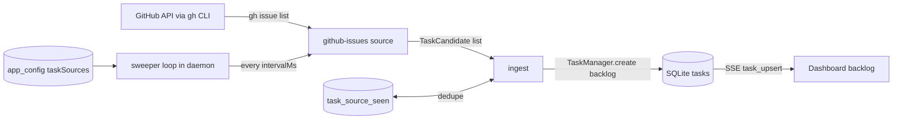

# Task sources

A shared interface for pulling work **into** the backlog from systems that already hold
it - GitHub issues first, but nothing in the interface should know that.

## The problem

Work often already exists somewhere: open issues, a triage board, an on-call queue, a
spreadsheet of flaky tests. Before task sources, importing it meant re-typing it into
Mission Control, which is why the backlog was usually emptier than the real backlog.

The obvious fix - "add a GitHub integration" - is the wrong shape. It puts `gh issue list`
in the middle of the dispatcher, and the second source (Linear, Jira, a cron that files a
task when a nightly build fails) either copies all of it or bolts a second special case
onto the same code. So: **one interface, many implementations, and the daemon owns
everything the implementations must not be trusted to get right.**

## What a task source is

A task source **reads an external system on a schedule and returns candidate tasks**. That
is the whole contract. It does not write to the database, it does not dispatch anything,
and it does not decide whether a candidate is new.

That split is the point of the design, and it is worth being explicit about why:

- **The daemon is the only writer of the DB** (`CLAUDE.md`), and a task source is not the
  daemon. Returning data instead of writing rows keeps that invariant true by
  construction, rather than by every implementer remembering it.
- **De-duplication, normalization and caps get enforced once.** A source that got dedupe
  wrong would re-file the same issue every sweep, forever. Making that impossible to get
  wrong is worth more than the flexibility of letting each source do it.
- **It makes a source a pure function to test.** `sweep(config) -> candidates` needs no
  database, no registry and no HTTP.

### Sources never type into a pane

This is the safety boundary, and the README already has the paragraph that explains why it
matters (*"The daemon is no longer strictly reactive - read this before adding another
autonomous writer"*). The skills reload loop types into live panes on its own schedule, and
needs `settledIdle` plus a pane read plus `withPaneLock` before it dares.

**A task source needs none of that, because it writes backlog rows and nothing else.** The
worst a broken source can do is file junk into a list, which a human then reads and
deletes. Nothing is provisioned, no worktree is cut, no keystroke is sent.

Auto-dispatching swept work is therefore **explicitly out of scope**, and not because it is
hard: it is a different risk class, and it would need its own gate (an allowlist, a rate
limit, a dry-run mode) of exactly the kind Foreman already carries. If it is ever wanted it
is a separate change with a separate argument.

## The interface

Lives in `src/shared/task-source.ts`, imported by both the server and the settings UI.

```ts
/** Where a candidate came from - the identity a sweep is de-duplicated on. */
export interface TaskSourceRef {
  /** The configured source instance that produced it. */
  sourceId: string;
  /**
   * Stable id in the EXTERNAL system, e.g. "owner/repo#123". Must be stable across
   * sweeps for the same underlying item and unique within the source; it is half of
   * the de-duplication key and nothing else is.
   */
  externalId: string;
  /** Deep link back to the item, shown on the task. Null when the system has no URL. */
  url: string | null;
}

/**
 * One item a source proposes for the backlog.
 *
 * Deliberately the shape of a TASK, not a passthrough of the external record. A source's
 * job is to translate - deciding what an issue's *intent* should say is the part that
 * needs judgement, and it is the part the source is uniquely able to do.
 */
export interface TaskCandidate {
  ref: TaskSourceRef;
  /** Short label. Falls back to `deriveTitle(intent)` when empty. */
  title: string;
  /** The prompt the agent will actually receive as its first message. */
  intent: string;
  /** Absolute path of the repo to base the task on. Validated as a task root on ingest. */
  repoRoot: string;
  kind?: TaskKind;
  agent?: AgentType;
  priority?: TaskPriority | null;
  labels?: string[];
}

/** The outcome of one sweep. */
export interface SweepResult {
  items: TaskCandidate[];
  /**
   * Human-readable failure, or null. A failure NEVER retracts anything: an unreachable
   * API means "unknown", not "there is no work" - the same stance `pr.ts` takes when
   * `gh` is missing, where an error leaves the existing chip alone rather than clearing it.
   */
  error: string | null;
}

/** An implementation. One per kind, registered in TASK_SOURCE_KINDS. */
export interface TaskSourceImpl<C> {
  /** Stable kind id, e.g. "github-issues". APPEND-ONLY - it is persisted in config. */
  kind: string;
  /** What the settings panel calls it. */
  label: string;
  /** One line under the label, saying what this source sweeps. */
  blurb: string;
  /** Validates and defaults this kind's config blob. The panel renders from it too. */
  configSchema: z.ZodType<C>;
  /**
   * "Can this run at all?" - null when fine, else a sentence naming the fix
   * ("gh is not authenticated - run `gh auth login`"). Separate from `sweep` so the
   * settings panel can tell a misconfigured source from an empty one, which is the
   * difference between "you have nothing to do" and "this has been silently broken".
   */
  preflight(config: C): Promise<string | null>;
  sweep(config: C, ctx: SweepContext): Promise<SweepResult>;
}

/** What the daemon lends a sweep. Narrow on purpose - no registry, no DB. */
export interface SweepContext {
  sourceId: string;
  /** The repo this source is bound to, already resolved to a git root. */
  repoRoot: string;
  /** Abort signal, so a hung sweep cannot wedge the loop. */
  signal: AbortSignal;
}
```

### Configuration

One generic wrapper around each kind's own blob, persisted in `app_config` under
`taskSources` - the same schema-validated-KV pattern as `harnesses.ts` / `foreman/config.ts`,
which means **no migration for a new key**.

```ts
export interface TaskSourceInstance {
  id: string;              // uuid, minted when you add one
  kind: string;            // which implementation
  label: string;           // your name for it, e.g. "mission-control bugs"
  enabled: boolean;        // default false: adding a source never starts it
  repoRoot: string;        // which repo swept tasks are filed against
  intervalMs: number;      // clamped [60_000, 24h]; default 15 min
  /** Applied to any candidate that doesn't set its own. */
  defaults: {
    kind: TaskKind;
    agent: AgentType;
    priority: TaskPriority | null;
    labels: string[];
  };
  /** Kind-specific, validated by that kind's `configSchema`. */
  config: unknown;
  /** Hard cap on rows one sweep may file. Default 25. */
  maxPerSweep: number;
}
```

`enabled: false` by default is deliberate: adding a source is configuration, turning it on
is consent, and they should be two separate acts.

### Ingest - the part sources don't get to do

`src/server/task-sources/ingest.ts` takes a `SweepResult` and decides. In order:

1. **Drop anything already seen.** Keyed `(sourceId, externalId)` against a
   `task_source_seen` table.
2. **Resolve and validate `repoRoot`** through the same `resolveTaskRepoRoot` the dispatch
   route uses.
3. **Normalize** through `DispatchSchema` - so `normalizeLabels` and the priority enum
   apply to a machine-authored task exactly as to a typed one.
4. **Cap** at `maxPerSweep`, and `log()` what was dropped. A silent truncation reads as
   "that's all there was".
5. **Create** through `TaskManager.create({ ..., backlog: true })` - the same path the
   dispatch form takes, so titling, SSE emission and persistence are unchanged.
6. **Record the seen row**, in the same transaction as the insert.

#### Why `task_source_seen` is its own table

The obvious design is to put `source_id` / `external_id` on `tasks` and de-duplicate
against that. It is wrong for one reason, and it is the reason that matters:

**A task you deleted must stay deleted.** Dedupe against `tasks` means deleting a swept
task makes it un-seen, so the next sweep files it again - the source becomes impossible to
say no to, and the delete button becomes a snooze button that doesn't even snooze.

So: a `task_source_seen` row **outlives the task**. The columns on `tasks` still exist
(`source_id`, `external_id`, `source_url`), but they are for the *link back*, not for
identity. Both are needed and they answer different questions.

Two corollaries worth stating, because they are the first things anyone asks:

- **Re-filing an item you deleted** is a deliberate act: "Forget seen items" on the source
  in settings, which clears its seen rows.
- **Updating an already-seen item** (the issue's labels changed) is *not* in v1. A sweep
  files new work; it does not reconcile old work. Re-syncing is a bigger question - it has
  to decide what happens when a human has edited the task since - and it deserves its own
  design rather than being smuggled in.

### The sweeper

`startTaskSourceSweeper(registry, tasks)` in `src/server/task-sources/sweeper.ts`, started
in `src/server/index.ts` beside the eight existing pollers, following the canonical shape
(`discovery/poller.ts`): a self-rescheduling `setTimeout` (never `setInterval`, so ticks
cannot overlap), `unref()` so it never holds the process open, try/catch **inside** the
tick so one bad sweep never kills the loop, and a returned stop closure wired into
`shutdown()`.

Per tick: for each enabled source whose `intervalMs` has elapsed, run `sweep` under an
`AbortSignal` with a timeout, hand the result to ingest, and record `lastSweepAt` /
`lastError` for the settings panel. It runs in the daemon because ingest writes to the DB,
and the port bind is the mutex.

## The GitHub issues source

`src/server/task-sources/github-issues.ts` - the first implementation, and the proof the
interface is the right shape.

**Auth is `gh`, and there is no credential to store.** `src/server/pr.ts` already shells
out to `gh` with `cwd` set to a checkout, letting it resolve both the repo and the user's
existing `gh auth`. Doing the same here means this feature adds no token storage, no OAuth
flow and no new secret to leak - which is worth more than the flexibility of an API client.

```ts
interface GithubIssuesConfig {
  /** Empty = the repo `gh` resolves from repoRoot's origin. */
  repo: string;
  /** Match issues carrying ANY of these labels. Empty = no label filter. */
  labelsAny: string[];
  /** Only issues assigned to the authenticated `gh` user. */
  assignedToMe: boolean;
  /** Only issues with no assignee - the "up for grabs" sweep. */
  unassignedOnly: boolean;
  milestone: string | null;
  /** GitHub label -> task priority, e.g. {"P0": "blocker", "P1": "high"}. */
  priorityFrom: Record<string, TaskPriority>;
  /** Copy the issue's GitHub labels onto the task. */
  copyLabels: boolean;
  limit: number;
}
```

`assignedToMe` and `unassignedOnly` are mutually exclusive and the schema refuses both -
together they select nothing, and a filter that silently matches nothing is the worst
possible failure for a background sweep.

The sweep is one call:

```
gh issue list --state open --limit <n> [--label ...] [--assignee @me] [--milestone ...]
  --json number,title,body,url,labels,assignees,updatedAt
```

run with `cwd: repoRoot` and a timeout, through the existing `run()` helper (which never
throws on a missing binary). A non-zero exit becomes `{items: [], error}` - never an empty
success, so a broken `gh` cannot read as "no issues".

Mapping:

- `externalId` = `owner/repo#number`, from the issue URL so it is stable even if `repo` is
  reconfigured.
- `title` = the issue title.
- `intent` = a short brief naming the issue, its URL and its body - so the agent's first
  prompt has the actual text and a link, not just a number.
- `priority` = `priorityFrom[label]` for the first matching label, else the source's
  default. Unset stays unset.
- `labels` = the issue's labels when `copyLabels`, normalized by `normalizeLabels`, which
  is why that function preserves case (`Type: Bug` must still match the issue it came from).

## Settings

A new **Task sources** category, which is the registry extension `CLAUDE.md` describes:
an entry in `SETTINGS_CATEGORIES`, a `case` in `renderCategory`, and a new discriminator in
`settings-sidebar-render.test.ts` (which asserts nav count equals array length).

`TaskSourcesPanel.tsx` follows `HarnessesPanel.tsx`: a `useTaskSources()` hook polling
`GET /api/task-sources/config` at 4s with optimistic apply and revert-on-refusal. Per
source: enable toggle, label, repo (`RepoCombobox`, resolved server-side so a typo cannot
enter), interval, the kind-specific fields, `lastSweepAt` / `lastError`, **Sweep now**, and
**Forget seen items**.

Routes, beside the existing config pair:

| Route | Body | Does |
|---|---|---|
| `GET /api/task-sources/config` | - | the configured sources plus derived status |
| `PUT /api/task-sources/config` | `TaskSourcesConfigPatch` | upsert/remove, through `parseBody` |
| `POST /api/task-sources/:id/sweep` | - | sweep now; returns what it filed |
| `POST /api/task-sources/:id/preflight` | - | "is this actually going to work?" |
| `DELETE /api/task-sources/:id/seen` | - | forget seen items |

## Data flow



The load-bearing arrows: the source only ever *returns* to ingest, ingest is the only thing
that touches the DB, and nothing in this diagram reaches a pane.

## What ships, and what does not

**In:** the shared interface, the registry, the sweeper, ingest with its seen table, the
GitHub issues implementation, the Settings category, README, tests.

**Out, deliberately:**

- auto-dispatching swept tasks (a different risk class - see above)
- re-syncing an already-seen item when it changes upstream
- any source other than GitHub issues (the interface is the deliverable; a second
  implementation is the proof, and it can come later)
- writing back to the external system (closing an issue when the task lands)

## Tests

- `task-source-contract.test.ts` - every registered kind has a unique appended id, a schema
  that accepts `{}`, and a `preflight` that never throws.
- `task-source-ingest.test.ts` - the load-bearing one: a re-sweep of the same item files
  nothing; **an item whose task was deleted still files nothing**; a candidate with a
  non-repo `repoRoot` is refused; labels and priority go through the shared normalizer; the
  `maxPerSweep` cap is reported, not silent.
- `github-issues-map.test.ts` - `gh` JSON fixtures to candidates, including a non-zero exit
  becoming an error rather than an empty success, and the mutually-exclusive assignee
  filters being refused by the schema.
- `task-sources-panel.test.ts` + the `settings-sidebar-render.test.ts` discriminator.

## Open decisions

Both are called here rather than left implicit; both are cheap to reverse.

1. **Swept tasks land in the backlog only, never dispatched.** Recommended, and assumed by
   everything above.
2. **A deleted task stays deleted** until you explicitly "Forget seen items". The
   alternative - dedupe against live tasks - makes delete meaningless.
