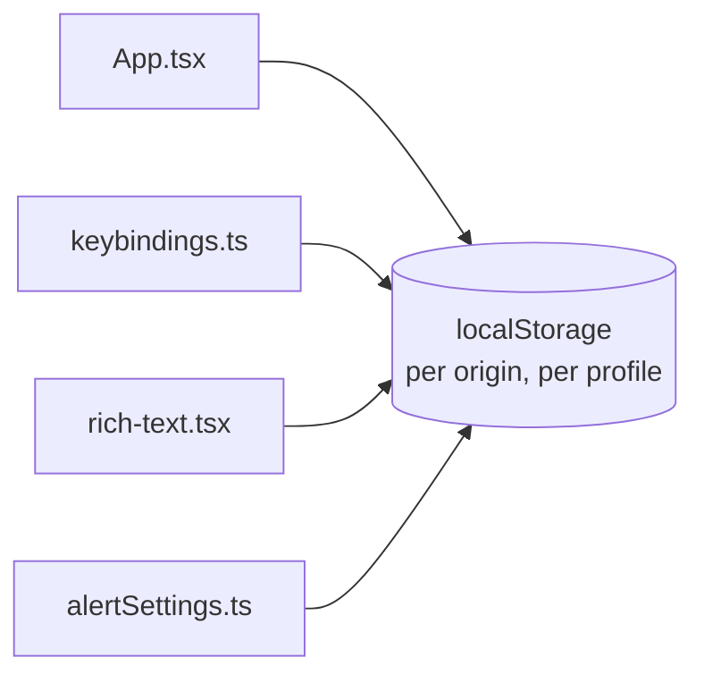
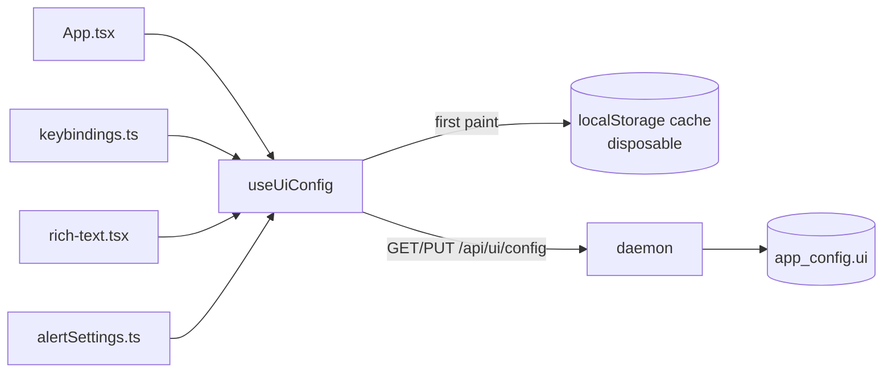

# Move the dashboard's UI settings into the daemon

Layout, Keyboard, Alerts and Appearance live in `localStorage` today. That store is
scoped to the **origin** and to the **Electron profile**, and both of those have moved out
from under the user - twice. Move the durable copy into `app_config`, where every other
setting already lives, and demote `localStorage` to a first-paint cache.

> **Decided:** `localStorage` becomes a write-through cache with the daemon authoritative
> (Decision 1); all four settings move, including layout (Decision 2).

## Why

On 2026-07-16, commit `52f220f` ("Rename to Mission Control") reset every client-side
setting on this machine. Three separate mechanisms, all still live:

1. **The Electron profile path changed.** `productName` went `Agent Wrangler` →
   `Mission Control` in `electron-builder.yml`, and Electron derives `userData` from
   `productName`. `~/Library/Application Support/Mission Control/` was born at the moment
   of the first post-rename launch; the old profile still sits beside it with the old
   values in it (`fleet-control.alerts`, `fleet-control.keybindings`).
2. **The storage keys were renamed with no fallback.** `fleet-control.*` →
   `mission-control.*`. `keybindings.ts` and `layout.ts` have no legacy read at all.
   `alertSettings.ts` has one, but it points at `ai-harness.alerts` - two generations
   stale, because the `ai-harness` → `fleet-control` rename landed separately in
   `6862653`. That fallback can never fire.
3. **Origins are per-port, and this one is ongoing.** `localStorage` is keyed by origin.
   The surviving profiles hold settings under five different origins between them -
   `127.0.0.1:7397`, `localhost:5173`, `localhost:5174`, `localhost:5199`. Every time Vite
   lands on a different port you get an empty settings bucket. `CLAUDE.md` already warns
   that `:5173` usually serves the main checkout rather than your worktree; the settings
   consequence of that is a silent reset.

None of this was a schema change. `app_config` is a KV blob table by design - "a new key
needs no migration" is written into `harnesses.ts`, `cost.ts` and `skills/config.ts` - and
`migrate()` is purely additive (`addColumn` returns early when the column exists,
`db.ts:478`). The settings that live in the DB were never touched.

The fix is to stop treating `localStorage` as durable. **The daemon is already the
per-machine store**; `localStorage` is a per-origin store being asked to do a per-machine
job, which is exactly why it keeps failing.

## What moves

| Setting | Today | After |
|---|---|---|
| Layout (`grid`/`console`/`board`) | `mission-control.layout` | `app_config.ui.layout` |
| Keybinding overrides | `mission-control.keybindings` | `app_config.ui.keybindings` |
| Alert delivery (notifications, sound) | `mission-control.alerts` | `app_config.ui.alerts` |
| Rich text (format messages) | `mission-control.rich-text` | `app_config.ui.richText` |

One `app_config` key, `ui`, not four. The existing per-section split (`foreman`, `skills`,
`harnesses`, `cost`) exists because each of those has distinct **server-side behaviour** -
skills writes symlinks, cost rewrites `~/.claude/settings.json`, foreman drives a worker.
These four have none: they are pure display preferences the daemon only stores. One blob
means one route, one poll, one hook.

## The cache, and why a miss is now harmless

The daemon is the source of truth. `localStorage` stays, but only as a synchronous cache so
the first paint is unchanged - today `layout` and `keybindings` are both read at module
load, and `keybindings` is a module-level `useSyncExternalStore` snapshot, not React state.
A pure fetch would show one frame of `grid` and default chords on every load.

```
module load   read the localStorage cache  ->  paint immediately
on mount      GET /api/ui/config           ->  daemon wins, rewrite cache
on edit       write cache + PUT optimistically; revert both if the server refuses
```

The important property is that **the cache is no longer load-bearing**. A miss costs one
fetch, not a preference. That dissolves the whole class of bug above by construction: a
future rename, a new Electron profile, a different Vite port - each is now a cold cache
that refills itself on mount, not a reset. It also means the legacy-key chain does not need
to be maintained forever; it runs once, as adoption, and then never matters again.

### Reconciliation rule

The daemon wins the moment a fetch lands. There is no merge and no last-write-wins clock:
the cache is only ever a guess about what the daemon holds, so a disagreement is resolved
by discarding the guess. Writes are optimistic against both, and revert on rejection -
the same contract `useHarnesses` already implements for its own optimistic toggles.

### One-time adoption

On the first `GET` that returns an unset `ui` key, the client offers whatever the current
origin's `localStorage` holds - walking the prefix chain `mission-control.` →
`fleet-control.` → `ai-harness.` - and `PUT`s it. That is a real recovery on any origin
that still has values, and a no-op elsewhere.

It cannot reach values stranded in the **old Electron profile**, because the renamed app
never opens that profile. Those are recoverable only by hand; the two that exist on this
machine are recorded in the appendix.

## Flow

Before - four independent stores, each scoped to the origin, no server involvement:



After - one hook over one route, with the cache demoted to a first-paint read:



## Server

**`src/shared/protocol.ts`** - `UiConfigSchema` beside the other config schemas, with
per-field defaults so an unset key parses to the shipped defaults, and
`UiConfigPatchSchema` as its `.partial()` with the standard non-empty refinement.
`keybindings` is `z.record(z.string())` validated against known `ActionId`s on the client,
matching how `loadOverrides` already discards unknown actions rather than erroring.

**`src/server/ui-config.ts`** - `getUiConfig` / `setUiConfig` over `getAppConfig` /
`setAppConfig`, modelled directly on `harnesses.ts`. A shallow merge is correct here:
every top-level field is replaced wholesale by the panel that owns it.

**`src/server/routes.ts`** - `GET /api/ui/config` and `PUT /api/ui/config`, through
`parseBody` per the house rule on mutating routes.

No migration. No new table. No new column.

## Client

**`src/web/useUiConfig.ts`** - the single hook, modelled on `useHarnesses`: fetch on mount,
optimistic update, revert on refusal. It does **not** poll. The existing config hooks poll
because they are open only while a rarely-edited modal is; this one is mounted for the life
of the app, and a 4s poll for the life of the app to catch a second dashboard tab is a poor
trade. A `ui_config` `ServerEvent` would be the right way to reconcile tabs and is noted as
follow-up, not built here.

**`src/web/lib/uiCache.ts`** - the synchronous cache: `readCache()` walking the legacy
prefix chain, `writeCache()`, and nothing else. The one place that knows `localStorage`
exists.

The four call sites keep their current shapes so nothing downstream changes:

- `useLayoutMode()` and `useAlertSettings()` keep their `[value, setter]` tuples, and
  `App.tsx` is untouched at both call sites.
- `useRichText()` keeps its context and its outside-a-provider fallback;
  `RichTextProvider` reads from the hook instead of `localStorage`.
- `keybindings.ts` keeps its module-level external store and its `useSyncExternalStore`
  snapshot. `commit()` writes the cache and fires the `PUT`; a new `hydrate(overrides)`
  lets the fetch push the daemon's copy into the store. `setBinding` / `resetBinding` /
  `resetAll` are unchanged from the outside.

## Done means

- README: the Configuration section gains a line saying UI preferences are stored in the
  daemon's `app_config` and are per-machine, not per-browser.
- Tests, `node:test` + `node:assert/strict`, flat in `test/`:
  - `ui-config-routes.test.ts` - GET returns defaults for an unset key; PUT merges,
    validates, and rejects an empty patch.
  - `ui-config-cache.test.ts` - the legacy prefix chain resolves newest-first; a corrupt
    or absent entry falls back to defaults rather than throwing.
  - `keybindings.test.ts` - extended for `hydrate` replacing the store and notifying
    subscribers.
- The stale `LEGACY_KEY` in `alertSettings.ts` is deleted rather than corrected; the prefix
  chain in `uiCache.ts` replaces it and covers all three generations.

## Follow-up, explicitly not in this change

- **A `ui_config` `ServerEvent`** so a second dashboard tab reconciles live instead of on
  reload. Needs a `case` in `useEventStream.ts` per the compiler-enforced contract.
- **The orphaned `~/.ai-harness/harness.db`** (991 KB, last written 2026-07-14). Stranded
  when the `ai-harness` → `fleet-control` rename created a fresh state dir on 2026-07-12;
  `migrateStateDir()` did not exist until `52f220f`, four days later, and it bails when the
  target already exists so it will never adopt it now. It holds no `app_config` table - it
  predates it - so no settings are in there, but tasks and reviews from 2026-07-10..14 are.

## Appendix: values stranded in the old Electron profile

From `~/Library/Application Support/Agent Wrangler/Local Storage/leveldb/`, unreachable by
any in-app migration:

```
fleet-control.keybindings   {"select":"shift+Tab"}
fleet-control.alerts        {"notifications":false,"sound":true,"afk":false,"digestMinutes":15}
```

`afk` and `digestMinutes` are dead fields - away mode moved server-side - and are dropped
on adoption, which `alertSettings.ts` already does deliberately.
