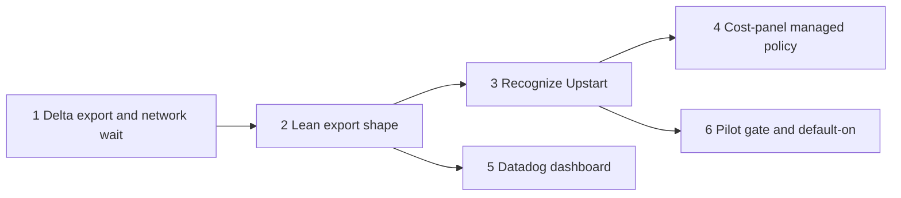

# Upstart default telemetry to Datadog: phased implementation

- **Source plan:** [plan.md](plan.md), approved with decisions recorded 2026-09-28.
- **Date:** 2026-09-28.
- **Phases:**
  1. [Delta export and the network wait](phase-1-delta-export-and-network-wait.md)
  2. [The lean export shape](phase-2-lean-export-shape.md)
  3. [Recognize Upstart and manage its lane](phase-3-recognize-upstart.md)
  4. [Name the managed-policy redirect in the Cost panel](phase-4-cost-panel-managed-policy.md)
  5. [The Mission Control Datadog dashboard](phase-5-datadog-dashboard.md)
  6. [Pass the pilot gate, then turn the Upstart default on](phase-6-pilot-gate-and-default-on.md)

## Incorporated decisions

These are requirements, not open questions.

| Question | Adopted | Owned by |
| --- | --- | --- |
| How Mission Control recognizes Upstart and gets its defaults | A built-in Upstart preset, switched on by Jamf enrollment | Phase 3 |
| Which destination carries the lane | Product analytics | Phase 3 |
| What an Upstart user experiences | On by default, with a one-time notice | Phase 6, after the pilot gate |
| Extra scope | The precise Cost-panel warning, and the Datadog dashboard | Phases 4 and 5 |
| Follow-up | This phased plan | - |
| Who may edit telemetry settings (recorded in the dashboard on 2026-09-29: "No: view-only for Upstart users; only non-Upstart users edit settings") | Only people on machines that are not Upstart-managed. On an Upstart Mac, Settings > Telemetry is view-only and the daemon refuses direct changes. People on other machines gain editable temporality and export-shape controls. This supersedes "viewable in settings and editable" for Upstart users. | Phases 1 and 2 (controls), 3 (lock), 6 |
| Publishing to this public repository (human, 2026-09-29) | Redact internal details, then push and schedule the phases. The unredacted investigation notes are kept outside the repository. | All artifacts |

## What the repository investigation found

Each finding below changes or sharpens the source plan. Every one is recorded as a decision in
the phase that owns it.

| # | Finding | Decision | Phase |
| --- | --- | --- | --- |
| F1 | Datadog drops metric points more than **one hour** older than their submission time, unless Historical Metrics Ingestion is turned on per metric. Datadog's documentation says it is billed as ordinary indexed custom metrics. A laptop off the VPN for an afternoon would lose that afternoon, even though Mission Control queues it for 7 days. | Mission Control counts points sent past a destination's `lateAfterMs` (`latePointsSent`) and records a gap, so the loss is visible. A new rollout step asks Datadog's admins to enable Historical Metrics Ingestion for `mission.*`. | 1 (count), rollout |
| F2 | "Waiting for the network" cannot be a pause reason: any non-null `pausedReason` stops delivery until a person acts. | A new `waiting` delivery outcome, with its own 5-minute backoff ceiling and new health and summary fields. | 1 |
| F3 | A batch holds only the series touched in that pass, with their full cumulative values. The series key has no destination or shape. | The delta watermark is stored in columns on `telemetry_series`, which is one destination per profile. It advances in the batch-building transaction. | 1 |
| F4 | Delta end times cannot reuse event times without overlapping windows, and a lost delta batch is lost data. | End time is the pass clock, strictly increasing per series. Every loss path is already counted and is documented as such. An endpoint or temporality change baselines the watermark, so a new endpoint never receives the whole history. | 1 |
| F5 | "Changing a shape starts new series" has no mechanism today. A policy-epoch bump would skip journal facts captured but not yet projected. | A shape change bumps the generation, which fences queued batches, and resets the profile's series and their watermarks in one transaction. Projection checkpoints are kept, so already-projected facts never count twice and pending facts count once, under the new shape. This is sufficient because `CATALOG_PROJECTION` holds no reducer state: every counter and histogram total lives in `telemetry_series`. The analytical projection emits only gauges, recomputed from retained facts. | 2 |
| F6 | Series rows are never pruned, so old app versions count toward the 10,000 profile cap forever. | Prune series for resources that no longer contribute after the 30-day reducer window. The lean budget counts only live series. | 2 |
| F7 | Datadog picks a host from `host`, then `datadog.host.name`, and recommends the latter. | The lean shape sets `datadog.host.name = mission-control`. The pilot verifies that no billable hosts result. | 2, 6 |
| F8 | Every subprocess must be registered, and a scanner test enforces it. `plutil` is registered; `profiles` is not. `plutil -extract` reads one subtree safely. | Register `profiles` like `plutil`. Build bounded readers once, in Phase 3, and let Phase 4 reuse them. | 3 |
| F9 | Tests on a managed Mac would read the real `/Library` policies and enrollment. CI runs on Linux and would never notice. | The e2e fixture pins `MISSION_ORGANIZATION=none` and `MISSION_MANAGED_SETTINGS_ROOT`. Unit tests inject their readers. | 3, 4 |
| F10 | Upstart Macs also carry a per-user managed Claude Code plist. | The Cost-panel reader checks it first. | 4 |
| F11 | The source plan requires the pilot before default-on, but a merged phase is in every alpha build at once. Upstart users also have no Settings control to join a pilot, because Settings is view-only for them. | Phase 3 ships the preset with `rollout: "pilot"`, and volunteers enroll with one documented call, `POST /api/telemetry/organization/pilot`. Phase 6 flips the rollout to `default-on` only after the measured gate passes, and retires enrollment. | 3, 6 |
| F12 | Managing the product destination on Upstart Macs overwrites whatever a person had configured there. If that destination was already on, it could send to the gateway before pilot enrollment. A Mac can also leave Upstart's management. | Under the pilot invariant, Product analytics is on exactly when the Mac is enrolled. First application is one transaction that writes the preset and switches the destination off. The record stores the prior product destination, including its switch, and the master switch, and withdrawal restores them. A route-level lock refuses only person-initiated writes, so the daemon's own apply path keeps working. | 3, 6 |

## Sizing and phase count

The estimate counts gross non-test lines of production code added or materially changed. It
assumes today's module layout and no rework of neighbouring subsystems.

| Phase | Estimate | Main surfaces |
| --- | --- | --- |
| 1 | 500-650 | telemetry schema, projection, OTLP serialization, delivery, health, settings summary, panel sentence, temporality control |
| 2 | 500-700 | shared shape registry, projection contribution and batch build, budget, config, retention, export-shape control |
| 3 | 700-900 | executable catalog, macOS readers, organization registry and detection, apply/keep-in-step/withdraw, managed lock, pilot route, status wire, view-only panel |
| 4 | 150-220 | managed-settings reader, cost status, Cost panel copy |
| 5 | 60-120, plus 400-700 lines of dashboard JSON | dashboard JSON and validator |
| 6 | 200-300 | default-on rules, notice, acknowledgement route |
| **Total** | **about 2,000-2,800**, plus the dashboard JSON | |

That is far above the 200-line threshold for a single phase. Each boundary is justified:

- **1 and 2 are separate.** Both change the most delicate code in telemetry, the durable
  projection and batch path, but they carry independent semantic risk:
  - Phase 1 changes what a number means (delta windows and a watermark);
  - Phase 2 changes which numbers exist (families, labels and budgets).

  Together they would be about 1,000 lines in one review of the durability core, and a defect
  in either would block the other. Each leaves every default installation byte-identical, so
  each can merge alone.
- **3 is one vertical slice.** It is detection plus preset plus lock plus the view-only panel.
  Splitting the UI from the server would leave a managed, locked destination with no
  explanation on Upstart Macs.
- **4 is its own phase.** It is a separate user-visible feature, the Cost panel, with its own
  e2e. Folding it into Phase 3 would make the largest phase larger, for no shared review
  benefit.
- **5 is independent.** The dashboard needs only Phase 2's manifest, so it can run beside
  Phases 3, 4 and 6.
- **6 is a release gate on outside evidence**, a one-week measured pilot, which cannot be
  inside Phase 3 without shipping default-on on an estimate.

## Phases

| # | Phase | Direct prerequisites | Can run alongside |
| --- | --- | --- | --- |
| 1 | [Delta export and the network wait](phase-1-delta-export-and-network-wait.md) | - | - |
| 2 | [The lean export shape](phase-2-lean-export-shape.md) | 1 | - |
| 3 | [Recognize Upstart and manage its lane](phase-3-recognize-upstart.md) | 2 | 5 |
| 4 | [Name the managed-policy redirect in the Cost panel](phase-4-cost-panel-managed-policy.md) | 3 | 5, 6 |
| 5 | [The Mission Control Datadog dashboard](phase-5-datadog-dashboard.md) | 2 | 3, 4, 6 |
| 6 | [Pass the pilot gate, then turn the Upstart default on](phase-6-pilot-gate-and-default-on.md) | 3 | 4, 5 |

Every phase task also depends on this planning session, whose merge publishes these files.

## Concurrency and merge order

- **Serial:** 1 → 2 → 3.
- **After 2:** Phase 5 may start and merge at any point.
- **After 3:** Phases 4 and 6 may run together.
  - Both edit `docs/upstart.md` in different sections, and possibly
    `test/fixtures/route-surface.json`. Whichever merges second rebases those; neither changes
    the other's code.
  - Phase 6 additionally waits on a human-run pilot week, so in practice it merges last.
- **Suggested order:** 1, 2, 3, then 5 and 4 in either order, then 6 once the pilot passes.

## Cross-phase contracts

| Contract | Owner | Consumers |
| --- | --- | --- |
| Destination fields `temporality`, `networkGate` and `lateAfterMs`, with defaults equal to today | 1 | 2, 3 |
| `temporality: "delta"` on `MetricPointDto`, where absence means cumulative | 1 | 2 |
| The `exported_*` watermark columns, and the baseline on an endpoint or temporality change | 1 | 2 |
| Gauges sent on change, with an hourly heartbeat | 1 | 2 (budget liveness), 5 (adoption query) |
| The `waiting` outcome, the health and summary fields, and the waiting sentence with an optional label | 1 | 3 |
| `TELEMETRY_EXPORT_SHAPE_IDS`, `exportShape`, and the shape records with their `summary` | 2 | 3, 5, 6 |
| `exportedInstruments(shapeId)` as the only statement of what a shape exports | 2 | 3, 5 |
| A shape change bumps the generation and resets series and watermarks, keeps projection checkpoints, and forbids projection-held cumulative totals | 2 | 3 (preset apply) |
| The editable temporality and export-shape controls, through one component with an `editable` flag | 1, 2 | 3 (hidden when managed) |
| `profiles` executable, `readMdmEnrollment` and `readPlistValue` | 3 | 4 |
| `currentOrganization()` and its label | 3 | 4, 6 |
| The `telemetry.organization` record, including `previous` and `pilotEnrolledAt` | 3 | 6 |
| The managed lock: person-initiated telemetry settings writes answer 403 while an organization is active | 3 | 6 |
| The pilot invariant: during `pilot`, `product.enabled` is true exactly when `pilotEnrolledAt` is set; only Phase 6's default-on replaces it | 3 | 6 |
| Preset `rollout` (`pilot`, then `default-on`) and the rule that a newer `presetVersion` rewrites every preset field | 3 | 6 |
| e2e fixture pins: `MISSION_ORGANIZATION=none` and `MISSION_MANAGED_SETTINGS_ROOT` | 3, 4 | every later spec |

## Rollout steps for a person

These are outward-facing, so a person does them or explicitly authorizes an agent. They come
from the source plan's rollout prerequisites, plus F1.

1. **Tell the gateway owners,** with the cost estimate, and settle four things:
   - that the gateway's copy of metrics to its second destination is acceptable;
   - that staging-1 remains the address until production opens;
   - the constant-host approach;
   - whether `send_aggregation_metrics` can be turned off.

   This must be done before Phase 6.
2. **Get cost sign-off.** The Datadog budget owner reviews the estimate, then the pilot's
   measured figure. This must be done before Phase 6.
3. **Confirm the public hostname.** Confirm that publishing the gateway hostname in this public
   repository is acceptable. This must be done before Phase 3 merges.
4. **Ask for Historical Metrics Ingestion.** Ask Datadog's admins to enable it for the
   `mission.*` metrics (F1). This should be done before Phase 6's pilot, so the pilot measures
   the real configuration.
5. **Apply the dashboard.** Apply `observability/datadog/dashboards/mission-control.json` to
   Upstart's Datadog, after Phase 5 merges.
6. **Run the pilot.** After Phase 3 is in their build, 5 to 10 volunteers enroll their Macs
   for one week with `POST /api/telemetry/organization/pilot`, as `docs/upstart.md` documents.

## Final verification strategy

- **Every phase:**
  - `npm run typecheck`, `npm run lint` and `npm test`;
  - `npm run build && npm run smoke` wherever runtime surfaces change;
  - `npm run test:e2e` for Phases 1, 2, 3, 4 and 6, which change UI.
- **Byte-for-byte defaults.** Phases 1 and 2 must leave a default installation's batches
  byte-identical. The existing analytics-durability and stack pins are the proof.
- **Uniqueness of detection.** Phase 3's lookalike and other-tenant fixtures must all fail,
  and the no-organization e2e spec must find no Upstart text.
- **Who can edit.** Phase 3's e2e must find no editable control on a managed Mac and a 403 on a
  direct write. Its no-organization spec, and the Phase 1 and 2 specs, must find every control
  editable, including temporality and export shape.
- **The pilot gate.** Phase 6 records measured installations, custom metrics per installation
  (150 or fewer), host billing, span volume and the person-run checks in its pull request,
  before the default flips.
- **End state.**
  - On an Upstart-managed Mac, the lean, delta, gated lane sends to Datadog by default, with a
    one-time notice, and Settings > Telemetry is view-only.
  - Everywhere else, Mission Control behaves as it did before Phase 1, and gains editable
    temporality and export-shape controls.

## Task map

Scheduled on 2026-09-29. Each task is a backlog ship task in `teamupstart/mission-control`, and
each also depends on this planning session, so none starts until these files reach the
default branch.

| Phase | Task id | Direct task prerequisites |
| --- | --- | --- |
| 1 | `2ee7286d-491a-493d-a1eb-bafb94e1d5d0` | - |
| 2 | `ac7b09dc-199c-42be-9819-09973da3f577` | Phase 1 |
| 3 | `2e5d44c2-5b6b-4f27-be8d-5de7003dc0c2` | Phase 2 |
| 4 | `0622fabd-1f2d-4a32-b8e2-67c8ea788f92` | Phase 3 |
| 5 | `243a0a7c-ed73-4ad3-8bba-f1b0d3c7d7c8` | Phase 2 |
| 6 | `2f5da74a-a67b-4e84-9858-19721f2ff5e1` | Phase 3 |
