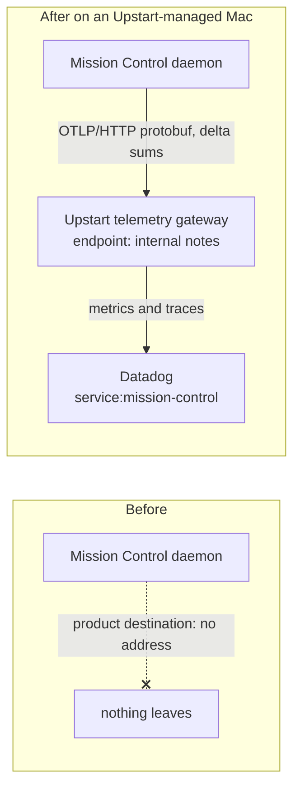
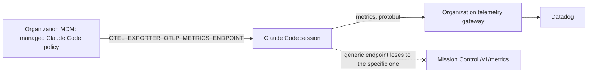

# Upstart default telemetry to Datadog

- **Status:** Approved for phased implementation planning
- **Date:** 2026-09-25, decisions recorded 2026-09-28 and 2026-09-29
- **Scope:** Planning only. This document proposes no application changes by itself.
- **Surfaces:**
  - `src/server/telemetry/` and `src/shared/telemetry.ts`;
  - a new organization check under `src/server/environment/`;
  - `src/web/components/TelemetrySettingsPanel.tsx` and the Cost panel;
  - a new `observability/datadog/dashboards/` definition;
  - `docs/observability.md` and `docs/upstart.md`.
- **Internal notes.** This repository is public, so it carries no Upstart-internal specifics:
  no hostnames, tenant names, gateway configuration, vendor details, account figures or
  investigation evidence. Those live in a local file that is never committed:

  `~/workspace/upstart/mission-control-internal/upstart-datadog-telemetry/internal-notes.md`

  This plan cites it as "internal notes, *Section*". An implementing agent on an Upstart machine
  reads the values from there. Whether any of them may enter committed code is rollout
  prerequisite 3.
- **Decision record:** see [Decisions](#decisions).

## The short version

- **What already exists.** Mission Control captures telemetry durably and exports it over
  OTLP/HTTP to two remote destinations, **Your own backend** and **Product analytics**. Both
  are off by default, and no address is built in.
- **The route.** Upstart runs an internal OpenTelemetry Collector gateway that its laptops
  reach over the corporate network, and it forwards metrics and traces to Datadog (internal
  notes, Gateway). Shipping Mission Control's telemetry to Datadog therefore needs no Datadog
  client in Mission Control. It means pointing the existing Product analytics destination at
  that gateway, closing four compatibility gaps, and turning it on by default only on Macs
  enrolled in Upstart's device management.
- **Validated on 2026-09-25.** One synthetic `mission.daemon.starts` delta point, sent this way
  with Mission Control's own serializer, arrived in Datadog with value 1. See
  [Validation through the gateway](#validation-through-the-gateway).
- **Cost.**
  - Shipping everything as-is would cost about $60 per installation per month in Datadog
    custom metrics, at list price.
  - The lean export shape brings the expected figure to about **$4.60 per installation**, or
    about $690 a month for 150 installations.
  - A durable per-hour export ledger enforces a hard ceiling.
  - A one-week pilot must confirm the figure before the default turns on.

  See [Datadog cost](#datadog-cost).
- **Detection.** Apple's `profiles status -type enrollment` reports the Mac's current MDM
  enrollment and server. It needs no admin rights and takes about 30 ms. The rule requires an
  **active** enrollment whose server is **exactly Upstart's own MDM tenant host** (internal
  notes, Preset values). Using the same MDM vendor, or any other, at another company is never
  enough, so those users see today's behaviour unchanged.
- **Managed on Upstart Macs, editable everywhere else.**
  - Upstart users see the Upstart configuration in Settings > Telemetry but cannot change it.
  - People on other machines keep full control, including new temporality and export-shape
    controls for configuring a Datadog-compatible destination by hand.
- **Not the internal CLI's approach.** An existing internal Upstart CLI sends to Datadog by
  a different route (internal notes, Internal CLI). Mission Control holds no Datadog
  credential and needs no cloud login.

## What exists today

### Mission Control's outbound telemetry

| Fact | Where |
| --- | --- |
| Profiles are `local`, `user`, `product`. Signals are `metrics` and `traces`, with no logs. | `src/shared/telemetry.ts:112`, `:127` |
| Every config default is off, and that is the stated upgrade contract. Tests pin it. | `src/shared/telemetry.ts:330`; `test/telemetry-migration.test.ts`, `test/telemetry-durability.test.ts`, `e2e/specs/telemetry-settings.spec.ts` |
| Product analytics reports `unavailable` until it has an address, and turns itself off if the address is cleared. | `src/server/telemetry/config.ts:68`, `:276`, `:291` |
| Product carries every `AUDIENCE_ALL` fact. Only the operator facts are withheld: the probe, telemetry control actions and settings-opened. | `src/shared/telemetry-catalog.ts`; `src/server/telemetry/capture.ts:152` |
| One base URL per destination, with `/v1/metrics` and `/v1/traces` appended. Protobuf only. | `src/server/telemetry/endpoint.ts:23`; `src/server/telemetry/otlp.ts:38` |
| **Sums, histograms and gauges are always cumulative.** A test pins it. | `src/server/telemetry/otlp.ts:78`, `:100`, `:108`; `test/telemetry-contract.test.ts:177` |
| **A 401 or 403 pauses the destination** with reason `auth` until someone saves the config again. | `src/server/telemetry/delivery.ts:413` |
| Only `user` can hold a credential: one header, with any name. `product` has none. | `src/server/telemetry/config.ts:324-342`; `src/server/telemetry/schema.ts:207` |
| Resource: `service.name=mission-control`, `service.version`, `service.instance.id` (the installation pseudonym), `mission.identity.epoch`, `deployment.environment.name` (`MISSION_TELEMETRY_ENVIRONMENT`, else `local`). | `src/server/telemetry/capture.ts:95-119` |
| Launch mode is `desktop` (Electron), `daemon` (built) or `dev`. | `src/server/index.ts:786` |
| Organization-specific facts live in exactly one file under `src/server/environment/`. The UpstartClaw row is the precedent: the server decides whether a row exists at all, and the browser renders what arrives. | `src/server/environment/index.ts:20-28`; `src/server/environment/upstartclaw.ts` |
| No organization, managed-policy or first-run seeding mechanism exists for telemetry. | - |

### What the internal CLI does, and what to take from it

The requested inspiration is an internal Upstart CLI that already sends to Datadog. Its
specifics, and the reasons its delivery route is not reused, are in the internal notes,
Internal CLI.

- Take:
  - delivery that is best-effort and never blocks work;
  - an explicit opt-out;
  - secrets redacted in logs.
- Do not take:
  - its delivery route. Mission Control holds no Datadog credential, needs no cloud login,
    and sends only through the gateway;
  - machine and user names, which Mission Control's privacy contract forbids.

### What the gateway requires of a sender

These are the gateway's own facts; the values and sources are in the internal notes, Gateway.
The plan only depends on these properties:

| Property | What it means for Mission Control |
| --- | --- |
| It accepts OTLP/HTTP protobuf at one base URL. | It matches Mission Control's exporter as-is. |
| It needs no credential from Mission Control, and refuses requests from off the corporate network with a 403. | Off the network, a destination must wait instead of pausing (change 2). |
| It cannot convert cumulative sums to delta correctly. | Cumulative counters would be miscounted. Mission Control must send delta (change 1). |
| It adds its own environment tag. | Datadog then carries two `env` values on each series. The preset sets Mission Control's environment to the gateway's (internal notes, Preset values). |
| Its Datadog exporter keeps `service.instance.id` as a metric tag, and uses the receiving gateway instance as `host` unless told otherwise. | Series cardinality and the constant host value (change 3 and the lean shape). |
| Its histogram export produces a distribution plus separate aggregation metrics. | Each histogram combination costs 9 custom metrics, which is why minor histograms become sum and count counters. |
| Its onward routing is set by its owners. | It is disclosed in the one-time notice and settled with the owners (rollout prerequisite 1). |

### Validation through the gateway

On 2026-09-25, with the requester's go-ahead, one synthetic Mission Control metric was sent
over the proposed route. The exact request and response are in the internal notes, Validation
run. The point had these properties:

- it was built with `@opentelemetry/otlp-transformer` 0.222.0 and `@opentelemetry/sdk-metrics`
  2.11.0, the versions `src/server/telemetry/otlp.ts` pins;
- it carried the resource attributes `capture.ts` attaches;
- the metric was `mission.daemon.starts`, value 1, as a delta monotonic sum;
- the environment was `test` on purpose, with a synthetic installation id.

The gateway accepted it, and Datadog showed the value 1.

| Datadog tag | Came from |
| --- | --- |
| `service`, `version` | `service.name`, `service.version` |
| `env`, with two values: the gateway's and `test` | the gateway's environment tag, and Mission Control's `deployment.environment.name` |
| `service.instance.id` | the resource attribute |
| `launch_mode`, `schema_upgraded` | data-point attributes |
| `instrumentation_scope`, `instrumentation_scope_version` | the OTLP scope |
| `host` | the gateway instance that received the request |

What this settles:

- the route works end to end;
- delta arrives exactly, with one sent and one counted;
- Datadog keeps the OTel metric name unchanged;
- every installation is its own set of series;
- environment filters need care.

What it does not settle:

- traces;
- the response off the Upstart network;
- whether a re-sent delta point overwrites or adds;
- series count at fleet scale.

## Detecting Upstart

The question is "is this Mac managed by Upstart?", and the answer has to be unique to
Upstart. Two groups must see exactly today's behaviour, with nothing sent and nothing shown:

- people at other companies whose Macs are managed by any MDM, including the same vendor;
- people who work at Upstart but run Mission Control on a personal laptop.

So the signal describes the device and names Upstart's own tenant. It never names a vendor,
an app, or the person. The evidence for each verdict is in the internal notes, Detection
evidence.

| Signal | What it proves | Verdict |
| --- | --- | --- |
| Active MDM enrollment whose server host is exactly Upstart's tenant host (`/usr/bin/profiles status -type enrollment`) | The device is enrolled right now in Upstart's own tenant | **Use.** Apple-owned, needs no root, fast. The enrollment record is system-owned, and a non-admin user cannot write it. |
| The MDM vendor's own settings file naming Upstart's tenant | The vendor's agent was configured for Upstart's tenant at some point | **Reject, including as a fallback.** It can outlive an unenrollment. On a Mac later enrolled with another organization, "active enrollment" plus a stale file would wrongly pass. |
| The MDM vendor's agent is installed, or any host under the vendor's cloud domain | Some customer of that vendor manages this Mac | **Reject.** True at every company on that vendor. |
| The self-service IT app the request suggested | Some customer of the MDM vendor manages this Mac | **Reject.** It is the vendor's generic app under another name, so it is not Upstart-specific. |
| An organization-named managed-preference domain | The organization's MDM pushed some policy | **Reject as a trigger.** Such a domain belongs to whichever tool uses it, and can disappear with that tool. |
| Person-level signals: a work email in git config, cloud SSO configuration, UpstartClaw installed, an internal tool's local configuration | The person works at Upstart | **Reject.** True on personal machines, and anyone can edit them. |
| Reaching the gateway or corporate DNS | The Mac is on the corporate network right now | **Reject.** Flips with the VPN. |

**Rule.** The organization is `upstart` only when **both** of these hold:

1. **Active enrollment.** `profiles status -type enrollment` reports `MDM enrollment: Yes`.
   `No`, a missing line, or unreadable output means no organization.
2. **Upstart's tenant, exactly.** The enrolled server's URL parses with scheme `https`, and
   its hostname, lowercased with any trailing dot removed, equals an entry in the preset's
   host allowlist. Today that list holds exactly one host (internal notes, Preset values).
   - The hostname comes **only** from the `MDM server` line of the same `profiles status`
     output that reported the enrollment, so both conditions describe the current enrollment.
   - A missing, empty or unparseable `MDM server` line means no organization.
   - No file is consulted as a fallback.

There is no suffix, substring, vendor or app matching anywhere. A cloud MDM tenant hostname
belongs to one customer, so an exact match names one organization. Any other tenant, a
self-hosted server and every other MDM fail condition 2.

The read runs through a fixed-argument command with an absolute path, a 2-second timeout and
no shell. Any other platform, error, timeout or unexpected output means no organization. It
fails closed: an unreadable result turns nothing on. Detection runs once at daemon start and
again on an explicit Re-check.

| Machine | Result |
| --- | --- |
| Upstart-issued Mac, enrolled in Upstart's tenant | Upstart default applies |
| Another company's Mac on the same MDM vendor (a different tenant host) | Nothing changes: off and hidden |
| Another company's Mac on a self-hosted server or any other MDM | Nothing changes: off and hidden |
| Personal Mac, not enrolled, including an Upstart employee's own laptop | Nothing changes: off and hidden |
| Mac that left Upstart's MDM but still has the vendor's files naming Upstart | Nothing changes: enrollment reads `No` |
| That same Mac, now enrolled in another organization's MDM | Nothing changes. The `MDM server` line names the other organization, or is missing; either way there is no match, and the stale file is never read. |
| Linux, Windows, or a container | Nothing changes: detection is macOS-only |

**Guards.** Even on an Upstart Mac, the organization default applies only when all of these
hold:

- the launch mode is `desktop` or `daemon`, not `dev`;
- the daemon is not under the test runner;
- the state home does not resolve inside the OS temp dir, so e2e and fixture daemons never
  qualify.

**Overrides.**
- `MISSION_ORGANIZATION=none` turns detection off on any machine.
- `MISSION_ORGANIZATION=upstart` exists only for tests. It is honoured only when the preset
  endpoint is also redirected to a loopback address, such as the e2e suite's fake collector.

So no machine that fails the rule above can ever send to Upstart's gateway, whether by override
or by accident.

## Design

### The data flow

Before, Mission Control's product destination has no address, so nothing leaves the Mac.
After, on an Upstart-managed Mac, the product destination is addressed to Upstart's gateway,
which forwards to Datadog.

### The Upstart preset

One registry entry, next to the detection check under `src/server/environment/`. It is never
branched on elsewhere, following the same rule as the UpstartClaw check. The literal values
are in the internal notes, Preset values.

| Field | Value |
| --- | --- |
| Organization | `upstart`, label "Upstart" |
| MDM host allowlist | Upstart's tenant host, matched exactly against an active enrollment |
| Evidence shown to the user | "This Mac is enrolled in Upstart's device management (*tenant host*)." |
| Destination | Product analytics |
| Endpoint | The gateway's base URL |
| Credential | None |
| Metric temporality | Delta |
| Export shape | `datadog-lean`, described in [Datadog cost](#datadog-cost) |
| Host attribute | One constant value, `mission-control`, for every installation |
| Series budget | 1,500 weighted series per installation |
| Network gate | The gateway's edge-refusal gate: a 403 served by the edge proxy means "off the Upstart network", not "unauthorized" |
| Environment | The gateway's own environment name, so an Upstart install's series carry one `env` value instead of two. `MISSION_TELEMETRY_ENVIRONMENT` still overrides it. |
| Preset version | An integer, bumped when any value changes |

### Managed on Upstart Macs: apply, keep in step, withdraw

On an Upstart-managed Mac, Upstart's telemetry configuration is **managed**. The person can see
it in Settings > Telemetry but cannot change it. This follows the human decision recorded on
2026-09-29 (see [Decisions](#decisions)). People on every other machine keep full control of
their own telemetry settings.

The stored `telemetry` config stays the single source of truth; the organization never
becomes a second read path. At daemon start and on Re-check, when the guards pass:

1. **First application.** This happens when there is no `telemetry.organization` record, a
   new operational app-config entry that, like `telemetry`, is excluded from settings
   snapshots.
   - Mission Control writes the preset into the Product analytics destination through the
     ordinary `setTelemetryConfig` transaction, so consent epochs, generations and the
     revision all behave as for any save.
   - The record first stores the product destination and master collection switch as they
     were. Withdrawal restores them.
   - **During the pilot, only enrolled Macs send.** The same write turns the Product analytics
     switch **off** unless the Mac is enrolled. A destination that was already on cannot send
     to Upstart's gateway before enrollment.
     - The master collection switch is left as it was. It also governs local collection and
       the person's own backend, and the Product analytics lane cannot send while its own
       switch is off.
     - Batches already queued for the previous product endpoint are fenced by the endpoint
       change and dropped by the switch-off, under the existing rules. They are never
       redirected to the gateway.
   - **Once the default is on,** every Upstart-managed Mac sends, and the master collection
     switch is turned on with it.
   - The record stores the preset version and the time.

   The write is recorded as a telemetry control action by the daemon itself (`SYSTEM_ACTOR`,
   basis `owner`). This is where the installation identity is first minted, when sending
   starts.
2. **Later starts.** When the preset version is newer than the record, every preset-owned field
   moves to the new value, because nobody on the Mac can have changed it. This is how an
   endpoint move reaches every Upstart Mac in an ordinary release.
3. **Managed means managed.** While the organization is active, the daemon refuses any
   person's change to telemetry settings with a clear "managed by Upstart" answer.
   - That covers `PUT /api/telemetry/config` and the purge and identity-reset operations.
   - Test connection and Try again remain available, because they change no setting.
   - The daemon's own writes are unaffected.
4. **No longer detected.** If a Mac with a record stops matching, the product destination
   (including its own switch) and the master switch are restored to what the record stored,
   and the record is removed.
   - A destination that was on before detection is on again, sending to its original endpoint
     under a new consent epoch.
   - From then on the person can edit their settings again, like anyone else.

`MISSION_ORGANIZATION=none` remains a diagnostic override for development and support. It is
an environment variable, not a Settings control.

### The one-time notice

When the default first turns sending on, the dashboard shows one dismissible notice. It is a
notice in the page, not a modal. It says:

- that Mission Control now sends usage telemetry to Upstart's Datadog, through Upstart's
  telemetry gateway, because this Mac is enrolled in Upstart's device management;
- that Upstart manages this setting on its Macs;
- what travels and what never does, in the same words as the Telemetry panel, including any
  onward destinations the gateway owners configure;
- where to see it, with a link to **Settings > Telemetry**.

Dismissing it stores `noticeAcknowledgedAt` in the `telemetry.organization` record, so it
never returns on that installation. It never appears on a Mac that is not Upstart-managed.
The notice only ships in the release that turns the default on, which comes after the pilot
gate in [Datadog cost](#datadog-cost) has passed.

### Datadog compatibility: four generic changes

These are destination capabilities, not Upstart code, so anyone can use them with manual
settings as well.

1. **Per-destination metric temporality: `cumulative` (the default) or `delta`.**
   - **Why.** A load-balanced gateway that converts cumulative sums to delta in each instance
     separately computes every delta against a stale baseline, and counts come out inflated.
     Datadog says so directly: all points of a cumulative series must reach the same
     exporter. Its agentless OTLP metrics intake accepts only delta. Why this applies to
     Upstart's gateway is in the internal notes, Gateway.
   - **How.** For a delta destination, the projection writes each immutable batch as the
     difference from the cumulative value last batched for that destination and series. The
     start time is the previous batch's end. It happens in the same transaction that already
     commits checkpoint, state and batch, so a restart neither loses nor repeats a window.
   - **The cost, stated rather than hidden.** A batch re-sent after an ambiguous
     acknowledgement repeats its delta, unless Datadog overwrites a point with the same series
     and timestamp. Phase 6's pilot measures which against the real gateway, before the
     default turns on.
   - **No zero deltas.** A series whose delta is zero is never sent. Datadog bills a series
     only for the hours it reports, so this keeps idle series free.
   - **Gauges.** A gauge has no delta. It is sent when its value changes, and otherwise as a
     **heartbeat** at most an hour after its last export. The heartbeat runs even in a pass
     with no new events, so a quiet installation still reports its gauges. Phase 1 specifies
     the mechanism.
   - **Cumulative destinations** keep today's behaviour exactly, and the pinned test keeps
     pinning it.
2. **A network gate that waits instead of pausing.**
   - **Why.** Off the corporate network, the gateway refuses the request. Today every 403
     pauses the destination with reason `auth` until somebody saves the config again, so a
     laptop that leaves the VPN would stop exporting for good.
   - **How.** A destination whose network gate is set classifies a 403 matching the gate's
     edge fingerprint as `waiting_for_network` instead. Phase 1 ships one generic
     fingerprint, Cloudflare's documented edge response: a `cf-ray` header,
     `server: cloudflare`, and a body that is not an OTLP response. Which gate the Upstart
     preset names is in the internal notes, Preset values.
   - **Retry.** The destination retries with backoff capped at 5 minutes and never pauses. The
     queue already holds 7 days, and loss beyond that is counted as it is today.
   - **What people see.** Health reads "Waiting for the Upstart network (VPN)". Any other 403
     still pauses.
3. **Series cardinality.** The validation point showed which attributes become Datadog tags:
   data-point attributes, `service`, `version`, `env`, `service.instance.id`, the
   instrumentation scope, and a `host` tag naming the receiving gateway instance. That has three
   consequences:
   - **Every installation is its own set of series.** Per-installation analysis works in
     Datadog, but the custom-metric count grows with installations times label combinations.
     [Datadog cost](#datadog-cost) sizes it.
   - **The `host` tag splits series across gateway instances.** One installation's counter appears
     under several `host` values. Sums across hosts stay correct, but the series count
     multiplies. The lean export shape fixes this with one constant host value.
   - **Environment filters would also match test and local data**, because the gateway's
     environment is added next to Mission Control's own value. The preset gives real installs
     the gateway's environment alone, and a Datadog view excludes `env:test`, `env:local` and
     `env:development`.

   Traces keep resource attributes as span tags, so per-installation drill-down also comes
   from APM.
4. **A per-destination export shape.** A destination can name a registered shape that
   changes what it receives, without touching what other destinations receive:
   - excluded instrument families;
   - labels dropped from particular instruments;
   - histograms exported as a sum counter plus a count counter instead of a distribution;
   - a constant host resource attribute;
   - a series budget.

   The default shape is today's full export, so the local Grafana stack and every existing
   destination keep every metric and label. The shape is applied when the destination's
   batches are built. Dropping a label aggregates the affected series together, and the
   dropped detail stays on the matching trace span.

   Changing a destination's shape starts new series for it from zero:
   - queued batches of the old shape are fenced, never rewritten;
   - its aggregates and delta watermarks are cleared;
   - journal facts already projected are not projected again, and facts not yet projected
     count once, under the new shape;
   - gauges that a projection recomputes from its own retained state come back with their
     current values, which is correct for a gauge and is never added to a counter.

   The Upstart preset selects `datadog-lean`, and anyone can select it for their own Datadog
   destination.

### Datadog cost

**How Datadog bills it.** Sources: Datadog's custom-metrics billing documentation and public
price list.

- A custom metric is one unique combination of metric name and tag values, including `host`.
  The bill is the monthly average of distinct series seen each hour, so a series costs money
  only in the hours it reports.
- List price is $5 per 100 custom metrics a month, so $0.05 each. Upstart's contract rate may be
  lower. Treat every new series as billed.
- A histogram reported as a distribution counts 5 per tag combination. The gateway also sends
  separate aggregation metrics (internal notes, Gateway), which makes **9** per combination.
  Counters and gauges count once.

**Before the optimizations.** This is the full product fact set: 205 instruments, of which
52 are activity metrics, 11 of those histograms, plus 153 cohort gauges.

| Scenario | Cohort gauges | Activity metrics | Health gauges | Custom metrics per installation | Per installation per month |
| --- | --- | --- | --- | --- | --- |
| Low | 458 | 96 | 5 | 559 | $28 |
| Expected | 915 | 266 | 12 | 1,194 | $60 |
| High | 2,224 | 694 | 25 | 2,943 | $147 |

The cohort gauges dominate because they report every hour the daemon runs, by design. Their
count also grows over time, because every release adds an `app_version` slice that is kept
up to the 24-slice limit. The expected case therefore drifts towards about $100.

**The lean export shape (`datadog-lean`).** Each item is a requirement for the Upstart lane.

1. **No cohort gauges.** `mission.analytics.v1.*` is excluded from this destination. Those
   gauges exist for the Grafana dashboards' PromQL coherence checks. Datadog views derive their
   numbers from the counters, and traces carry per-run detail.
2. **One constant host value.**
   - Mission Control sends the host resource attribute `datadog.host.name = mission-control`
     for every installation, so the receiving gateway instance no longer splits series.
   - Installations stay distinct through `service.instance.id`.
   - The pilot must show that it collapses the instance split without making Datadog bill each
     laptop, or anything beyond one entry, as an infrastructure host. If it does bill them,
     the fallback is for the gateway owners to set a fixed hostname for this service.
3. **Labels trimmed on the largest activity metrics.** Every dropped label remains on the
   matching span, either as a span attribute or as the envelope's `mission.actor.*`, which
   every span carries.

   | Metric | Dropped labels | Typical combinations, before → after |
   | --- | --- | --- |
   | `mission.dispatches` | `resolution_source`, `resolved_effort` | 288 → 32 |
   | `mission.action.count` | `actor` | 200 → 100 |
   | `mission.sessions.ended` | `ended_while_work_open` | 96 → 48 |
   | `mission.session.segments` | `quality`, `reason` | 72 → 12 |
   | `mission.sessions.started` | `start_observation` | 64 → 32 |
   | `mission.session.operations` | `actor_basis` | 64 → 32 |
   | `mission.session.turns` | `quality` | 48 → 24 |
   | `mission.session.effort.selections` | `applies` | 48 → 24 |
   | `mission.automation.actions` | `actor` | 48 → 24 |

4. **Distributions only where percentiles matter.** Four histograms stay as distributions:
   `mission.session.turn.duration`, `mission.dispatch.duration`, `mission.workflow.duration`
   and `mission.workflow.node.duration`. The other seven are exported as a sum counter and a
   count counter, which is 2 per combination instead of 9 and still gives averages:
   - `mission.session.observed.duration`;
   - `mission.daemon.startup.duration`;
   - `mission.workflow.pickup.duration`, `.repair.duration`, `.wait.duration`,
     `.node.queue.duration` and `.stage.duration`.

   Separately, the gateway owners are asked whether they can stop sending the extra
   aggregation metrics, which would take each distribution from 9 to 5.
5. **No zero deltas.** This is stated under temporality above. An unchanged series is not
   sent, so it is not billed.
6. **A hard series budget.** Each installation can have at most 1,500 weighted series live
   for this destination. A distribution combination weighs 9 (or 5), a sum-and-count pair 2,
   and a counter or gauge 1. **The overflow series count toward that limit too:**
   - when an instrument gets its first live series for a resource, the budget also reserves
     the weight of that instrument's one overflow series;
   - a series is admitted only if the live weight, plus every reservation, plus its own weight
     (and its instrument's reservation, if it has none yet) stays within 1,500. That applies
     to a brand-new series, and equally to a stored series that went more than 7 days without
     reporting and then reports again;
   - a series that does not fit folds into its instrument's overflow series, which is always
     admissible because its weight was reserved;
   - a contribution for an instrument that has neither room for a series nor a reservation is
     dropped and counted as a `budget_exhausted` gap.

   **The hourly export ledger.** That admission rule bounds the live series of one shape and
   consent epoch. The billing guarantee is enforced separately, where points are exported:
   - a durable ledger records, for each clock hour, the distinct series already exported and
     their weights;
   - it is keyed by profile and hour, **not** by shape or epoch. A shape change, a
     consent-epoch change or a restart earlier in the hour cannot reset what that hour has
     already used;
   - a point for a series already in the hour's ledger always goes out;
   - a point for a new series goes out only if the hour's weight stays within 1,500.
     Otherwise it waits for the next hour: its delta is not lost, the delay is counted as an
     `hourly_cap_deferred` gap, and a gauge sends its then-current value.

   As a result, no installation exports more than 1,500 weighted distinct series in any clock
   hour, measured by point timestamp, even across shape and epoch changes. That is $75 a month
   at list price, and the realistic high case is far below it.

   A point is admitted once, when its batch is built in the current hour. A batch delivered
   late was admitted when it was built, so late delivery never admits anything again, and a
   wall clock that moves backwards cannot reopen an hour the ledger has already swept.

   One case the ledger cannot control is how Datadog counts a backlog delivered late, for
   example after a day offline with Historical Metrics Ingestion enabled. Phase 6's pilot
   measures it.

**After the optimizations.**

| Scenario | Custom metrics per installation | Per installation per month | If histograms counted 5 instead of 9 |
| --- | --- | --- | --- |
| Low | 47 | $2.34 | $1.92 |
| **Expected** | **92** | **$4.61** | **$3.77** |
| High | 172 | $8.59 | $7.00 |

| Installations | Before, expected | After, expected |
| --- | --- | --- |
| 50 | $2,984/mo | $231/mo |
| 150 | $8,953/mo | $692/mo |
| 300 | $17,905/mo | $1,384/mo |

**Assumptions** for the expected case:
- the daemon runs 45% of hours;
- each activity series reports in about 8% of hours;
- the typical installation uses 2 agents, 2 runtimes, 4 task kinds, 3 effort levels, 4
  models and about 50 of the 188 action names;
- label value counts come from the catalog's own schemas, with model labels capped at the 17
  shipped models plus `other` and `unknown`.

The activity duty cycle is the weakest input. Trace cost is not in these figures: APM span
ingestion and indexing are measured in the pilot.

**Pilot gate.** The default does not turn on for every Upstart Mac until a pilot passes:

- 5 to 10 volunteer installations run `datadog-lean` for one week. Because Settings is
  view-only on Upstart Macs, volunteers enroll their Mac with one documented call,
  `POST /api/telemetry/organization/pilot`, which exists only while the rollout is in its
  pilot stage;
- `datadog.estimated_usage.metrics.custom.by_metric{metric_name:mission.*}` divided by the
  number of pilot installations must be **150 or fewer** per installation, about $7.50 a month
  at list price;
- the pilot also records APM span volume for `service:mission-control`.

If the pilot runs higher, the shape is trimmed further before rollout.

### Settings > Telemetry

Who can edit follows the human decision recorded on 2026-09-29: only people on machines that
are not Upstart-managed edit telemetry settings.

- **On a Mac that is not Upstart-managed,** everything is editable, and no Upstart text
  appears anywhere. The status response carries `organization: null`, and the browser renders
  nothing for it, as with the UpstartClaw row.
  - The panel works as it does today.
  - Each remote destination gains two editable controls, so a person can configure a
    Datadog-compatible destination by hand:
    - **Metric temporality:** "Cumulative (Prometheus, Grafana)" or "Delta (Datadog)";
    - **Export shape:** "Full" or "Datadog lean", with the shape's sentence about what it
      leaves out.
  - They save with the destination's existing Save button, under the same revision rules.
- **On an Upstart-managed Mac,** Settings > Telemetry is **view-only**.
  - A "Managed by Upstart" block at the top names the organization and its evidence.
  - It shows the state in plain words: "Sending to Upstart's Datadog", "Waiting for the
    Upstart network", or, during the pilot, "Not enrolled in the pilot on this Mac".
  - It lists the effective configuration read-only: destination, endpoint, temporality,
    export shape (with the sentence naming what it leaves out), environment and network gate.
  - No switch, field, Save, credential, purge or identity-reset control is shown, and the
    daemon refuses those changes if they are attempted directly.
  - **Test connection**, **Try again** after a pause, and **Re-check** remain, because they
    change no setting. Re-check re-runs detection, as the Setup panel does for agent
    extensions.

### The Datadog dashboard

One Datadog dashboard, **Mission Control**, is kept as code at
`observability/datadog/dashboards/mission-control.json`, beside the Grafana dashboards in
`observability/grafana/dashboards/`. The JSON is the source of truth. Applying it to
Upstart's Datadog organization is an outward-facing write, so a person does it, or authorizes
it explicitly. The repository never applies it automatically.

It reads only what `datadog-lean` actually sends:

- **Adoption:** distinct installations over 1, 7 and 28 days, counted as distinct
  `service.instance.id` values on the hourly telemetry-health heartbeat, with the session
  spans as a cross-check.
- **Sessions and dispatch:**
  - sessions started and ended by agent, runtime and task kind;
  - dispatch outcomes;
  - p50 and p95 of turn and dispatch duration.
- **Usage:** tokens and API-equivalent cost by model and usage origin, labelled as never
  subscription billing.
- **Outcomes:** task outcomes with their completion evidence, and verified pull request facts.
- **Workflows and Personas:**
  - runs started and finished;
  - node dispositions;
  - reviewer verdicts;
  - finding categories.
- **Reliability:** errors by component and code, and action outcomes by feature.
- **Telemetry health:** pending items, the oldest pending age, and the last accepted time per
  installation.
- **Cost watch:** `datadog.estimated_usage.metrics.custom.by_metric{metric_name:mission.*}`,
  against the 150-per-installation gate.

Every widget that queries Mission Control's own metrics or spans filters to
`service:mission-control` and an `env` template variable:
- the filter excludes `test`, `local` and `development`;
- the variable's default is the gateway's environment name. The committed JSON uses `*`, and
  the person who applies the dashboard sets the default from the internal notes, Preset
  values.

The cost-watch usage metric is Datadog's own and carries neither tag, so it filters on
`metric_name:mission.*` instead.

No widget depends on the cohort gauges, which this destination never receives.

### Privacy and consent

- **What is sent.** A subset of Product analytics' existing fact set, narrowed further by the
  lean export shape. That includes bounded enums, durations, token counts, model ids from the
  shipped catalog, and pseudonymous per-destination ids.
- **What is never sent:** prompts, code, paths, branches, repository or PR URLs, terminal
  output, names, hostnames or user names.
- **Default-on on Upstart Macs.** Default-on, and the fact that Upstart users cannot change
  it, is the device owner's decision, made through its MDM and recorded on 2026-09-29. It
  changes the off-by-default contract only on Macs that pass detection.
  `docs/observability.md` and `docs/upstart.md` will say so plainly, including that the
  setting is managed on those Macs.
- **Onward routing.** Whether the gateway forwards data anywhere besides Datadog is its
  owners' policy. It is listed as a rollout prerequisite below.

### Testing

- **Unit (`test/`):**
  - the detection parser, over fixtures that use a placeholder tenant host, never the real
    one:
    - an enrolled Mac on the allowlisted host;
    - enrollment `No` while a vendor settings file names the allowlisted host;
    - another tenant on the same vendor, and a self-hosted server;
    - other MDMs;
    - lookalikes of the allowlisted host (a prefixed label, a suffixed label, the host under
      another domain, `http://`, and a `user@` authority), all of which must fail;
    - uppercase and trailing-dot forms of the allowlisted host, which must match;
    - a missing `MDM server` line, which must fail even when a vendor file names the
      allowlisted host;
    - active enrollment with another organization, a stale vendor file naming the allowlisted
      host and no `MDM server` line, which must fail;
    - malformed output, a non-zero exit and a timeout;
  - every guard, and the rule that a forced organization without a loopback endpoint is
    ignored;
  - apply, keep in step and withdraw, including restoring the stored product destination and
    master switch on withdrawal;
  - a Mac whose Product analytics destination and master switch were both on before
    detection:
    - after first application, the destination holds the preset and is off, and the master
      switch is unchanged;
    - nothing reaches the gateway until enrollment;
    - withdrawal restores the original destination with its switch on;
  - a person's change to telemetry settings, refused while the organization is active and
    accepted again after withdrawal;
  - the temporality and export-shape controls saving on a machine that is not managed;
  - delta batches across restart and replay, with zero deltas never sent;
  - classification of edge 403s against other 403s;
  - the `datadog-lean` shape against a real batch:
    - no `mission.analytics.v1.*` series;
    - the constant host attribute;
    - each trimmed metric aggregated without its dropped labels;
    - the seven minor histograms as sum and count counters;
    - the budget folding into overflow at 1,500 weighted series;
    - the default shape still exporting everything, byte for byte.

  Detection is injected, and under the test runner it is off. Every existing default-off test
  stays green without changes.
- **E2E (`e2e/`):**
  - **Forced organization.** A spec forces `MISSION_ORGANIZATION=upstart` and redirects the
    preset endpoint to the suite's local fake collector, so no spec ever reaches the real
    gateway. It covers:
    - the "Managed by Upstart" block and its evidence;
    - the effective configuration shown read-only, with no editing control on the page;
    - a direct settings change refused by the daemon;
    - sending once the lane is on, and the waiting-for-network state.
  - **No organization.** A second spec asserts that without the override, no Upstart text
    appears in Settings > Telemetry and no notice appears. It also asserts that the
    temporality and export-shape controls save and survive a reload.
  - **The notice** appears once after the default turns sending on. Dismissing it survives a
    reload.
  - **The Cost panel** names a managed-policy redirect when a fixture policy sets one, and
    keeps today's wording when none does.
- **Dashboard.** A unit test validates `mission-control.json` against the metric names and
  labels `datadog-lean` exports, so a widget cannot query a dropped label, an excluded family
  or a renamed metric.
- **Against the real gateway.** The metric path was validated on 2026-09-25, as recorded
  above. Every remaining real-gateway check is owned by **Phase 6's pilot**, run once with
  human authorization before the default turns on. No earlier phase sends to the real gateway;
  Phases 1 to 3 test against local fake collectors. The checks use an installation with
  `MISSION_TELEMETRY_ENVIRONMENT=test`:
  - the real daemon's delta counts, which must match its own health counts;
  - one span through the traces path, which must appear in APM;
  - the off-VPN response, captured to confirm the gate's fingerprint;
  - a deliberately re-sent delta batch, to learn whether Datadog overwrites a point with the
    same series and timestamp or adds to it;
  - one installation's measured series count;
  - the pilot gate described in [Datadog cost](#datadog-cost).

### Rollout prerequisites

These are outward-facing. They are for a person to do, and this plan does none of them.

1. **Tell the gateway owners** (internal notes, Gateway) that `service.name=mission-control`
   will start sending metrics and traces, and share the cost estimate above. Then:
   - confirm that the gateway's onward routing of these metrics is acceptable;
   - confirm which endpoint to use until any planned move;
   - agree the constant-host approach, or ask for a fixed hostname for this service;
   - ask whether the extra histogram aggregation metrics can be turned off.
2. **Get the budget reviewed.** Have the Datadog custom-metrics estimate, and then the pilot's
   measured figure, reviewed by whoever owns that budget.
3. **Settle publication of the preset values.** `teamupstart/mission-control` is **public** on
   GitHub. The built-in preset needs the gateway endpoint and tenant host from the internal
   notes. Before Phase 3 commits them to code, confirm with Upstart that publishing them is
   acceptable, or decide another way to deliver them.
4. **Apply the dashboard.** Apply the Datadog dashboard definition to Upstart's Datadog
   organization, setting its `env` default from the internal notes, or authorize an agent to
   do it.

## Adjacent finding: Cost telemetry is silent on managed Macs

On a managed Mac, `GET /api/cost/config` can return `exporterSilent: true` (internal notes,
Managed Claude Code policy).
- Mission Control's Cost switch writes a generic `OTEL_EXPORTER_OTLP_ENDPOINT` into
  `~/.claude/settings.json`.
- A managed Claude Code policy can set the signal-specific
  `OTEL_EXPORTER_OTLP_METRICS_ENDPOINT` to another collector.
- The OTel SDK prefers the specific variable, so Claude Code's metrics never reach the daemon.

The Cost panel's warning blames "a managed policy [that] disables telemetry", but the policy
redirects telemetry rather than disabling it. Mission Control cannot override managed
settings, and should not try.

**In scope by decision: name the cause precisely.** The fix is generic, not Upstart code:

- Read Claude Code's managed settings, both the MDM domain
  `/Library/Managed Preferences/com.anthropic.claudecode.plist` and
  `/Library/Application Support/ClaudeCode/managed-settings.json`, when present.
- When their `env` block sets `OTEL_EXPORTER_OTLP_METRICS_ENDPOINT`, or a generic endpoint,
  to anything other than this daemon, the warning names the host:

  > Your organization's managed Claude Code policy sends metrics to *host*, so the estimate
  > covers only sessions Mission Control runs.

- On an Upstart-managed Mac, the organization's label replaces "your organization".
- The read is bounded and fails closed, like the other environment checks. Only the host is
  shown, never a path, query or header.
- When no managed policy redirects metrics, today's wording is unchanged.

## Risks and open questions

| Risk | Handling |
| --- | --- |
| Delta replay after an ambiguous acknowledgement double-counts, if Datadog does not overwrite points with the same timestamp | Measured by Phase 6's pilot against the real gateway, before default-on. The window is one in-flight request per destination. |
| The off-network response is not the expected edge 403 | Phase 1 builds the gate to a documented edge fingerprint and tests it with a fake collector, without sending to the real gateway. Phase 6's pilot captures the real response with the VPN off before default-on. If it differs, Phase 6 corrects the fingerprint and records it in Phase 1's audit record. |
| The gateway owners move to a new endpoint | Bump the preset version. The next start moves every Upstart Mac to the new address. |
| An Upstart user wants to change or stop the lane | By the 2026-09-29 decision, Upstart manages it: Settings is view-only and the daemon refuses direct changes. Questions go to the lane's owners, and the source of truth is `docs/upstart.md`. |
| Datadog custom-metric cost | The `datadog-lean` shape brings the expected figure from about $60 to about $4.60 per installation per month. The hourly export ledger caps any installation at 1,500 weighted distinct series per clock hour, across shape and epoch changes. The pilot gate requires 150 or fewer before default-on. |
| The constant host value makes Datadog bill laptops as infrastructure hosts | The pilot checks the host list and usage. The fallback is a fixed hostname set by the gateway for this service. |
| Trace cost is unmeasured | The pilot records APM span volume before default-on. |
| Environment filters also match test and local data | The preset gives real installs the gateway's environment alone. Datadog views exclude `env:test`, `env:local` and `env:development`. |
| An Upstart developer's own dev or worktree daemons ship test data | The launch-mode, test-runner and temp-home guards, plus `MISSION_ORGANIZATION=none`. |
| A Mac that is not Upstart's is detected as Upstart | Active enrollment plus an exact-host allowlist, both read from the same `profiles` output, with no vendor, suffix, app or file matching. No file fallback is used, so a stale vendor file on a Mac now enrolled elsewhere cannot match. Lookalike, other-tenant and stale-file fixtures must fail. A forced override cannot reach the real gateway. |
| macOS changes the `profiles status` output | Detection fails closed, so nothing turns on anywhere and no file fallback can misfire. Upstart Macs see today's behaviour until the parser is updated in a release. There are parser fixtures for each output shape. |
| Upstart moves to a new MDM tenant or domain | Add the host to the preset's allowlist and bump the preset version. Until then, Upstart Macs fail closed. |
| Upstart-internal specifics leak into this public repository | They live only in the local internal notes. Tests use placeholder hosts. Before Phase 3 commits any value to code, it passes rollout prerequisite 3. |

## Decisions

The first five rows were submitted in the Mission Control dashboard on 2026-09-28. The next two
were submitted there on 2026-09-29; the editing row confirms, as a recorded decision, what the
human first said in the session. The last row is the human's instruction of 2026-09-29.

| Question | Adopted |
| --- | --- |
| How Mission Control recognizes Upstart and gets its defaults | **A built-in Upstart preset, switched on by enrollment in Upstart's MDM tenant**, using the detection rule and guards above |
| Which destination carries the lane | **Product analytics** |
| What an Upstart user experiences when it turns on | **On by default, with a one-time notice**, as in [The one-time notice](#the-one-time-notice) |
| Extra scope | **The precise Cost-panel warning** and **the Datadog dashboard** |
| Follow-up | **Create the phased implementation plan** |
| Who may edit telemetry settings (2026-09-29, dashboard: "No: view-only for Upstart users; only non-Upstart users edit settings") | **Only people on machines that are not Upstart-managed.** Upstart employees using the Upstart configuration see it but do not edit it. This supersedes the original request's "viewable in settings and editable" for Upstart users. People on every other machine keep editing, including the new Datadog-compatibility controls. |
| Publishing to this public repository (2026-09-29) | **Redact the internal details, then push and schedule the phases.** |
| Upstart internals in this repository (2026-09-29, the human's instruction) | **None.** Hostnames, tenant names, gateway configuration, vendor details, account figures and investigation evidence stay in the local internal notes, which this plan references and never commits. |

## Not in scope

- Any change to the gateway, its edge, the MDM or Datadog configuration.
- Exporting logs.
- Porting the Grafana dashboards. They depend on PromQL and Prometheus name translation.
- Anything that identifies a person or a machine.
- A documented direct-to-Datadog recipe for people outside Upstart. The generic capabilities
  here make one possible, but this work neither verifies nor documents it.
- Reading the gateway endpoint from a managed Claude Code policy, or from an IT-pushed
  Mission Control profile. The endpoint comes from the preset.
