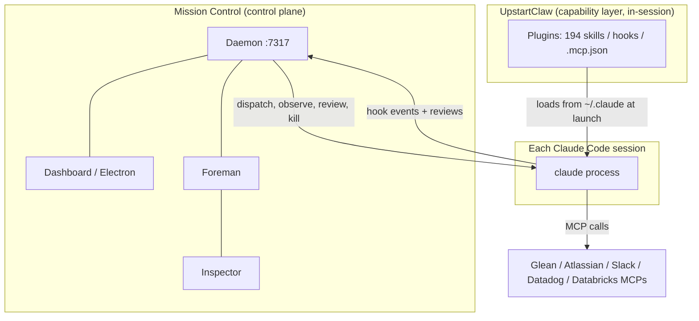
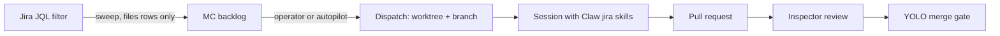

# UpstartClaw x Mission Control: comparison and integration plan

Sources: full exploration of `~/workspace/upstart/claude-code-extensions` (branch `main`,
2026-08-04) and this repository. This plan answers: what UpstartClaw actually is, where it
overlaps with Mission Control, where one of the two should win, what to integrate, and what
does not fit.

## 1. What UpstartClaw is (and is not)

UpstartClaw is **not a harness in the runtime sense**. It is a **Claude Code plugin
marketplace**: one private repo (`teamupstart/claude-code-extensions`) that is both the
marketplace manifest (`.claude-plugin/marketplace.json`, 64 entries) and the monorepo of 63
first-party plugins. It distributes, through Claude Code's native `/plugin` mechanism:

- **194 skills** across the plugins (Jira/Confluence/Glean/Slack workflows, on-call
  playbooks, standups, deploy tooling, domain SOPs).
- **~20 MCP server configs** in 11 `.mcp.json` files (Glean, Guru, Atlassian, Slack,
  Datadog, PagerDuty, AWS API, Databricks, Alation, SonarQube, internal Upstart service
  MCPs). One plugin (`databricks-explorer`) bundles its own first-party Python MCP server.
- **~17 hooks** in 11 `hooks.json` files - almost all `PreToolUse` **guard rails**:
  setup gates, domain allowlists, no-send/no-delete enforcement, a fail-closed
  feature-flag publish gate, read-only Databricks enforcement.
- **8 subagent definitions**, 1 LSP server config (`kotlin-lsp`), 29 slash commands,
  zsh helpers, and a Codex avatar. Zero output styles despite the README advertising them.
- **No daemon, no server, no UI, no session management, no control plane.** The only
  background processes any plugin starts are a localhost Sniffly cost dashboard and a
  weekly launchd/cron scan job.

Its engineering center of gravity is **distribution discipline**: CI auto-bumps plugin
versions from a PR-body field, tags releases per plugin (`{name}--v{X.Y.Z}`, prerelease
suffixes stripped because Claude Code's semver resolution cannot match prerelease tags),
validates every manifest/hook file against JSON Schemas in pre-commit, and enforces
TypeScript-only shipped logic. Ownership is per-plugin via CODEOWNERS (72 contributors,
~10 months old, active daily).

The foundational plugin is `upstartclaw-core` (v1.1.7): the four core MCP servers (Glean,
Guru, Atlassian, Slack), a first-time `setup` skill (Palo Alto VPN CA cert into
`NODE_EXTRA_CA_CERTS`, then sequential OAuth flows), and a `PreToolUse` gate that blocks
core MCP calls until a setup state file reads `completed`. Roughly a third of the catalog
declares a dependency on it.

So: **"is it just a Claude Code extension/plugin with shared skills?" - essentially yes**,
plus MCP wiring, guard hooks, and unusually mature versioning/release machinery. Everything
it ships loads **inside** each individual Claude Code session.

## 2. What Mission Control is, in one contrast

Mission Control is the **layer above the session**: a local daemon + dashboard that
discovers, dispatches, supervises, reviews, compares, and ships the work of many
Claude/Codex/Pi sessions. It owns things no plugin can own - durable tasks and worktrees,
SSE-live fleet state, the review channel, ensembles with immutable artifacts and human
gates, the Inspector's PR provenance, fleet cost telemetry, and alerting.

**The relationship: UpstartClaw equips a session; Mission Control commands a fleet.**
They meet in exactly one place - the operator's `~/.claude` config - and they already
compose there:

- Terminal dispatches inherit the operator's environment, so installed Claw plugins load.
- SDK dispatches load `settingSources: ["user", "project", "local"]`
  (`src/server/harness/claude/sdk.ts`), so user-level plugin config reaches embedded
  sessions too.
- Mission Control's statusline integration is a **wrapper that delegates to the user's
  pre-existing statusline** (`hooks/install.mjs` records the inner command in a sidecar),
  so Claw's `statusline` plugin keeps rendering while MC reads model/context/cost off it.
- Both install hooks into `~/.claude/settings.json` surgically and idempotently, with
  markers, and neither touches the other's entries.

## 3. Overlap map: where to pick one

| Area | UpstartClaw has | Mission Control has | Verdict |
|---|---|---|---|
| **Cost tracking** | `cost-dashboard` (Sniffly web UI over local transcripts), `cost-analysis` (codeburn CLI), statusline cost | Live fleet cost telemetry via OTEL export to the daemon: per-session badges, cost per PR, rate-limit runway, automation spend by role | **Pick MC** for anything fleet- or live-facing. Claw's tools are retrospective, per-machine, and Sniffly's Share button uploads conversation content to sniffly.dev (its own README warns). Keep Sniffly only as a personal historical view. |
| **Needs-you notifications** | `notify` plugin: `Notification` hook -> macOS notification + focus-terminal-tab script | Full alert engine: notification + sound, stuck detection, Away mode with digest, delivery with window closed (Electron) | **Pick MC.** Running both double-fires on every needs-input. Document "disable `notify` when MC is running". Worth stealing: `focus-terminal-tab.sh` behavior is already covered by MC's Focus action. |
| **Multi-agent orchestration** | `agent-team`: in-session manager + background agents via experimental `CLAUDE_CODE_EXPERIMENTAL_AGENT_TEAMS` flag, shared task list, worktrees, 11 themed role personas | Ensembles (Best of N / Consensus / Panel vote) with pinned base commits, immutable artifacts, human decision gates, recovery; plus Workflows and dispatch | **Pick MC.** MC's orchestration is durable, recoverable, and human-gated; agent-team rides an experimental flag with no persistence. But **mine agent-team's 11 role definitions** (DO/DON'T/REPORT format) as MC Personas - see track C. Do not run agent-team inside MC-dispatched sessions (two orchestrators, nested worktrees, conflicting PR rules). |
| **Ticket -> PR pipeline** | `jira-to-pr` skill: 9-phase in-session pipeline, plan-reviewer subagent pinned to Opus | Dispatch + worktrees + Inspector review + YOLO merge, with GitHub-issues task source | **Pick MC for the pipeline, Claw for the Jira knowledge.** The orchestration (branching, review, CI iteration, merge) is MC's job with real provenance; the Jira-domain skills (`working-with-jira`, JQL, custom fields) are what the dispatched session should load. Track B closes the loop with a Jira task source. |
| **Diff review** | `dev-tools/viewing-diffs` (difit browser viewer) | Review channel: agent pushes diff/plan/question to dashboard, decision flows back | **Pick MC** for dispatched/supervised work; difit stays fine for ad hoc human use outside MC. |
| **Standup / digest** | `standup`, `del-ops/stand-up`, `team-highlights`: summarize *your* GitHub/Jira/Confluence/Slack activity | Roundup: summarize *your fleet* (who needs you, outcomes, backlog) as panel/JSON/markdown | **Mostly complementary, keep both.** Different subjects (your activity vs your agents). Small integration: MC's markdown roundup is a ready-made input for the standup skill. |
| **Statusline** | `statusline` plugin writes `.statusLine` in settings | Wrapper that delegates to whatever statusline exists and forwards data to the daemon | **Keep both - expected to compose** (Claw renders, MC wraps and reads), but this is the one spot to **verify by hand** against an installed Claw statusline, not assert. |
| **Skills distribution** | Marketplace + native plugin loading, versioned, org-wide | Repo-baked `skills/` catalog symlinked into `~/.claude/skills` and `~/.agents/skills`, toggled per machine | **Both, different scopes.** Claw is the org channel for *domain* skills; MC's catalog is app-owned skills that make sessions cooperate with MC. **Never duplicate Claw's catalog inside `skills/`**; if MC needs to surface Claw skills, it goes through the existing catalog/reconcile path as one mechanism, never a second parallel one. Track D distributes MC's own integration *through* Claw. |
| **Security review** | `security-review`, `security-threat-model` skills | Workflow Persona stages, Inspector | **Compose:** wrap Claw's security-review methodology as a Persona / workflow stage rather than writing a competing one. |

## 4. Integration tracks (ranked)

### Track A - Document and harden the zero-code baseline (small)

It already works: install Claw plugins on the operator machine and every MC-dispatched
session (terminal and SDK) gets Glean/Jira/Confluence/Slack skills, MCP servers, and -
importantly for unattended fleets - Claw's **fail-closed guard hooks** (gws no-send/no-delete,
Databricks read-only, GrowthBook publish gate, browser navigation allowlists). Work:

- A README section: "Running Mission Control at Upstart" - install `upstartclaw-core`,
  run its setup interactively **once** (OAuth flows cannot complete in a headless
  dispatched session), confirm `NODE_EXTRA_CA_CERTS` is present in the daemon's
  environment so SDK sessions trust VPN-inspected TLS.
- Known failure mode to document (or detect): Claw core's `PreToolUse` setup gate exits 2
  with "invoke /upstartclaw-core:setup immediately" when setup is incomplete. An
  unattended dispatched agent hitting that will burn a turn or stall. A cheap dispatch-time
  preflight could read `~/.claude/upstartclaw-core-setup` and surface a warning chip.

### Track B - Jira task source (medium, highest product value)

MC's task-source registry (`src/server/task-sources/`) has one kind, `github-issues`, and
was built to be extended. Add a `jira` kind: sweep a JQL filter on a schedule, file backlog
rows (never dispatch - same contract as the GitHub source). At Upstart, work lives in Jira;
this makes the full loop native: **Jira ticket -> backlog -> dispatch (session loads Claw's
Jira skills for context) -> Inspector -> YOLO merge**. This is `jira-to-pr` re-based onto a
durable, supervised pipeline.

Auth (decided): the sweeper follows Upstart's standardized Jira CLI convention rather than
storing a token in MC. `ankitpokhrel/jira-cli` is the brew-recommended standard in Upstart's
onboarding docs, and it authenticates through the same `JIRA_API_TOKEN` (+ `JIRA_EMAIL`,
site defaulting to `upstartnetwork.atlassian.net`) convention Claw's own `zsh/atlassian.zsh`
helpers use. The source shells out to `jira` when available (as the GitHub source uses `gh`),
falling back to direct REST with those env vars, and its `preflight` - the hook the
task-source registry already defines per kind - reports a settings-panel warning when
neither the CLI nor the env convention is configured.

### Track C - Import Claw's agent-team roles as Personas, with drift detection (small)

`plugins/agent-team/references/roles/*.md` contains 11 well-structured role definitions
(Manager, Implementer, Tester, Reviewer, PR Orchestrator, Communications Gatekeeper, etc.)
each with persona, responsibilities, and DO/DON'T/REPORT contracts. Convert the review-shaped
ones (Reviewer, Tester, security-review's methodology) into MC **Personas** for workflow
stages and Panel-vote judges.

A blind copy would drift as the Claw repo evolves, so the import follows the pattern Claw
itself uses to vendor upstream content (the `gws` plugin's pinned sync from
`googleworkspace/cli`): **import + provenance + drift badge**, adapted to MC's existing
persona lifecycle.

- An imported persona records its provenance: source repo, path, plugin version, and a
  content hash of the file it was adapted from.
- A cheap check (Workflows panel load or startup reconcile) hashes the currently installed
  plugin's copy of that file and badges the persona when it differs - "upstream updated:
  agent-team 0.1.1 -> 0.2.0" - with a diff view.
- Re-import creates a **new draft revision**. Published workflow and ensemble snapshots
  stay immutable, exactly as today: upstream drift becomes a visible diff a human reviews
  and republishes, never a silent change to what judges score with.
- Live reference (reading role files at run time) is rejected: it breaks the
  publish-snapshot invariant and would let an upstream edit silently change review
  behavior.

Source of truth starts **MC-side**, importing from the installed `agent-team` plugin cache
or a checkout. When Track D's plugin lands, the adapted persona files migrate into it and
the plugin becomes the import source - same mechanism, different upstream.

### Track D - Publish a `mission-control` plugin in the Claw marketplace (medium, strategic)

Today MC's Upstart adoption path is "clone this repo, run make init". A Claw plugin flips
that to the channel Upstart engineers already use:

- Skills: a `mission-control` skill (what MC is, how to talk to the daemon), plus MC's own
  catalog skills where they make sense org-wide.
- A `setup` skill that wires the status hooks and MCP review server against an installed
  MC daemon (the same edits `hooks/install.mjs` and the Electron tray installer make).
- Claw's CI then versions and ships MC's integration surface like any other plugin.
- Once it exists, it also carries the adapted persona files from Track C, becoming their
  import source - persona updates then flow through the marketplace channel and surface in
  MC as drift badges.

This lives in *their* repo, not this one - the work here is defining what the plugin wraps
and keeping `hooks/install.mjs` the single source of the settings edit.

### Track E - Steal the engineering lessons (ongoing, free)

- **Fail-closed hook gates**: GrowthBook's write gate treats *any* non-zero-or-two exit as
  deny. MC's own hook bridges and future guard surfaces should hold that standard.
- **Protocol-level read-only MCP** (`databricks-explorer/ARCHITECTURE.md`): destructive
  tools simply do not exist in `tools/list` - "no allowlist to misconfigure, no prompt
  injection surface". A good check against MC's MCP server tool inventory as it grows.
- **`userConfig` for sensitive values** with the documented `sensitive`-not-`secret`
  footgun; relevant if MC ever takes per-user tokens (Track B).
- **Prerelease semver trap** (`docs/plugin-dependency-semver.md`): Claude Code resolves
  plugin deps with `includePrerelease` off, so perpetual `-beta` versions can never satisfy
  ranges; they strip suffixes at tag time. Directly relevant to Track D versioning.
- **Schema-validated hooks and manifests in pre-commit** - MC validates protocol at
  runtime; validating authored hook JSON at commit time is a cheap addition.

## 5. What does not fit

- **agent-team inside MC sessions.** Two orchestrators fight: nested worktrees, MC ensemble
  members are forbidden to push/PR while agent-team's PR Orchestrator opens drafts, and the
  experimental flag changes session behavior MC does not model. Choose per task, never nest.
- **No service-level integration exists.** Claw has no API, daemon, or event stream; every
  integration is file/config-level (`~/.claude`) or content-level (skills, personas). Do not
  design MC features that assume a Claw runtime to call.
- **Upstart-specific logic hard-coded in MC core.** MC is a generic product (claude/codex/pi,
  registries everywhere). Upstart specifics enter through the existing extension points -
  task-source kinds, Personas, skills catalog, or a Claw-side plugin - never as
  `if (upstart)` branches.
- **Two Claw behaviors to treat as flagged, not built upon** (noting, not displaying,
  per policy): `slack-advanced` deliberately scrapes a live browser Slack session token
  rather than using the sanctioned OAuth MCP - do not route any MC automation through it;
  `cost-dashboard`'s bundled Sniffly UI has a Share button that uploads conversation
  content to an external site, warned about but not technically blocked. Claw also commits
  two OAuth *public client* identifiers by design (Slack client ID; a security-approved
  Google installed-app client) - fine where they are, but do not copy them into MC.
- **MC's skills catalog staying repo-baked.** Claw might suggest MC should grow a plugin
  marketplace of its own. It should not: the catalog is deliberately versioned-with-the-app,
  and org-wide distribution is exactly the job Claw already does well. The boundary stands.

## 6. Decisions recorded (2026-08-05)

The plan review resolved the open choices as follows:

1. **Composition over absorption.** Mission Control stays the control plane (daemon,
   dispatch, dashboard, telemetry, alerts) and consumes UpstartClaw as an ordinary
   user-level plugin set through the `settingSources` path that already exists. The factual
   mapping above is accepted as-is.
2. **One owner per concern.** Where the two collide: MC keeps cost telemetry, alerts,
   ensembles, and dispatch/review; Claw keeps its 194 domain skills, MCP auth/VPN setup,
   and PreToolUse guard rails.
3. **No skill-catalog duplication.** Claw's catalog is never copied into MC's repo-baked
   `skills/`. If MC needs to surface Claw skills, it happens through the existing
   catalog/reconcile mechanism, not a parallel one.
4. **Statusline composition is verified by hand**, not asserted: test MC's wrapper
   delegating to Claw's installed statusline before claiming the row in section 3.
5. **Track B is the first concrete build**: a Jira-backed task source registered through
   the existing task-sources registry alongside `github-issues` - one interface,
   per-source detail behind it.
6. **Implementation bar** (restating the project contract for whoever picks this up):
   README updated in the same change for any new capability or env var; behavior changes
   get `node:test` + `node:assert/strict` tests in `test/`; any new card affordance or
   compose box lands on every surface the project rules say move together (a `SessionCard`
   edit alone reaches one layout of three; compose boxes register through `onReplyBox`);
   new UI behavior gets a Playwright spec in `e2e/`.
7. **No phased implementation plan was requested** in the decision response. Phasing stays
   available later via the phased-plan skill against this document.

A second review (same day) scoped the implementation:

8. **Implementation scope is Tracks A and B only.** Track A includes both the README
   section and the dispatch-time warning when Claw core setup is incomplete (a UI change,
   so it carries a Playwright spec). Tracks C, D, and E are explicitly out of scope for
   this round.
9. **Jira sweeper credential**: the stored-token-in-MC-settings recommendation was
   declined. The sweeper defaults to the standardized Jira CLI (`ankitpokhrel/jira-cli`,
   the brew-recommended standard in Upstart onboarding docs), whose `JIRA_API_TOKEN` +
   `JIRA_EMAIL` convention matches Claw's `zsh/atlassian.zsh` REST helpers, with direct
   REST on those env vars as the fallback. A misconfigured or absent credential surfaces
   as a task-source `preflight` warning in settings, never a silent empty sweep.
10. **Follow-up decision (superseded by 13): stop after this plan.** Confirmed twice at the
    time (dashboard submission, then direct question).

A third review (same day) resolved Tracks C and D:

11. **Track C rejoins the scope, with drift detection.** Sync model: import + provenance
    (source repo, path, plugin version, content hash) + a drift badge when the installed
    plugin's file changes; re-import creates a new draft revision; published snapshots stay
    immutable. Live reference was rejected as breaking the publish-snapshot invariant.
12. **Persona source of truth starts MC-side, migrates to the Claw plugin later.** Track C
    imports from the installed `agent-team` plugin now; when Track D's `mission-control`
    plugin lands in the Claw marketplace, the adapted persona files move there and become
    the import source. Track D itself stays out of this round's phases as the recorded
    migration target.
13. **Proceed to phased implementation** (explicit user request following the C/D
    discussion), covering Tracks A, B, and C.
