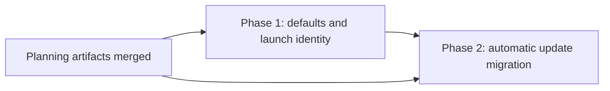

# User-scoped installation: implementation phases

## Approved source and decisions

Source: [plan.md](plan.md), reviewed through [plan.html](plan.html). The root plan is authoritative for the goal; each phase document is the proposed implementation route and may be adapted with documented reasoning where the repository changes.

The operator selected:

- `~/Applications (standard user folder)`.
- **Automatic migration during an update**.
- **Approve this plan**, explicitly including an in-place transition update, retained system copy, system opt-out, and forward recovery after receipt commitment.
- **Create phased implementation plan**.

These are requirements, not outstanding choices. Only this repository, `teamupstart/mission-control`, is in implementation scope. Both tasks use the current repository and attach no others.

## Investigation and compatibility decisions

Baseline: `e54634a467e72b218d9a0b3de92d5c4d57fc0d93`.

- The archived evaluation established custom-destination support, but existing `DEFAULT_APPS_DIR` also gates elevation. Phase 1 separates those concerns.
- `HelperHandoff.appPath` currently means source, install target, rollback target, and relaunch target. Phase 2 extends this contract without changing the meaning of old invocations.
- The running bundle supplies the helper. A pre-feature app updating directly to the final feature still installs in place first, then relocates on a later accepted update. No particular release number or intervening release is required.
- Old helpers always pass `--apps-dir`. That argument cannot constitute system opt-out. Phase 1 owns explicit `installScope` receipt semantics and legacy preservation.
- Receipt `installedCommit` is optional. Phase 1 compares it when present, and uses the existing packaged-version identity plus validated path for legacy receipts; it does not make historical receipts invalid merely for lacking the optional field.
- `installIntegrations()` installs broadly and can return partial MCP success. Phase 2 must inspect and verify owned registrations, not equate its current result with migration completion.
- Skill reconciliation belongs to the daemon. Phase 2 performs it after receipt commitment, preserving the boundary before which an old app can safely resume without a database downgrade.
- The updater currently treats an `open` command exit as launch success. Phase 2 needs pre-daemon readiness tied to the target process; packaged runtime verification remains required separately.
- The DMG's fixed symlink mechanism cannot supply an arbitrary recipient's home. Phase 1 ships explicit app plus offline instructions instead of a home-specific link.

The root plan expressly supersedes the system-default and same-location-only installation assumptions in `docs/plans/self-updating-local-install/plan.md` and `docs/plans/release-pipeline-and-auto-updates/plan.md`. Their release selection, canonical repository trust, build ownership, and existing runtime ownership contracts remain in force where reflected by current code. Neither historical plan is an implementation prerequisite or a current claim about release health.

## Sizing and phase-count rationale

Estimate: **950-1,550 gross non-test implementation lines** added or materially changed across scripts, receipt/update contracts, Electron startup, integration adapters, and visible update surfaces. Tests, plan text, and operator documentation are excluded.

| Merge unit | Estimate | Assumptions |
| --- | --- | --- |
| Phase 1 | 250-400 lines | Reuse the receipt parser, swap primitive, and existing UI copy; add focused policy and startup classification, not another installer framework. |
| Phase 2 | 700-1,150 lines | Reuse the helper lock and journal file patterns, existing skill reconciliation, and current update UI. Include recovery, owned MCP inspection, and acknowledgment handling in this estimate. |

Two phases are warranted because Phase 1 provides useful personal installations and the old-copy behavior that relocation relies on. Combining it with the transaction and integration recovery would make one review cover both a changed privilege boundary and a cross-process migration protocol. Splitting Phase 2 further would leave recovery, integrations, and visible success inconsistent across intermediate merges, so they remain one vertical slice. This is not a test-only or documentation-only split.

## Phase table and dependencies

| Phase | Outcome | Direct prerequisites | Detailed guide |
| --- | --- | --- | --- |
| 1 | Personal install defaults, system compatibility, and safe launch identity | This planning session's merged PR | [phase-1-user-defaults-and-launch-identity.md](phase-1-user-defaults-and-launch-identity.md) |
| 2 | Automatic update relocation with recovery and integration repair | This planning session's merged PR; Phase 1 merged PR | [phase-2-automatic-update-migration.md](phase-2-automatic-update-migration.md) |

**Concurrency:** no implementation phases may run concurrently. Phase 2 consumes Phase 1's receipt policy, path classification, helper packaging, and launch behavior. Each task also has a direct dependency on this planning session, so none can dispatch before its referenced files exist on the default branch.

Schedule tasks after committing and pushing all artifacts and verifying the task paths in that pushed commit. Task IDs and returned canonical repository paths are recorded in the PR description after creation. That PR's merge releases Phase 1; Phase 2 still waits for Phase 1 to merge.

## Requirement ownership

Each root requirement has exactly one accountable phase. A prerequisite contributes a contract but does not take duplicate ownership of the complete outcome.

| Root requirement or decision | Accountable phase | Contribution from prerequisite |
| --- | --- | --- |
| R1 personal defaults; D1 standard plural directory | 1 | None |
| R2 explicit locations and fixed elevation boundary | 1 | None |
| R3 automatic migration; D2 automatic update scope | 2 | Phase 1 destination policy |
| R4 old updater/skip-release compatibility | 2 | Phase 1 preserves legacy argv and receipt eligibility |
| R5 transaction and interrupted recovery | 2 | Phase 1 swap primitive remains compatible |
| R6 integrations, login, and account preservation | 2 | Phase 1 canonical launch classification |
| R7 complete post-migration identity/update lifecycle | 2 | Phase 1 mismatch guard and validated redirect |
| R8 all install and update guidance | 2 | Phase 1 completes defaults/developer/DMG guidance; Phase 2 completes migration UI/recovery guidance |
| R9 complete behavior verification | 2 | Phase 1 verifies its own shipped defaults and launch behavior |
| D3 approved transition/retention/opt-out/recovery | 2 | Phase 1 explicit system policy and retained-copy compatibility |
| D4 durable phased artifacts and scheduling | Planning session | Both tasks depend directly on its merge |

## Cross-phase contracts

Phase 1 owns these foundations, detailed in its phase file:

- Optional `installScope` receipt field, absent legacy semantics, and preserved old-helper argv.
- User destination resolution distinct from the fixed system elevation allowlist.
- Running bundle versus receipt classification and validated old-to-personal redirection.
- Unmanaged developer/DMG semantics and unchanged package identity.

Phase 2 extends these without redefining them. It owns the relocation journal, source/target helper handoff, pre-start readiness, receipt commitment, repair status, and visible migration choices. The existing helper lock must cover receipt mutations that could race migration. New detached helper dependencies must be copied and packaged together.

The state-home location and database ownership do not change. A pre-commit failure can return to the old system app. A committed relocation uses forward recovery, since starting the target daemon can change the database. The global system bundle is never automatically deleted or turned into a user-specific symlink.

## Final verification and publication

Each phase specifies focused tests, repository gates, browser evidence for changed UI, and packaged checks. Phase 2's isolated macOS transition exercise is the release bar for enabling automatic migration. A missing packaged check is a reported incomplete criterion, not permission to call the feature finished.

For this planning PR, verify Markdown/HTML parity with `node docs/plans/user-scoped-install/render-plan.mjs --check`, inspect light/dark offline pages, verify no horizontal page overflow at desktop/mobile widths, check the requirement map and dependencies, and run typecheck and lint. No installer or migration is run against the operator's account in this task.

Register complete plan/phase text plus relevant unchanged contract text in gitignored workflow artifacts; screenshots and evidence never enter the commit. Push only this plan directory, create both gated tasks, and open the scoped planning PR. Monitor its checks and conflicts. Merge remains a human action unless separately authorized; the current task authorizes the PR but not merging it.

## Cross-phase audit record

- **Audit 1, Phase 1 drafted:** policy is additive; old helper transport does not become opt-out; receipt mismatch handling is useful without relocation. No Phase 2 code is needed to make Phase 1 operable.
- **Audit 2, Phase 2 drafted:** Phase 2 preserves `installScope`, consumes launch classification, and adds its startup gate before normal background work. Skill repair occurs after commitment, so it does not require a daemon before the rollback boundary.
- **Audit 3, complete set:** R1-R9 and D1-D4 have one accountable owner each. Both implementation tasks depend on planning publication; Phase 2 also directly depends on Phase 1. There is no concurrency claim or undocumented cleanup phase. The source plan's automatic migration scope and retained-copy decision remain intact.
