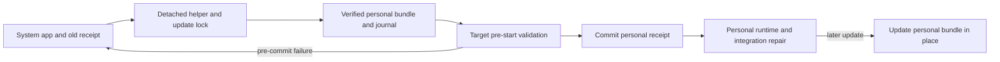

# User-scoped Mission Control installation

## Review status and goal

Approved by the operator in the Mission Control dashboard. This task delivers planning documents only; it does not move an installed app or change product code.

Make `~/Applications/Mission Control.app` the default for personal installations. Automatically migrate eligible managed installations from `/Applications/Mission Control.app` as part of an accepted update, preserving the working app, state, and existing integrations through the transition.

### Recorded human decisions

- **D1, destination:** the operator selected `~/Applications (standard user folder)`, explicitly resolving the singular `~/Application` wording.
- **D2, migration:** the operator selected **Automatic migration during an update**, rather than a guided manual migration or a new-install-only change.
- **D3, plan review:** the operator selected **Approve this plan**, including the in-place transition update, retained system copy, system opt-out, and forward recovery after receipt commitment.
- **D4, implementation follow-up:** the operator selected **Create phased implementation plan**. Write and schedule the dependency-linked implementation phases.

Automatic migration is the adopted scope. A manual migration procedure is recovery documentation, not the primary delivery.

## Earlier evaluation and current findings

Reviewed the complete archived report **Evaluate user-scoped Mission Control install**, archive `44b4efb7-4684-4c58-83fc-35baa080f7ea`, captured on 2026-09-15 UTC. Its source checkout was `85a8b07081d0b4f92ffb85475d539b271618bf50`. This plan was checked against `e54634a467e72b218d9a0b3de92d5c4d57fc0d93`.

The report recommended a user default and deliberate migration. D2 supersedes that recommendation's migration approach. Its 165 passing focused tests are historical evidence, not a test run for this plan or proof of a live relocation.

| Finding | Current repository evidence | Planning consequence |
| --- | --- | --- |
| The app derives daemon, preload, dashboard, and worker paths from its bundle root. | `src/main/index.ts`, `app.getAppPath()` | User scope does not require a second runtime layout. |
| The default directory also controls the privileged swap allowlist. | `scripts/app-bundle-swap.mjs`, `DEFAULT_APPS_DIR`, `privilegedBundleSwapCommand` | Split the user default from the fixed system authorization boundary before changing either consumer. |
| The installer accepts `--apps-dir`, requires an existing directory, and writes the resulting absolute app path. | `scripts/install-app.mjs`, `parseArgs`, `appsDirProblem`, `swapAndRecord` | Add deliberate default-directory creation; preserve the old CLI transport contract. |
| Update, restore, and relaunch all use one receipt path today. | `src/main/updater.ts`, `HelperHandoff`; `scripts/apply-update.mjs`, `runApplyUpdate` | Relocation needs distinct source and destination identities and a recoverable transaction. |
| The detached helper comes from the running app, not the newly built app. | `src/main/updater.ts`, `spawnDetachedUpdateHelper` | An older installed app first updates in place; migration starts on a later accepted update from a capable app. |
| Receipt validation accepts an absolute app path but updater startup does not match it to the running bundle. | `src/shared/install-receipt-schema.mjs`; `src/main/updater.ts`, `start` | Add identity checks and old-copy launch handling before creating duplicate bundle locations. |
| Hooks and MCP registrations contain absolute satellite/runtime paths. Existing integration installation is broad and MCP failures are best-effort. | `src/main/integrations.ts` | Do not use a blanket reinstall as proof that migration repaired only the integrations already enabled. |
| Skills have their own daemon-owned reconciler; login-at-startup is an Electron setting. | `src/server/skills/reconcile.ts`, `config.ts`; `src/main/tray.ts` | Preserve these owners and enabled/disabled choices. |
| Developer installation removes the old system app before copying; the DMG has no explicit contents. | `Makefile`, `install-app`; `electron-builder.yml`, `dmg` | Align all install guidance and replace the developer copy path with the existing safe swap mechanism. |

Apple identifies a home-directory Applications folder for user-specific apps. This supports the destination choice; it does not certify Mission Control's update behavior. [Apple file-system guidance](https://developer.apple.com/library/archive/documentation/FileManagement/Conceptual/FileSystemProgrammingGuide/FileSystemOverview/FileSystemOverview.html).

The DMG format supports explicit contents and fixed symlink destinations. Do not embed the build account's home path or assume a symlink expands `~` for the recipient. [electron-builder DMG documentation](https://www.electron.build/v26/docs/dmg/).

## Scope and outcomes

| ID | Required outcome |
| --- | --- |
| R1 | A fresh managed personal install and a developer install default to the signed-in user's `~/Applications`; the default directory is created when absent. |
| R2 | Explicit system and custom locations remain supported, with administrator authorization restricted to the exact system product bundle. |
| R3 | A migration-capable app automatically selects user scope for an eligible legacy managed system installation during an accepted update. The confirmation states the move before the app closes. |
| R4 | Old installed updaters remain compatible. Their first update stays in place and preserves migration eligibility; the next accepted update from capable code can relocate. Skipping releases remains safe. |
| R5 | The migration preserves the original bundle and old receipt until the new bundle and pre-start checks are ready; failures and interrupted attempts have deterministic recovery. |
| R6 | Only Mission-owned integrations already present are retargeted. Skills, login choice, unrelated settings, and other Mac accounts are preserved. Partial repair is visible and retryable. |
| R7 | Receipt identity, duplicate-copy startup, and subsequent update/rollback all consistently select the managed user bundle after commitment. |
| R8 | Update UI, setup instructions, developer commands, and DMG guidance accurately describe user scope, the transition update, system opt-out, and recovery. |
| R9 | Focused tests, browser tests, and an isolated packaged macOS exercise prove the destination and failure behavior before migration ships. |

State stays in the currently resolved Mission Control state home, including configured `MISSION_HOME`. No database, session, archive, updater clone, or user-data directory is relocated. No new database writer, second skill registry, alternate updater, signing scheme, CI workflow, release workflow, or deployment mechanism is introduced.

## Installation policy

Use one Node-side destination-policy owner shared by installation and update code. Keep browser-safe policy fields and validation in the existing receipt contract. New Node-only policy or journal modules belong outside `src/shared/`.

Keep a fixed `SYSTEM_APPS_DIR = "/Applications"` for privileged transactions. Resolve the personal default from the signed-in account's home at runtime. A permission failure under a user or custom directory is an actionable error, never a reason to elevate, chown the home, or fall back silently to `/Applications`.

### Destination selection

| Input | Destination and policy |
| --- | --- |
| Fresh managed install without a destination | `~/Applications/Mission Control.app`, recorded as user policy. |
| Existing valid managed receipt, ordinary CLI reinstall | Preserve the receipt destination and policy. Automatic relocation belongs to the update transaction. |
| Explicit proposed `--scope user` | Personal default, recorded as user policy. |
| Explicit proposed `--scope system` | `/Applications/Mission Control.app`, recorded as system policy; automatic relocation is disabled. |
| Existing `--apps-dir <absolute-or-resolvable-directory>` | Preserve the destination override contract. This argument alone must not be interpreted as a new system opt-out, because old update helpers always send it. Preserve matching receipt policy; an unrecognized custom destination stays custom. |
| Conflicting `--scope` and `--apps-dir` | Reject before build or mutation rather than choose silently. |
| Missing/malformed/newer receipt | No automatic migration. A fresh explicit installation may establish a valid receipt through the existing managed path. |

Add an optional receipt policy field, with validated values `user`, `system`, and `custom`, under the existing append-only schema rules. Absence is legacy, not explicit system consent. Preserve this field through staged installs, old-helper calls into a new installer, success, and rollback. The implementation can choose the final field name once and must use it everywhere.

Create only the selected canonical personal Applications directory automatically. Keep the existing explicit custom-directory requirement. Validate symlinks and resolved paths so a personal destination cannot alias `/Applications`, another account's directory, or the source bundle. Handle spaces and non-ASCII home paths without shell interpolation. Dry-run and stage-only preparation must not create the destination or modify the receipt.

Developer `make install-app` remains an unmanaged local-build operation and does not create or overwrite a managed receipt. Route its installation through a small caller of the existing sibling staging/swap primitive, preserving a documented explicit directory override. It must not delete a working bundle before a successful copy.

## Update transition and eligibility

Automatic relocation applies only when all of the following are established:

- The running packaged app matches the valid trusted receipt's bundle path and embedded identity.
- The source is exactly the supported system Mission Control bundle and the receipt has legacy policy, not an explicit system/custom policy.
- The running updater and detached helper support the relocation protocol, and the target build supports its startup/recovery contract. Unsupported or older target builds use an in-place update.
- The personal target is absent, or belongs to the same interrupted transaction with verified identity. An unrelated or independently installed app at that path is a blocker, not permission to overwrite it.
- The account can write the selected personal directory and state home without elevation; source/target validation and integration inspection complete successfully.

The ready-to-install UI names both locations and explains that the existing system copy is retained. The normal **Install and restart** action accepts the update and move together. **Later** has no side effects. Provide a **Keep system installation** choice that records an explicit system policy and continues updates in place. Persist that choice through the receipt's existing writer, not a competing preference store.

An older running app cannot perform the new transaction. Its update installs the migration-capable version in `/Applications` using the existing `--app-path`/`--apps-dir` contract. The next accepted update can migrate. This is based on capabilities, not hard-coded release numbers: users may skip the bridge release and still receive capable code in place before relocation. Stable and alpha channels follow the same rule, preserving their existing target-identity checks.

No promise is made that the first transition update avoids the existing system authorization prompt. The relocation itself and subsequent personal updates do not require system-folder writes.

## Transaction and recovery

### Before and after flow

Before: running system app -> detached single-path helper -> swap system bundle and write receipt -> reopen system app.

After: migration-capable system app -> detached helper holding the existing update lock -> stage verified personal bundle and journal source/target identities -> pre-start target validation -> commit the personal receipt -> start normal target runtime and reconcile existing integrations. The system bundle is retained. Pre-commit failure restores the old receipt and reopens the system app; after commitment, recover the personal installation in place.

### Ownership and commit boundary

Extend the existing helper and lock rather than add a second updater. The helper owns the bundle operation, transaction journal, receipt commit, and rollback. Main-process startup reports pre-start readiness and gates normal runtime startup; the daemon retains skill and SQLite ownership.

Journal one attempt durably under the existing state home with a version, attempt identity, source/target paths and bundle identities, prior receipt, stage, and bounded repair status. Validate journal input against canonical paths, receipt provenance, and current bundle identities before acting. Use private atomic file publication, not an additional database. Readiness must be tied to the attempt, actual target process, target commit, and state home; a successful `open` exit alone is insufficient. Persist any acknowledgment separately from the helper-owned journal to avoid competing writers.

The target's pre-start path checks that its identity and required packaged assets can load before starting a daemon, restoring sessions, invoking agents, or changing schema. Hold normal startup until the helper atomically commits the receipt and a durable committed marker. If the receipt rename succeeds but marker publication fails, recovery compares the exact intended receipt and target identity and finishes that commit instead of guessing from a missing marker.

The relocation install path must be able to stage and verify a bundle without prematurely publishing its receipt. Ordinary same-location installs retain their current behavior. Journal recovery runs before starting update checks or normal daemon work, reuses the existing lock, and checks PID plus start identity so a second launch cannot race a live helper. Readiness and exit waits are bounded, with an actionable timeout.

**The receipt commit is the rollback boundary.** Before it, failure preserves/restores the old receipt and old system app and removes only attempt-owned staged files. After it, normal startup may migrate the database: never automatically launch an older system runtime against that database. Retain the personal bundle and committed receipt, resume forward repair on launch, and report a blocked startup if necessary. A later ordinary update retains the updater's existing rollback semantics; this plan does not claim a general database downgrade mechanism.

### Failure matrix

| Event | Required result |
| --- | --- |
| Build, copy, identity, free-space, or directory validation fails | Old receipt and system bundle remain usable; no integration mutation. |
| Pre-start launch/readiness fails or times out | Stop only the attempt-owned target process, restore the prior receipt if needed, relaunch the original app, retain bounded diagnostics. |
| Helper or app dies before commit | Next startup proves the helper is dead, reconciles the journal, and either resumes verified preparation or restores the old state. |
| Receipt is committed but journal completion is interrupted | Recognize the exact committed receipt and finish forward; never revert based only on journal stage. |
| Target already exists or identity changes mid-attempt | Refuse to overwrite/adopt it unless the durable transaction proves ownership. |
| Integration repair fails after commit | Keep the new installation active, record which repairs remain, expose retry guidance, and retain the old bundle as a path fallback. Do not claim migration complete. |
| Personal runtime cannot start after commit | Preserve the new receipt and both bundles; report forward-recovery instructions. No automatic database downgrade. |
| Two update/migration attempts race | Existing helper lock plus receipt/identity revalidation allows one owner; the loser does not change receipt, outcome, or integrations. |

## Integrations and old-copy behavior

Retarget only installed Mission-owned paths that resolve inside the previous bundle. Do not enable an absent integration or overwrite an unrelated custom command. Capture enough bounded before-state for idempotent repair, and compare current values before changing them so concurrent user edits are preserved and reported.

| Surface | Migration behavior |
| --- | --- |
| Claude hook groups | Reuse the existing ownership predicate and surgical JSONC editing; retarget only old-bundle commands and preserve other hooks and formatting. |
| Harness MCP registrations | Inspect supported harness registrations through their existing adapters/capabilities. Replace only existing Mission-owned registrations pointing to the old bundle; preserve disabled/absent/custom entries. Verify the resulting executable and script paths; CLI success alone is not proof. |
| Skill links | Let the daemon's existing reconciler update enabled owned links from the new app root. Preserve disabled skills and other people's links; report conflicts through that owner. |
| Login at startup | Carry the prior on/off choice and refresh registration for the new bundle through Electron. Never turn login startup on as a migration side effect. |
| Already-running external sessions | Do not kill or reconfigure sessions in memory. Retain old satellites and tell the user when a new session is required to consume refreshed paths. |
| Dock/Finder launches of the old app | Before taking the normal single-instance lock or starting background work, a capable old copy validates the current user's committed canonical receipt and redirects to the personal app. An unvalidated/missing target yields a clear recovery message and disables updates, never silent adoption. |

Keep `/Applications/Mission Control.app` in place after relocation. Other users may still depend on it, and retained satellites support existing sessions. Do not auto-delete it, replace it with a user-home symlink, modify other accounts, or rewrite the Dock database. The completion message tells the user the active location and how to replace their Dock shortcut. Optional administrator cleanup is manual after all users and sessions no longer need the system copy.

A managed app whose running path does not match its receipt must not update some other bundle. The explicit validated old-to-personal redirect is the sole relocation exception. An old copy with the current user's system policy and matching system receipt continues to work for that account.

## Packaging and documentation

- Make user scope the default in managed and developer commands, help text, README/setup guides, and desktop packaging documentation. Document `--scope system`, custom destinations, the bridge update, post-commit recovery, and retained system copies.
- Render update text from the shared copy/dialog owners and carry destination/relocation facts through existing typed update/preload contracts. Do not hard-code a home path in browser code or claim every update uses `/Applications`.
- Keep the DMG as an unmanaged distribution artifact: explicitly include the app and a short offline installation Read Me, and remove the default system Applications shortcut. Explain copying to the user's Applications folder, optional system-wide copying, and that managed updates require the managed install command. No recipient home path is baked into the DMG.
- Preserve app identity, ad-hoc signing/notarization policy, `asar: false`, external satellite layout, and packaged helper assets. Add any new detached-helper dependency to both packaging and the helper-copy inventory, with bundle smoke coverage.
- Historical plans remain historical. This plan supersedes their system-default and same-location-only assumptions for the scoped change; it does not rewrite unrelated plans.

## Implementation shape and verification

Prefer two coherent merge units if implementation phases are requested:

1. **User defaults and compatible launch identity:** shared destination policy, preserved privilege boundary and legacy CLI behavior, consistent developer/DMG/docs defaults, running-bundle receipt checks, and validated old-copy redirect. Fully usable personal installs; existing updates continue in place.
2. **Automatic update migration:** the complete transaction, pre-start/commit recovery, integration repair, login handling, UI choice/copy, and end-to-end packaged verification. This phase owns relocation and its tests together.

The first unit makes old-copy behavior safe before relocation can create a second location. A release between merges is useful but not required: an older app that skips it still installs newer capable code in place first. Exact sizing, files, tests, merge prerequisites, and tasks belong in the derived phase documents after review.

### Required verification for implementation

- Installer and swap fixtures: missing default folder; dry-run/stage-only no mutations; spaces; custom directories; explicit system policy; legacy absent policy; symlink aliases; unwritable home; unchanged system-only authorization; copy failure preserving the working app.
- Update fixtures: older helper argv against the new installer; distinct source/target; capability mismatch/downgrade; stable/alpha identity; existing-target collision; write/launch/ack failures; interruption at every journal boundary; concurrent attempts; post-commit forward recovery; subsequent personal update and rollback.
- Integration fixtures: preinstalled/absent/custom hooks and MCP entries; Electron runtime fallback paths; JSONC and concurrent user edits; partial CLI failures; enabled/disabled skill links; login on/off; old-copy redirect and no duplicate daemon.
- Playwright coverage in `e2e/` for all changed update text and controls, **Later**, explicit system opt-out, migration success, and repair-required states. Reuse the desktop update bridge fixtures, select by role/label, and use `expectContentClearsBorder` for newly opened modals. Keep agent CLIs faked.
- A packaged macOS exercise in a disposable account/VM covers legacy in-place bootstrap, automatic relocation, real new-path launch, integration paths, login restart, old Dock entry, interrupted pre-commit recovery, and a subsequent update/rollback. Use fake agent binaries and a fixture state home. Record actual app/receipt identities and paths, not only `open`'s exit code. Do not relocate this operator's app during verification.
- Run repository-required typecheck, lint, focused tests, build, smoke, and UI E2E checks proportionate to each phase. Use the single-file test invocation specified in root `AGENTS.md`. If packaged macOS verification is unavailable, report the gap and keep automatic migration disabled; mocks alone do not satisfy R9.

### Evidence and acceptance

Implementation evidence must distinguish bundle installation committed from integration repair completed. A success claim requires R1-R9 to have corresponding focused or runtime evidence. Any blocked integration is surfaced as repair required rather than hidden in a log.

For this planning task, submit the complete final plan and every in-scope phase/contract as gitignored workflow evidence, render and inspect the HTML offline, commit only planning artifacts, and open the ordinary plan pull request. Implementation tasks, if selected, depend on this planning session's PR merge.

## Limits and review choices

The remaining uncertainty is empirical macOS behavior: login-item retargeting, old Dock launches, and packaged pre-start recovery have not been exercised in the scout or this planning task. They are implementation exit criteria, not assumed successes. Moving the bundle does not promise to repair historical root-owned build files or preserve every macOS privacy grant.

The human approved this design, including the transition update, retained system copy, explicit system opt-out, and forward recovery after commitment, and requested phased implementation. The derived index is `phased-plan.md`; its tasks remain gated on publication through this planning PR.
