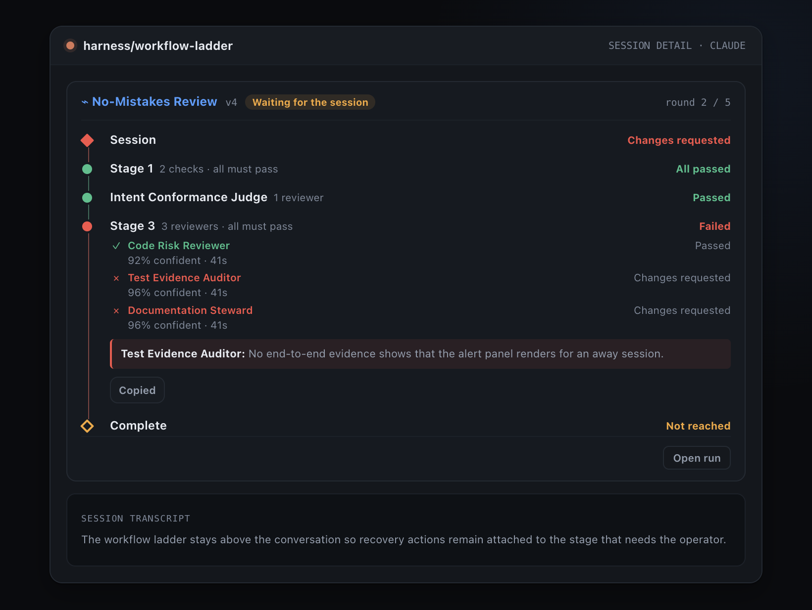
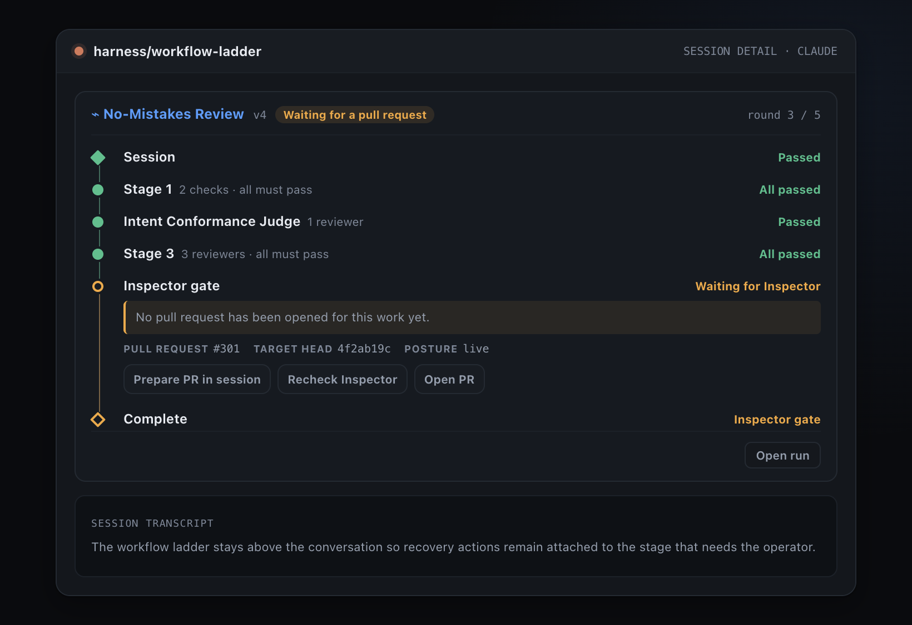
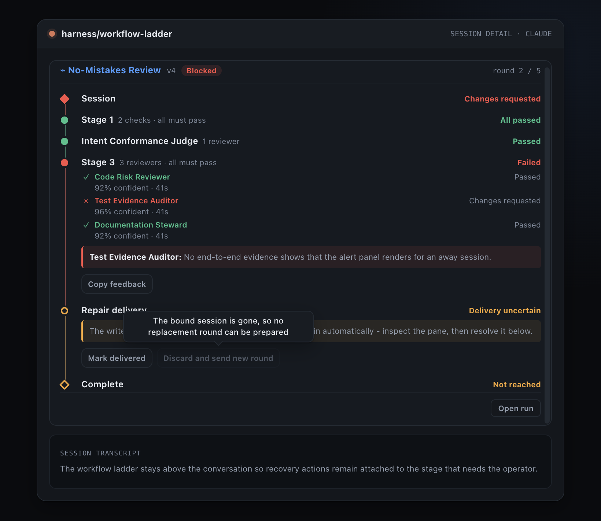
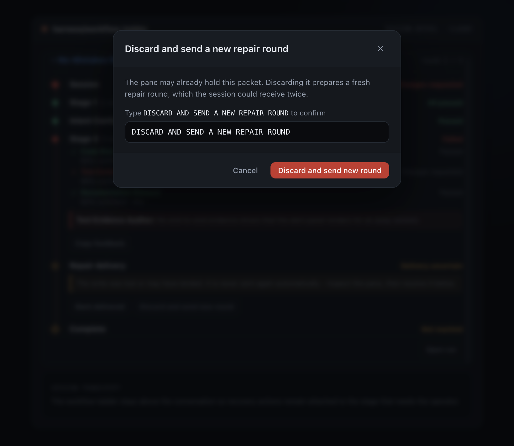

# Phase 2 ladder action evidence

Generated from the real `WorkflowLadderPanel`, `WorkflowConfirmModal`,
`useRunActions`, and `workflowRequest` implementations. The harness replaces only
`fetch` and the clipboard, so button activation, confirmation gating, request construction,
inline errors, pending state, and refetch are exercised in the browser.

Reproduce from the repository root:

```sh
npx electron scripts/workflow-ladder-actions-evidence.cjs
```

## Visual captures

### D2 · Feedback carried by hand

The Preview-mode failed rung after activating **Copy feedback**; the live button state reads
**Copied**.



### D3 · Inspector gate actions

The gate is parked on `missing_pr`, so **Prepare PR in session**, **Recheck Inspector**, and
**Open PR** are all visible on the gate rung.



### D4 · Bound session disappeared

The durable binding has `sessionId: null` while the summary still carries its stale session
id. **Discard and send new round** remains visible but disabled; its visible tooltip explains
that the bound session is gone.



### D4 · Typed destructive confirmation

With a live binding, activating **Discard and send new round** opens the real shared
confirmation. The exact phrase is typed and the destructive confirm is enabled.



## End-to-end action transcript

### Inspector recheck: error, stable retry key, success, refresh

The harness returns 503 once to expose the panel's inline error and then accepts the retry.

| # | Method | Path | Status | Request JSON | Response JSON |
|---:|---|---|---:|---|---|
| 1 | GET | `/api/workflow-runs/run` | 200 | — | `{"runId":"run","waitReason":"missing_pr","deliveryStates":[]}` |
| 2 | POST | `/api/workflow-runs/run/recheck-inspector` | 503 | `{"requestId":"f7c46b7d-d92e-4d41-aece-c9314b52bb53"}` | `{"error":"Inspector ledger unavailable for evidence run"}` |
| 3 | GET | `/api/workflow-runs/run` | 200 | — | `{"runId":"run","waitReason":"missing_pr","deliveryStates":[]}` |
| 4 | POST | `/api/workflow-runs/run/recheck-inspector` | 200 | `{"requestId":"f7c46b7d-d92e-4d41-aece-c9314b52bb53"}` | `{"ok":true}` |
| 5 | GET | `/api/workflow-runs/run` | 200 | — | `{"runId":"run","waitReason":null,"deliveryStates":[]}` |

Observed:

- Inline error after the first POST: `Inspector ledger unavailable for evidence run`.
- Failed request id: `f7c46b7d-d92e-4d41-aece-c9314b52bb53`.
- Retry request id: `f7c46b7d-d92e-4d41-aece-c9314b52bb53`.
- Retry reused the idempotency key: **yes**.
- GETs after each settled POST: **2**.
- Final rendered state: Inspector gate present = **false**.

### Uncertain delivery: typed confirmation, guarded POST, refresh

| # | Method | Path | Status | Request JSON | Response JSON |
|---:|---|---|---:|---|---|
| 1 | GET | `/api/workflow-runs/run` | 200 | — | `{"runId":"run","waitReason":null,"deliveryStates":["uncertain"]}` |
| 2 | POST | `/api/workflow-deliveries/delivery/resolve` | 200 | `{"requestId":"da622ecc-8a07-475f-9a47-c1167cd4edda","resolution":"discard_and_new_round","confirmation":"DISCARD AND SEND A NEW REPAIR ROUND","expectedSessionId":"session","expectedNoteKey":"note"}` | `{"ok":true}` |
| 3 | GET | `/api/workflow-runs/run` | 200 | — | `{"runId":"run","waitReason":null,"deliveryStates":["cancelled"]}` |

Observed:

- Request id: `da622ecc-8a07-475f-9a47-c1167cd4edda`.
- Exact typed confirmation sent: **yes**.
- Expected binding guard: session `session`, note
  `note`.
- Refetch after the resolution: **yes**.
- Final rendered state: Repair delivery present = **false**.
