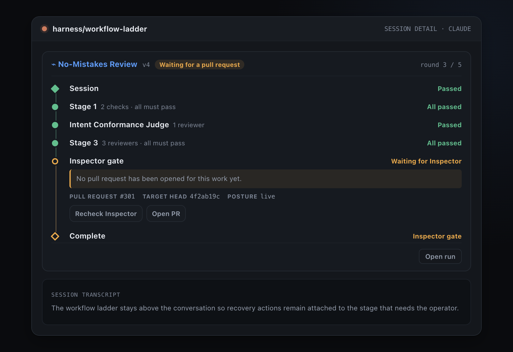
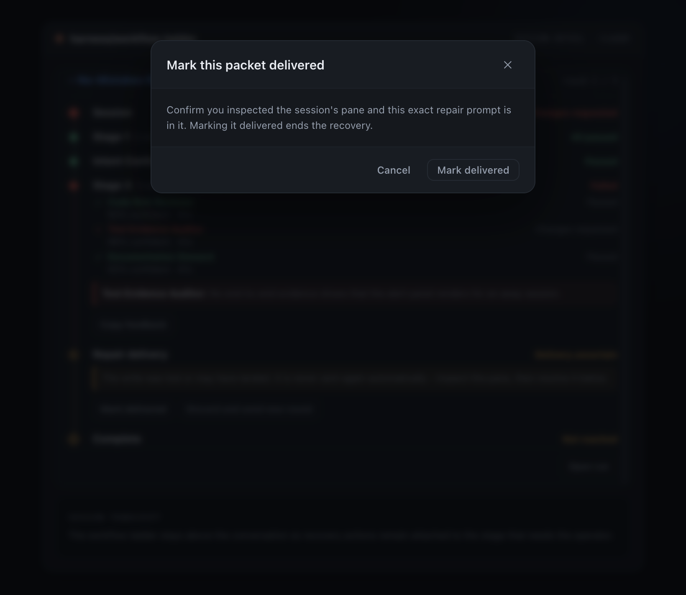

# Phase 2 ladder action evidence

Generated from the real `WorkflowLadderPanel`, `WorkflowConfirmModal`,
`useRunActions`, and `workflowRequest` implementations. The harness replaces only
`fetch` and the clipboard, so button activation, confirmation gating, request construction,
inline errors, pending state, and refetch are exercised in the browser.

Reproduce from the repository root:

```sh
npx electron scripts/workflow-ladder-actions-evidence.cjs
```

## Visual captures

### D2 · Feedback carried by hand

The Preview-mode failed rung after activating **Copy feedback**; the live button state reads
**Copied**.


### D3 · Inspector gate actions

The gate is parked on `missing_pr`, so **Prepare PR in session**, **Recheck Inspector**, and
**Open PR** are all visible on the gate rung.


After activating **Prepare PR in session**, the panel refetches the run in
`waiting_for_session` / `pr_handoff`; the one-shot preparation action is gone.



### D4 · Bound session disappeared

The durable binding has `sessionId: null` while the summary still carries its stale session
id. **Discard and send new round** remains visible but disabled; its visible tooltip explains
that the bound session is gone.


### D4 · Typed destructive confirmation

With a live binding, activating **Discard and send new round** opens the real shared
confirmation. The exact phrase is typed and the destructive confirm is enabled.


The other resolution uses the real shared confirmation too. **Mark delivered** displays its
inspection warning before the guarded POST can run.



## End-to-end action transcript

### Copy feedback: prepared packet written to the clipboard

Observed:

- Clipboard writes after activating **Copy feedback**: **1**.
- Copied bytes exactly equal `workflowFeedbackText(detail)`: **yes**.
- Copied packet size: **732 bytes**.
- Copied packet SHA-256: `ab28449522a900bd54f49b2f39aa9cb1d00d29ab6bf4b14e7a359ed24c64d50c`.
- Final rendered button label: **Copied**.

### Prepare PR in session: POST and committed refresh

| # | Method | Path | Status | Request JSON | Response JSON |
|---:|---|---|---:|---|---|
| 1 | GET | `/api/workflow-runs/run` | 200 | — | `{"runId":"run","waitReason":"missing_pr","deliveryStates":[]}` |
| 2 | POST | `/api/workflow-runs/run/prepare-pr` | 200 | `{"requestId":"aa364776-64d3-4de2-b552-04a36b8e498f"}` | `{"deliveryId":"pr-handoff","state":"delivered"}` |
| 3 | GET | `/api/workflow-runs/run` | 200 | — | `{"runId":"run","waitReason":"missing_pr","deliveryStates":[]}` |

Observed:

- Request id: `aa364776-64d3-4de2-b552-04a36b8e498f`.
- Refetch after PR handoff preparation: **yes**.
- Final run status from the refreshed detail: `waiting_for_session`.
- Final rendered state: Prepare PR offered = **false**.

### Inspector recheck: error, stable retry key, success, refresh

The harness returns 503 once to expose the panel's inline error and then accepts the retry.

| # | Method | Path | Status | Request JSON | Response JSON |
|---:|---|---|---:|---|---|
| 1 | GET | `/api/workflow-runs/run` | 200 | — | `{"runId":"run","waitReason":"missing_pr","deliveryStates":[]}` |
| 2 | POST | `/api/workflow-runs/run/recheck-inspector` | 503 | `{"requestId":"24bf0f63-c260-4838-a727-3d2c41560515"}` | `{"error":"Inspector ledger unavailable for evidence run"}` |
| 3 | GET | `/api/workflow-runs/run` | 200 | — | `{"runId":"run","waitReason":"missing_pr","deliveryStates":[]}` |
| 4 | POST | `/api/workflow-runs/run/recheck-inspector` | 200 | `{"requestId":"24bf0f63-c260-4838-a727-3d2c41560515"}` | `{"ok":true}` |
| 5 | GET | `/api/workflow-runs/run` | 200 | — | `{"runId":"run","waitReason":null,"deliveryStates":[]}` |

Observed:

- Inline error after the first POST: `Inspector ledger unavailable for evidence run`.
- Failed request id: `24bf0f63-c260-4838-a727-3d2c41560515`.
- Retry request id: `24bf0f63-c260-4838-a727-3d2c41560515`.
- Retry reused the idempotency key: **yes**.
- GETs after each settled POST: **2**.
- Final rendered state: Recheck Inspector offered = **false**.

### Uncertain delivery: typed confirmation, guarded POST, refresh

| # | Method | Path | Status | Request JSON | Response JSON |
|---:|---|---|---:|---|---|
| 1 | GET | `/api/workflow-runs/run` | 200 | — | `{"runId":"run","waitReason":null,"deliveryStates":["uncertain"]}` |
| 2 | POST | `/api/workflow-deliveries/delivery/resolve` | 200 | `{"requestId":"c959b895-589b-4657-92ed-8162d2b864e7","resolution":"discard_and_new_round","confirmation":"DISCARD AND SEND A NEW REPAIR ROUND","expectedSessionId":"session","expectedNoteKey":"note"}` | `{"ok":true}` |
| 3 | GET | `/api/workflow-runs/run` | 200 | — | `{"runId":"run","waitReason":null,"deliveryStates":["cancelled"]}` |

Observed:

- Request id: `c959b895-589b-4657-92ed-8162d2b864e7`.
- Exact typed confirmation sent: **yes**.
- Expected binding guard: session `session`, note
  `note`.
- Refetch after the resolution: **yes**.
- Final rendered state: Repair delivery present = **false**.

### Mark delivered: confirmation, guarded POST, refresh

| # | Method | Path | Status | Request JSON | Response JSON |
|---:|---|---|---:|---|---|
| 1 | GET | `/api/workflow-runs/run` | 200 | — | `{"runId":"run","waitReason":null,"deliveryStates":["uncertain"]}` |
| 2 | POST | `/api/workflow-deliveries/delivery/resolve` | 200 | `{"requestId":"98c4d2fe-d0e9-4967-a736-5f575eab1b4c","resolution":"mark_delivered"}` | `{"ok":true}` |
| 3 | GET | `/api/workflow-runs/run` | 200 | — | `{"runId":"run","waitReason":null,"deliveryStates":["delivered"]}` |

Observed:

- Confirmation shown before the POST: `Mark this packet delivered`.
- POSTs before confirmation: **0**.
- Request id: `98c4d2fe-d0e9-4967-a736-5f575eab1b4c`.
- Resolution: `mark_delivered`.
- Confirmation is the Mark-delivered guard; this resolution deliberately requires no bound
  session.
- Refetch after the resolution: **yes**.
- Final rendered state: Repair delivery present = **false**.
