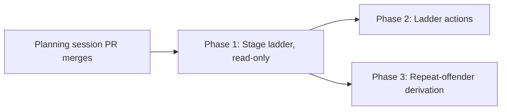

# Phased implementation: the workflow stage ladder

Source plan: `docs/plans/workflow-card-progress/plan.md` (decisions adopted 2026-07-27; rendered
page `plan.html` beside it). Source design: `mockups.html`, Option D.

## Incorporated human decisions

1. **The Runs page keeps `RunPipeline`.** The ladder is detail-pane only. Two drawings, one
   derivation; what must never be duplicated is the derivation, not the leaves.
2. **The seam is an inline strip in the conversation tab**, beside `ForemanStrip` and
   `NomistakesStrip`. Passed stages collapse to one line to control height.
3. **A freehand-graph run shows today's chip plus an "Open run" link.** No ladder is claimed for
   a graph that has no stages.
4. **Option C's repeat-offender derivation is taken, on the run detail only** - server-side
   beside `compactGate`, exposed on `WorkflowRunDetail`, never on the SSE summary.

## Investigated findings (what the repository actually does)

Verified against `main` at `985aaa23`.

- **The derivation exists and is complete.** `projectStages` (`workflow-stages.ts:376`) yields
  `StagePipeline { sessionId, endId, endOutcome, stages }` with `StageMember` a discriminated
  persona/check union (`:44-46`); `run-model.ts` supplies every status and sentence the ladder
  needs - `reviewerStatus:240`, `checkStatus:276`, `stageStatus:297`, `endStatus:323`,
  `latestAttemptsFor:112`, `verdictOf:126`, `verdictMeta:531`, `gateWaitSentence:370`,
  `gateSummaryStatus:386`, `deliveryStateView:408`, `checkStatusView:455`, `checkOutcomeOf:466`,
  `runRounds:168`, `orderedSubmissions:78`, `selectedSubmission:90`. **Stages are a pure
  projection of the graph and are persisted nowhere** (`workflow-stages.ts:11-19`). The ladder is
  a leaf rendering over this, and re-deriving any of it is the defect these phases exist to
  prevent.
- **The data is detail-only and that is deliberate.** `WorkflowRunSummary`
  (`workflow.ts:1277-1299`) carries no stage or member structure - only `activePersonaNames`,
  `failedPersonaCount`, `round`, `maxRepairRounds`, `gate` and two delivery counters. Graphs,
  attempts, verdicts and events never travel over SSE (`workflow.ts:1328-1332`). Everything the
  ladder draws is on `WorkflowRunDetail` (`:1312-1334`) from `GET /api/workflow-runs/:id`
  (`routes.ts:965-979`).
- **`inspectorGate` is decorated only by the manager.** `store.runDetail` sets it `null`
  (`store.ts:3879`); `WorkflowManager.decorateRun` (`manager.ts:578-600`) is the only place it is
  filled, with `state`, `inspection`, `findings` and `inspector.posture`. The gate rung has one
  source.
- **No reusable detail-fetching hook exists.** `WorkflowRuns.tsx` fetches inline through
  `workflowRequest` (`workflowApi.ts:12`) inside `load()` (`:1278-1297`), guarded by a
  `loadGeneration` counter and re-triggered on `[selected, selectedSummary]` (`:1298-1303`) - so
  a moving SSE summary is what refreshes the detail. Phase 1 owns extracting that pattern as a
  hook; it does **not** refactor `WorkflowRuns`, whose `load()` is entangled with round
  selection, mutations and event/call paging.
- **`NomistakesStrip` is not a usable fetching precedent.** It is fetch-free because
  `NmRunSummary` rides the session snapshot (`types.ts:397`). A workflow ladder has no
  equivalent and cannot get one without the SSE widening Option D was chosen to avoid.
- **`WorkflowConfirmModal` is already shared** (`WorkflowConfirmModal.tsx:64`), used by
  `WorkflowRuns`, `WorkflowLibrary`, `PersonaLibrary`, `PipelineEditor`, `WorkflowProperties` and
  `App`. Each surface holds its own `confirm` state and renders its own instance. The ladder
  follows that pattern; no extraction and no App-level channel is needed.
- **The destructive delivery action is phrase-gated today.** "Discard and send new round"
  requires `DISCARD AND SEND A NEW REPAIR ROUND` and is disabled with no bound session
  (`WorkflowRuns.tsx:930`); "Mark delivered" has its own confirm body (`:903`). Both POST
  `/api/workflow-deliveries/:id/resolve` (`routes.ts:1050`). Phase 2 must carry the phrase across,
  not simplify it.
- **The degraded-check trap has a mechanism.** `WORKFLOW_CHECK_STATUSES` is
  `passed | failed | skipped | unavailable` (`workflow.ts:791-792`), only `failed` blocks
  (`checkOutcomePasses:808`), and an unconfigured slot records `"skipped"` with a note
  (`checks.ts:250-256`). `RunPipeline` threads `checkOutcomeFor` because "a skipped or
  unavailable check still finishes as a passing attempt" (`RunPipeline.tsx:51-58`). The ladder
  threads it for the same reason.
- **`maxRepairRounds` defaults to 5, not the mockups' 6** (`workflow.ts:387-390`, bounds 1-20 at
  `:32-33`). Read from the run; hardcode nothing.
- **The built-in the mockups draw is real and current.** `BUILTIN_WORKFLOWS` holds
  `no-mistakes-review` at **version 4** (`builtin-workflows.ts:365-414`): stage 1 two checks
  (`typecheck`, `test`), stage 2 the single-member Intent Conformance Judge, stage 3 Code Risk
  Reviewer + Test Evidence Auditor + Documentation Steward, bookended `nmr-session` / `nmr-end`
  with `endOutcome: "Complete"` and an `inspector` completion policy.
- **Version 4 landed while this plan was being written (#305) and changes what a round can
  contain.** `completionPolicy` moved from one fact about the workflow to one fact per version;
  v4 reuses v3's pipeline but sets `onFindings: "inspector_only"` where v3 set
  `"restart_workflow"`. Inspector findings now open an **inspector-only submission** rather than
  restarting the whole review, so **a round can legitimately contain no persona review at all**.
  `runRounds` (`run-model.ts:168`) already flags such a round `inspectorOnly` and
  `WorkflowRunSummary.bypassedPersonaReview` records that it happened. Phase 1 owns drawing that
  honestly; a ladder that listed three pending reviewers for an inspector-only round would be
  wrong in what is now the normal path after findings. `missingPrAction: "offer_prepare_pr"` is
  unchanged across all four versions, so Phase 2's Prepare PR arm is unaffected.
- **The session join already exists.** `App.tsx:587-595` builds `workflowRunBySession` by newest
  `updatedAt` per `run.sessionId`, and `SessionViewProps` already carries
  `workflowRunBySession`, `onOpenWorkflowRun` and `onBindWorkflow` (`types.ts:117-119`).
  `ConsoleDetail` already reads the run at `:102`. No new `SessionViewProps` field is required;
  if one becomes necessary it goes there and in `cardProps`, never on a single view.
- **`.detail-conv` uses child combinators** - `> .transcript` (`styles.css:13444`),
  `> .transcript .transcript-log` (`:13448`), `> .nm-log-open` (`:13465`). A new child element is
  safe, but the ladder must not be inserted between `.transcript` and its parent.
- **Run status vocabulary** for the four drawn states: statuses `capturing | running |
  waiting_for_session | waiting_for_pr | waiting_for_inspector | waiting_for_new_head | blocked |
  completed | cancelled | failed` (`workflow.ts:395-407`); gate summaries
  `none | waiting_pr | waiting_inspector | findings | clean | blocked` (`:437-445`); 11 wait
  reasons (`:409-422`); delivery states `prepared | sending | delivered | refused | uncertain |
  cancelled` (`:478-486`). Uncertain delivery is `status: "blocked"` with phase
  `delivery_uncertain` (`store.ts:3121`, `:3152`); round exhaustion is `status: "blocked"` with
  phase `round_limit` (`manager.ts:838`).
- **Tests are flat** `test/<feature>-<aspect>.test.ts`, `node:test` + `node:assert/strict`, React
  via `renderToStaticMarkup`. `session-leaf-parity.test.ts` imports all four session drawings and
  the shared leaves; a DB-touching test must set `HARNESS_HOME` before importing anything that
  resolves it.
- **README** owns "Workflows and Personas"; the ladder is documented there in the phase that
  introduces it.

One correction to the source design was made before phasing: the mockups estimate Option D as
"the cheapest server change of the four and the most expensive client one". The server half is
confirmed - nothing is widened - but the client half is materially cheaper than estimated,
because the whole derivation is reusable and only the leaves are new. The phase sizes below
reflect the corrected estimate.

## Phase table

| Phase | Name | Direct prerequisites | Deliverable |
|---|---|---|---|
| 1 | The stage ladder, read-only (`phase-1-stage-ladder.md`) | planning session | `useWorkflowRunDetail` hook, `WorkflowLadder` renderer, inline wiring in `ConsoleDetail`, freehand fallback, `wf-ladder-*` CSS, README, tests |
| 2 | Ladder actions (`phase-2-ladder-actions.md`) | 1 | Copy feedback, the Inspector-gate rung's Recheck/Open PR/Prepare PR, and the uncertain-delivery rung's two phrase-gated resolutions, routed to existing endpoints through the shared confirm modal |
| 3 | The repeat-offender derivation (`phase-3-repeat-offender.md`) | 1 | Server-side "same member failed N rounds running", on `WorkflowRunDetail` only, surfaced as one line in the ladder |

Three phases. **Phase 2 and Phase 3 are independent and may run concurrently**; both consume
Phase 1's ladder and neither consumes anything the other owns.

Phase 1 deliberately ships a complete *reading* surface with no in-place actions: every state
the mockups draw renders, and the buttons D2, D3 and D4 draw are a single "Open run" link until
Phase 2. That is an operable intermediate state, not a broken one - it is strictly better than
today's single chip and it is what keeps Phase 1 reviewable.

Phase 2 owns **every** action the mockups draw on the ladder, including D2's Copy feedback. An
earlier draft scoped it to the gate and delivery only, which left Copy feedback owned by no phase
at all - the kind of gap that becomes a drawn affordance nobody builds. See that phase's audit
record.

A phase separating "the fetch hook" from "the renderer" was considered and rejected: the hook
has no consumer other than the ladder, and shipping it alone would add a dead surface. That is a
chapter split, not a merge unit.

## Dependency graph and concurrency

Concurrency group: **{Phase 2, Phase 3}**. Neither consumes a contract, route, migration or
generated asset the other owns. They overlap textually in three files and nowhere else:

| File | Phase 2 region | Phase 3 region |
|---|---|---|
| `src/web/workflows/WorkflowLadder.tsx` | action rows on the changes-requested, gate and delivery rungs | one derived sentence on the failing stage's rung |
| `src/web/styles.css` | `wf-ladder-actrow` and button states | `wf-ladder-repeat` |
| `README.md` | the actions the ladder offers | the repeat-offender line |

These are ordinary textual conflicts resolvable at merge, not contract dependencies. Whichever
merges second rebases.

## Merge order

Phase 1 first. Phase 2 and Phase 3 may merge in either order afterwards.

## Cross-phase contracts

Established by Phase 1, relied on by Phases 2 and 3:

- **`useWorkflowRunDetail(runId, updatedAt)`** is the single client path to
  `GET /api/workflow-runs/:id`. It carries a generation guard, refetches when `updatedAt` moves
  (mirroring `WorkflowRuns`' `[selected, selectedSummary]` trigger), and returns a discriminated
  `{ state: "loading" | "error" | "ready" }` so a caller cannot read a half-loaded detail.
  Neither later phase changes this signature.
- **All status and sentence derivation comes from `run-model.ts` and `@shared/workflow-stages.ts`.**
  No phase may re-implement a status, a label or a shipped sentence in the ladder. A missing
  derivation is added to `run-model.ts`, where both drawings can reach it.
- **`WorkflowLadder`'s props are the detail plus callbacks**, never a second fetch. Phase 2 adds
  callbacks; it does not make the component fetch.
- **CSS prefix is `wf-ladder-`**, in its own `/* ---- workflow stage ladder ---- */` section, and
  it does not reuse `wf-pipeline-*`. The two drawings share derivation, not rules; a shared rule
  is how a change to the detail pane silently restyles the Runs page and the authoring editor.
- **Tone classes are the shared `workflow-${tone}` vocabulary** from `workflowRunTone`
  (`session-bits.tsx:142`), which the chip, tile flag, rail mark and `PipelineStatusChip` already
  share. The ladder joins that vocabulary rather than inventing a fifth.
- **A check never reads as passed unless it ran.** `checkOutcomeFor` is threaded and
  `checkStatusView`'s sentence is used verbatim.
- **The freehand fallback is the chip plus "Open run"**, and it is Phase 1's, so neither later
  phase has to answer it again.

Established by Phase 3, relied on by nobody:

- **The repeat-offender field is OPTIONAL on `WorkflowRunDetail`.** Phase 2 is concurrent and
  must compile whether or not Phase 3 has merged, and an older daemon serving a newer browser
  must not fail to parse.

## Final verification strategy

- `npm run typecheck`, `npm test`, `npm run build` and the bundle smoke check green on each
  phase's PR, on Node 24 and Node 26 as CI runs them.
- After Phase 1: a bound run in each of the four states drawn in `mockups.html` renders in the
  Console and Board detail panes; a run on a non-stage-expressible version shows the chip and an
  "Open run" link and never an empty ladder.
- After Phase 2: both delivery resolutions still require exactly what the Runs page requires -
  the typed phrase and a bound session - and the Inspector recheck remains idempotent per
  `requestId`.
- After Phase 3: a run whose same member failed in consecutive rounds reports it; one that failed
  in non-consecutive rounds does not.
- Throughout: `session-leaf-parity.test.ts` stays green, and the collapsed grid card, board tile
  and console rail are visually unchanged - the ladder is detail-pane only.
- A check that never ran never reads as "Passed" on any surface.
