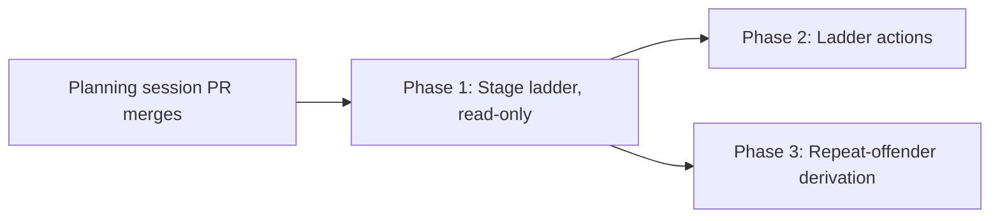

# Phased implementation: the workflow stage ladder

Source plan: `docs/plans/workflow-card-progress/plan.md` (decisions adopted 2026-07-27).
Source design: `mockups.html`, Option D.

## Incorporated human decisions

## Investigated findings (what the repository actually does)

Verified against `main` at `985aaa23`.

One correction to the source design was made before phasing: the mockups estimate Option D as
"the cheapest server change of the four and the most expensive client one". The server half is
confirmed - nothing is widened - but the client half is materially cheaper than estimated,
because the whole derivation is reusable and only the leaves are new. The phase sizes below
reflect the corrected estimate.

## Phase table

| Phase | Name | Direct prerequisites | Deliverable |
|---|---|---|---|
| 1 | The stage ladder, read-only (`phase-1-stage-ladder.md`) | planning session | `useWorkflowRunDetail` hook, `WorkflowLadder` renderer, inline wiring in `ConsoleDetail`, freehand fallback, `wf-ladder-*` CSS, README, tests |
| 2 | Ladder actions (`phase-2-ladder-actions.md`) | 1 | Copy feedback, the Inspector-gate rung's Recheck/Open PR/Prepare PR, and the uncertain-delivery rung's two phrase-gated resolutions, routed to existing endpoints through the shared confirm modal |
| 3 | The repeat-offender derivation (`phase-3-repeat-offender.md`) | 1 | Server-side "same member failed N rounds running", on `WorkflowRunDetail` only, surfaced as one line in the ladder |

Three phases. **Phase 2 and Phase 3 are independent and may run concurrently**; both consume
Phase 1's ladder and neither consumes anything the other owns.

Phase 1 deliberately ships a complete *reading* surface with no in-place actions: every state
the mockups draw renders, and the buttons D2, D3 and D4 draw are a single "Open run" link until
Phase 2. That is an operable intermediate state, not a broken one - it is strictly better than
today's single chip and it is what keeps Phase 1 reviewable.

Phase 2 owns **every** action the mockups draw on the ladder, including D2's Copy feedback. An
earlier draft scoped it to the gate and delivery only, which left Copy feedback owned by no phase
at all - the kind of gap that becomes a drawn affordance nobody builds. See that phase's audit
record.

A phase separating "the fetch hook" from "the renderer" was considered and rejected: the hook
has no consumer other than the ladder, and shipping it alone would add a dead surface. That is a
chapter split, not a merge unit.

## Dependency graph and concurrency

Concurrency group: **{Phase 2, Phase 3}**. Neither consumes a contract, route, migration or
generated asset the other owns. They overlap textually in three files and nowhere else:

| File | Phase 2 region | Phase 3 region |
|---|---|---|
| `src/web/workflows/WorkflowLadder.tsx` | action rows on the changes-requested, gate and delivery rungs | one derived sentence on the failing stage's rung |
| (Phase 2 also adds `run-actions.ts` and `run-action-store.ts`, which Phase 3 does not touch) | | |
| `src/web/styles.css` | `wf-ladder-actrow` and button states | `wf-ladder-repeat` |
| `README.md` | the actions the ladder offers | the repeat-offender line |

These are ordinary textual conflicts resolvable at merge, not contract dependencies. Whichever
merges second rebases.

## Merge order

Phase 1 first. Phase 2 and Phase 3 may merge in either order afterwards.

## Cross-phase contracts

Established by Phase 1, relied on by Phases 2 and 3:

- **`useWorkflowRunDetail(runId, updatedAt)`** is the single client path to
  `GET /api/workflow-runs/:id`. It carries a generation guard, refetches when `updatedAt` moves
  (mirroring `WorkflowRuns`' `[selected, selectedSummary]` trigger), and returns a discriminated
  `{ state: "loading" | "error" | "ready" }` so a caller cannot read a half-loaded detail.
  Neither later phase changes this signature.
- **All status and sentence derivation comes from `run-model.ts` and `@shared/workflow-stages.ts`.**
  No phase may re-implement a status, a label or a shipped sentence in the ladder. A missing
  derivation is added to `run-model.ts`, where both drawings can reach it.
- **`WorkflowLadder`'s props are the detail plus callbacks**, never a second fetch. Phase 2 adds
  callbacks; it does not make the component fetch.
- **CSS prefix is `wf-ladder-`**, in its own `/* ---- workflow stage ladder ---- */` section, and
  it does not reuse `wf-pipeline-*`. The two drawings share derivation, not rules; a shared rule
  is how a change to the detail pane silently restyles the Runs page and the authoring editor.
- **Tone classes are the shared `workflow-${tone}` vocabulary** from `workflowRunTone`
  (`session-bits.tsx:142`), which the chip, tile flag, rail mark and `PipelineStatusChip` already
  share. The ladder joins that vocabulary rather than inventing a fifth.
- **A check never reads as passed unless it ran.** `checkOutcomeFor` is threaded and
  `checkStatusView`'s sentence is used verbatim.
- **The freehand fallback is the chip plus "Open run"**, and it is Phase 1's, so neither later
  phase has to answer it again.

Established by Phase 3, relied on by nobody:

- **The repeat-offender field is OPTIONAL on `WorkflowRunDetail`.** Phase 2 is concurrent and
  must compile whether or not Phase 3 has merged, and an older daemon serving a newer browser
  must not fail to parse.
- **`WorkflowRepeatOffender` is declared in `src/shared/workflow.ts`, not in the server module.**
  It rides on `WorkflowRunDetail`, which is shared and read by the browser, and `src/shared/`
  never imports from `src/server/`. The server derivation imports the type; it does not own it.

## Final verification strategy

- `npm run typecheck`, `npm test`, `npm run build` and the bundle smoke check green on each
  phase's PR, on Node 24 and Node 26 as CI runs them.
- After Phase 1: a bound run in each of the four states drawn in `mockups.html` renders in the
  Console and Board detail panes; a run on a non-stage-expressible version shows the chip and an
  "Open run" link and never an empty ladder.
- After Phase 2: both delivery resolutions still require exactly what the Runs page requires -
  the typed phrase and a bound session - and the Inspector recheck remains idempotent per
  `requestId`.
- After Phase 3: a run whose same member failed in consecutive rounds reports it; one that failed
  in non-consecutive rounds does not.
- Throughout: `session-leaf-parity.test.ts` stays green, and the collapsed grid card, board tile
  and console rail are visually unchanged - the ladder is detail-pane only.
- A check that never ran never reads as "Passed" on any surface.
